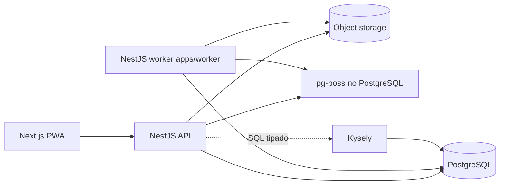
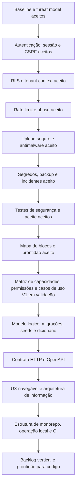

# Mapa da arquitetura

Este índice mostra o que já foi decidido e quais artefatos ainda precisam ser
produzidos antes da implementação. Escolher a stack não encerra a arquitetura.

## 1. Estado atual

| Área | Estado | Fonte |
|---|---|---|
| Marca e multitenancy | Definido | ADR-0002 e ADR-0007; ADR-0001 substituído |
| Frontend, dados, shells e showcase | Definido | `frontend/README.md`, ADR-0009, ADR-0011, ADR-0012 e ADR-0013 |
| Hierarquia de autorização | Definido conceitualmente | ADR-0003 |
| Documentação e releases | Definido | ADR-0004 |
| Blocos de projeção e prontidão | Aceito | `../governance/project-blocks-and-readiness.md` |
| Stack e acesso a dados | Definido | ADR-0005 |
| Modelo conceitual | Definido, sujeito ao modelo lógico | `conceptual-data-model.md` |
| Matriz de capacidades e casos de uso | Proposto para validação | `../product/capabilities-permissions-and-use-cases.md` |
| Segurança não funcional | Requisitos iniciais definidos | `security-and-non-functional-requirements.md` |
| Estratégia de testes | Definido | `testing-strategy.md` e ADR-0014 |
| Backend modular e workers | Definido inicialmente | `backend/README.md`, ADR-0015 e ADR-0016 |
| Convenções de banco | Definido | `database/conventions.md` e ADR-0006 |
| Modelo lógico e dicionário | Estrutura criada; domínios ainda serão detalhados | `database/README.md` |
| RLS e tenant context | Definido | `security/rls-and-tenant-context.md` e ADR-0019 |
| Rate limit e abuso | Definido | `security/rate-limit-and-abuse.md` e ADR-0020 |
| Upload seguro e antimalware | Definido | `security/secure-uploads-and-antimalware.md` e ADR-0021 |
| Segredos, backup e incidentes | Definido | `security/secrets-backup-and-incident-response.md` e ADR-0022 |
| Testes de segurança e aceite | Definido | `security/security-tests-and-acceptance.md` e ADR-0023 |
| Segurança formal e threat model | Baseline aceito | `security/README.md` e ADR-0017 |
| Autenticação, sessão e CSRF | Definido | `security/session-cookies-and-csrf.md` e ADR-0018 |
| Contrato HTTP/OpenAPI | Não iniciado | Após casos de uso e modelo lógico |
| Implantação e operação | Direção definida, detalhes pendentes | Após infraestrutura |

## 2. Arquitetura-alvo inicial

É um monólito modular com processos separados para interface, API e trabalho
assíncrono. Não é uma arquitetura de microserviços.

## 3. Artefatos obrigatórios antes do código de negócio

### Produto e prontidão

1. mapa de blocos e prontidão aprovado;
2. matriz detalhada de capacidades, permissões e casos de uso da V1 validada;
3. critérios de aceite rastreáveis para ações críticas;
4. pendências classificadas por momento limite;
5. primeira fatia vertical escolhida.

### Banco de dados

1. modelo lógico relacional;
2. convenções de nomes, chaves, datas e estados;
3. dicionário de dados por domínio;
4. constraints e índices;
5. estratégia de exclusão, auditoria e retenção;
6. estratégia RLS e propagação de contexto;
7. política e runner de migrações;
8. dados iniciais e seeds configuráveis.

O trabalho de banco é indexado em [Arquitetura do banco](database/README.md).

### Aplicação

1. fronteiras dos módulos NestJS — definidas inicialmente;
2. regras de dependência entre módulos — definidas inicialmente;
3. estrutura do monorepo;
4. padrões de erro, validação e transação;
5. contratos entre frontend e API;
6. processamento assíncrono e idempotência;
7. estratégia de testes.

A estratégia transversal está descrita em [Estratégia de testes](testing-strategy.md).

### Operação

1. ambientes local, homologação e produção;
2. segredos e configuração;
3. logs, métricas e rastreamento;
4. backup e restauração testada;
5. saúde, deploy e rollback;
6. limites e cotas de arquivos.

## 4. Ordem restante recomendada

A ordem abaixo reflete o ponto atual da documentação. O baseline de segurança,
o bloco de autenticação, sessão, cookies e CSRF, o isolamento por RLS, rate limit,
upload seguro, operação de segredos/backup/incidentes e gates de aceite já foram
aceitos. O próximo risco estrutural não é desenhar tabelas ainda; é transformar
as regras de produto em uma matriz de capacidades e ações verificáveis.

Cada decisão estrutural relevante gera ADR. O dicionário descreve o estado atual;
o ADR preserva o motivo da escolha; a migração implementa a evolução física.
