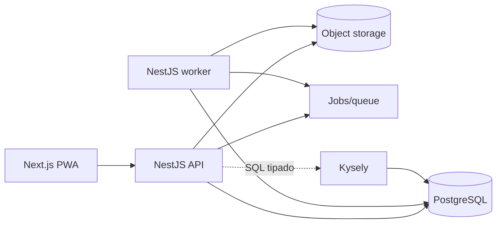
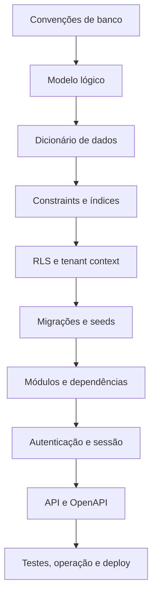

# Mapa da arquitetura

Este índice mostra o que já foi decidido e quais artefatos ainda precisam ser
produzidos antes da implementação. Escolher a stack não encerra a arquitetura.

## 1. Estado atual

| Área | Estado | Fonte |
|---|---|---|
| Marca e multitenancy | Definido | ADR-0002 e ADR-0007; ADR-0001 substituído |
| Frontend, dados, shells e showcase | Definido, exceto formulários e testes | `frontend/README.md` e ADR-0009 |
| Hierarquia de autorização | Definido conceitualmente | ADR-0003 |
| Documentação e releases | Definido | ADR-0004 |
| Stack e acesso a dados | Definido | ADR-0005 |
| Modelo conceitual | Definido, sujeito ao modelo lógico | `conceptual-data-model.md` |
| Segurança não funcional | Requisitos iniciais definidos | `security-and-non-functional-requirements.md` |
| Estratégia de testes | Definido | `testing-strategy.md` e ADR-0014 |
| Backend modular | Definido inicialmente | `backend/README.md` e ADR-0015 |
| Convenções de banco | Definido | `database/conventions.md` e ADR-0006 |
| Modelo lógico e dicionário | Estrutura criada; domínios ainda serão detalhados | `database/README.md` |
| RLS e contexto de tenant | Não iniciado | Próxima etapa |
| Autenticação e sessão | Não iniciado | Após modelo base de identidade |
| Contrato HTTP/OpenAPI | Não iniciado | Após casos de uso e modelo lógico |
| Implantação e operação | Direção definida, detalhes pendentes | Após infraestrutura |

## 2. Arquitetura-alvo inicial

É um monólito modular com processos separados para interface, API e trabalho
assíncrono. Não é uma arquitetura de microserviços.

## 3. Artefatos obrigatórios antes do código de negócio

### Banco de dados

1. modelo lógico relacional;
2. convenções de nomes, chaves, datas e estados;
3. dicionário de dados por domínio;
4. constraints e índices;
5. estratégia de exclusão, auditoria e retenção;
6. estratégia RLS e propagação de contexto;
7. política e runner de migrações;
8. dados iniciais e seeds configuráveis.

O trabalho de banco é indexado em [Arquitetura do banco](database/README.md).

### Aplicação

1. fronteiras dos módulos NestJS — definidas inicialmente;
2. regras de dependência entre módulos — definidas inicialmente;
3. estrutura do monorepo;
4. padrões de erro, validação e transação;
5. contratos entre frontend e API;
6. processamento assíncrono e idempotência;
7. estratégia de testes.

A estratégia transversal está descrita em [Estratégia de testes](testing-strategy.md).

### Operação

1. ambientes local, homologação e produção;
2. segredos e configuração;
3. logs, métricas e rastreamento;
4. backup e restauração testada;
5. saúde, deploy e rollback;
6. limites e cotas de arquivos.

## 4. Ordem de decisão

Cada decisão estrutural relevante gera ADR. O dicionário descreve o estado atual;
o ADR preserva o motivo da escolha; a migração implementa a evolução física.
