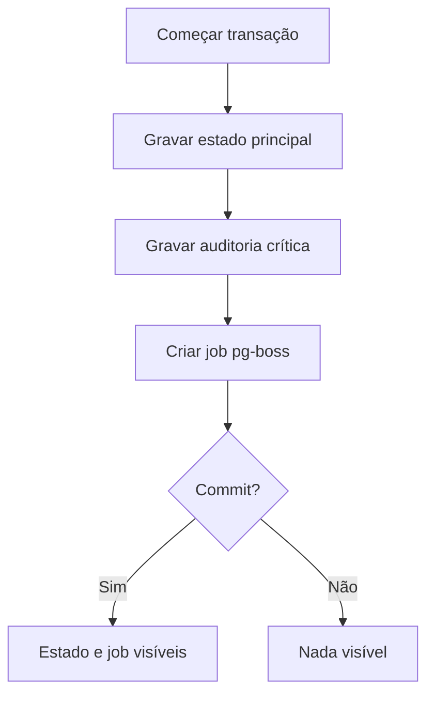

# Jobs assíncronos e workers

Este documento operacionaliza o
[ADR-0016](../decisions/0016-postgresql-backed-jobs-with-pg-boss.md).

## 1. Runtimes

```text
apps/
├── api/       HTTP, SSE, autenticação, comandos e consultas
└── worker/    jobs, agendamentos, retries e efeitos posteriores
```

API e worker pertencem ao mesmo monólito modular, mas rodam como processos
separados. Eles compartilham contratos, módulos e banco; não compartilham ciclo
de vida operacional.

## 2. Regra de ouro

Se um efeito posterior é consequência direta de uma operação principal, o job que
representa esse efeito nasce dentro da mesma transação.



Não existe operação aceita que “talvez” gere notificação se o processo sobreviver
por tempo suficiente. Ou tudo confirma junto, ou nada confirma.

## 3. Payload mínimo

Um job deve carregar:

- `job_type`;
- `orchestra_id`, quando aplicável;
- `actor_profile_id` ou `actor_account_id`, quando aplicável;
- `correlation_id`;
- identificadores técnicos dos recursos afetados;
- versão do contrato do payload;
- metadados mínimos para idempotência.

Um job não deve carregar:

- senha, token longo ou segredo;
- arquivo binário;
- PDF, áudio ou imagem em base64;
- cópia completa de dados pessoais;
- decisão de autorização já “congelada” quando ela deve ser reavaliada;
- payload tão grande que substitua a leitura canônica do banco.

## 4. Idempotência

Todo handler deve ser seguro para retry. Exemplos:

- notificação usa chave deduplicadora por evento/destinatário;
- e-mail de convite usa identificador do envio e não cria convite novo;
- miniatura verifica se já existe derivado válido;
- limpeza verifica estado atual antes de remover;
- expiração confirma que o recurso ainda está expirável.

## 5. Estados e observabilidade

Cada tipo de job precisa documentar:

| Campo | Exigência |
|---|---|
| Dono | Módulo responsável |
| Gatilho | Operação, agenda ou retry manual |
| Idempotência | Como duplicidade é neutralizada |
| Retry | Tentativas e backoff |
| Dead letter | Quando vira intervenção |
| Dados sensíveis | O que nunca entra no payload/log |
| Auditoria | Evento humano ou técnico gerado |

Falha recorrente de job é defeito operacional visível, não ruído escondido em
log local.

## 6. Tipos iniciais de job

| Tipo | Dono | Observação |
|---|---|---|
| `notification.material_published` | Notificações | Criado no commit da publicação |
| `notification.announcement_published` | Notificações | Deduplica destinatários |
| `notification.comment_created` | Notificações | Agrupa para autor do comunicado |
| `email.invitation_created` | Identidade/Orquestras | Payload sem token em claro |
| `email.password_recovery_requested` | Identidade | Token permanece armazenado como hash |
| `file.process_uploaded` | Arquivos | Gera preview/metadados |
| `file.cleanup_orphaned` | Arquivos | Respeita aviso prévio |
| `announcement.expire` | Comunicados | Pode ser agenda ou varredura |

## 7. Critérios de aceite

1. publicar material cria estado, auditoria e job na mesma transação;
2. rollback não deixa job órfão;
3. job repetido não duplica notificação;
4. worker sem contexto de tenant falha fechado;
5. payload de job não contém segredo ou arquivo bruto;
6. dead letter é consultável por operador autorizado;
7. API continua respondendo mesmo se worker estiver parado;
8. worker retomado processa pendências sem ação manual.
