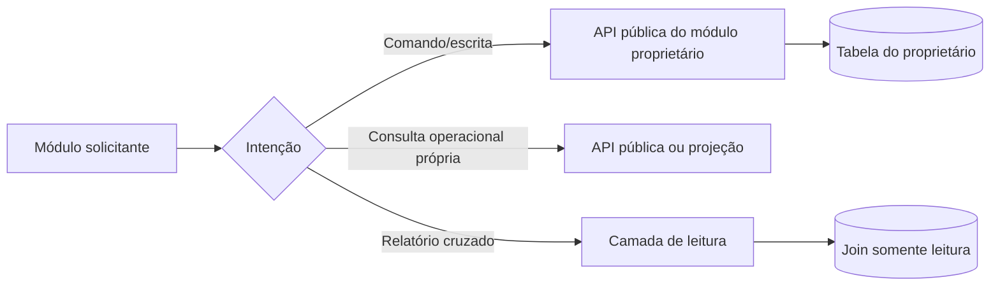
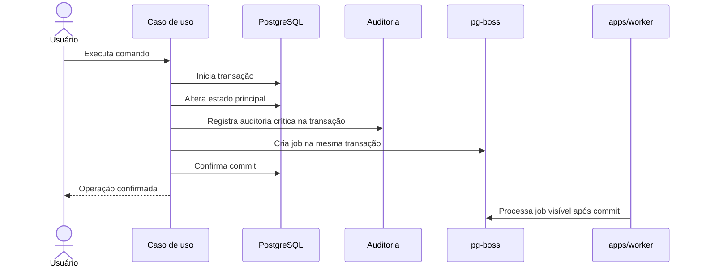

# Módulos e dependências

## 1. Catálogo inicial

| Módulo | Responsabilidade principal | Dados típicos sob propriedade |
|---|---|---|
| Identidade e autenticação | Conta global, credenciais, sessões, MFA e recuperação | contas, e-mails, credenciais, sessões |
| Orquestras e membros | Tenant, perfil, convite, naipe, sala, voz e liderança | orquestras, perfis, memberships e formação |
| Autorização | Avaliação hierárquica, concessão e bloqueio | grants, políticas persistidas e delegações |
| Bibliotecas e publicações | Biblioteca, pasta, obra, parte, distribuição e publicação | recursos de conteúdo, lotes e atribuições |
| Arquivos e processamento | Upload, objeto físico, inspeção e derivação | uploads, arquivos armazenados e estados de processamento |
| Comunicados e interações | Comunicado, comentário, reação, enquete e ciência | comunicados e interações |
| Notificações | Modelos, deduplicação, caixa interna e estado de leitura | templates e notificações persistentes |
| Auditoria | Trilhas da orquestra, plataforma e impersonação | eventos de auditoria e sessões técnicas aplicáveis |
| Administração da plataforma | Casos de uso exclusivos do master e coordenação técnica | configurações e vínculos exclusivos da plataforma quando necessários |

O inventário final de tabelas é definido no modelo lógico. Uma tabela tem um dono
mesmo quando o schema PostgreSQL contém tabelas de mais de um módulo.

## 2. Regras de acesso

Proibido:

- importar repository interno de outro módulo;
- executar `insert`, `update` ou `delete` em tabela alheia;
- contornar autorização por uma query de relatório;
- exportar módulo inteiro quando basta uma porta estreita;
- criar dependência circular para acelerar uma entrega.

## 3. APIs internas

Um módulo expõe somente o necessário:

- command/query handler de aplicação;
- interface/porta estável;
- tipos de contrato sem entidade de persistência;
- eventos versionados;
- projeções de leitura seguras.

Controllers são entradas HTTP, não APIs para outros módulos. Tipos gerados pelo
Kysely não atravessam a fronteira como modelos de domínio públicos.

## 4. Consultas cruzadas

A camada de leitura pode fazer joins eficientes no mesmo PostgreSQL para painéis e
relatórios. Ela:

- não executa mutações;
- recebe contexto explícito de tenant e ator;
- seleciona apenas campos necessários;
- respeita RLS e sensibilidade;
- não se torna fonte de regra de negócio;
- documenta consulta e índices no dicionário de dados.

## 5. Unidade transacional

Notificação ou processamento ainda pendente aparece como estado próprio. Uma
falha posterior gera retry e observabilidade; não tenta “desconfirmar” o commit.

## 6. Matriz de dependências

A matriz exata será mantida quando o código for criado. Como regra:

- módulos de negócio podem depender de Autorização e Auditoria por portas;
- Notificações consome fatos, não decide regra do módulo de origem;
- Arquivos processa binários, mas Bibliotecas decide publicação e público;
- Administração da plataforma orquestra APIs públicas, sem ganhar acesso SQL
  universal;
- Identidade global não depende de conteúdo de tenant.

## 7. Testes arquiteturais

O pipeline deve futuramente verificar:

1. imports não atravessam diretórios internos de módulos;
2. repositories acessam apenas tabelas do próprio ownership;
3. dependências declaradas não formam ciclos;
4. query layer não contém mutação;
5. toda tabela possui módulo proprietário no dicionário.
