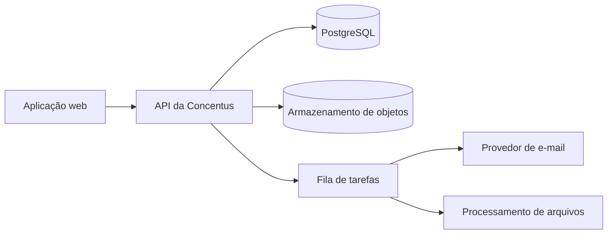
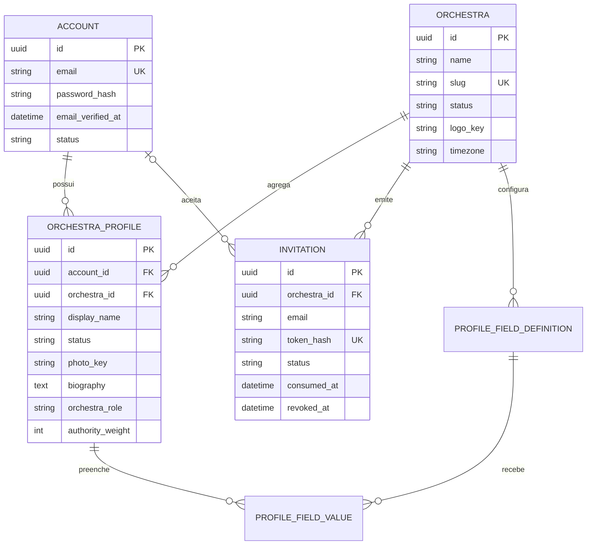
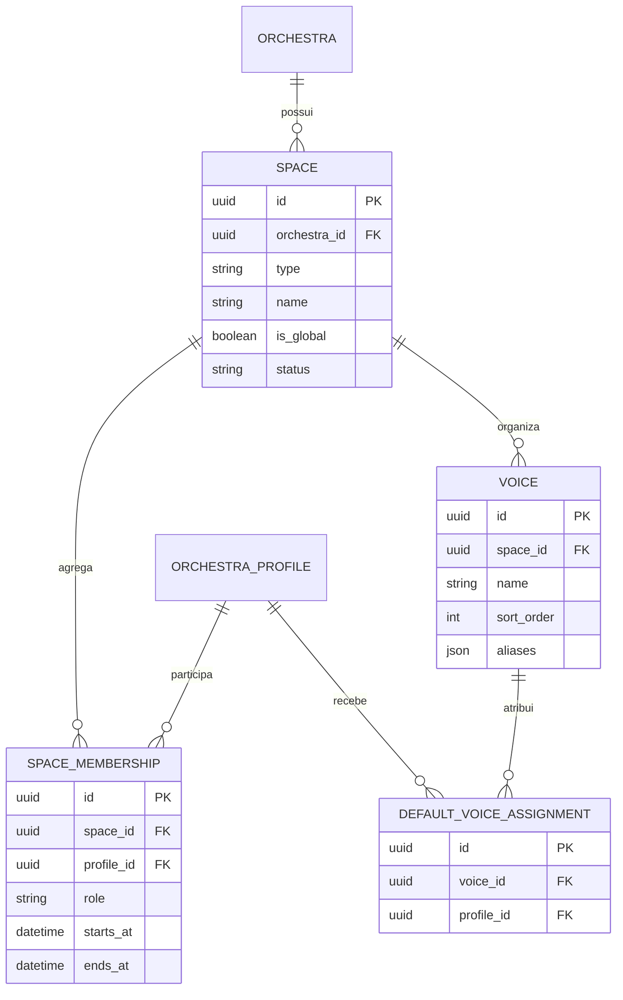
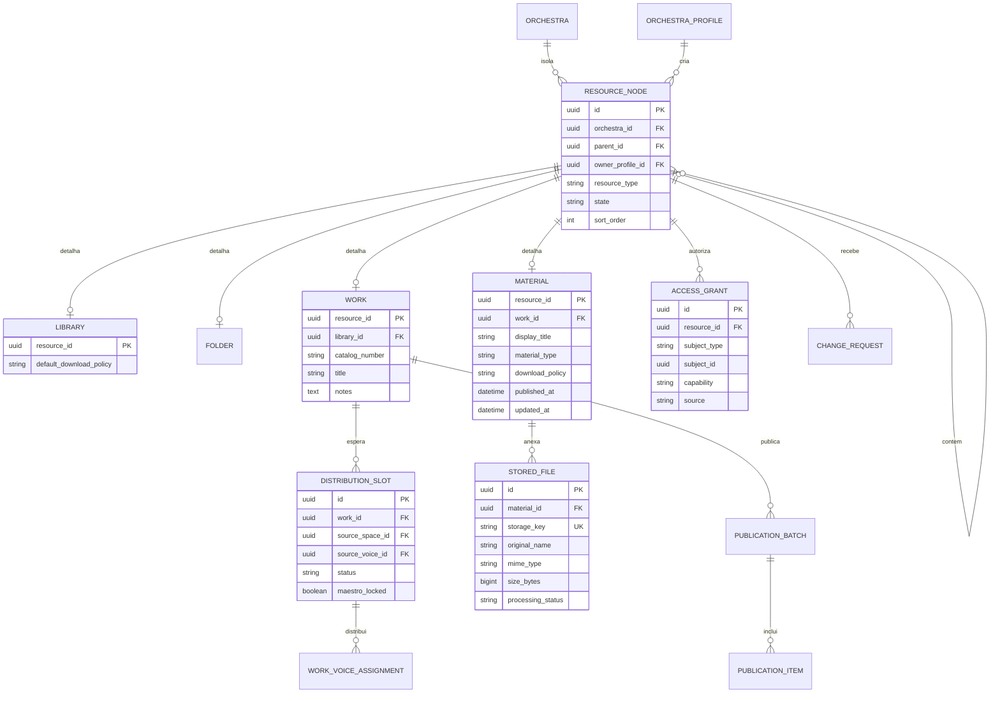
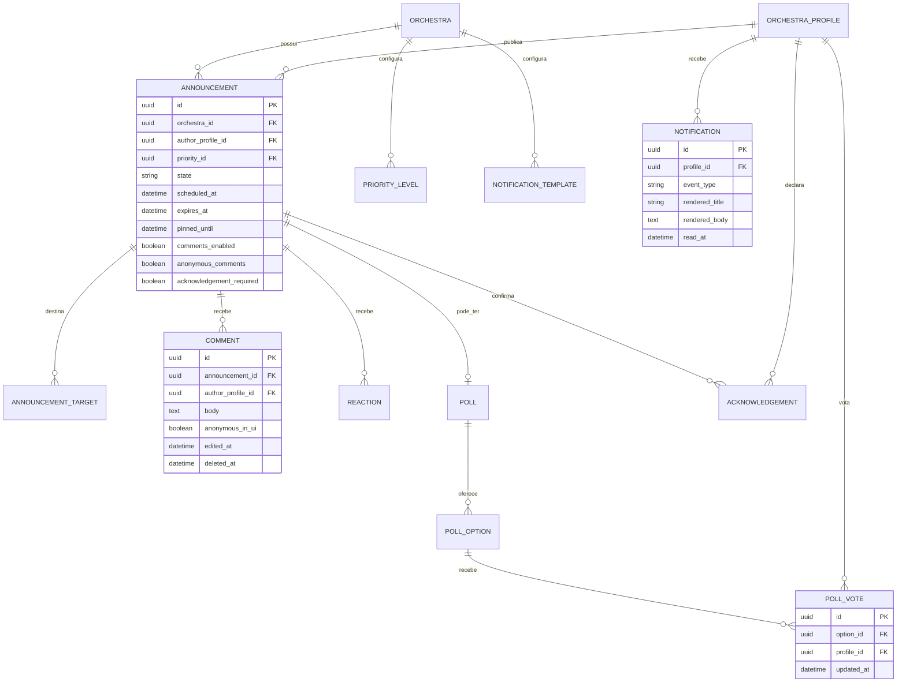
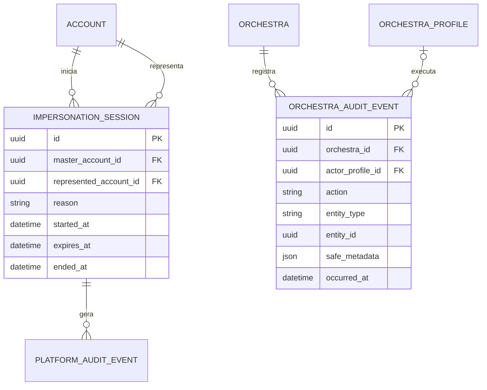
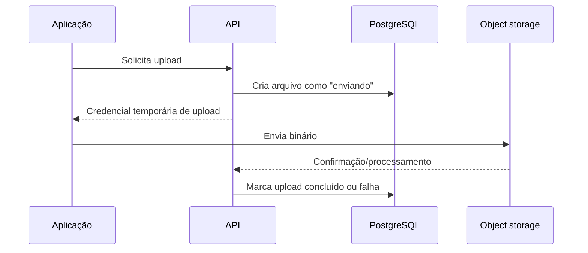

# Modelo conceitual de dados

## 1. Direção arquitetural

Recomendação inicial:

- banco relacional PostgreSQL;
- PostgreSQL como fonte de verdade do esquema e da integridade;
- Kysely como query builder SQL tipado, sem ORM tradicional;
- migrações explícitas, sequenciais, revisadas e versionadas;
- armazenamento de objetos compatível com S3 para binários;
- aplicação web responsiva/mobile-first;
- tarefas assíncronas para e-mail, processamento de upload e notificações;
- autorização sempre validada no servidor;
- isolamento por `orchestra_id`, reforçado no banco.

A stack de aplicação e persistência foi aceita no
[ADR-0005](decisions/0005-application-stack-and-sql-first-data-access.md). Provedores
de infraestrutura continuam pendentes.

## 2. Contas e organizações

Restrições essenciais:

- e-mail normalizado único globalmente;
- um perfil por `conta + orquestra`;
- nome visível normalizado único por orquestra;
- token de convite armazenado como hash, nunca em texto puro;
- convite aceito somente pela conta de e-mail correspondente.

## 3. Espaços, naipes e vozes

`SPACE.type` é estrutural (`GLOBAL`, `SECTION`, `TEMPORARY`), embora os nomes
mostrados ao usuário sejam configuráveis. Aliases de voz podem usar uma tabela
filha em vez de JSON na implementação final; a decisão depende da necessidade de
busca, unicidade e manutenção.

## 4. Recursos, bibliotecas e obras

Para reutilizar autoria, estado, hierarquia e concessões sem transformar todos os
dados em uma tabela genérica, recomenda-se um registro estrutural `RESOURCE_NODE`
e tabelas especializadas para os detalhes de cada tipo.

`LIBRARY.default_download_policy` define `allow` ou `deny`.
`MATERIAL.download_policy` define `inherit`, `allow` ou `deny`. A política efetiva
é resolvida no servidor; alterar o material exige autoridade de gerenciamento de
acesso, não apenas edição.

Restrições importantes:

- número de catálogo único por `biblioteca + número normalizado`;
- todo nó filho pertence à mesma orquestra do pai;
- um acesso nunca referencia sujeito de outra orquestra;
- `maestro_locked` impede líder de substituir decisão explícita;
- `WORK_VOICE_ASSIGNMENT` é uma fotografia; não depende ao vivo da voz padrão;
- publicações referenciam materiais e destinatários efetivos no momento do lote.

## 5. Comunicação

Regras de unicidade:

- uma confirmação por `comunicado + perfil`;
- um voto ativo por `enquete + perfil`, alterável enquanto aberta;
- notificações deduplicadas por destinatário e evento/lote;
- comentário anônimo nunca omite `author_profile_id` no armazenamento, apenas na
  projeção retornada à interface.

## 6. Auditoria e impersonação

O histórico da orquestra e o histórico técnico da plataforma são separados. O
detalhe de uma sessão de impersonação fica restrito ao master. No histórico
operacional, a ação aparece como `Ação técnica da plataforma`; somente o log
técnico relaciona master, conta representada e sessão.

## 7. Armazenamento e exclusão

O banco não armazena PDFs e áudios. Guarda apenas metadados e uma chave opaca do
objeto físico.

Na exclusão permanente, o objeto físico é removido. O log não conserva conteúdo
nem anexo, apenas metadados mínimos necessários à responsabilização.

## 8. Índices conceituais mínimos

- perfis por orquestra e estado;
- espaços e membros por orquestra;
- obras por biblioteca, número e título;
- materiais por obra e estado;
- slots por obra, naipe, voz e estado;
- concessões por recurso e sujeito;
- comunicados por público, estado, prioridade e data;
- notificações por destinatário e leitura;
- eventos de auditoria por orquestra, entidade e data.
