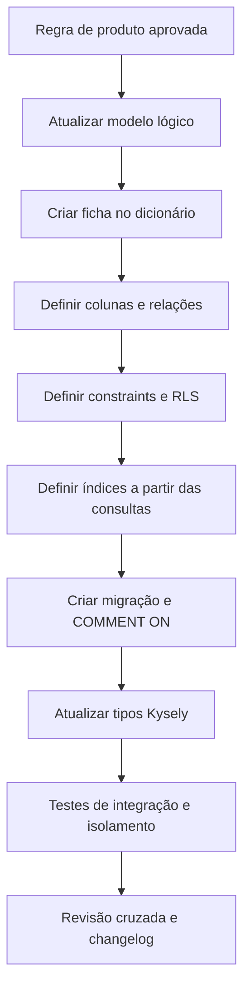

# Arquitetura do banco de dados

## 1. Objetivo

Esta área documenta o PostgreSQL do Concentus de forma navegável, rastreável e
útil tanto para desenvolvimento quanto para operação.

Uma pessoa nova deve conseguir responder rapidamente:

- em qual schema está determinado dado;
- qual módulo é proprietário de suas escritas;
- qual tabela representa determinado conceito;
- por que uma coluna existe;
- quais regras o banco garante;
- como o tenant é isolado;
- quais índices sustentam uma consulta;
- que eventos são auditados;
- qual migração introduziu ou alterou a estrutura.

## 2. Fontes de verdade

| Camada | Responsabilidade |
|---|---|
| Migrações | Estado físico executável do banco |
| Schema tipado do Kysely/codegen | Tipos consumidos pela aplicação |
| Dicionário Markdown | Semântica, ciclo de vida e regras humanas |
| `COMMENT ON` | Descrição disponível dentro do PostgreSQL |
| ADRs | Motivo de decisões estruturais |
| Diagramas | Relações e fluxos difíceis de perceber linearmente |

Quando houver divergência física, a migração aplicada determina o que realmente
existe; a divergência documental é um defeito e deve ser corrigida imediatamente.

## 3. Navegação

| Documento | Estado | Finalidade |
|---|---|---|
| [Convenções](conventions.md) | Definido | Nomes, tipos, chaves, constraints e índices |
| [Modelo lógico](logical-model.md) | Inicial | Schemas, domínios e inventário previsto |
| [Dicionário](dictionary/README.md) | Estrutura definida | Índice de tabelas por domínio |
| [Modelo de ficha](dictionary/table-template.md) | Definido | Formato obrigatório para cada tabela |
| [RLS e contexto de tenant](../security/rls-and-tenant-context.md) | Definido | Políticas e propagação por transação |
| Migrações e seeds | A criar | Evolução, rollback e dados iniciais |
| Índices e desempenho | A criar | Estratégia de acesso e observabilidade |

## 4. Fluxo de criação de tabela



Nenhuma tabela entra em produção sem ficha, comentários, constraints, política de
tenant aplicável e testes de migração.

## 5. Organização física planejada

```text
database/
├── conventions.md
├── logical-model.md
├── migrations-and-seeds.md
├── indexes-and-performance.md
└── dictionary/
    ├── README.md
    ├── table-template.md
    ├── identity.md
    ├── tenancy.md
    ├── content.md
    ├── communication.md
    └── audit.md
```

As fichas por domínio serão criadas junto do modelo lógico correspondente. Não
serão escritos dicionários especulativos antes de as regras daquele domínio serem
confirmadas.

## 6. Qualidade e automação futura

O pipeline deverá validar:

- migrações em banco vazio;
- migração desde a última release;
- ausência de alterações destrutivas não aprovadas;
- existência de `COMMENT ON` para tabelas e colunas públicas da aplicação;
- correspondência entre tipos Kysely e banco migrado;
- presença da tabela no dicionário;
- constraints de tenant e políticas RLS;
- links e diagramas da documentação.
