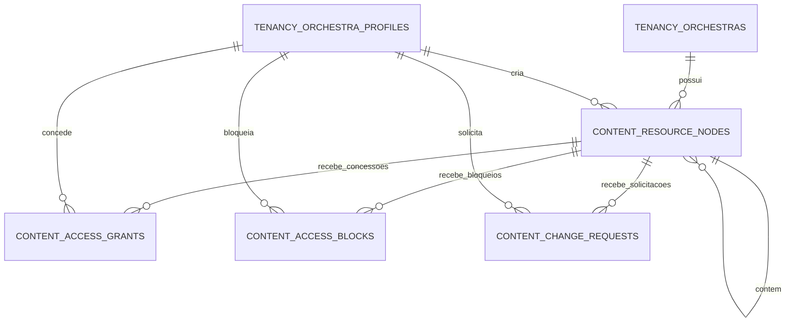
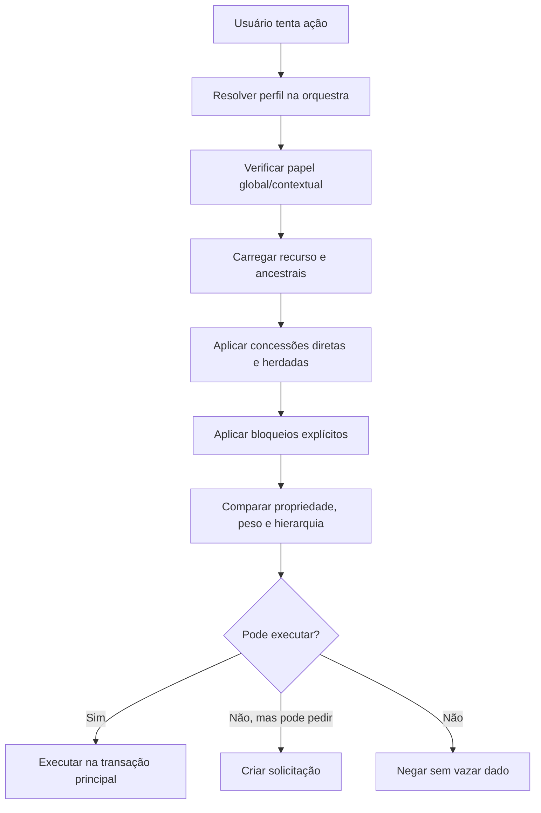

# Dicionário — autorização e concessões de acesso

## 1. Estado

Status: Proposto para P2

Última revisão: 2026-07-09

Este documento fecha a Onda 3 do modelo lógico: papéis, pesos administrativos,
capacidades, concessões de acesso, bloqueios explícitos do maestro e solicitações
de alteração/exclusão.

Esta onda não cria um schema PostgreSQL chamado `authorization`. A autorização é
um módulo de aplicação transversal, mas as tabelas abaixo ficam no schema
`content` porque controlam acesso a recursos de conteúdo: bibliotecas, pastas,
obras e materiais. A consequência prática é simples:

- o módulo **Autorização** é dono das regras e da escrita em concessões;
- o módulo **Conteúdo** consulta permissões efetivas para decidir se uma ação pode
  ocorrer;
- nenhum outro módulo deve alterar essas tabelas diretamente;
- comunicação e auditoria podem reutilizar os conceitos, mas não ganham FK
  circular para `content` sem decisão explícita futura.

Migração conceitual de origem: `0004_authorization_access_grants`.

## 2. Regras rastreadas

Este dicionário materializa principalmente:

- `PER-07` a `PER-12`: decisões do maestro, peso administrativo e limites entre
  admins;
- `PER-13` a `PER-21`: propriedade operacional, delegação e solicitações;
- `CAP-MAT-09` a `CAP-MAT-25`: associação a naipe/voz, compartilhamento,
  download, publicação, substituição, exclusão e bloqueio de ampliação indevida;
- regra de produto: editor comum não recebe `MANAGE_ACCESS` por consequência de
  `EDIT`;
- regra de produto: biblioteca compartilhada com herança inclui materiais futuros.

## 3. Modelo conceitual da onda

Fluxo de decisão simplificado:

## 4. Tipos fechados da onda

Os valores abaixo devem nascer como `CHECK` ou enum controlado pela camada de
migração. A decisão física final será tomada na migração, mas a semântica já está
fechada aqui.

### `resource_kind`

| Valor | Significado |
|---|---|
| `library` | Biblioteca de conteúdo |
| `folder` | Pasta dentro de biblioteca ou pasta |
| `work` | Obra/repertório |
| `material` | Material individual, como PDF, imagem, áudio ou documento |

### `resource_status`

| Valor | Significado |
|---|---|
| `draft` | Ainda não publicado para o público efetivo |
| `published` | Disponível ao público efetivo |
| `withdrawn` | Retirado temporariamente; mantém histórico e metadados |
| `deleted` | Exclusão lógica do recurso; exclusão física depende da política de arquivos |

### `resource_owner_kind`

| Valor | Significado |
|---|---|
| `profile` | Um perfil da orquestra é o proprietário operacional |
| `orchestra_administration` | A administração da orquestra assumiu o recurso |

### `capability_code`

| Valor | Significado |
|---|---|
| `VIEW` | Visualizar recurso publicado ou rascunho compartilhado |
| `ADD` | Criar recurso filho ou anexar conteúdo no escopo permitido |
| `EDIT` | Alterar metadados e conteúdo editável, sem gerenciar público |
| `PUBLISH` | Publicar, retirar de publicação ou republicar dentro da autoridade |
| `REQUEST_CHANGE` | Solicitar alteração quando não há autoridade direta |
| `REQUEST_DELETE` | Solicitar exclusão quando não há autoridade direta |
| `MANAGE_ACCESS` | Conceder, remover ou ajustar acesso dentro da autoridade |
| `ADMIN` | Administrar recurso em escopo amplo, sem ignorar regras superiores |

`MANAGE_ACCESS` é propositalmente separado de `EDIT`. Isso impede que um editor
comum amplie público, habilite download ou repasse biblioteca recebida apenas
porque pode editar conteúdo.

### `access_subject_type`

| Valor | Significado |
|---|---|
| `orchestra` | Toda a orquestra |
| `space` | Todos os membros de uma sala/naipe |
| `space_role` | Pessoas com papel contextual em uma sala, como líder ou responsável |
| `voice` | Pessoas vinculadas a uma voz específica |
| `profile` | Um perfil específico |

### `space_role_code`

| Valor | Significado |
|---|---|
| `leader` | Líder do naipe/sala |
| `responsible` | Responsável por sala temporária |
| `member` | Membro comum do espaço |

### `access_grant_status`

| Valor | Significado |
|---|---|
| `active` | Concessão válida |
| `revoked` | Concessão removida; permanece para histórico |

### `access_block_status`

| Valor | Significado |
|---|---|
| `active` | Bloqueio em vigor |
| `revoked` | Bloqueio removido; permanece para histórico |

### `change_request_type`

| Valor | Significado |
|---|---|
| `edit_metadata` | Pedido para alterar dados textuais ou organização |
| `replace_file` | Pedido para substituir arquivo |
| `delete_resource` | Pedido para excluir recurso |
| `change_access` | Pedido para alterar público, voz, naipe ou download |
| `publish` | Pedido para publicar ou republicar |
| `withdraw` | Pedido para retirar publicação |

### `change_request_status`

| Valor | Significado |
|---|---|
| `pending` | Aguardando decisão |
| `approved` | Aprovada, mas ainda não aplicada quando houver etapa separada |
| `rejected` | Rejeitada pelo aprovador |
| `cancelled` | Cancelada pelo solicitante antes da decisão |
| `applied` | Aprovada e aplicada |

## 5. Regra de permissão efetiva

A permissão efetiva nunca deve ser salva como uma verdade final permanente. Ela é
calculada a partir de fatos auditáveis:

1. papel do perfil na orquestra;
2. peso administrativo atual em `tenancy.orchestra_profiles.admin_weight`, quando
   o perfil é maestro/admin;
3. papel contextual em sala/naipe;
4. propriedade operacional do recurso;
5. concessões diretas no recurso;
6. concessões herdáveis nos ancestrais;
7. bloqueios explícitos ativos;
8. estado do recurso;
9. política de download/publicação do recurso;
10. regra de tenant e RLS.

Pode existir cache técnico de leitura no futuro, mas ele será derivado e
invalidável. O banco canônico deve permanecer nas tabelas abaixo.

## `content.resource_nodes`

### Finalidade

Representa a árvore comum de recursos protegidos por autorização: biblioteca,
pasta, obra e material. As tabelas detalhadas da Onda 4 (`libraries`, `works`,
`materials` etc.) referenciam este nó para herdar propriedade, status e acesso.

### Classificação

| Campo | Valor |
|---|---|
| Domínio físico | `content` |
| Módulo dono da autorização | Autorização |
| Módulo dono dos detalhes de conteúdo | Conteúdo |
| Escopo | Tenant |
| Contém dado pessoal? | Sim, por autoria/propriedade |
| Contém segredo? | Não |
| RLS obrigatória? | Sim |
| Migração de origem | `0004_authorization_access_grants` |

### Colunas

| Coluna | Tipo lógico | Obrigatório | Descrição |
|---|---|---:|---|
| `id` | `uuid` | Sim | Identificador técnico do nó |
| `orchestra_id` | `uuid` | Sim | Orquestra proprietária |
| `parent_resource_node_id` | `uuid` | Não | Nó pai; nulo apenas para raiz de biblioteca |
| `resource_kind` | `resource_kind` | Sim | Tipo do recurso |
| `resource_status` | `resource_status` | Sim | Estado de publicação/exclusão lógica |
| `owner_kind` | `resource_owner_kind` | Sim | Define se o dono operacional é perfil ou administração |
| `owner_profile_id` | `uuid` | Não | Perfil proprietário quando `owner_kind = profile` |
| `created_by_profile_id` | `uuid` | Sim | Perfil que criou originalmente o recurso |
| `created_at` | `timestamptz` | Sim | Criação |
| `updated_at` | `timestamptz` | Sim | Última alteração de metadado comum |
| `published_at` | `timestamptz` | Não | Última transição do nó para `published`; materiais guardam primeira/última publicação em `content.materials` |
| `withdrawn_at` | `timestamptz` | Não | Retirada de publicação |
| `deleted_at` | `timestamptz` | Não | Exclusão lógica |
| `lock_version` | `integer` | Sim | Controle otimista de concorrência |

### Integridade e constraints

| Nome lógico | Tipo | Regra | Motivo |
|---|---|---|---|
| `pk_resource_nodes` | PK | `id` | Identidade técnica |
| `uq_resource_nodes_orchestra_id_id` | UNIQUE | `(orchestra_id, id)` | Permite FKs compostas tenant-scoped |
| `fk_resource_nodes_orchestra` | FK | `orchestra_id -> tenancy.orchestras.id ON DELETE RESTRICT` | Tenant não some por cascade |
| `fk_resource_nodes_parent` | FK | `(orchestra_id, parent_resource_node_id) -> content.resource_nodes(orchestra_id, id) ON DELETE RESTRICT` | Filho fica no mesmo tenant |
| `fk_resource_nodes_owner_profile` | FK | `(orchestra_id, owner_profile_id) -> tenancy.orchestra_profiles(orchestra_id, id) ON DELETE RESTRICT` | Dono pertence à orquestra |
| `fk_resource_nodes_created_by` | FK | `(orchestra_id, created_by_profile_id) -> tenancy.orchestra_profiles(orchestra_id, id) ON DELETE RESTRICT` | Autor pertence à orquestra |
| `ck_resource_nodes_owner` | CHECK | `owner_kind = 'profile'` exige `owner_profile_id`; `orchestra_administration` exige nulo | Evita dono ambíguo |
| `ck_resource_nodes_parent_kind` | CHECK/aplicação | biblioteca não possui pai; pasta/obra/material possuem pai compatível | A árvore não vira grafo livre |
| `ck_resource_nodes_status_dates` | CHECK | datas compatíveis com status | Evita recurso publicado com `deleted_at` incoerente |
| `ck_resource_nodes_lock_version_positive` | CHECK | `lock_version >= 1` | Concorrência otimista |

### Índices iniciais

| Índice | Colunas | Motivo |
|---|---|---|
| `idx_resource_nodes_orchestra_parent` | `(orchestra_id, parent_resource_node_id, resource_kind)` | Listar filhos |
| `idx_resource_nodes_orchestra_status` | `(orchestra_id, resource_status)` | Administração por estado |
| `idx_resource_nodes_owner_profile` | `(orchestra_id, owner_profile_id)` | Encontrar recursos de um proprietário |
| `idx_resource_nodes_created_by` | `(orchestra_id, created_by_profile_id)` | Autoria e auditoria operacional |

### Regras de negócio

- Bibliotecas são raízes de árvore de conteúdo.
- Um recurso em `draft` só é visível ao autor, a quem possui autoridade superior
  ou a quem recebeu concessão explícita compatível.
- Um recurso em `withdrawn` deixa de aparecer para músicos, mas permanece para
  administração e histórico.
- Um recurso em `deleted` não aparece em fluxos normais, mas preserva autoria e
  auditoria.
- Se o criador sair da orquestra, `created_by_profile_id` permanece; a propriedade
  operacional pode mudar para `orchestra_administration`.
- Nenhuma exclusão física de arquivo é decidida apenas por esta tabela; a Onda 4
  fecha `stored_files` e retenção.

### RLS

Políticas iniciais:

- maestro/admin ativo da orquestra pode ler nós da própria orquestra;
- usuário comum só lê recurso se a autorização efetiva permitir;
- escrita deve passar por funções/serviços autorizados, nunca por update aberto;
- admin master não entra por RLS operacional comum: ações técnicas passam por
  fluxo auditado próprio.

## `content.access_grants`

### Finalidade

Registra concessões explícitas de capacidade sobre um recurso para uma orquestra,
sala, papel contextual, voz ou perfil específico. Cada linha concede uma única
capacidade. Para conceder várias capacidades, criam-se várias linhas, o que
mantém consulta, auditoria e revogação simples.

### Classificação

| Campo | Valor |
|---|---|
| Domínio físico | `content` |
| Módulo dono | Autorização |
| Escopo | Tenant |
| Contém dado pessoal? | Sim, quando o sujeito é perfil |
| Contém segredo? | Não |
| RLS obrigatória? | Sim |
| Migração de origem | `0004_authorization_access_grants` |

### Colunas

| Coluna | Tipo lógico | Obrigatório | Descrição |
|---|---|---:|---|
| `id` | `uuid` | Sim | Identificador técnico |
| `orchestra_id` | `uuid` | Sim | Orquestra |
| `resource_node_id` | `uuid` | Sim | Recurso alvo |
| `capability_code` | `capability_code` | Sim | Capacidade concedida |
| `subject_type` | `access_subject_type` | Sim | Tipo de destinatário |
| `subject_profile_id` | `uuid` | Não | Perfil quando `subject_type = profile` |
| `subject_space_id` | `uuid` | Não | Espaço quando sujeito envolve sala/naipe |
| `subject_voice_id` | `uuid` | Não | Voz quando `subject_type = voice` |
| `subject_space_role` | `space_role_code` | Não | Papel contextual quando `subject_type = space_role` |
| `applies_to_descendants` | `boolean` | Sim | Se a concessão herda para filhos atuais e futuros |
| `may_delegate` | `boolean` | Sim | Se o destinatário pode repassar dentro das regras |
| `grant_status` | `access_grant_status` | Sim | Estado da concessão |
| `granted_by_profile_id` | `uuid` | Sim | Perfil que concedeu |
| `grant_reason` | `text` | Não | Justificativa opcional |
| `created_at` | `timestamptz` | Sim | Criação |
| `revoked_at` | `timestamptz` | Não | Revogação |
| `revoked_by_profile_id` | `uuid` | Não | Perfil que revogou |
| `revocation_reason` | `text` | Não | Justificativa opcional |

### Integridade e constraints

| Nome lógico | Tipo | Regra | Motivo |
|---|---|---|---|
| `pk_access_grants` | PK | `id` | Identidade técnica |
| `uq_access_grants_orchestra_id_id` | UNIQUE | `(orchestra_id, id)` | FKs compostas |
| `fk_access_grants_resource` | FK | `(orchestra_id, resource_node_id) -> content.resource_nodes(orchestra_id, id) ON DELETE RESTRICT` | Concessão aponta para recurso do tenant |
| `fk_access_grants_profile` | FK | `(orchestra_id, subject_profile_id) -> tenancy.orchestra_profiles(orchestra_id, id) ON DELETE RESTRICT` | Perfil destinatário pertence ao tenant |
| `fk_access_grants_space` | FK | `(orchestra_id, subject_space_id) -> tenancy.spaces(orchestra_id, id) ON DELETE RESTRICT` | Sala destinatária pertence ao tenant |
| `fk_access_grants_voice` | FK | `(orchestra_id, subject_voice_id) -> tenancy.voices(orchestra_id, id) ON DELETE RESTRICT` | Voz destinatária pertence ao tenant |
| `fk_access_grants_granted_by` | FK | `(orchestra_id, granted_by_profile_id) -> tenancy.orchestra_profiles(orchestra_id, id) ON DELETE RESTRICT` | Concedente pertence ao tenant |
| `fk_access_grants_revoked_by` | FK | `(orchestra_id, revoked_by_profile_id) -> tenancy.orchestra_profiles(orchestra_id, id) ON DELETE RESTRICT` | Revogador pertence ao tenant |
| `ck_access_grants_subject_shape` | CHECK | Apenas as colunas compatíveis com `subject_type` podem estar preenchidas | Evita concessão ambígua |
| `ck_access_grants_revocation_shape` | CHECK | `revoked` exige `revoked_at` e `revoked_by_profile_id`; `active` não possui revogação | Estado coerente |
| `ck_access_grants_delegate_manage_access` | CHECK/aplicação | `may_delegate = true` exige `MANAGE_ACCESS` ou `ADMIN` efetivo do concedente | Impede repasse por editor comum |
| `uq_access_grants_active_orchestra_subject` | UNIQUE parcial | `(orchestra_id, resource_node_id, capability_code) WHERE grant_status = 'active' AND subject_type = 'orchestra'` | Uma concessão ativa por sujeito efetivo |
| `uq_access_grants_active_profile_subject` | UNIQUE parcial | `(orchestra_id, resource_node_id, capability_code, subject_profile_id) WHERE grant_status = 'active' AND subject_type = 'profile'` | Evita duplicidade para pessoa |
| `uq_access_grants_active_space_subject` | UNIQUE parcial | `(orchestra_id, resource_node_id, capability_code, subject_space_id) WHERE grant_status = 'active' AND subject_type = 'space'` | Evita duplicidade para sala |
| `uq_access_grants_active_space_role_subject` | UNIQUE parcial | `(orchestra_id, resource_node_id, capability_code, subject_space_id, subject_space_role) WHERE grant_status = 'active' AND subject_type = 'space_role'` | Evita duplicidade para papel contextual |
| `uq_access_grants_active_voice_subject` | UNIQUE parcial | `(orchestra_id, resource_node_id, capability_code, subject_voice_id) WHERE grant_status = 'active' AND subject_type = 'voice'` | Evita duplicidade para voz |

### Índices iniciais

| Índice | Colunas | Motivo |
|---|---|---|
| `idx_access_grants_resource_active` | `(orchestra_id, resource_node_id, grant_status)` | Resolver permissões de um recurso |
| `idx_access_grants_subject_profile` | `(orchestra_id, subject_profile_id, grant_status)` | Recursos compartilhados com uma pessoa |
| `idx_access_grants_subject_space` | `(orchestra_id, subject_space_id, grant_status)` | Recursos por sala/naipe |
| `idx_access_grants_subject_voice` | `(orchestra_id, subject_voice_id, grant_status)` | Recursos por voz |
| `idx_access_grants_capability` | `(orchestra_id, capability_code, grant_status)` | Consultas administrativas |

### Regras de negócio

- Concessões diretas são fatos; permissões herdadas são calculadas pelos
  ancestrais com `applies_to_descendants = true`.
- Uma biblioteca compartilhada com herança concede acesso a materiais criados no
  futuro, desde que esses materiais estejam publicados ou o rascunho tenha sido
  explicitamente compartilhado.
- `EDIT` não implica `MANAGE_ACCESS`.
- `may_delegate` não é “poder absoluto”: apenas registra que aquela concessão pode
  ser repassada dentro do limite do recurso pai e da hierarquia.
- Líder que criou uma biblioteca própria pode compartilhá-la se possuir
  `MANAGE_ACCESS`.
- Líder/editor que apenas recebeu biblioteca do maestro não pode repassar, mesmo
  tendo `EDIT`.
- Recurso filho não pode ampliar público acima do recurso pai sem `MANAGE_ACCESS`
  no nível adequado.
- Remover acesso torna a concessão `revoked`; não se apaga a linha.
- Para mudar escopo, herança ou delegação de uma concessão ativa, a operação deve
  revogar a linha antiga e criar uma nova, preservando histórico.

### RLS

- Usuário pode ler concessões necessárias para montar sua própria navegação,
  preferencialmente por views/funções que não revelem destinatários alheios.
- Maestro/admin lê concessões da própria orquestra.
- Escrita exige serviço de autorização e verificação transacional de autoridade.

## `content.access_blocks`

### Finalidade

Registra bloqueios explícitos definidos por maestro/admin sobre um recurso. O
bloqueio existe para representar decisões como: “nesta obra, o líder não pode
alterar a voz/destinatário decidido pelo maestro”.

### Classificação

| Campo | Valor |
|---|---|
| Domínio físico | `content` |
| Módulo dono | Autorização |
| Escopo | Tenant |
| Contém dado pessoal? | Sim, quando mira perfil |
| Contém segredo? | Não |
| RLS obrigatória? | Sim |
| Migração de origem | `0004_authorization_access_grants` |

### Colunas

| Coluna | Tipo lógico | Obrigatório | Descrição |
|---|---|---:|---|
| `id` | `uuid` | Sim | Identificador técnico |
| `orchestra_id` | `uuid` | Sim | Orquestra |
| `resource_node_id` | `uuid` | Sim | Recurso protegido |
| `blocked_capability_code` | `capability_code` | Sim | Capacidade bloqueada |
| `subject_type` | `access_subject_type` | Sim | Quem é bloqueado |
| `subject_profile_id` | `uuid` | Não | Perfil bloqueado |
| `subject_space_id` | `uuid` | Não | Sala/naipe bloqueado |
| `subject_voice_id` | `uuid` | Não | Voz bloqueada |
| `subject_space_role` | `space_role_code` | Não | Papel contextual bloqueado |
| `applies_to_descendants` | `boolean` | Sim | Se o bloqueio herda para filhos |
| `block_status` | `access_block_status` | Sim | Estado do bloqueio |
| `blocked_by_profile_id` | `uuid` | Sim | Maestro/admin que bloqueou |
| `block_reason` | `text` | Não | Justificativa opcional |
| `created_at` | `timestamptz` | Sim | Criação |
| `revoked_at` | `timestamptz` | Não | Revogação |
| `revoked_by_profile_id` | `uuid` | Não | Perfil que revogou |
| `revocation_reason` | `text` | Não | Justificativa opcional |

### Integridade e constraints

| Nome lógico | Tipo | Regra | Motivo |
|---|---|---|---|
| `pk_access_blocks` | PK | `id` | Identidade técnica |
| `uq_access_blocks_orchestra_id_id` | UNIQUE | `(orchestra_id, id)` | FKs compostas |
| `fk_access_blocks_resource` | FK | `(orchestra_id, resource_node_id) -> content.resource_nodes(orchestra_id, id) ON DELETE RESTRICT` | Bloqueio pertence ao recurso |
| `fk_access_blocks_profile` | FK | `(orchestra_id, subject_profile_id) -> tenancy.orchestra_profiles(orchestra_id, id) ON DELETE RESTRICT` | Perfil alvo pertence ao tenant |
| `fk_access_blocks_space` | FK | `(orchestra_id, subject_space_id) -> tenancy.spaces(orchestra_id, id) ON DELETE RESTRICT` | Espaço alvo pertence ao tenant |
| `fk_access_blocks_voice` | FK | `(orchestra_id, subject_voice_id) -> tenancy.voices(orchestra_id, id) ON DELETE RESTRICT` | Voz alvo pertence ao tenant |
| `fk_access_blocks_blocked_by` | FK | `(orchestra_id, blocked_by_profile_id) -> tenancy.orchestra_profiles(orchestra_id, id) ON DELETE RESTRICT` | Autor do bloqueio pertence ao tenant |
| `fk_access_blocks_revoked_by` | FK | `(orchestra_id, revoked_by_profile_id) -> tenancy.orchestra_profiles(orchestra_id, id) ON DELETE RESTRICT` | Revogador pertence ao tenant |
| `ck_access_blocks_subject_shape` | CHECK | Apenas colunas compatíveis com `subject_type` preenchidas | Evita alvo ambíguo |
| `ck_access_blocks_revocation_shape` | CHECK | `revoked` exige revogação; `active` não possui revogação | Estado coerente |
| `ck_access_blocks_admin_only` | CHECK/aplicação | Apenas maestro/admin com autoridade pode criar bloqueio | Regra depende de peso e papel |
| `uq_access_blocks_active_orchestra_subject` | UNIQUE parcial | `(orchestra_id, resource_node_id, blocked_capability_code) WHERE block_status = 'active' AND subject_type = 'orchestra'` | Um bloqueio ativo por sujeito efetivo |
| `uq_access_blocks_active_profile_subject` | UNIQUE parcial | `(orchestra_id, resource_node_id, blocked_capability_code, subject_profile_id) WHERE block_status = 'active' AND subject_type = 'profile'` | Evita duplicidade para pessoa |
| `uq_access_blocks_active_space_subject` | UNIQUE parcial | `(orchestra_id, resource_node_id, blocked_capability_code, subject_space_id) WHERE block_status = 'active' AND subject_type = 'space'` | Evita duplicidade para sala |
| `uq_access_blocks_active_space_role_subject` | UNIQUE parcial | `(orchestra_id, resource_node_id, blocked_capability_code, subject_space_id, subject_space_role) WHERE block_status = 'active' AND subject_type = 'space_role'` | Evita duplicidade para papel contextual |
| `uq_access_blocks_active_voice_subject` | UNIQUE parcial | `(orchestra_id, resource_node_id, blocked_capability_code, subject_voice_id) WHERE block_status = 'active' AND subject_type = 'voice'` | Evita duplicidade para voz |

### Índices iniciais

| Índice | Colunas | Motivo |
|---|---|---|
| `idx_access_blocks_resource_active` | `(orchestra_id, resource_node_id, block_status)` | Resolver bloqueios no recurso |
| `idx_access_blocks_subject_profile` | `(orchestra_id, subject_profile_id, block_status)` | Bloqueios por pessoa |
| `idx_access_blocks_subject_space` | `(orchestra_id, subject_space_id, block_status)` | Bloqueios por sala/naipe |
| `idx_access_blocks_subject_voice` | `(orchestra_id, subject_voice_id, block_status)` | Bloqueios por voz |

### Regras de negócio

- Bloqueio explícito vence concessão contextual de líder/responsável.
- Bloqueio não deve ser usado como substituto de revogar acesso; se a intenção é
  remover `VIEW`, revoga-se a concessão.
- Bloqueio de `MANAGE_ACCESS` impede que o alvo altere destinatários ou repasse
  acesso naquele escopo.
- Bloqueio de `PUBLISH` impede publicação/republicação pelo alvo naquele escopo.
- Bloqueio não autoriza o bloqueador a ignorar a hierarquia de pesos
  administrativos.
- Revogar bloqueio não reabre automaticamente permissões removidas; apenas deixa
  de impedir capacidades que ainda existam por outras vias.
- Para alterar alvo, herança ou capacidade bloqueada, a operação deve revogar o
  bloqueio antigo e criar outro, preservando histórico.

## `content.change_requests`

### Finalidade

Registra solicitações quando alguém não pode alterar, substituir, publicar,
retirar, alterar acesso ou excluir um recurso diretamente, mas possui direito de
pedir a ação.

### Classificação

| Campo | Valor |
|---|---|
| Domínio físico | `content` |
| Módulo dono | Autorização |
| Escopo | Tenant |
| Contém dado pessoal? | Sim |
| Contém segredo? | Não |
| RLS obrigatória? | Sim |
| Migração de origem | `0004_authorization_access_grants` |

### Colunas

| Coluna | Tipo lógico | Obrigatório | Descrição |
|---|---|---:|---|
| `id` | `uuid` | Sim | Identificador técnico |
| `orchestra_id` | `uuid` | Sim | Orquestra |
| `resource_node_id` | `uuid` | Sim | Recurso alvo |
| `request_type` | `change_request_type` | Sim | Tipo de pedido |
| `request_status` | `change_request_status` | Sim | Estado do pedido |
| `requested_by_profile_id` | `uuid` | Sim | Solicitante |
| `requested_to_profile_id` | `uuid` | Não | Aprovador preferencial, quando definido |
| `proposal_summary` | `text` | Sim | Resumo legível do pedido |
| `request_reason` | `text` | Não | Justificativa do solicitante |
| `proposed_stored_file_id` | `uuid` | Não | Arquivo proposto para substituição |
| `decision_by_profile_id` | `uuid` | Não | Quem decidiu |
| `decision_reason` | `text` | Não | Justificativa de aprovação/rejeição |
| `decided_at` | `timestamptz` | Não | Momento da decisão |
| `applied_by_profile_id` | `uuid` | Não | Quem aplicou a alteração |
| `applied_at` | `timestamptz` | Não | Momento da aplicação |
| `cancelled_at` | `timestamptz` | Não | Cancelamento pelo solicitante |
| `created_at` | `timestamptz` | Sim | Criação |
| `updated_at` | `timestamptz` | Sim | Última atualização |
| `lock_version` | `integer` | Sim | Controle otimista de concorrência |

### Integridade e constraints

| Nome lógico | Tipo | Regra | Motivo |
|---|---|---|---|
| `pk_change_requests` | PK | `id` | Identidade técnica |
| `uq_change_requests_orchestra_id_id` | UNIQUE | `(orchestra_id, id)` | FKs compostas |
| `fk_change_requests_resource` | FK | `(orchestra_id, resource_node_id) -> content.resource_nodes(orchestra_id, id) ON DELETE RESTRICT` | Pedido pertence ao recurso |
| `fk_change_requests_requested_by` | FK | `(orchestra_id, requested_by_profile_id) -> tenancy.orchestra_profiles(orchestra_id, id) ON DELETE RESTRICT` | Solicitante pertence ao tenant |
| `fk_change_requests_requested_to` | FK | `(orchestra_id, requested_to_profile_id) -> tenancy.orchestra_profiles(orchestra_id, id) ON DELETE RESTRICT` | Aprovador preferencial pertence ao tenant |
| `fk_change_requests_decision_by` | FK | `(orchestra_id, decision_by_profile_id) -> tenancy.orchestra_profiles(orchestra_id, id) ON DELETE RESTRICT` | Decisor pertence ao tenant |
| `fk_change_requests_applied_by` | FK | `(orchestra_id, applied_by_profile_id) -> tenancy.orchestra_profiles(orchestra_id, id) ON DELETE RESTRICT` | Aplicador pertence ao tenant |
| `fk_change_requests_proposed_file` | FK | `(orchestra_id, proposed_stored_file_id) -> content.stored_files(orchestra_id, id) ON DELETE RESTRICT` | Arquivo proposto pertence ao tenant |
| `ck_change_requests_decision_shape` | CHECK | `approved/rejected` exigem `decision_by_profile_id` e `decided_at` | Pedido decidido tem decisor |
| `ck_change_requests_applied_shape` | CHECK | `applied` exige aprovação anterior e `applied_at` | Aplicação coerente |
| `ck_change_requests_cancelled_shape` | CHECK | `cancelled` exige `cancelled_at` e não possui decisão | Cancelamento não vira decisão |
| `ck_change_requests_lock_version_positive` | CHECK | `lock_version >= 1` | Concorrência otimista |

### Índices iniciais

| Índice | Colunas | Motivo |
|---|---|---|
| `idx_change_requests_resource_status` | `(orchestra_id, resource_node_id, request_status)` | Pedidos por recurso |
| `idx_change_requests_requested_by` | `(orchestra_id, requested_by_profile_id, request_status)` | Pedidos do usuário |
| `idx_change_requests_requested_to` | `(orchestra_id, requested_to_profile_id, request_status)` | Caixa de aprovação |
| `idx_change_requests_status_created` | `(orchestra_id, request_status, created_at)` | Administração e SLA futuro |

### Regras de negócio

- Solicitação não altera o recurso por si só.
- Aprovação e aplicação podem ocorrer na mesma transação quando a ação for
  simples.
- `proposal_summary` é texto humano, não payload executável.
- Solicitações que precisarem de proposta estruturada não devem usar JSON opaco;
  devem ganhar tabela filha por tipo, por exemplo alteração de metadados, mudança
  de acesso ou substituição de arquivo. Na V1, a substituição de arquivo usa
  `proposed_stored_file_id`; propostas automatizadas mais ricas exigirão tabela
  filha própria antes de serem implementadas.
- Substituição de arquivo criado por autoridade superior sempre entra como
  solicitação se o usuário não possuir autoridade suficiente.
- Exclusão de material criado pelo maestro/admin superior exige solicitação.
- O solicitante pode cancelar enquanto o pedido estiver `pending`.
- O aprovador deve ser o autor do recurso, uma autoridade superior ou alguém com
  capacidade válida para decidir aquela ação.
- A decisão gera auditoria operacional e notificação ao solicitante.
- Se o pedido aprovado gerar notificação aos destinatários do recurso, o job deve
  nascer na mesma transação da aplicação.

### RLS

- Solicitante lê seus próprios pedidos.
- Aprovador potencial lê pedidos atribuídos ou decidíveis por sua autoridade.
- Maestro/admin lê pedidos da própria orquestra.
- Usuário comum não deve inferir existência de recurso privado por pedido negado.

## 6. Seeds mínimos

Esta onda não exige seed de papéis ou capacidades em tabela própria na V1. Os
códigos fechados acima podem nascer como tipos controlados pela migração e pelo
contrato TypeScript.

Seeds de demonstração podem criar:

- uma biblioteca oficial restrita;
- uma biblioteca criada por líder;
- uma concessão herdável para um naipe;
- uma concessão individual “Compartilhado comigo”;
- um bloqueio explícito de maestro em uma obra;
- uma solicitação pendente de substituição.

Seeds não podem criar:

- acesso entre orquestras;
- concessão sem recurso;
- concessão para perfil inativo como se fosse membro ativo;
- `MANAGE_ACCESS` implícito a partir de `EDIT`.

## 7. Auditoria mínima

Eventos obrigatórios para a Onda 6 consumir:

- concessão criada;
- concessão revogada;
- bloqueio criado;
- bloqueio revogado;
- solicitação criada;
- solicitação aprovada;
- solicitação rejeitada;
- solicitação cancelada;
- solicitação aplicada;
- propriedade operacional transferida para administração da orquestra.

Enquanto o domínio `audit` não estiver fechado, esses eventos ficam como contrato
obrigatório para a implementação, não como tabela desta onda.

## 8. Integração com Onda 4

A Onda 4 detalha em [content.md](content.md):

- bibliotecas, pastas, obras, materiais e arquivos físicos;
- `stored_files`, quarentena, hash, MIME e exclusão física;
- política de download por biblioteca/material;
- fotografias de formação da obra e partes faltantes;
- upload e publicação em lote;
- logs técnicos temporários de download.

A autorização continua definindo como o acesso é concedido, bloqueado, herdado e
solicitado. Conteúdo define o que existe, em qual estado está e qual arquivo
físico sustenta cada material.
