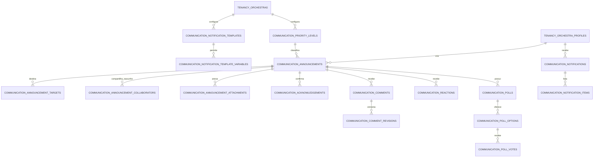
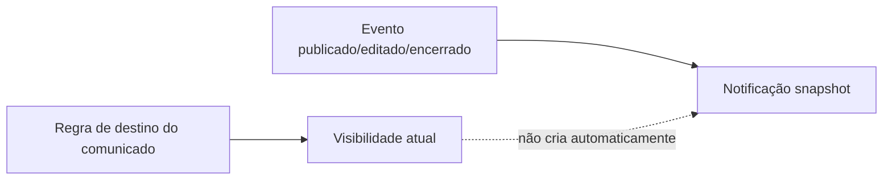

# Dicionário — domínio `communication`

## 1. Estado

Status: Proposto para P2

Última revisão: 2026-07-09

Este documento fecha a Onda 5 do modelo lógico: comunicados, públicos,
prioridades, anexos, ciência, comentários, reações, enquetes, modelos e
notificações internas persistentes.

O domínio `communication` depende de:

- `tenancy`, para orquestra, perfis, espaços, naipes e vozes;
- `content.stored_files`, para anexos;
- `content.materials`, `content.publication_batches` e
  `content.change_requests`, quando notificações apontarem para conteúdo;
- worker assíncrono, para publicação agendada, expiração, notificações,
  agrupamentos, SSE e limpeza.

Migração conceitual de origem: `0006_communication_notifications`.

## 2. Regras rastreadas

Este dicionário materializa principalmente:

- `CAP-COM-01` a `CAP-COM-25`;
- `CAP-NOT-01` a `CAP-NOT-08`;
- regra de produto: visibilidade e notificação são conceitos diferentes;
- regra de produto: comunicado expirado desaparece para músicos, inclusive por
  link direto;
- regra de produto: abrir notificação não confirma ciência;
- regra de produto: comentário anônimo é anônimo na interface e tecnicamente
  rastreável;
- regra de produto: comentários são lista simples na V1, sem respostas
  encadeadas;
- regra de produto: enquetes têm uma resposta ativa por usuário;
- regra de produto: notificações internas são idempotentes e individuais.

Referências:

- [Comunicados e notificações](../../../product/announcements-and-notifications.md)
- [Capacidades, permissões e casos de uso](../../../product/capabilities-permissions-and-use-cases.md)
- [Upload seguro e antimalware](../../security/secure-uploads-and-antimalware.md)

## 3. Modelo conceitual da onda

Separação essencial:

Se alguém entra em um naipe depois da publicação, pode ver o comunicado ativo
desse naipe, mas não recebe notificação antiga automaticamente na V1.

## 4. Tipos fechados da onda

### `priority_level_status`

| Valor | Significado |
|---|---|
| `active` | Disponível para novos comunicados |
| `archived` | Preservado para histórico, não usado em novos comunicados |

### `announcement_status`

| Valor | Significado |
|---|---|
| `draft` | Rascunho privado ou compartilhado explicitamente |
| `scheduled` | Agendado para publicação futura |
| `published` | Publicado e visível ao público efetivo |
| `expired` | Expirado; invisível para músicos |
| `deleted` | Excluído permanentemente da visão operacional; mantém log mínimo/auditoria |

### `interaction_status`

| Valor | Significado |
|---|---|
| `disabled` | Recurso desativado |
| `configured` | Configurado, mas ainda não aberto |
| `open` | Aberto para interação |
| `closed` | Encerrado |

Comentários, reações e enquetes têm estados independentes. Fechar interação não
expira comunicado.

### `template_status`

| Valor | Significado |
|---|---|
| `active` | Modelo disponível para renderização |
| `archived` | Preservado para histórico, não usado em novos eventos |

### `target_type`

| Valor | Significado |
|---|---|
| `orchestra` | Toda a orquestra |
| `space` | Sala, naipe ou sala temporária |
| `voice` | Voz específica |
| `profile` | Perfil específico |

### `target_status`

| Valor | Significado |
|---|---|
| `active` | Regra de destino vigente |
| `revoked` | Regra removida; permanece para histórico |

### `announcement_collaboration_capability`

| Valor | Significado |
|---|---|
| `view_draft` | Visualizar rascunho sem publicar |
| `edit_draft` | Editar rascunho sem publicar |

### `collaboration_status`

| Valor | Significado |
|---|---|
| `active` | Colaboração vigente |
| `revoked` | Colaboração removida |

### `attachment_status`

| Valor | Significado |
|---|---|
| `active` | Anexo disponível conforme comunicado |
| `removed` | Anexo removido do comunicado |
| `purged` | Binário removido após exclusão definitiva |

### `comment_identity_mode`

| Valor | Significado |
|---|---|
| `identified` | Autor visível conforme regras normais |
| `anonymous` | Autor oculto em todas as interfaces de negócio |

### `comment_status`

| Valor | Significado |
|---|---|
| `active` | Comentário visível |
| `edited` | Visível com edição do autor |
| `hidden_by_moderator` | Oculto por moderação |
| `deleted_by_author` | Excluído pelo próprio autor enquanto aberto |
| `deleted_by_moderator` | Excluído por autor do comunicado/maestro/admin |

### `comment_revision_reason`

| Valor | Significado |
|---|---|
| `created` | Versão inicial |
| `author_edit` | Edição do autor |
| `author_delete` | Exclusão do autor |
| `moderator_edit` | Edição moderadora |
| `moderator_hide` | Ocultação moderadora |
| `moderator_delete` | Exclusão moderadora |

### `reaction_identity_mode`

| Valor | Significado |
|---|---|
| `identified` | Nomes aparecem para participantes |
| `moderator_visible` | Identidade visível só para maestro/moderadores/autores autorizados |

### `reaction_value`

| Valor | Significado |
|---|---|
| `positive` | Reação positiva |
| `negative` | Reação negativa |

### `reaction_status`

| Valor | Significado |
|---|---|
| `active` | Reação vigente |
| `removed` | Usuário removeu ou reação foi encerrada |

### `poll_status`

| Valor | Significado |
|---|---|
| `configured` | Enquete criada antes da abertura |
| `open` | Votação aberta |
| `closed` | Votação encerrada |

### `poll_vote_status`

| Valor | Significado |
|---|---|
| `active` | Voto atual |
| `replaced` | Voto trocado pelo usuário |
| `removed` | Voto removido, se a interface permitir |

### `poll_option_status`

| Valor | Significado |
|---|---|
| `active` | Opção disponível para voto |
| `archived` | Opção preservada para histórico, indisponível para novos votos |

### `notification_event_kind`

| Valor | Significado |
|---|---|
| `material_published` | Material/lote publicado |
| `material_updated` | Material atualizado/substituído |
| `material_withdrawn` | Material retirado |
| `access_removed` | Acesso removido |
| `announcement_published` | Comunicado publicado |
| `announcement_updated` | Comunicado editado com renotificação |
| `announcement_interactions_closed` | Comentários, reações ou enquete encerrados |
| `comment_digest` | Comentários agrupados para o autor |
| `change_request_created` | Solicitação criada |
| `change_request_decided` | Solicitação aprovada/rejeitada |
| `administrative_change` | Mudança administrativa relevante |

### `notification_status`

| Valor | Significado |
|---|---|
| `unread` | Ainda não lida |
| `read` | Lida individualmente |
| `archived` | Arquivada pelo usuário |

### `notification_item_kind`

| Valor | Significado |
|---|---|
| `material` | Item aponta para material |
| `announcement` | Item aponta para comunicado |
| `comment` | Item aponta para comentário |
| `change_request` | Item aponta para solicitação |
| `text` | Item é linha de texto renderizado sem FK adicional |

## `communication.priority_levels`

### Finalidade

Configura prioridades por orquestra, como `Normal`, `Importante` e `Urgente`.
Nomes são configuráveis; a ordenação usa peso numérico.

### Identificação

| Campo | Valor |
|---|---|
| Domínio | `communication` |
| Módulo proprietário | Comunicados e interações |
| Escopo | Tenant |
| Sensibilidade | Interna |
| Retenção | Arquivar em vez de apagar quando houver uso histórico |
| Migração de origem | `0006_communication_notifications` |

### Colunas

| Coluna | Tipo | Nulo | Default | Sensibilidade | Descrição |
|---|---|---:|---|---|---|
| `id` | `uuid` | Não | `uuidv7()` | Interna | Identificador |
| `orchestra_id` | `uuid` | Não | — | Interna | Tenant |
| `display_name` | `text` | Não | — | Interna | Nome visível |
| `normalized_name` | `text` | Não | — | Interna | Nome normalizado |
| `color_token` | `text` | Sim | — | Interna | Token visual controlado pelo design system |
| `sort_weight` | `integer` | Não | `0` | Interna | Peso de ordenação |
| `requires_acknowledgement_by_default` | `boolean` | Não | `false` | Interna | Se prioridade sugere ciência obrigatória |
| `is_default` | `boolean` | Não | `false` | Interna | Prioridade padrão |
| `status` | `priority_level_status` | Não | `active` | Interna | Estado |
| `created_at` | `timestamptz` | Não | `now()` | Interna | Criação |
| `updated_at` | `timestamptz` | Não | `now()` | Interna | Atualização |

### Chaves e constraints

| Nome | Tipo | Definição | Regra protegida |
|---|---|---|---|
| `pk_priority_levels` | PK | `(id)` | Identidade |
| `uq_priority_levels_orchestra_id_id` | UNIQUE | `(orchestra_id, id)` | FK composta |
| `uq_priority_levels_name_active` | UNIQUE parcial | `(orchestra_id, normalized_name) WHERE status = 'active'` | Evita duplicidade ativa |
| `uq_priority_levels_default_active` | UNIQUE parcial | `(orchestra_id) WHERE is_default = true AND status = 'active'` | Uma prioridade padrão |
| `fk_priority_levels_orchestra` | FK | `orchestra_id -> tenancy.orchestras.id ON DELETE RESTRICT` | Tenant preservado |

## `communication.notification_templates`

### Finalidade

Define modelos editáveis por orquestra para renderizar notificações internas.
O motor e a allowlist de variáveis são estruturais; o texto é configurável.

### Identificação

| Campo | Valor |
|---|---|
| Domínio | `communication` |
| Módulo proprietário | Notificações |
| Escopo | Tenant |
| Sensibilidade | Interna |
| Retenção | Preservar templates usados por histórico enquanto necessário |
| Migração de origem | `0006_communication_notifications` |

### Colunas

| Coluna | Tipo | Nulo | Default | Sensibilidade | Descrição |
|---|---|---:|---|---|---|
| `id` | `uuid` | Não | `uuidv7()` | Interna | Identificador |
| `orchestra_id` | `uuid` | Não | — | Interna | Tenant |
| `event_kind` | `notification_event_kind` | Não | — | Interna | Evento suportado |
| `display_name` | `text` | Não | — | Interna | Nome administrativo |
| `title_template` | `text` | Não | — | Interna | Template de título sem HTML |
| `body_template` | `text` | Não | — | Interna | Template de corpo sem HTML |
| `status` | `template_status` | Não | `active` | Interna | Ativo ou arquivado |
| `created_at` | `timestamptz` | Não | `now()` | Interna | Criação |
| `updated_at` | `timestamptz` | Não | `now()` | Interna | Atualização |

### Chaves e constraints

| Nome | Tipo | Definição | Regra protegida |
|---|---|---|---|
| `pk_notification_templates` | PK | `(id)` | Identidade |
| `uq_notification_templates_orchestra_id_id` | UNIQUE | `(orchestra_id, id)` | FK composta |
| `uq_notification_templates_event_active` | UNIQUE parcial | `(orchestra_id, event_kind) WHERE status = 'active'` | Um modelo ativo por evento |
| `fk_notification_templates_orchestra` | FK | `orchestra_id -> tenancy.orchestras.id ON DELETE RESTRICT` | Tenant preservado |
| `ck_notification_templates_no_html` | CHECK/aplicação | templates não aceitam HTML/JS/expressão arbitrária | Evita injeção |

### Regras de negócio

- Ao notificar, o título/corpo renderizados são salvos em `notifications`.
- Alterar template não reescreve notificações antigas.
- Variáveis são escapadas e renderizadas por allowlist.

## `communication.notification_template_variables`

### Finalidade

Declara variáveis permitidas por modelo de notificação. A tabela torna a allowlist
consultável e evita esconder estrutura em array ou JSON.

### Colunas

| Coluna | Tipo | Nulo | Default | Sensibilidade | Descrição |
|---|---|---:|---|---|---|
| `id` | `uuid` | Não | `uuidv7()` | Interna | Identificador |
| `orchestra_id` | `uuid` | Não | — | Interna | Tenant |
| `notification_template_id` | `uuid` | Não | — | Interna | Modelo |
| `variable_code` | `text` | Não | — | Interna | Código permitido, como `obra_titulo` |
| `description` | `text` | Sim | — | Interna | Descrição administrativa |
| `is_required` | `boolean` | Não | `false` | Interna | Se o evento deve fornecer a variável |
| `created_at` | `timestamptz` | Não | `now()` | Interna | Criação |

### Chaves e constraints

| Nome | Tipo | Definição | Regra protegida |
|---|---|---|---|
| `pk_notification_template_variables` | PK | `(id)` | Identidade |
| `uq_notification_template_variables_orchestra_id_id` | UNIQUE | `(orchestra_id, id)` | FK composta |
| `uq_notification_template_variables_code` | UNIQUE | `(orchestra_id, notification_template_id, variable_code)` | Variável única no modelo |
| `fk_notification_template_variables_template` | FK | `(orchestra_id, notification_template_id) -> communication.notification_templates(orchestra_id, id) ON DELETE CASCADE` | Variável inseparável do modelo |
| `ck_notification_template_variables_code` | CHECK | código normalizado em `snake_case` | Evita placeholder ambíguo |

### Regras de negócio

- O motor ainda valida se a variável pertence ao `event_kind`.
- Template com variável não declarada é inválido.
- Variável declarada, mas não usada no texto, é permitida para facilitar modelos
  alternativos.

## `communication.announcements`

### Finalidade

Guarda comunicados configuráveis: rascunhos, agendados, publicados, expirados e
excluídos. O comunicado concentra configurações de interação; destinatários,
anexos e interações ficam em tabelas próprias.

### Identificação

| Campo | Valor |
|---|---|
| Domínio | `communication` |
| Módulo proprietário | Comunicados e interações |
| Escopo | Tenant |
| Sensibilidade | Interna/privada conforme público |
| Retenção | Expirado permanece para histórico administrativo; exclusão mantém log mínimo/auditoria |
| Migração de origem | `0006_communication_notifications` |

### Colunas

| Coluna | Tipo | Nulo | Default | Sensibilidade | Descrição |
|---|---|---:|---|---|---|
| `id` | `uuid` | Não | `uuidv7()` | Interna | Identificador |
| `orchestra_id` | `uuid` | Não | — | Interna | Tenant |
| `author_profile_id` | `uuid` | Não | — | Interna | Autor |
| `priority_level_id` | `uuid` | Não | — | Interna | Prioridade |
| `title` | `text` | Não | — | Interna | Título |
| `body` | `text` | Não | — | Interna | Corpo em texto/markdown seguro definido pela aplicação |
| `status` | `announcement_status` | Não | `draft` | Interna | Estado principal |
| `requires_acknowledgement` | `boolean` | Não | `false` | Interna | Ciência obrigatória efetiva |
| `comments_status` | `interaction_status` | Não | `disabled` | Interna | Estado dos comentários |
| `allow_anonymous_comments` | `boolean` | Não | `false` | Interna | Se usuário pode comentar anonimamente |
| `reactions_status` | `interaction_status` | Não | `disabled` | Interna | Estado das reações |
| `reaction_identity_mode` | `reaction_identity_mode` | Não | `identified` | Interna | Visibilidade da identidade nas reações |
| `scheduled_publish_at` | `timestamptz` | Sim | — | Interna | Publicação agendada |
| `published_at` | `timestamptz` | Sim | — | Interna | Publicação efetiva |
| `expires_at` | `timestamptz` | Sim | — | Interna | Expiração |
| `pinned_until` | `timestamptz` | Sim | — | Interna | Fixado até |
| `interactions_closed_at` | `timestamptz` | Sim | — | Interna | Encerramento geral antecipado, se aplicável |
| `last_notified_at` | `timestamptz` | Sim | — | Interna | Última renotificação por edição material |
| `deleted_at` | `timestamptz` | Sim | — | Interna | Exclusão lógica/permanente operacional |
| `deleted_by_profile_id` | `uuid` | Sim | — | Interna | Responsável pela exclusão |
| `delete_reason` | `text` | Sim | — | Interna | Motivo |
| `created_at` | `timestamptz` | Não | `now()` | Interna | Criação |
| `updated_at` | `timestamptz` | Não | `now()` | Interna | Atualização |
| `lock_version` | `integer` | Não | `1` | Interna | Concorrência otimista |

### Chaves e constraints

| Nome | Tipo | Definição | Regra protegida |
|---|---|---|---|
| `pk_announcements` | PK | `(id)` | Identidade |
| `uq_announcements_orchestra_id_id` | UNIQUE | `(orchestra_id, id)` | FK composta |
| `fk_announcements_orchestra` | FK | `orchestra_id -> tenancy.orchestras.id ON DELETE RESTRICT` | Tenant preservado |
| `fk_announcements_author` | FK | `(orchestra_id, author_profile_id) -> tenancy.orchestra_profiles(orchestra_id, id) ON DELETE RESTRICT` | Autor do tenant |
| `fk_announcements_priority` | FK | `(orchestra_id, priority_level_id) -> communication.priority_levels(orchestra_id, id) ON DELETE RESTRICT` | Prioridade do tenant |
| `fk_announcements_deleted_by` | FK | `(orchestra_id, deleted_by_profile_id) -> tenancy.orchestra_profiles(orchestra_id, id) ON DELETE RESTRICT` | Excluidor do tenant |
| `ck_announcements_schedule_shape` | CHECK | `scheduled` exige `scheduled_publish_at`; `published` exige `published_at` | Estado coerente |
| `ck_announcements_expiry_order` | CHECK | `expires_at IS NULL OR expires_at > COALESCE(published_at, scheduled_publish_at, created_at)` | Expiração posterior |
| `ck_announcements_deleted_shape` | CHECK | `deleted` exige `deleted_at`, `deleted_by_profile_id` e motivo | Exclusão rastreável |
| `ck_announcements_lock_version_positive` | CHECK | `lock_version >= 1` | Concorrência otimista |

### Índices iniciais

| Índice | Colunas | Motivo |
|---|---|---|
| `idx_announcements_orchestra_status` | `(orchestra_id, status, published_at DESC)` | Listas administrativas |
| `idx_announcements_schedule` | `(status, scheduled_publish_at)` | Job de publicação |
| `idx_announcements_expiration` | `(status, expires_at)` | Job de expiração |
| `idx_announcements_home_order` | `(orchestra_id, status, pinned_until, published_at DESC)` | Página inicial |

### Regras de negócio

- Rascunho começa privado e só aparece a quem recebeu acesso explícito ou possui
  autoridade.
- Editar comunicado publicado pode ser correção silenciosa ou renotificação.
- Mudança de público depois da publicação é mudança material.
- Comunicado expirado não aparece para músicos nem por link direto.
- Excluir comunicado expirado remove anexos físicos por job e preserva log mínimo.

## `communication.announcement_targets`

### Finalidade

Registra regras de destino do comunicado. Destino é regra estruturada, não texto
livre.

### Colunas

| Coluna | Tipo | Nulo | Default | Sensibilidade | Descrição |
|---|---|---:|---|---|---|
| `id` | `uuid` | Não | `uuidv7()` | Interna | Identificador |
| `orchestra_id` | `uuid` | Não | — | Interna | Tenant |
| `announcement_id` | `uuid` | Não | — | Interna | Comunicado |
| `target_type` | `target_type` | Não | — | Interna | Tipo de destino |
| `target_space_id` | `uuid` | Sim | — | Interna | Espaço/naipe |
| `target_voice_id` | `uuid` | Sim | — | Interna | Voz |
| `target_profile_id` | `uuid` | Sim | — | Interna | Perfil |
| `target_status` | `target_status` | Não | `active` | Interna | Vigente ou revogado |
| `created_by_profile_id` | `uuid` | Não | — | Interna | Quem adicionou |
| `created_at` | `timestamptz` | Não | `now()` | Interna | Criação |
| `revoked_by_profile_id` | `uuid` | Sim | — | Interna | Quem removeu |
| `revoked_at` | `timestamptz` | Sim | — | Interna | Remoção |

### Chaves e constraints

| Nome | Tipo | Definição | Regra protegida |
|---|---|---|---|
| `pk_announcement_targets` | PK | `(id)` | Identidade |
| `uq_announcement_targets_orchestra_id_id` | UNIQUE | `(orchestra_id, id)` | FK composta |
| `fk_announcement_targets_announcement` | FK | `(orchestra_id, announcement_id) -> communication.announcements(orchestra_id, id) ON DELETE RESTRICT` | Alvo do comunicado |
| `fk_announcement_targets_space` | FK | `(orchestra_id, target_space_id) -> tenancy.spaces(orchestra_id, id) ON DELETE RESTRICT` | Espaço do tenant |
| `fk_announcement_targets_voice` | FK | `(orchestra_id, target_voice_id) -> tenancy.voices(orchestra_id, id) ON DELETE RESTRICT` | Voz do tenant |
| `fk_announcement_targets_profile` | FK | `(orchestra_id, target_profile_id) -> tenancy.orchestra_profiles(orchestra_id, id) ON DELETE RESTRICT` | Perfil do tenant |
| `ck_announcement_targets_shape` | CHECK | apenas colunas compatíveis com `target_type` preenchidas | Destino não ambíguo |
| `ck_announcement_targets_revocation_shape` | CHECK | `revoked` exige `revoked_at` e `revoked_by_profile_id` | Histórico coerente |
| `uq_announcement_targets_active_orchestra` | UNIQUE parcial | `(orchestra_id, announcement_id) WHERE target_status = 'active' AND target_type = 'orchestra'` | Um destino global ativo |
| `uq_announcement_targets_active_space` | UNIQUE parcial | `(orchestra_id, announcement_id, target_space_id) WHERE target_status = 'active' AND target_type = 'space'` | Evita duplicidade por espaço |
| `uq_announcement_targets_active_voice` | UNIQUE parcial | `(orchestra_id, announcement_id, target_voice_id) WHERE target_status = 'active' AND target_type = 'voice'` | Evita duplicidade por voz |
| `uq_announcement_targets_active_profile` | UNIQUE parcial | `(orchestra_id, announcement_id, target_profile_id) WHERE target_status = 'active' AND target_type = 'profile'` | Evita duplicidade por perfil |

### Regras de negócio

- Público efetivo é calculado pelos targets ativos e associação atual do usuário.
- Notificações são snapshot do evento e deduplicam destinatários.
- Remover target ativo tira acesso imediatamente.
- Alguém que entrou depois no público vê comunicado ativo, mas não recebe
  notificação antiga automaticamente na V1.

## `communication.announcement_collaborators`

### Finalidade

Registra compartilhamento explícito de rascunho de comunicado para visualização ou
edição. Esta tabela não define público final e não gera notificação para
destinatários do comunicado.

### Colunas

| Coluna | Tipo | Nulo | Default | Sensibilidade | Descrição |
|---|---|---:|---|---|---|
| `id` | `uuid` | Não | `uuidv7()` | Interna | Identificador |
| `orchestra_id` | `uuid` | Não | — | Interna | Tenant |
| `announcement_id` | `uuid` | Não | — | Interna | Comunicado |
| `profile_id` | `uuid` | Não | — | Interna | Colaborador |
| `capability` | `announcement_collaboration_capability` | Não | — | Interna | Visualizar ou editar rascunho |
| `collaboration_status` | `collaboration_status` | Não | `active` | Interna | Estado |
| `granted_by_profile_id` | `uuid` | Não | — | Interna | Quem compartilhou |
| `created_at` | `timestamptz` | Não | `now()` | Interna | Criação |
| `revoked_by_profile_id` | `uuid` | Sim | — | Interna | Quem revogou |
| `revoked_at` | `timestamptz` | Sim | — | Interna | Revogação |

### Chaves e constraints

| Nome | Tipo | Definição | Regra protegida |
|---|---|---|---|
| `pk_announcement_collaborators` | PK | `(id)` | Identidade |
| `uq_announcement_collaborators_orchestra_id_id` | UNIQUE | `(orchestra_id, id)` | FK composta |
| `uq_announcement_collaborators_active` | UNIQUE parcial | `(orchestra_id, announcement_id, profile_id, capability) WHERE collaboration_status = 'active'` | Evita concessão duplicada |
| `fk_announcement_collaborators_announcement` | FK | `(orchestra_id, announcement_id) -> communication.announcements(orchestra_id, id) ON DELETE RESTRICT` | Colaboração do comunicado |
| `fk_announcement_collaborators_profile` | FK | `(orchestra_id, profile_id) -> tenancy.orchestra_profiles(orchestra_id, id) ON DELETE RESTRICT` | Colaborador do tenant |
| `fk_announcement_collaborators_granted_by` | FK | `(orchestra_id, granted_by_profile_id) -> tenancy.orchestra_profiles(orchestra_id, id) ON DELETE RESTRICT` | Concedente do tenant |
| `fk_announcement_collaborators_revoked_by` | FK | `(orchestra_id, revoked_by_profile_id) -> tenancy.orchestra_profiles(orchestra_id, id) ON DELETE RESTRICT` | Revogador do tenant |
| `ck_announcement_collaborators_revocation_shape` | CHECK | `revoked` exige `revoked_at` e `revoked_by_profile_id` | Histórico coerente |

### Regras de negócio

- Autoridade superior pode ver/editar conforme hierarquia mesmo sem linha nesta
  tabela.
- Colaboração de rascunho não torna a pessoa destinatária após publicação.
- Para publicar, ainda é necessário permissão de publicação no escopo.
- Revogar colaboração remove acesso ao rascunho imediatamente.

## `communication.announcement_attachments`

### Finalidade

Vincula anexos a comunicados. O arquivo físico é `content.stored_files`; o anexo
herda visibilidade do comunicado.

### Colunas

| Coluna | Tipo | Nulo | Default | Sensibilidade | Descrição |
|---|---|---:|---|---|---|
| `id` | `uuid` | Não | `uuidv7()` | Interna | Identificador |
| `orchestra_id` | `uuid` | Não | — | Interna | Tenant |
| `announcement_id` | `uuid` | Não | — | Interna | Comunicado |
| `stored_file_id` | `uuid` | Não | — | Restrita | Arquivo físico |
| `display_title` | `text` | Não | — | Interna | Título visível |
| `attachment_status` | `attachment_status` | Não | `active` | Interna | Estado |
| `sort_order` | `integer` | Não | `0` | Interna | Ordem |
| `created_by_profile_id` | `uuid` | Não | — | Interna | Quem anexou |
| `created_at` | `timestamptz` | Não | `now()` | Interna | Criação |
| `removed_at` | `timestamptz` | Sim | — | Interna | Remoção |
| `purged_at` | `timestamptz` | Sim | — | Restrita | Binário removido |

### Chaves e constraints

| Nome | Tipo | Definição | Regra protegida |
|---|---|---|---|
| `pk_announcement_attachments` | PK | `(id)` | Identidade |
| `uq_announcement_attachments_orchestra_id_id` | UNIQUE | `(orchestra_id, id)` | FK composta |
| `fk_announcement_attachments_announcement` | FK | `(orchestra_id, announcement_id) -> communication.announcements(orchestra_id, id) ON DELETE RESTRICT` | Anexo do comunicado |
| `fk_announcement_attachments_file` | FK | `(orchestra_id, stored_file_id) -> content.stored_files(orchestra_id, id) ON DELETE RESTRICT` | Arquivo do tenant |
| `fk_announcement_attachments_created_by` | FK | `(orchestra_id, created_by_profile_id) -> tenancy.orchestra_profiles(orchestra_id, id) ON DELETE RESTRICT` | Autor do tenant |
| `ck_announcement_attachments_sort_order` | CHECK | `sort_order >= 0` | Ordenação previsível |

### Regras de negócio

- Anexo em quarentena ou rejeitado não aparece ao público.
- Anexo deixa de aparecer ao músico quando comunicado expira.
- Exclusão definitiva do comunicado agenda remoção física do anexo.

## `communication.acknowledgements`

### Finalidade

Registra confirmação explícita de ciência. Abrir notificação ou comunicado não
cria confirmação.

### Colunas

| Coluna | Tipo | Nulo | Default | Sensibilidade | Descrição |
|---|---|---:|---|---|---|
| `id` | `uuid` | Não | `uuidv7()` | Interna | Identificador |
| `orchestra_id` | `uuid` | Não | — | Interna | Tenant |
| `announcement_id` | `uuid` | Não | — | Interna | Comunicado |
| `profile_id` | `uuid` | Não | — | Interna | Perfil que confirmou |
| `acknowledged_at` | `timestamptz` | Não | `now()` | Interna | Momento da ciência |
| `created_at` | `timestamptz` | Não | `now()` | Interna | Criação |

### Chaves e constraints

| Nome | Tipo | Definição | Regra protegida |
|---|---|---|---|
| `pk_acknowledgements` | PK | `(id)` | Identidade |
| `uq_acknowledgements_orchestra_id_id` | UNIQUE | `(orchestra_id, id)` | FK composta |
| `uq_acknowledgements_announcement_profile` | UNIQUE | `(orchestra_id, announcement_id, profile_id)` | Uma ciência por pessoa/comunicado |
| `fk_acknowledgements_announcement` | FK | `(orchestra_id, announcement_id) -> communication.announcements(orchestra_id, id) ON DELETE RESTRICT` | Comunicado do tenant |
| `fk_acknowledgements_profile` | FK | `(orchestra_id, profile_id) -> tenancy.orchestra_profiles(orchestra_id, id) ON DELETE RESTRICT` | Perfil do tenant |

### Regras de negócio

- Pendentes são calculados pelo público efetivo atual menos confirmações.
- Confirmação histórica permanece mesmo se o usuário perder acesso depois.

## `communication.comments`

### Finalidade

Guarda comentários de comunicados. A V1 usa lista simples, sem respostas
encadeadas.

### Colunas

| Coluna | Tipo | Nulo | Default | Sensibilidade | Descrição |
|---|---|---:|---|---|---|
| `id` | `uuid` | Não | `uuidv7()` | Interna | Identificador |
| `orchestra_id` | `uuid` | Não | — | Interna | Tenant |
| `announcement_id` | `uuid` | Não | — | Interna | Comunicado |
| `author_profile_id` | `uuid` | Não | — | Restrita quando anônimo | Autor técnico |
| `identity_mode` | `comment_identity_mode` | Não | `identified` | Interna | Identificado ou anônimo |
| `comment_body` | `text` | Não | — | Interna | Texto atual quando visível |
| `comment_status` | `comment_status` | Não | `active` | Interna | Estado |
| `created_at` | `timestamptz` | Não | `now()` | Interna | Criação |
| `updated_at` | `timestamptz` | Não | `now()` | Interna | Atualização |
| `moderated_by_profile_id` | `uuid` | Sim | — | Interna | Moderador |
| `moderated_at` | `timestamptz` | Sim | — | Interna | Momento da moderação |
| `moderation_reason` | `text` | Sim | — | Interna | Motivo |

### Chaves e constraints

| Nome | Tipo | Definição | Regra protegida |
|---|---|---|---|
| `pk_comments` | PK | `(id)` | Identidade |
| `uq_comments_orchestra_id_id` | UNIQUE | `(orchestra_id, id)` | FK composta |
| `fk_comments_announcement` | FK | `(orchestra_id, announcement_id) -> communication.announcements(orchestra_id, id) ON DELETE RESTRICT` | Comentário do comunicado |
| `fk_comments_author` | FK | `(orchestra_id, author_profile_id) -> tenancy.orchestra_profiles(orchestra_id, id) ON DELETE RESTRICT` | Autor do tenant |
| `fk_comments_moderated_by` | FK | `(orchestra_id, moderated_by_profile_id) -> tenancy.orchestra_profiles(orchestra_id, id) ON DELETE RESTRICT` | Moderador do tenant |
| `ck_comments_moderation_shape` | CHECK | estados moderados exigem moderador e motivo | Moderação rastreável |

### Regras de negócio

- Comentário anônimo nunca retorna `author_profile_id` em API de negócio.
- Autor pode editar/excluir enquanto comentários estiverem abertos.
- Após encerramento, somente moderação autorizada altera visibilidade.
- Novo comentário notifica persistentemente apenas o autor do comunicado, de forma
  agrupada.

## `communication.comment_revisions`

### Finalidade

Preserva versões e ações sobre comentários sem depender apenas de auditoria
externa. Isso evita que edição/moderação apague o fato histórico.

### Colunas

| Coluna | Tipo | Nulo | Default | Sensibilidade | Descrição |
|---|---|---:|---|---|---|
| `id` | `uuid` | Não | `uuidv7()` | Restrita | Identificador |
| `orchestra_id` | `uuid` | Não | — | Interna | Tenant |
| `comment_id` | `uuid` | Não | — | Interna | Comentário |
| `revision_number` | `integer` | Não | — | Interna | Sequência por comentário |
| `revision_reason` | `comment_revision_reason` | Não | — | Interna | Motivo |
| `body_snapshot` | `text` | Sim | — | Restrita | Texto da versão, quando aplicável |
| `changed_by_profile_id` | `uuid` | Não | — | Restrita | Quem alterou |
| `created_at` | `timestamptz` | Não | `now()` | Restrita | Momento |

### Chaves e constraints

| Nome | Tipo | Definição | Regra protegida |
|---|---|---|---|
| `pk_comment_revisions` | PK | `(id)` | Identidade |
| `uq_comment_revisions_orchestra_id_id` | UNIQUE | `(orchestra_id, id)` | FK composta |
| `uq_comment_revisions_comment_number` | UNIQUE | `(orchestra_id, comment_id, revision_number)` | Sequência única |
| `fk_comment_revisions_comment` | FK | `(orchestra_id, comment_id) -> communication.comments(orchestra_id, id) ON DELETE RESTRICT` | Revisão do comentário |
| `fk_comment_revisions_changed_by` | FK | `(orchestra_id, changed_by_profile_id) -> tenancy.orchestra_profiles(orchestra_id, id) ON DELETE RESTRICT` | Autor da alteração |
| `ck_comment_revisions_number_positive` | CHECK | `revision_number >= 1` | Sequência válida |

### Regras de negócio

- Revisões são visíveis apenas a administradores/autores autorizados e suporte
  técnico conforme política.
- Interface comum não usa revisões para descobrir autor de comentário anônimo.

## `communication.reactions`

### Finalidade

Registra reação positiva ou negativa por usuário em comunicado.

### Colunas

| Coluna | Tipo | Nulo | Default | Sensibilidade | Descrição |
|---|---|---:|---|---|---|
| `id` | `uuid` | Não | `uuidv7()` | Interna | Identificador |
| `orchestra_id` | `uuid` | Não | — | Interna | Tenant |
| `announcement_id` | `uuid` | Não | — | Interna | Comunicado |
| `profile_id` | `uuid` | Não | — | Interna/restrita conforme modo | Autor da reação |
| `reaction_value` | `reaction_value` | Não | — | Interna | Positiva ou negativa |
| `reaction_status` | `reaction_status` | Não | `active` | Interna | Ativa/removida |
| `created_at` | `timestamptz` | Não | `now()` | Interna | Criação |
| `updated_at` | `timestamptz` | Não | `now()` | Interna | Atualização |
| `removed_at` | `timestamptz` | Sim | — | Interna | Remoção |

### Chaves e constraints

| Nome | Tipo | Definição | Regra protegida |
|---|---|---|---|
| `pk_reactions` | PK | `(id)` | Identidade |
| `uq_reactions_orchestra_id_id` | UNIQUE | `(orchestra_id, id)` | FK composta |
| `uq_reactions_active_announcement_profile` | UNIQUE parcial | `(orchestra_id, announcement_id, profile_id) WHERE reaction_status = 'active'` | Uma reação ativa por usuário |
| `fk_reactions_announcement` | FK | `(orchestra_id, announcement_id) -> communication.announcements(orchestra_id, id) ON DELETE RESTRICT` | Reação do comunicado |
| `fk_reactions_profile` | FK | `(orchestra_id, profile_id) -> tenancy.orchestra_profiles(orchestra_id, id) ON DELETE RESTRICT` | Perfil do tenant |

## `communication.polls`

### Finalidade

Configura uma enquete de opção única vinculada a um comunicado.

### Colunas

| Coluna | Tipo | Nulo | Default | Sensibilidade | Descrição |
|---|---|---:|---|---|---|
| `id` | `uuid` | Não | `uuidv7()` | Interna | Identificador |
| `orchestra_id` | `uuid` | Não | — | Interna | Tenant |
| `announcement_id` | `uuid` | Não | — | Interna | Comunicado |
| `question` | `text` | Não | — | Interna | Pergunta |
| `poll_status` | `poll_status` | Não | `configured` | Interna | Estado |
| `max_choices` | `integer` | Não | `1` | Interna | V1 fixa em uma escolha |
| `results_visible_immediately` | `boolean` | Não | `true` | Interna | Resultado aparece imediatamente na V1 |
| `opens_at` | `timestamptz` | Sim | — | Interna | Abertura |
| `closes_at` | `timestamptz` | Sim | — | Interna | Fechamento previsto |
| `closed_at` | `timestamptz` | Sim | — | Interna | Fechamento real |
| `closed_by_profile_id` | `uuid` | Sim | — | Interna | Quem encerrou |
| `created_at` | `timestamptz` | Não | `now()` | Interna | Criação |
| `updated_at` | `timestamptz` | Não | `now()` | Interna | Atualização |

### Chaves e constraints

| Nome | Tipo | Definição | Regra protegida |
|---|---|---|---|
| `pk_polls` | PK | `(id)` | Identidade |
| `uq_polls_orchestra_id_id` | UNIQUE | `(orchestra_id, id)` | FK composta |
| `uq_polls_announcement` | UNIQUE | `(orchestra_id, announcement_id)` | Uma enquete por comunicado na V1 |
| `fk_polls_announcement` | FK | `(orchestra_id, announcement_id) -> communication.announcements(orchestra_id, id) ON DELETE RESTRICT` | Enquete do comunicado |
| `fk_polls_closed_by` | FK | `(orchestra_id, closed_by_profile_id) -> tenancy.orchestra_profiles(orchestra_id, id) ON DELETE RESTRICT` | Fechamento por perfil |
| `ck_polls_max_choices_v1` | CHECK | `max_choices = 1` | V1 é resposta única |
| `ck_polls_closed_shape` | CHECK | `closed` exige `closed_at` | Estado coerente |

## `communication.poll_options`

### Finalidade

Opções fechadas de uma enquete.

### Colunas

| Coluna | Tipo | Nulo | Default | Sensibilidade | Descrição |
|---|---|---:|---|---|---|
| `id` | `uuid` | Não | `uuidv7()` | Interna | Identificador |
| `orchestra_id` | `uuid` | Não | — | Interna | Tenant |
| `poll_id` | `uuid` | Não | — | Interna | Enquete |
| `option_text` | `text` | Não | — | Interna | Texto da opção |
| `sort_order` | `integer` | Não | `0` | Interna | Ordem |
| `option_status` | `poll_option_status` | Não | `active` | Interna | Estado da opção |
| `created_at` | `timestamptz` | Não | `now()` | Interna | Criação |

### Chaves e constraints

| Nome | Tipo | Definição | Regra protegida |
|---|---|---|---|
| `pk_poll_options` | PK | `(id)` | Identidade |
| `uq_poll_options_orchestra_id_id` | UNIQUE | `(orchestra_id, id)` | FK composta |
| `uq_poll_options_poll_sort` | UNIQUE | `(orchestra_id, poll_id, sort_order)` | Ordem estável |
| `fk_poll_options_poll` | FK | `(orchestra_id, poll_id) -> communication.polls(orchestra_id, id) ON DELETE RESTRICT` | Opção da enquete |
| `ck_poll_options_sort_order` | CHECK | `sort_order >= 0` | Ordem válida |

## `communication.poll_votes`

### Finalidade

Registra votos e alterações de voto. Um usuário possui no máximo um voto ativo
por enquete.

### Colunas

| Coluna | Tipo | Nulo | Default | Sensibilidade | Descrição |
|---|---|---:|---|---|---|
| `id` | `uuid` | Não | `uuidv7()` | Restrita | Identificador |
| `orchestra_id` | `uuid` | Não | — | Interna | Tenant |
| `poll_id` | `uuid` | Não | — | Interna | Enquete |
| `poll_option_id` | `uuid` | Não | — | Interna | Opção escolhida |
| `profile_id` | `uuid` | Não | — | Restrita | Votante |
| `vote_status` | `poll_vote_status` | Não | `active` | Interna | Estado |
| `created_at` | `timestamptz` | Não | `now()` | Restrita | Voto |
| `replaced_at` | `timestamptz` | Sim | — | Restrita | Troca |

### Chaves e constraints

| Nome | Tipo | Definição | Regra protegida |
|---|---|---|---|
| `pk_poll_votes` | PK | `(id)` | Identidade |
| `uq_poll_votes_orchestra_id_id` | UNIQUE | `(orchestra_id, id)` | FK composta |
| `uq_poll_votes_active_profile` | UNIQUE parcial | `(orchestra_id, poll_id, profile_id) WHERE vote_status = 'active'` | Um voto ativo por usuário |
| `fk_poll_votes_poll` | FK | `(orchestra_id, poll_id) -> communication.polls(orchestra_id, id) ON DELETE RESTRICT` | Voto da enquete |
| `fk_poll_votes_option` | FK | `(orchestra_id, poll_option_id) -> communication.poll_options(orchestra_id, id) ON DELETE RESTRICT` | Opção do tenant |
| `fk_poll_votes_profile` | FK | `(orchestra_id, profile_id) -> tenancy.orchestra_profiles(orchestra_id, id) ON DELETE RESTRICT` | Perfil do tenant |

## `communication.notifications`

### Finalidade

Guarda notificações internas persistentes. Notificação é snapshot de evento, não
prova de leitura, ciência, voto ou interação.

### Colunas

| Coluna | Tipo | Nulo | Default | Sensibilidade | Descrição |
|---|---|---:|---|---|---|
| `id` | `uuid` | Não | `uuidv7()` | Interna | Identificador |
| `orchestra_id` | `uuid` | Não | — | Interna | Tenant |
| `recipient_profile_id` | `uuid` | Não | — | Interna | Destinatário |
| `event_kind` | `notification_event_kind` | Não | — | Interna | Tipo de evento |
| `event_key` | `text` | Não | — | Interna | Chave idempotente determinística |
| `group_key` | `text` | Sim | — | Interna | Chave de agrupamento |
| `source_announcement_id` | `uuid` | Sim | — | Interna | Comunicado relacionado |
| `source_material_id` | `uuid` | Sim | — | Interna | Material relacionado |
| `source_publication_batch_id` | `uuid` | Sim | — | Interna | Lote de publicação |
| `source_comment_id` | `uuid` | Sim | — | Interna | Comentário relacionado |
| `source_change_request_id` | `uuid` | Sim | — | Interna | Solicitação relacionada |
| `rendered_title` | `text` | Não | — | Interna | Título renderizado |
| `rendered_body` | `text` | Não | — | Interna | Corpo renderizado |
| `aggregate_count` | `integer` | Não | `1` | Interna | Quantidade agrupada |
| `notification_status` | `notification_status` | Não | `unread` | Interna | Estado |
| `created_at` | `timestamptz` | Não | `now()` | Interna | Criação |
| `last_event_at` | `timestamptz` | Não | `now()` | Interna | Último evento agrupado |
| `read_at` | `timestamptz` | Sim | — | Interna | Leitura individual |
| `archived_at` | `timestamptz` | Sim | — | Interna | Arquivamento |

### Chaves e constraints

| Nome | Tipo | Definição | Regra protegida |
|---|---|---|---|
| `pk_notifications` | PK | `(id)` | Identidade |
| `uq_notifications_orchestra_id_id` | UNIQUE | `(orchestra_id, id)` | FK composta |
| `uq_notifications_recipient_event` | UNIQUE | `(orchestra_id, recipient_profile_id, event_key)` | Idempotência por destinatário/evento |
| `fk_notifications_recipient` | FK | `(orchestra_id, recipient_profile_id) -> tenancy.orchestra_profiles(orchestra_id, id) ON DELETE RESTRICT` | Destinatário do tenant |
| `fk_notifications_announcement` | FK | `(orchestra_id, source_announcement_id) -> communication.announcements(orchestra_id, id) ON DELETE RESTRICT` | Comunicado do tenant |
| `fk_notifications_material` | FK | `(orchestra_id, source_material_id) -> content.materials(orchestra_id, id) ON DELETE RESTRICT` | Material do tenant |
| `fk_notifications_publication_batch` | FK | `(orchestra_id, source_publication_batch_id) -> content.publication_batches(orchestra_id, id) ON DELETE RESTRICT` | Lote do tenant |
| `fk_notifications_comment` | FK | `(orchestra_id, source_comment_id) -> communication.comments(orchestra_id, id) ON DELETE RESTRICT` | Comentário do tenant |
| `fk_notifications_change_request` | FK | `(orchestra_id, source_change_request_id) -> content.change_requests(orchestra_id, id) ON DELETE RESTRICT` | Solicitação do tenant |
| `ck_notifications_aggregate_count` | CHECK | `aggregate_count >= 1` | Agrupamento válido |
| `ck_notifications_read_shape` | CHECK | `read` exige `read_at` | Estado coerente |

### Índices iniciais

| Índice | Colunas | Motivo |
|---|---|---|
| `idx_notifications_recipient_unread` | `(orchestra_id, recipient_profile_id, created_at DESC) WHERE notification_status = 'unread'` | Sino/contador |
| `idx_notifications_recipient_all` | `(orchestra_id, recipient_profile_id, created_at DESC)` | Caixa de notificações |
| `idx_notifications_group` | `(orchestra_id, recipient_profile_id, group_key)` | Agrupamento |

### Regras de negócio

- Job repetido não duplica notificação.
- Abrir ou ler notificação não confirma ciência.
- Não existe “marcar todas como lidas” na V1.
- SSE informa atualização; escrita continua por HTTP.

## `communication.notification_items`

### Finalidade

Guarda itens estruturados de notificações agrupadas, como materiais publicados em
um lote. Evita depender apenas de texto renderizado para listar links.

### Colunas

| Coluna | Tipo | Nulo | Default | Sensibilidade | Descrição |
|---|---|---:|---|---|---|
| `id` | `uuid` | Não | `uuidv7()` | Interna | Identificador |
| `orchestra_id` | `uuid` | Não | — | Interna | Tenant |
| `notification_id` | `uuid` | Não | — | Interna | Notificação |
| `item_kind` | `notification_item_kind` | Não | — | Interna | Tipo do item |
| `material_id` | `uuid` | Sim | — | Interna | Material |
| `announcement_id` | `uuid` | Sim | — | Interna | Comunicado |
| `comment_id` | `uuid` | Sim | — | Interna | Comentário |
| `change_request_id` | `uuid` | Sim | — | Interna | Solicitação |
| `display_label` | `text` | Não | — | Interna | Texto renderizado seguro |
| `sort_order` | `integer` | Não | `0` | Interna | Ordem |
| `created_at` | `timestamptz` | Não | `now()` | Interna | Criação |

### Chaves e constraints

| Nome | Tipo | Definição | Regra protegida |
|---|---|---|---|
| `pk_notification_items` | PK | `(id)` | Identidade |
| `uq_notification_items_orchestra_id_id` | UNIQUE | `(orchestra_id, id)` | FK composta |
| `uq_notification_items_sort` | UNIQUE | `(orchestra_id, notification_id, sort_order)` | Ordem estável |
| `fk_notification_items_notification` | FK | `(orchestra_id, notification_id) -> communication.notifications(orchestra_id, id) ON DELETE CASCADE` | Item inseparável da notificação |
| `fk_notification_items_material` | FK | `(orchestra_id, material_id) -> content.materials(orchestra_id, id) ON DELETE RESTRICT` | Material do tenant |
| `fk_notification_items_announcement` | FK | `(orchestra_id, announcement_id) -> communication.announcements(orchestra_id, id) ON DELETE RESTRICT` | Comunicado do tenant |
| `fk_notification_items_comment` | FK | `(orchestra_id, comment_id) -> communication.comments(orchestra_id, id) ON DELETE RESTRICT` | Comentário do tenant |
| `fk_notification_items_change_request` | FK | `(orchestra_id, change_request_id) -> content.change_requests(orchestra_id, id) ON DELETE RESTRICT` | Solicitação do tenant |
| `ck_notification_items_shape` | CHECK/aplicação | FK compatível com `item_kind` | Item não ambíguo |

## 5. RLS e autorização

Regras gerais:

- todas as tabelas tenant-scoped têm RLS;
- músicos leem comunicados publicados, não expirados, cujo público efetivo os
  alcance;
- músico não lê comunicado expirado por link direto;
- autor lê e edita rascunhos próprios;
- colaborador lê ou edita rascunho conforme `announcement_collaborators`;
- líder/responsável lê e administra comunicados do próprio escopo;
- maestro/admin lê e administra comunicados da própria orquestra;
- comentário anônimo nunca expõe autor em policies/views de negócio;
- notificações são lidas apenas pelo destinatário;
- `comment_revisions`, identidade de reação restrita e votos identificados têm
  acesso administrativo restrito.

## 6. Seeds mínimos

Seed base por nova orquestra:

- prioridades `Normal`, `Importante` e `Urgente`;
- templates iniciais editáveis para eventos obrigatórios.

Seed demo pode criar:

- comunicado global urgente com ciência obrigatória;
- comunicado de naipe com comentários;
- rascunho compartilhado com colaborador;
- comentário anônimo moderado;
- enquete aberta com opções;
- notificação interna não lida.

Seed não pode criar:

- comentário anônimo sem autor técnico;
- notificação sem destinatário;
- alvo em outra orquestra;
- colaborador de rascunho em outra orquestra;
- URL assinada ou anexo físico real privado.

## 7. Eventos obrigatórios para auditoria/jobs

Eventos operacionais:

- comunicado criado/agendado/publicado/editado/expirado/excluído;
- colaborador de rascunho concedido/revogado;
- público alterado;
- anexo adicionado/removido/purgado;
- ciência confirmada;
- comentário criado/editado/excluído/moderado;
- reação criada/alterada/removida;
- enquete aberta/encerrada;
- voto criado/alterado;
- notificação criada/lida/arquivada;
- template de notificação alterado;
- prioridade criada/alterada/arquivada.

Jobs assíncronos:

- publicar comunicado agendado;
- expirar comunicado;
- desfixar comunicado vencido, quando útil;
- criar notificações deduplicadas;
- agrupar comentários para o autor;
- emitir evento SSE de invalidação/atualização;
- remover anexos físicos em exclusão definitiva;
- limpar dados técnicos conforme retenção futura.

## 8. Invariantes críticas

- Visibilidade atual não é igual a notificação histórica.
- Notificação lida não é ciência confirmada.
- Comentário anônimo não revela autor pela API de negócio.
- Enquete V1 tem uma resposta ativa por usuário.
- Comunicado expirado não aparece para músico, mesmo por link direto.
- Remover público revoga acesso imediatamente.
- Jobs de notificação são idempotentes por `event_key`.
- SSE nunca revela recurso que a sessão não possa consultar pela API.

## 9. Pontos deliberadamente adiados

- Comentários encadeados.
- Enquete com múltiplas respostas.
- Enquete plenamente anônima também para administração.
- E-mail, push mobile ou WhatsApp como canais de conteúdo.
- Chat em tempo real com WebSockets.
- Relatórios comportamentais amplos de leitura de comunicados sem ciência.
