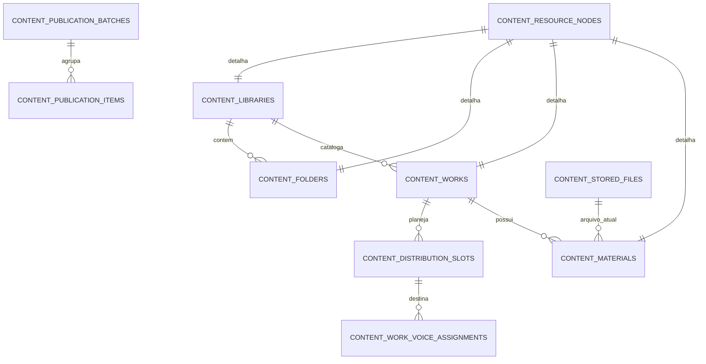

# Dicionário — domínio `content`

## 1. Estado

Status: Proposto para P2

Última revisão: 2026-07-09

Este documento fecha a Onda 4 do modelo lógico: bibliotecas, pastas, obras,
plano de distribuição, materiais, arquivos físicos, upload em lote, publicação em
lote, download e logs técnicos temporários.

O domínio `content` depende de:

- `tenancy`, para orquestra, perfis, espaços, naipes e vozes;
- `content.resource_nodes`, `content.access_grants`, `content.access_blocks` e
  `content.change_requests`, fechados na Onda 3;
- object storage privado, para binários;
- worker assíncrono, para validação, antimalware, processamento, notificações e
  limpeza.

Migração conceitual de origem: `0005_content_files_publication`.

## 2. Regras rastreadas

Este dicionário materializa principalmente:

- `MAT-01` a `MAT-17`, de bibliotecas, obras, materiais, upload, publicação e
  download;
- `CAP-MAT-01` a `CAP-MAT-25`, da matriz de capacidades;
- `SEC-03`, upload seguro com quarentena, antimalware, allowlist e limites;
- regra de produto: número da obra é único somente dentro da biblioteca;
- regra de produto: biblioteca define padrão de download e material pode ter
  exceção;
- regra de produto: materiais não possuem agendamento na V1;
- regra de segurança: binário nunca é armazenado no PostgreSQL;
- regra de segurança: URL pública permanente de arquivo é proibida.

Referências:

- [Bibliotecas, obras e materiais](../../../product/libraries-works-and-materials.md)
- [Capacidades, permissões e casos de uso](../../../product/capabilities-permissions-and-use-cases.md)
- [Upload seguro e antimalware](../../security/secure-uploads-and-antimalware.md)
- [Autorização e concessões](authorization-and-access.md)

## 3. Relação com `resource_nodes`

`content.resource_nodes` é a árvore comum de autorização. As tabelas deste
documento guardam os detalhes de negócio de cada tipo de recurso.

Regra física preferida:

- `libraries.id = resource_nodes.id`;
- `folders.id = resource_nodes.id`;
- `works.id = resource_nodes.id`;
- `materials.id = resource_nodes.id`.

Assim, o nó de autorização e o detalhe de conteúdo compartilham a mesma chave
técnica. Isso evita duplicidade de identificadores e facilita RLS, auditoria,
permissão efetiva e navegação.

## 4. Mapa de estados de tela para tabelas

Nem todo estado exibido na interface é uma coluna única. Esta tabela evita
ambiguidade:

| Estado exibido | Fonte canônica |
|---|---|
| Enviando | `upload_batch_items.item_status = uploading` ou `stored_files.file_status = uploading` |
| Upload concluído | `stored_files.file_status` em `quarantined`, `clean`, `processing` ou `ready` |
| Faltando | `distribution_slots.slot_status = expected` sem material pronto vinculado |
| Rascunho | `resource_nodes.resource_status = draft` |
| Publicado | `resource_nodes.resource_status = published` |
| Falha | `stored_files.file_status = failed/rejected` ou `upload_batch_items.item_status = failed` |
| Aguardando aprovação | `change_requests.request_status = pending` |
| Retirado | `resource_nodes.resource_status = withdrawn` |
| Excluído do plano | `distribution_slots.slot_status = excluded` |

Estados técnicos de arquivo não substituem estados de material. Um arquivo pode
estar `ready` enquanto o material continua `draft`.

## 5. Tipos fechados da onda

### `download_policy`

| Valor | Significado |
|---|---|
| `allowed` | Download explícito permitido |
| `blocked` | Download explícito bloqueado |

### `download_policy_override`

| Valor | Significado |
|---|---|
| `inherit` | Material herda o padrão da biblioteca |
| `allowed` | Material permite download mesmo se a biblioteca bloquear |
| `blocked` | Material bloqueia download mesmo se a biblioteca permitir |

Alterar política efetiva de download exige autoria, maestro/admin ou
`MANAGE_ACCESS`. `EDIT` sozinho não basta.

### `slot_kind`

| Valor | Significado |
|---|---|
| `global` | Parte/material comum à obra inteira |
| `space` | Parte destinada a um naipe/sala |
| `voice` | Parte destinada a uma voz específica |
| `custom` | Parte manual sem vínculo direto com voz |

### `slot_status`

| Valor | Significado |
|---|---|
| `expected` | Parte esperada no plano |
| `excluded` | Parte removida do plano da obra |

`missing` não é status persistido: é a visão calculada quando um slot `expected`
não possui material pronto/publicável.

### `assignment_source`

| Valor | Significado |
|---|---|
| `default_snapshot` | Copiado da formação padrão ao criar a obra |
| `maestro_override` | Decisão explícita de maestro/admin |
| `leader_override` | Decisão do líder no próprio naipe quando permitido |
| `manual_grant` | Inclusão individual por concessão específica |

`maestro_override` prevalece sobre líder. Líder não revoga nem substitui decisão
explícita do maestro.

### `assignment_status`

| Valor | Significado |
|---|---|
| `active` | Atribuição vigente |
| `revoked` | Atribuição encerrada; permanece para histórico |

### `material_kind`

| Valor | Significado |
|---|---|
| `score` | Partitura ou parte oficial/de estudo |
| `audio` | Áudio |
| `image` | Imagem |
| `document` | Documento editável ou planilha |
| `study` | Material de estudo sem obra formal |
| `other` | Outro formato permitido |

### `file_family`

| Valor | Significado |
|---|---|
| `pdf` | PDF validado |
| `image` | Imagem validada |
| `audio` | Áudio validado |
| `ooxml` | Documento Office moderno validado |

Arquivos fora da allowlist não recebem família válida.

### `file_status`

| Valor | Significado |
|---|---|
| `reserved` | Sessão de upload criada |
| `uploading` | Cliente está enviando |
| `quarantined` | Upload finalizado em quarentena |
| `validating` | Worker valida extensão, MIME, assinatura e tamanho |
| `scanning` | Antimalware em execução |
| `clean` | Scanner aprovou |
| `processing` | Derivados/metadados em processamento |
| `ready` | Arquivo pronto para vínculo |
| `linked` | Arquivo vinculado a material ou anexo |
| `failed` | Falha técnica recuperável ou investigável |
| `rejected` | Rejeitado por validação, malware ou política |
| `deletion_pending` | Aprovado para remoção física |
| `purged` | Binário removido do storage |

Estados `draft`, `published` e `withdrawn` pertencem ao recurso/material, não ao
arquivo físico.

### `scan_result`

| Valor | Significado |
|---|---|
| `not_scanned` | Ainda não varrido |
| `clean` | Scanner aprovou |
| `infected` | Malware detectado |
| `error` | Erro do scanner |
| `timeout` | Scanner excedeu tempo |

### `upload_batch_status`

| Valor | Significado |
|---|---|
| `draft` | Lote criado, ainda sem envio |
| `receiving` | Recebendo arquivos |
| `processing` | Arquivos recebidos em validação/processamento |
| `needs_review` | Há associações a revisar |
| `completed` | Todos os itens concluídos ou tratados |
| `cancelled` | Lote cancelado |
| `failed` | Lote falhou de forma geral |

### `upload_item_status`

| Valor | Significado |
|---|---|
| `waiting` | Aguardando envio |
| `uploading` | Enviando |
| `received` | Binário recebido |
| `processing` | Validação/processamento em andamento |
| `ready` | Arquivo pronto |
| `needs_review` | Sugestão ausente ou insegura |
| `confirmed` | Associação revisada/confirmada |
| `failed` | Falha no item |
| `cancelled` | Item cancelado |

### `association_source`

| Valor | Significado |
|---|---|
| `filename_suggestion` | Sugerido por nome de arquivo e aliases |
| `manual` | Associado manualmente |
| `none` | Sem associação |

### `publication_batch_status`

| Valor | Significado |
|---|---|
| `draft` | Preparado, mas não aplicado |
| `applying` | Aplicação em andamento |
| `applied` | Todos os itens aplicáveis concluídos |
| `partially_applied` | Parte aplicada e parte ignorada/falhou |
| `failed` | Nenhum item aplicável concluiu |
| `cancelled` | Cancelado antes da aplicação |

### `publication_action`

| Valor | Significado |
|---|---|
| `publish_selected` | Publicar seleção |
| `publish_ready` | Publicar todos os prontos |
| `withdraw` | Voltar para retirado/rascunho conforme regra |
| `republish` | Republicar material retirado |
| `replace_file` | Substituir arquivo |
| `delete_material` | Excluir material |
| `access_change` | Registrar mudança de público que exige notificação |

Materiais não possuem publicação agendada na V1.

### `publication_item_status`

| Valor | Significado |
|---|---|
| `pending` | Aguardando aplicação |
| `applied` | Aplicado |
| `skipped` | Ignorado por não estar pronto, estar faltando ou excluído do plano |
| `failed` | Falhou |

### `download_event_action`

| Valor | Significado |
|---|---|
| `preview` | Visualização/reprodução interna |
| `download` | Download explícito |

### `download_event_decision`

| Valor | Significado |
|---|---|
| `issued` | Acesso temporário emitido |
| `denied` | Negado |
| `throttled` | Bloqueado por rate limit/quota |

## `content.libraries`

### Finalidade

Detalha uma biblioteca raiz. Bibliotecas representam áreas como repertório
oficial, materiais de estudo ou qualquer organização criada pela orquestra.

### Identificação

| Campo | Valor |
|---|---|
| Domínio | `content` |
| Módulo proprietário | Bibliotecas e publicações |
| Escopo | Tenant |
| Sensibilidade | Interna |
| Retenção | Preservar histórico; exclusão lógica no `resource_nodes` |
| Migração de origem | `0005_content_files_publication` |

### Colunas

| Coluna | Tipo | Nulo | Default | Sensibilidade | Descrição |
|---|---|---:|---|---|---|
| `id` | `uuid` | Não | — | Interna | Mesmo ID de `content.resource_nodes` |
| `orchestra_id` | `uuid` | Não | — | Interna | Tenant |
| `display_name` | `text` | Não | — | Interna | Nome visível da biblioteca |
| `normalized_name` | `text` | Não | — | Interna | Nome normalizado para busca/unicidade |
| `description` | `text` | Sim | — | Interna | Descrição opcional |
| `default_download_policy` | `download_policy` | Não | `blocked` | Interna | Padrão herdado pelos materiais |
| `sort_order` | `integer` | Não | `0` | Interna | Ordem manual |
| `created_at` | `timestamptz` | Não | `now()` | Interna | Criação |
| `updated_at` | `timestamptz` | Não | `now()` | Interna | Última alteração |

### Chaves e constraints

| Nome | Tipo | Definição | Regra protegida |
|---|---|---|---|
| `pk_libraries` | PK | `(id)` | Identidade |
| `uq_libraries_orchestra_id_id` | UNIQUE | `(orchestra_id, id)` | FK composta |
| `uq_libraries_orchestra_normalized_name` | UNIQUE | `(orchestra_id, normalized_name)` | Evita bibliotecas indistinguíveis |
| `fk_libraries_resource_node` | FK | `(orchestra_id, id) -> content.resource_nodes(orchestra_id, id) ON DELETE RESTRICT` | Detalhe pertence ao nó |
| `fk_libraries_orchestra` | FK | `orchestra_id -> tenancy.orchestras.id ON DELETE RESTRICT` | Tenant preservado |
| `ck_libraries_download_policy` | CHECK | `allowed` ou `blocked` | Biblioteca não herda de outra biblioteca |
| `ck_libraries_sort_order_non_negative` | CHECK | `sort_order >= 0` | Ordenação previsível |

### Índices iniciais

| Índice | Colunas | Motivo |
|---|---|---|
| `idx_libraries_orchestra_sort` | `(orchestra_id, sort_order, display_name)` | Navegação administrativa |
| `idx_libraries_orchestra_name_search` | `(orchestra_id, normalized_name)` | Busca por nome |

### Regras de negócio

- Biblioteca pode começar em rascunho/oculta pelo estado do `resource_nodes`.
- Biblioteca compartilhada com herança alcança pastas, obras e materiais futuros.
- Download padrão da biblioteca não expõe relatório de quem baixou.
- Acesso, editoria e compartilhamento são resolvidos por `access_grants`.
- `display_name` não deve codificar regra fixa como “oficial”; a regra vem de
  permissões, status e organização criada pela orquestra.

## `content.folders`

### Finalidade

Detalha pastas dinâmicas dentro de uma biblioteca ou de outra pasta. Pastas
servem para estudo, respiração, embocadura, repertórios por evento etc.

### Identificação

| Campo | Valor |
|---|---|
| Domínio | `content` |
| Módulo proprietário | Bibliotecas e publicações |
| Escopo | Tenant |
| Sensibilidade | Interna |
| Retenção | Preservar histórico; exclusão lógica no `resource_nodes` |
| Migração de origem | `0005_content_files_publication` |

### Colunas

| Coluna | Tipo | Nulo | Default | Sensibilidade | Descrição |
|---|---|---:|---|---|---|
| `id` | `uuid` | Não | — | Interna | Mesmo ID de `content.resource_nodes` |
| `orchestra_id` | `uuid` | Não | — | Interna | Tenant |
| `library_id` | `uuid` | Não | — | Interna | Biblioteca raiz |
| `parent_resource_node_id` | `uuid` | Não | — | Interna | Pai imediato na árvore |
| `display_name` | `text` | Não | — | Interna | Nome visível |
| `normalized_name` | `text` | Não | — | Interna | Nome normalizado |
| `description` | `text` | Sim | — | Interna | Descrição opcional |
| `sort_order` | `integer` | Não | `0` | Interna | Ordem entre irmãos |
| `created_at` | `timestamptz` | Não | `now()` | Interna | Criação |
| `updated_at` | `timestamptz` | Não | `now()` | Interna | Última alteração |

### Chaves e constraints

| Nome | Tipo | Definição | Regra protegida |
|---|---|---|---|
| `pk_folders` | PK | `(id)` | Identidade |
| `uq_folders_orchestra_id_id` | UNIQUE | `(orchestra_id, id)` | FK composta |
| `uq_folders_parent_name` | UNIQUE | `(orchestra_id, parent_resource_node_id, normalized_name)` | Evita ambiguidade no mesmo nível |
| `fk_folders_resource_node` | FK | `(orchestra_id, id) -> content.resource_nodes(orchestra_id, id) ON DELETE RESTRICT` | Detalhe pertence ao nó |
| `fk_folders_library` | FK | `(orchestra_id, library_id) -> content.libraries(orchestra_id, id) ON DELETE RESTRICT` | Pasta pertence à biblioteca |
| `fk_folders_parent_resource` | FK | `(orchestra_id, parent_resource_node_id) -> content.resource_nodes(orchestra_id, id) ON DELETE RESTRICT` | Pai imediato do mesmo tenant |
| `ck_folders_parent_consistency` | CHECK/aplicação | `parent_resource_node_id` deve coincidir com o pai em `resource_nodes` e ser biblioteca ou pasta | Árvore coerente |
| `ck_folders_sort_order_non_negative` | CHECK | `sort_order >= 0` | Ordenação previsível |

### Índices iniciais

| Índice | Colunas | Motivo |
|---|---|---|
| `idx_folders_parent_sort` | `(orchestra_id, parent_resource_node_id, sort_order, display_name)` | Listagem por pai |
| `idx_folders_library_sort` | `(orchestra_id, library_id, sort_order, display_name)` | Listagem por biblioteca |
| `idx_folders_name_search` | `(orchestra_id, normalized_name)` | Busca administrativa |

### Regras de negócio

- A relação imediata pai/filho fica em `resource_nodes.parent_resource_node_id` e
  é espelhada aqui para constraints e índices.
- `library_id` é a raiz denormalizada para busca, unicidade e política de
  download.
- Criar pasta exige `ADD` ou `ADMIN` no escopo.
- Pasta em rascunho não revela automaticamente filhos ao público final.

## `content.works`

### Finalidade

Detalha uma obra/repertório catalogado dentro de uma biblioteca. A obra contém
número escolhido pela orquestra, título, notas e plano de distribuição.

### Identificação

| Campo | Valor |
|---|---|
| Domínio | `content` |
| Módulo proprietário | Bibliotecas e publicações |
| Escopo | Tenant |
| Sensibilidade | Interna |
| Retenção | Preservar histórico e número de catálogo |
| Migração de origem | `0005_content_files_publication` |

### Colunas

| Coluna | Tipo | Nulo | Default | Sensibilidade | Descrição |
|---|---|---:|---|---|---|
| `id` | `uuid` | Não | — | Interna | Mesmo ID de `content.resource_nodes` |
| `orchestra_id` | `uuid` | Não | — | Interna | Tenant |
| `library_id` | `uuid` | Não | — | Interna | Biblioteca onde o número é único |
| `parent_resource_node_id` | `uuid` | Não | — | Interna | Pai imediato na árvore |
| `catalog_number` | `text` | Não | — | Interna | Número/código escolhido pelo maestro |
| `normalized_catalog_number` | `text` | Não | — | Interna | Número normalizado para unicidade |
| `title` | `text` | Não | — | Interna | Título oficial da obra |
| `normalized_title` | `text` | Não | — | Interna | Título normalizado para busca |
| `notes` | `text` | Sim | — | Interna | Observações permanentes da obra |
| `sort_order` | `integer` | Não | `0` | Interna | Ordem manual dentro do pai |
| `distribution_snapshot_at` | `timestamptz` | Não | `now()` | Interna | Momento em que a formação foi copiada |
| `created_at` | `timestamptz` | Não | `now()` | Interna | Criação |
| `updated_at` | `timestamptz` | Não | `now()` | Interna | Última alteração |
| `lock_version` | `integer` | Não | `1` | Interna | Concorrência otimista |

### Chaves e constraints

| Nome | Tipo | Definição | Regra protegida |
|---|---|---|---|
| `pk_works` | PK | `(id)` | Identidade |
| `uq_works_orchestra_id_id` | UNIQUE | `(orchestra_id, id)` | FK composta |
| `uq_works_library_catalog_number` | UNIQUE | `(orchestra_id, library_id, normalized_catalog_number)` | Número único somente dentro da biblioteca |
| `fk_works_resource_node` | FK | `(orchestra_id, id) -> content.resource_nodes(orchestra_id, id) ON DELETE RESTRICT` | Detalhe pertence ao nó |
| `fk_works_library` | FK | `(orchestra_id, library_id) -> content.libraries(orchestra_id, id) ON DELETE RESTRICT` | Obra pertence à biblioteca |
| `fk_works_parent_resource` | FK | `(orchestra_id, parent_resource_node_id) -> content.resource_nodes(orchestra_id, id) ON DELETE RESTRICT` | Pai imediato do mesmo tenant |
| `ck_works_parent_consistency` | CHECK/aplicação | `parent_resource_node_id` deve coincidir com o pai em `resource_nodes` e ser biblioteca ou pasta | Árvore coerente |
| `ck_works_catalog_number_not_blank` | CHECK | número normalizado não vazio | Evita identificador inútil |
| `ck_works_title_not_blank` | CHECK | título normalizado não vazio | Evita obra sem nome |
| `ck_works_lock_version_positive` | CHECK | `lock_version >= 1` | Concorrência otimista |

### Índices iniciais

| Índice | Colunas | Motivo |
|---|---|---|
| `idx_works_library_sort` | `(orchestra_id, library_id, sort_order, normalized_catalog_number)` | Listagem da biblioteca |
| `idx_works_parent_sort` | `(orchestra_id, parent_resource_node_id, sort_order, normalized_catalog_number)` | Listagem por pasta/biblioteca |
| `idx_works_title_search` | `(orchestra_id, normalized_title)` | Busca por título |
| `idx_works_catalog_search` | `(orchestra_id, normalized_catalog_number)` | Busca pelo número |

### Regras de negócio

- O maestro escolhe o número; o sistema não impõe sequência automática na V1.
- Duas bibliotecas podem possuir a obra número `55`.
- A criação da obra copia a formação atual para `distribution_slots` e
  `work_voice_assignments`.
- Alterações em vozes padrão depois da criação não modificam obras antigas.
- Notas permanentes da obra não substituem nota de publicação/atualização.
- Materiais podem ser ordenados manualmente dentro da obra.

## `content.distribution_slots`

### Finalidade

Representa partes esperadas no plano de distribuição de uma obra: por exemplo
`Trompete — 1ª voz`, `Clarinete — 2ª voz` ou `Áudio geral`.

### Identificação

| Campo | Valor |
|---|---|
| Domínio | `content` |
| Módulo proprietário | Bibliotecas e publicações |
| Escopo | Tenant |
| Sensibilidade | Interna |
| Retenção | Preservar como fotografia da obra |
| Migração de origem | `0005_content_files_publication` |

### Colunas

| Coluna | Tipo | Nulo | Default | Sensibilidade | Descrição |
|---|---|---:|---|---|---|
| `id` | `uuid` | Não | `uuidv7()` | Interna | Identificador do slot |
| `orchestra_id` | `uuid` | Não | — | Interna | Tenant |
| `work_id` | `uuid` | Não | — | Interna | Obra |
| `slot_kind` | `slot_kind` | Não | — | Interna | Global, espaço, voz ou custom |
| `section_space_id` | `uuid` | Sim | — | Interna | Naipe/sala associado |
| `voice_id` | `uuid` | Sim | — | Interna | Voz associada |
| `display_title` | `text` | Não | — | Interna | Título visível da parte |
| `normalized_title` | `text` | Não | — | Interna | Título normalizado |
| `slot_status` | `slot_status` | Não | `expected` | Interna | Esperado ou excluído |
| `source_kind` | `text` | Não | `default_snapshot` | Interna | `default_snapshot` ou `manual` |
| `sort_order` | `integer` | Não | `0` | Interna | Ordem dentro da obra |
| `created_by_profile_id` | `uuid` | Não | — | Interna | Quem criou/adicionou o slot |
| `created_at` | `timestamptz` | Não | `now()` | Interna | Criação |
| `updated_at` | `timestamptz` | Não | `now()` | Interna | Última alteração |

### Chaves e constraints

| Nome | Tipo | Definição | Regra protegida |
|---|---|---|---|
| `pk_distribution_slots` | PK | `(id)` | Identidade |
| `uq_distribution_slots_orchestra_id_id` | UNIQUE | `(orchestra_id, id)` | FK composta |
| `uq_distribution_slots_work_title` | UNIQUE | `(orchestra_id, work_id, normalized_title)` | Evita partes indistinguíveis |
| `fk_distribution_slots_work` | FK | `(orchestra_id, work_id) -> content.works(orchestra_id, id) ON DELETE RESTRICT` | Slot pertence à obra |
| `fk_distribution_slots_section_space` | FK | `(orchestra_id, section_space_id) -> tenancy.spaces(orchestra_id, id) ON DELETE RESTRICT` | Naipe/sala do tenant |
| `fk_distribution_slots_voice` | FK | `(orchestra_id, voice_id) -> tenancy.voices(orchestra_id, id) ON DELETE RESTRICT` | Voz do tenant |
| `fk_distribution_slots_created_by` | FK | `(orchestra_id, created_by_profile_id) -> tenancy.orchestra_profiles(orchestra_id, id) ON DELETE RESTRICT` | Autor pertence ao tenant |
| `ck_distribution_slots_shape` | CHECK/aplicação | `voice` exige `voice_id`; `space` exige `section_space_id`; `global` não exige nenhum | Slot semântico |
| `ck_distribution_slots_status` | CHECK | `expected` ou `excluded` | Plano fechado |
| `ck_distribution_slots_sort_order_non_negative` | CHECK | `sort_order >= 0` | Ordenação previsível |

### Índices iniciais

| Índice | Colunas | Motivo |
|---|---|---|
| `idx_distribution_slots_work_sort` | `(orchestra_id, work_id, sort_order, display_title)` | Montar plano da obra |
| `idx_distribution_slots_voice` | `(orchestra_id, voice_id, slot_status)` | Buscar partes por voz |
| `idx_distribution_slots_space` | `(orchestra_id, section_space_id, slot_status)` | Buscar partes por naipe |

### Regras de negócio

- Slot `excluded` não é publicado por “publicar todos os prontos”.
- Nova voz adicionada em obra antiga cria slot `expected` sem arquivo, caso o
  maestro inclua manualmente.
- Partes faltantes são calculadas a partir de slot `expected` sem material pronto.
- Alterar ordem de slots altera apresentação administrativa e do músico.

## `content.work_voice_assignments`

### Finalidade

Guarda quais perfis devem receber uma parte/voz dentro de uma obra específica.
É a fotografia editável da formação aplicada à obra.

### Identificação

| Campo | Valor |
|---|---|
| Domínio | `content` |
| Módulo proprietário | Bibliotecas e publicações |
| Escopo | Tenant |
| Sensibilidade | Interna |
| Retenção | Preservar histórico de atribuições |
| Migração de origem | `0005_content_files_publication` |

### Colunas

| Coluna | Tipo | Nulo | Default | Sensibilidade | Descrição |
|---|---|---:|---|---|---|
| `id` | `uuid` | Não | `uuidv7()` | Interna | Identificador |
| `orchestra_id` | `uuid` | Não | — | Interna | Tenant |
| `work_id` | `uuid` | Não | — | Interna | Obra |
| `distribution_slot_id` | `uuid` | Não | — | Interna | Parte da obra |
| `profile_id` | `uuid` | Não | — | Interna | Músico/perfil destinatário |
| `assignment_source` | `assignment_source` | Não | — | Interna | Origem da decisão |
| `assignment_status` | `assignment_status` | Não | `active` | Interna | Vigente ou revogada |
| `decided_by_profile_id` | `uuid` | Não | — | Interna | Quem decidiu |
| `decided_at` | `timestamptz` | Não | `now()` | Interna | Momento da decisão |
| `revoked_by_profile_id` | `uuid` | Sim | — | Interna | Quem revogou |
| `revoked_at` | `timestamptz` | Sim | — | Interna | Revogação |
| `revocation_reason` | `text` | Sim | — | Interna | Motivo opcional |

### Chaves e constraints

| Nome | Tipo | Definição | Regra protegida |
|---|---|---|---|
| `pk_work_voice_assignments` | PK | `(id)` | Identidade |
| `uq_work_voice_assignments_orchestra_id_id` | UNIQUE | `(orchestra_id, id)` | FK composta |
| `uq_work_voice_assignments_active` | UNIQUE parcial | `(orchestra_id, distribution_slot_id, profile_id) WHERE assignment_status = 'active'` | Um vínculo ativo por parte/pessoa |
| `fk_work_voice_assignments_work` | FK | `(orchestra_id, work_id) -> content.works(orchestra_id, id) ON DELETE RESTRICT` | Atribuição pertence à obra |
| `fk_work_voice_assignments_slot` | FK | `(orchestra_id, distribution_slot_id) -> content.distribution_slots(orchestra_id, id) ON DELETE RESTRICT` | Parte do mesmo tenant |
| `fk_work_voice_assignments_profile` | FK | `(orchestra_id, profile_id) -> tenancy.orchestra_profiles(orchestra_id, id) ON DELETE RESTRICT` | Perfil do tenant |
| `fk_work_voice_assignments_decided_by` | FK | `(orchestra_id, decided_by_profile_id) -> tenancy.orchestra_profiles(orchestra_id, id) ON DELETE RESTRICT` | Decisor do tenant |
| `fk_work_voice_assignments_revoked_by` | FK | `(orchestra_id, revoked_by_profile_id) -> tenancy.orchestra_profiles(orchestra_id, id) ON DELETE RESTRICT` | Revogador do tenant |
| `ck_work_voice_assignments_revocation_shape` | CHECK | `revoked` exige `revoked_at` e `revoked_by_profile_id` | Histórico coerente |

### Índices iniciais

| Índice | Colunas | Motivo |
|---|---|---|
| `idx_work_voice_assignments_profile_active` | `(orchestra_id, profile_id, assignment_status)` | Materiais do músico |
| `idx_work_voice_assignments_work_slot` | `(orchestra_id, work_id, distribution_slot_id, assignment_status)` | Plano da obra |

### Regras de negócio

- Atribuições copiadas da formação padrão usam `default_snapshot`.
- Alterar voz padrão do músico depois da criação da obra não altera esta tabela.
- `maestro_override` não pode ser desfeito por líder.
- Se não houver decisão de maestro, líder pode ajustar no próprio naipe quando
  autorizado.
- Para mudar uma atribuição ativa, revoga-se a linha antiga e cria-se uma nova.

## `content.materials`

### Finalidade

Detalha materiais visíveis ou administráveis: partituras, áudios, imagens,
documentos e materiais de estudo. Um material pode estar dentro de uma obra ou
diretamente em uma pasta/biblioteca.

### Identificação

| Campo | Valor |
|---|---|
| Domínio | `content` |
| Módulo proprietário | Bibliotecas e publicações |
| Escopo | Tenant |
| Sensibilidade | Interna/privada conforme acesso |
| Retenção | Preservar metadado mínimo mesmo se binário for removido |
| Migração de origem | `0005_content_files_publication` |

### Colunas

| Coluna | Tipo | Nulo | Default | Sensibilidade | Descrição |
|---|---|---:|---|---|---|
| `id` | `uuid` | Não | — | Interna | Mesmo ID de `content.resource_nodes` |
| `orchestra_id` | `uuid` | Não | — | Interna | Tenant |
| `library_id` | `uuid` | Não | — | Interna | Biblioteca raiz |
| `parent_resource_node_id` | `uuid` | Não | — | Interna | Pai imediato na árvore |
| `work_id` | `uuid` | Sim | — | Interna | Obra, quando material pertence a uma obra |
| `distribution_slot_id` | `uuid` | Sim | — | Interna | Parte/voz da obra |
| `current_stored_file_id` | `uuid` | Sim | — | Restrita | Arquivo físico atual |
| `material_kind` | `material_kind` | Não | — | Interna | Tipo do material |
| `display_title` | `text` | Não | — | Interna | Título visível na plataforma |
| `normalized_title` | `text` | Não | — | Interna | Título normalizado |
| `download_policy_override` | `download_policy_override` | Não | `inherit` | Interna | Exceção ao padrão da biblioteca |
| `sort_order` | `integer` | Não | `0` | Interna | Ordem dentro do pai/obra |
| `first_published_at` | `timestamptz` | Sim | — | Interna | Primeira publicação |
| `last_published_at` | `timestamptz` | Sim | — | Interna | Última publicação/republicação |
| `last_file_replaced_at` | `timestamptz` | Sim | — | Interna | Última troca de arquivo |
| `created_at` | `timestamptz` | Não | `now()` | Interna | Criação |
| `updated_at` | `timestamptz` | Não | `now()` | Interna | Última alteração |
| `lock_version` | `integer` | Não | `1` | Interna | Concorrência otimista |

### Chaves e constraints

| Nome | Tipo | Definição | Regra protegida |
|---|---|---|---|
| `pk_materials` | PK | `(id)` | Identidade |
| `uq_materials_orchestra_id_id` | UNIQUE | `(orchestra_id, id)` | FK composta |
| `uq_materials_parent_title` | UNIQUE | `(orchestra_id, parent_resource_node_id, normalized_title)` | Evita materiais indistinguíveis no mesmo pai |
| `fk_materials_resource_node` | FK | `(orchestra_id, id) -> content.resource_nodes(orchestra_id, id) ON DELETE RESTRICT` | Detalhe pertence ao nó |
| `fk_materials_library` | FK | `(orchestra_id, library_id) -> content.libraries(orchestra_id, id) ON DELETE RESTRICT` | Material pertence à biblioteca |
| `fk_materials_parent_resource` | FK | `(orchestra_id, parent_resource_node_id) -> content.resource_nodes(orchestra_id, id) ON DELETE RESTRICT` | Pai imediato do mesmo tenant |
| `fk_materials_work` | FK | `(orchestra_id, work_id) -> content.works(orchestra_id, id) ON DELETE RESTRICT` | Material pertence à obra |
| `fk_materials_distribution_slot` | FK | `(orchestra_id, distribution_slot_id) -> content.distribution_slots(orchestra_id, id) ON DELETE RESTRICT` | Material associado a parte |
| `fk_materials_current_stored_file` | FK | `(orchestra_id, current_stored_file_id) -> content.stored_files(orchestra_id, id) ON DELETE RESTRICT` | Arquivo atual do mesmo tenant |
| `ck_materials_parent_consistency` | CHECK/aplicação | `parent_resource_node_id` deve coincidir com o pai em `resource_nodes`; material de obra deve ter a obra como pai | Árvore coerente |
| `ck_materials_work_slot_shape` | CHECK/aplicação | `distribution_slot_id` exige `work_id`; slot deve pertencer à mesma obra | Associação coerente |
| `ck_materials_download_override` | CHECK | `inherit`, `allowed` ou `blocked` | Política fechada |
| `ck_materials_lock_version_positive` | CHECK | `lock_version >= 1` | Concorrência otimista |

### Índices iniciais

| Índice | Colunas | Motivo |
|---|---|---|
| `idx_materials_parent_sort` | `(orchestra_id, parent_resource_node_id, sort_order, display_title)` | Materiais no pai imediato |
| `idx_materials_library_sort` | `(orchestra_id, library_id, sort_order, display_title)` | Materiais na biblioteca |
| `idx_materials_work_sort` | `(orchestra_id, work_id, sort_order, display_title)` | Materiais da obra |
| `idx_materials_distribution_slot` | `(orchestra_id, distribution_slot_id)` | Materiais por parte esperada |
| `idx_materials_current_file` | `(orchestra_id, current_stored_file_id)` | Rastreamento de arquivo |

### Regras de negócio

- Título exibido é separado do nome original do arquivo.
- Publicar exige arquivo atual `ready` ou `linked`, destinatários válidos e
  autoridade `PUBLISH`.
- “Publicar todos os prontos” ignora materiais sem arquivo, slots faltantes e
  slots excluídos.
- Voltar a rascunho/retirar publicação remove acesso temporário e notifica
  afetados.
- Substituição de arquivo preserva metadado do arquivo anterior e pode remover
  binário anterior conforme política.
- Material sem `work_id` é material de biblioteca/pasta, como estudo.
- Download efetivo = `VIEW` + material publicado + arquivo pronto + política de
  download permitida.

## `content.stored_files`

### Finalidade

Guarda metadados técnicos de arquivos enviados. O binário fica no object storage
privado; o banco guarda somente chaves opacas, hashes, estados, validações e
metadados necessários.

### Identificação

| Campo | Valor |
|---|---|
| Domínio | `content` |
| Módulo proprietário | Arquivos e processamento |
| Escopo | Tenant |
| Sensibilidade | Restrita |
| Retenção | Conforme status, política de exclusão e logs mínimos |
| Migração de origem | `0005_content_files_publication` |

### Colunas

| Coluna | Tipo | Nulo | Default | Sensibilidade | Descrição |
|---|---|---:|---|---|---|
| `id` | `uuid` | Não | `uuidv7()` | Interna | Identificador do arquivo |
| `orchestra_id` | `uuid` | Não | — | Interna | Tenant |
| `uploaded_by_profile_id` | `uuid` | Não | — | Interna | Uploader |
| `file_family` | `file_family` | Sim | — | Interna | Família aprovada |
| `file_status` | `file_status` | Não | `reserved` | Restrita | Estado técnico |
| `original_filename` | `text` | Não | — | Restrita | Nome original normalizado e limitado |
| `safe_extension` | `text` | Sim | — | Interna | Extensão aprovada, sem ponto |
| `declared_mime_type` | `text` | Sim | — | Restrita | MIME informado pelo cliente |
| `detected_mime_type` | `text` | Sim | — | Restrita | MIME detectado pelo servidor |
| `file_size_bytes` | `bigint` | Sim | — | Interna | Tamanho em bytes |
| `sha256_hash` | `text` | Sim | — | Restrita | Hash criptográfico do conteúdo |
| `storage_bucket` | `text` | Não | — | Restrita | Bucket/contêiner lógico |
| `storage_key` | `text` | Não | — | Restrita | Chave opaca do objeto atual |
| `quarantine_storage_key` | `text` | Sim | — | Restrita | Chave de quarentena, quando separada |
| `derived_storage_prefix` | `text` | Sim | — | Restrita | Prefixo de derivados/thumbnail |
| `scan_result` | `scan_result` | Não | `not_scanned` | Restrita | Resultado do antimalware |
| `scanner_engine` | `text` | Sim | — | Restrita | Engine utilizada |
| `scanner_signature_version` | `text` | Sim | — | Restrita | Versão/assinatura |
| `scanned_at` | `timestamptz` | Sim | — | Restrita | Momento do scan |
| `processing_error_code` | `text` | Sim | — | Restrita | Código técnico de erro |
| `reserved_at` | `timestamptz` | Não | `now()` | Interna | Reserva de upload |
| `uploaded_at` | `timestamptz` | Sim | — | Interna | Upload finalizado |
| `ready_at` | `timestamptz` | Sim | — | Interna | Pronto para vínculo |
| `linked_at` | `timestamptz` | Sim | — | Interna | Vinculado a recurso |
| `deletion_requested_at` | `timestamptz` | Sim | — | Restrita | Pedido de remoção física |
| `purged_at` | `timestamptz` | Sim | — | Restrita | Binário removido |
| `retention_until` | `timestamptz` | Sim | — | Restrita | Prazo técnico de retenção/limpeza |
| `created_at` | `timestamptz` | Não | `now()` | Interna | Criação |
| `updated_at` | `timestamptz` | Não | `now()` | Interna | Última alteração |

### Chaves e constraints

| Nome | Tipo | Definição | Regra protegida |
|---|---|---|---|
| `pk_stored_files` | PK | `(id)` | Identidade |
| `uq_stored_files_orchestra_id_id` | UNIQUE | `(orchestra_id, id)` | FK composta |
| `fk_stored_files_orchestra` | FK | `orchestra_id -> tenancy.orchestras.id ON DELETE RESTRICT` | Tenant preservado |
| `fk_stored_files_uploaded_by` | FK | `(orchestra_id, uploaded_by_profile_id) -> tenancy.orchestra_profiles(orchestra_id, id) ON DELETE RESTRICT` | Uploader pertence ao tenant |
| `ck_stored_files_size_positive` | CHECK | `file_size_bytes IS NULL OR file_size_bytes > 0` | Tamanho válido |
| `ck_stored_files_scan_shape` | CHECK | `clean/infected/error/timeout` exigem `scanned_at` | Scan rastreável |
| `ck_stored_files_ready_shape` | CHECK/aplicação | `ready/linked` exigem hash, tamanho, MIME detectado e scan aprovado | Arquivo pronto de verdade |
| `ck_stored_files_no_public_url` | CHECK/processo | não armazenar URL assinada ou pública | Evita vazamento persistente |

### Índices iniciais

| Índice | Colunas | Motivo |
|---|---|---|
| `idx_stored_files_status` | `(orchestra_id, file_status, created_at)` | Worker e limpeza |
| `idx_stored_files_uploaded_by` | `(orchestra_id, uploaded_by_profile_id, created_at)` | Painel do uploader |
| `idx_stored_files_hash` | `(orchestra_id, sha256_hash, file_size_bytes)` | Deduplicação futura e investigação |
| `idx_stored_files_retention` | `(file_status, retention_until)` | Limpeza técnica |

### Regras de negócio e segurança

- `storage_key` não é URL pública.
- URL assinada nunca é persistida no banco.
- Nome original nunca é usado como caminho físico.
- Arquivo rejeitado não pode ser vinculado nem publicado.
- Arquivo em quarentena não gera preview/download.
- Scanner indisponível em produção falha fechado.
- Exclusão definitiva remove original e derivados, preservando metadado mínimo.
- Logs não armazenam conteúdo do arquivo, token de upload ou segredo de storage.

## `content.upload_batches`

### Finalidade

Agrupa um upload simples ou em lote para permitir autosave, painel global de
progresso e retomada administrativa dos arquivos já recebidos.

### Identificação

| Campo | Valor |
|---|---|
| Domínio | `content` |
| Módulo proprietário | Arquivos e processamento |
| Escopo | Tenant |
| Sensibilidade | Interna |
| Retenção | Preservar enquanto houver arquivo/rascunho associado |
| Migração de origem | `0005_content_files_publication` |

### Colunas

| Coluna | Tipo | Nulo | Default | Sensibilidade | Descrição |
|---|---|---:|---|---|---|
| `id` | `uuid` | Não | `uuidv7()` | Interna | Identificador do lote |
| `orchestra_id` | `uuid` | Não | — | Interna | Tenant |
| `target_resource_node_id` | `uuid` | Não | — | Interna | Biblioteca, pasta ou obra alvo |
| `work_id` | `uuid` | Sim | — | Interna | Obra alvo, quando houver |
| `batch_status` | `upload_batch_status` | Não | `draft` | Interna | Estado do lote |
| `started_by_profile_id` | `uuid` | Não | — | Interna | Uploader |
| `total_items_count` | `integer` | Não | `0` | Interna | Total planejado |
| `received_items_count` | `integer` | Não | `0` | Interna | Arquivos recebidos |
| `failed_items_count` | `integer` | Não | `0` | Interna | Itens com falha |
| `created_at` | `timestamptz` | Não | `now()` | Interna | Criação |
| `updated_at` | `timestamptz` | Não | `now()` | Interna | Atualização |
| `completed_at` | `timestamptz` | Sim | — | Interna | Conclusão |
| `cancelled_at` | `timestamptz` | Sim | — | Interna | Cancelamento |

### Chaves e constraints

| Nome | Tipo | Definição | Regra protegida |
|---|---|---|---|
| `pk_upload_batches` | PK | `(id)` | Identidade |
| `uq_upload_batches_orchestra_id_id` | UNIQUE | `(orchestra_id, id)` | FK composta |
| `fk_upload_batches_target_resource` | FK | `(orchestra_id, target_resource_node_id) -> content.resource_nodes(orchestra_id, id) ON DELETE RESTRICT` | Alvo do tenant |
| `fk_upload_batches_work` | FK | `(orchestra_id, work_id) -> content.works(orchestra_id, id) ON DELETE RESTRICT` | Obra do tenant |
| `fk_upload_batches_started_by` | FK | `(orchestra_id, started_by_profile_id) -> tenancy.orchestra_profiles(orchestra_id, id) ON DELETE RESTRICT` | Uploader do tenant |
| `ck_upload_batches_counts_non_negative` | CHECK | contadores `>= 0` | Contagem coerente |
| `ck_upload_batches_completed_shape` | CHECK | `completed` exige `completed_at` | Estado coerente |

### Regras de negócio

- Fechar/recarregar a aba interrompe arquivos ainda não enviados.
- Arquivos já recebidos permanecem e seguem processamento.
- Na V1, item interrompido recomeça do início.
- Autosave do lote não publica material nem dispara notificação.

## `content.upload_batch_items`

### Finalidade

Representa cada arquivo dentro de um lote de upload, incluindo sugestão de
associação por nome de arquivo, revisão e vínculo final.

### Identificação

| Campo | Valor |
|---|---|
| Domínio | `content` |
| Módulo proprietário | Arquivos e processamento |
| Escopo | Tenant |
| Sensibilidade | Interna/restrita |
| Retenção | Enquanto houver arquivo/rascunho associado |
| Migração de origem | `0005_content_files_publication` |

### Colunas

| Coluna | Tipo | Nulo | Default | Sensibilidade | Descrição |
|---|---|---:|---|---|---|
| `id` | `uuid` | Não | `uuidv7()` | Interna | Identificador |
| `orchestra_id` | `uuid` | Não | — | Interna | Tenant |
| `upload_batch_id` | `uuid` | Não | — | Interna | Lote |
| `stored_file_id` | `uuid` | Sim | — | Restrita | Arquivo reservado/recebido |
| `material_id` | `uuid` | Sim | — | Interna | Material criado/vinculado |
| `suggested_distribution_slot_id` | `uuid` | Sim | — | Interna | Sugestão de parte/voz |
| `confirmed_distribution_slot_id` | `uuid` | Sim | — | Interna | Associação confirmada |
| `item_status` | `upload_item_status` | Não | `waiting` | Interna | Estado do item |
| `association_source` | `association_source` | Não | `none` | Interna | Origem da associação |
| `original_filename_snapshot` | `text` | Não | — | Restrita | Nome original no momento da seleção |
| `display_title_suggestion` | `text` | Sim | — | Interna | Título sugerido |
| `sort_order` | `integer` | Não | `0` | Interna | Ordem no lote |
| `error_code` | `text` | Sim | — | Restrita | Código de erro |
| `created_at` | `timestamptz` | Não | `now()` | Interna | Criação |
| `updated_at` | `timestamptz` | Não | `now()` | Interna | Atualização |

### Chaves e constraints

| Nome | Tipo | Definição | Regra protegida |
|---|---|---|---|
| `pk_upload_batch_items` | PK | `(id)` | Identidade |
| `uq_upload_batch_items_orchestra_id_id` | UNIQUE | `(orchestra_id, id)` | FK composta |
| `uq_upload_batch_items_sort` | UNIQUE | `(orchestra_id, upload_batch_id, sort_order)` | Ordem estável |
| `fk_upload_batch_items_batch` | FK | `(orchestra_id, upload_batch_id) -> content.upload_batches(orchestra_id, id) ON DELETE CASCADE` | Item inseparável do lote |
| `fk_upload_batch_items_stored_file` | FK | `(orchestra_id, stored_file_id) -> content.stored_files(orchestra_id, id) ON DELETE RESTRICT` | Arquivo do tenant |
| `fk_upload_batch_items_material` | FK | `(orchestra_id, material_id) -> content.materials(orchestra_id, id) ON DELETE RESTRICT` | Material do tenant |
| `fk_upload_batch_items_suggested_slot` | FK | `(orchestra_id, suggested_distribution_slot_id) -> content.distribution_slots(orchestra_id, id) ON DELETE RESTRICT` | Sugestão do tenant |
| `fk_upload_batch_items_confirmed_slot` | FK | `(orchestra_id, confirmed_distribution_slot_id) -> content.distribution_slots(orchestra_id, id) ON DELETE RESTRICT` | Confirmação do tenant |
| `ck_upload_batch_items_confirmed_shape` | CHECK/aplicação | `confirmed` exige material ou associação confirmada | Item revisado |

### Regras de negócio

- Associação automática é sempre sugestão revisável.
- Se o nome do arquivo não permitir confiança suficiente, item fica
  `needs_review`.
- Aliases de naipe/voz são configuração da orquestra e não ficam nesta tabela.
- Um item inválido não cancela o lote inteiro.

## `content.publication_batches`

### Finalidade

Agrupa operações que alteram publicação, retirada, republicação, substituição,
exclusão ou mudança de acesso com notificação agrupada.

### Identificação

| Campo | Valor |
|---|---|
| Domínio | `content` |
| Módulo proprietário | Bibliotecas e publicações |
| Escopo | Tenant |
| Sensibilidade | Interna |
| Retenção | Preservar histórico operacional |
| Migração de origem | `0005_content_files_publication` |

### Colunas

| Coluna | Tipo | Nulo | Default | Sensibilidade | Descrição |
|---|---|---:|---|---|---|
| `id` | `uuid` | Não | `uuidv7()` | Interna | Identificador do lote |
| `orchestra_id` | `uuid` | Não | — | Interna | Tenant |
| `work_id` | `uuid` | Sim | — | Interna | Obra associada, quando houver |
| `resource_node_id` | `uuid` | Sim | — | Interna | Recurso raiz afetado |
| `publication_action` | `publication_action` | Não | — | Interna | Tipo de operação |
| `batch_status` | `publication_batch_status` | Não | `draft` | Interna | Estado do lote |
| `created_by_profile_id` | `uuid` | Não | — | Interna | Autor |
| `publication_note` | `text` | Sim | — | Interna | Nota opcional enviada/notificada |
| `created_at` | `timestamptz` | Não | `now()` | Interna | Criação |
| `applied_at` | `timestamptz` | Sim | — | Interna | Aplicação |
| `failed_at` | `timestamptz` | Sim | — | Interna | Falha |
| `cancelled_at` | `timestamptz` | Sim | — | Interna | Cancelamento |

### Chaves e constraints

| Nome | Tipo | Definição | Regra protegida |
|---|---|---|---|
| `pk_publication_batches` | PK | `(id)` | Identidade |
| `uq_publication_batches_orchestra_id_id` | UNIQUE | `(orchestra_id, id)` | FK composta |
| `fk_publication_batches_work` | FK | `(orchestra_id, work_id) -> content.works(orchestra_id, id) ON DELETE RESTRICT` | Obra do tenant |
| `fk_publication_batches_resource` | FK | `(orchestra_id, resource_node_id) -> content.resource_nodes(orchestra_id, id) ON DELETE RESTRICT` | Recurso do tenant |
| `fk_publication_batches_created_by` | FK | `(orchestra_id, created_by_profile_id) -> tenancy.orchestra_profiles(orchestra_id, id) ON DELETE RESTRICT` | Autor do tenant |
| `ck_publication_batches_target` | CHECK | `work_id` ou `resource_node_id` preenchido | Lote possui alvo |
| `ck_publication_batches_applied_shape` | CHECK | `applied/partially_applied` exigem `applied_at` | Estado coerente |

### Regras de negócio

- Cada operação em lote recebe identificador, autor e data.
- Job de notificação nasce na mesma transação que aplica a publicação.
- Notificação é agrupada por obra/lote e lista ao músico somente seus materiais.
- Correção silenciosa não deve criar lote de publicação; isso pertence à edição
  simples sem notificação.

## `content.publication_items`

### Finalidade

Detalha cada material afetado por um lote de publicação.

### Identificação

| Campo | Valor |
|---|---|
| Domínio | `content` |
| Módulo proprietário | Bibliotecas e publicações |
| Escopo | Tenant |
| Sensibilidade | Interna |
| Retenção | Preservar histórico operacional |
| Migração de origem | `0005_content_files_publication` |

### Colunas

| Coluna | Tipo | Nulo | Default | Sensibilidade | Descrição |
|---|---|---:|---|---|---|
| `id` | `uuid` | Não | `uuidv7()` | Interna | Identificador |
| `orchestra_id` | `uuid` | Não | — | Interna | Tenant |
| `publication_batch_id` | `uuid` | Não | — | Interna | Lote |
| `material_id` | `uuid` | Não | — | Interna | Material afetado |
| `previous_resource_status` | `resource_status` | Sim | — | Interna | Estado anterior |
| `new_resource_status` | `resource_status` | Sim | — | Interna | Estado resultante |
| `previous_stored_file_id` | `uuid` | Sim | — | Restrita | Arquivo anterior |
| `new_stored_file_id` | `uuid` | Sim | — | Restrita | Arquivo novo |
| `item_status` | `publication_item_status` | Não | `pending` | Interna | Estado do item |
| `skip_reason` | `text` | Sim | — | Interna | Motivo de ignorar |
| `error_code` | `text` | Sim | — | Restrita | Código de falha |
| `applied_at` | `timestamptz` | Sim | — | Interna | Aplicação |
| `created_at` | `timestamptz` | Não | `now()` | Interna | Criação |

### Chaves e constraints

| Nome | Tipo | Definição | Regra protegida |
|---|---|---|---|
| `pk_publication_items` | PK | `(id)` | Identidade |
| `uq_publication_items_orchestra_id_id` | UNIQUE | `(orchestra_id, id)` | FK composta |
| `uq_publication_items_batch_material` | UNIQUE | `(orchestra_id, publication_batch_id, material_id)` | Um item por material no lote |
| `fk_publication_items_batch` | FK | `(orchestra_id, publication_batch_id) -> content.publication_batches(orchestra_id, id) ON DELETE CASCADE` | Item inseparável do lote |
| `fk_publication_items_material` | FK | `(orchestra_id, material_id) -> content.materials(orchestra_id, id) ON DELETE RESTRICT` | Material do tenant |
| `fk_publication_items_previous_file` | FK | `(orchestra_id, previous_stored_file_id) -> content.stored_files(orchestra_id, id) ON DELETE RESTRICT` | Arquivo anterior do tenant |
| `fk_publication_items_new_file` | FK | `(orchestra_id, new_stored_file_id) -> content.stored_files(orchestra_id, id) ON DELETE RESTRICT` | Arquivo novo do tenant |
| `ck_publication_items_applied_shape` | CHECK | `applied` exige `applied_at` | Histórico coerente |

### Regras de negócio

- Substituição de arquivo registra arquivo anterior e novo.
- Item `skipped` explica por que “publicar todos os prontos” ignorou material.
- Publicação não duplica notificação em retry; idempotência usa lote e item.

## `content.download_access_logs`

### Finalidade

Registra eventos técnicos temporários de visualização/download para segurança,
rate limit, investigação e abuso. Não é relatório comportamental para maestro.

### Identificação

| Campo | Valor |
|---|---|
| Domínio | `content` |
| Módulo proprietário | Arquivos e processamento / Segurança |
| Escopo | Tenant |
| Sensibilidade | Restrita |
| Retenção | 90 dias por padrão; configurável somente pelo admin master |
| Migração de origem | `0005_content_files_publication` |

### Colunas

| Coluna | Tipo | Nulo | Default | Sensibilidade | Descrição |
|---|---|---:|---|---|---|
| `id` | `uuid` | Não | `uuidv7()` | Restrita | Identificador |
| `orchestra_id` | `uuid` | Não | — | Interna | Tenant |
| `profile_id` | `uuid` | Sim | — | Restrita | Perfil autenticado, quando houver |
| `material_id` | `uuid` | Sim | — | Restrita | Material solicitado |
| `stored_file_id` | `uuid` | Sim | — | Restrita | Arquivo solicitado |
| `event_action` | `download_event_action` | Não | — | Restrita | Preview ou download |
| `event_decision` | `download_event_decision` | Não | — | Restrita | Emitido, negado ou limitado |
| `reason_code` | `text` | Sim | — | Restrita | Motivo técnico sem vazar segredo |
| `request_ip_hash` | `text` | Sim | — | Restrita | Hash/sinal técnico, nunca IP bruto quando evitável |
| `user_agent_hash` | `text` | Sim | — | Restrita | Hash do user-agent |
| `occurred_at` | `timestamptz` | Não | `now()` | Restrita | Momento |
| `expires_at` | `timestamptz` | Não | — | Restrita | Data de limpeza |

### Chaves e constraints

| Nome | Tipo | Definição | Regra protegida |
|---|---|---|---|
| `pk_download_access_logs` | PK | `(id)` | Identidade |
| `uq_download_access_logs_orchestra_id_id` | UNIQUE | `(orchestra_id, id)` | Padrão tenant-scoped |
| `fk_download_access_logs_orchestra` | FK | `orchestra_id -> tenancy.orchestras.id ON DELETE RESTRICT` | Tenant preservado |
| `fk_download_access_logs_profile` | FK | `(orchestra_id, profile_id) -> tenancy.orchestra_profiles(orchestra_id, id) ON DELETE RESTRICT` | Perfil do tenant |
| `fk_download_access_logs_material` | FK | `(orchestra_id, material_id) -> content.materials(orchestra_id, id) ON DELETE RESTRICT` | Material do tenant |
| `fk_download_access_logs_file` | FK | `(orchestra_id, stored_file_id) -> content.stored_files(orchestra_id, id) ON DELETE RESTRICT` | Arquivo do tenant |
| `ck_download_access_logs_expiry` | CHECK | `expires_at > occurred_at` | Retenção temporária |

### Índices iniciais

| Índice | Colunas | Motivo |
|---|---|---|
| `idx_download_access_logs_expiry` | `(expires_at)` | Limpeza |
| `idx_download_access_logs_security` | `(orchestra_id, profile_id, occurred_at)` | Investigação restrita |
| `idx_download_access_logs_file` | `(orchestra_id, stored_file_id, occurred_at)` | Segurança de arquivo |

### Regras de negócio

- Maestro/admin não recebe lista de quem baixou na V1.
- Logs são restritos a segurança, suporte técnico autorizado e admin master.
- Não armazenar URL assinada, token, conteúdo, path físico completo ou segredo.
- Retenção padrão é 90 dias; alteração só pelo admin master.

## 6. RLS e autorização

Regras gerais:

- todas as tabelas tenant-scoped têm RLS habilitado;
- leitura de músicos passa por permissão efetiva, status publicado e tenant;
- leitura administrativa exige maestro/admin ou capacidade contextual;
- escrita passa pelo módulo proprietário e pela autorização transacional;
- worker usa papel de banco próprio, com contexto de tenant definido por job;
- logs técnicos de download têm políticas mais restritas que conteúdo normal.

Casos especiais:

- `stored_files` em quarentena, rejeitado ou falho não é visível por fluxo comum;
- `download_access_logs` não aparece em telas de maestro;
- `publication_items` pode ser lido por administradores da orquestra, mas não por
  músicos comuns;
- `upload_batch_items` do próprio usuário pode aparecer no painel de progresso.

## 7. Seeds mínimos

Seed base pode criar:

- nada obrigatório além das estruturas.

Seed demo pode criar:

- biblioteca “Repertório oficial”;
- biblioteca “Materiais de estudo”;
- obra `055 — O Gato Branco`;
- slots de trompete 1ª/2ª voz e clarinete 1ª/2ª voz;
- um material publicado;
- um slot faltante;
- um material em rascunho;
- um lote de publicação aplicado.

Seed não pode criar:

- arquivo privado real;
- URL assinada persistida;
- malware real;
- dado de orquestra real como se fosse regra de plataforma.

## 8. Eventos obrigatórios para auditoria/jobs

Eventos operacionais que a Onda 6 deve consumir:

- biblioteca criada/renomeada/excluída;
- obra criada/renomeada;
- fotografia da formação criada;
- slot adicionado/excluído/reincluído;
- atribuição de voz alterada;
- upload reservado/concluído/falhou;
- arquivo aprovado/rejeitado/promovido/removido;
- material criado/publicado/retirado/republicado/excluído;
- arquivo de material substituído;
- política de download alterada;
- URL temporária emitida/negada para segurança;
- lote de publicação aplicado;
- limpeza de arquivo executada.

Jobs assíncronos relacionados:

- validar e escanear arquivo;
- gerar derivados/thumbnail quando aplicável;
- promover arquivo limpo;
- notificar destinatários após publicação/retirada/substituição;
- limpar uploads incompletos, quarentena expirada e binários excluídos;
- remover logs técnicos expirados.

## 9. Invariantes críticas

- Conteúdo de uma orquestra nunca referencia arquivo de outra.
- Número de obra é único por biblioteca, não por orquestra inteira.
- Material publicado precisa de arquivo pronto e permissão de publicação.
- Download explícito precisa de `VIEW`, material publicado, arquivo pronto e
  política efetiva permitindo.
- Rascunho de negócio não expira automaticamente na V1.
- Upload incompleto pode expirar conforme política técnica e aviso prévio.
- Publicação em lote é idempotente por `publication_batches` e
  `publication_items`.
- O banco não armazena binário, URL assinada, token de upload ou segredo de
  storage.

## 10. Pontos deliberadamente adiados

- Modelos salvos de formação, como “Metais” ou “Grupo de câmara”.
- Publicação agendada de materiais.
- Histórico comportamental para maestro sobre quem baixou/visualizou.
- DRM ou bloqueio contra captura de tela/áudio.
- Player de áudio avançado.
- Versionamento completo com restauração de binários antigos.
