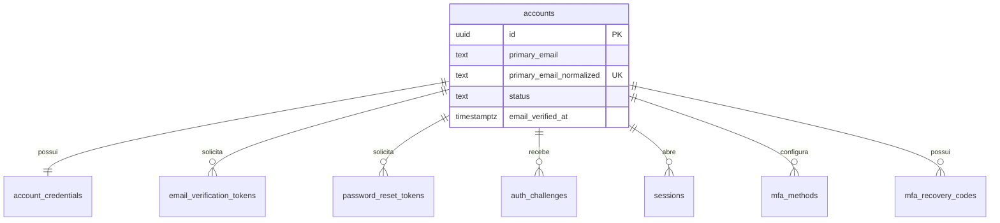
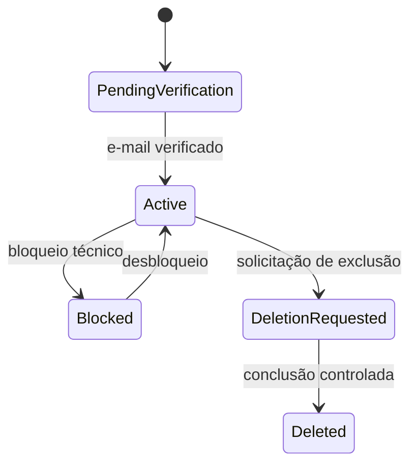
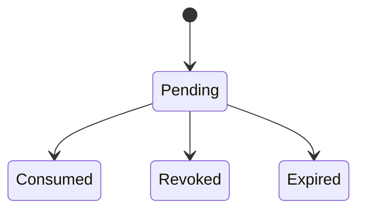
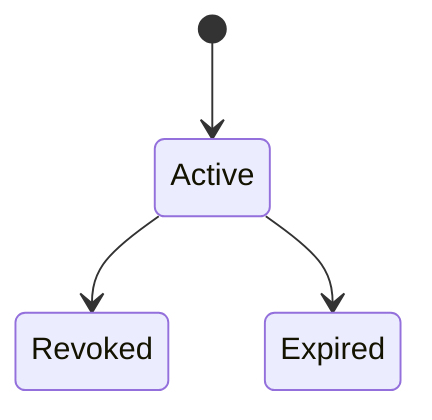

# Dicionário — domínio `identity`

Status: Proposto para P2

Última revisão: 2026-07-09

Este documento modela conta global, credenciais, tokens, sessões, MFA e desafios
de autenticação. O domínio `identity` não conhece orquestras, perfis, naipes ou
conteúdos. Relações com tenants pertencem ao domínio `tenancy`.

Migração conceitual de origem: `0002_identity`.

## Visão geral

## Regras globais do domínio

- E-mail normalizado é único globalmente.
- Senha, token, CSRF, desafio MFA e código de recuperação nunca são armazenados em
  texto puro.
- Conta global não possui `orchestra_id`.
- Maestro/admin não altera e-mail nem senha de outro usuário.
- Troca de e-mail exige reautenticação recente e verificação do novo endereço.
- Troca de senha/e-mail revoga outras sessões.
- MFA obrigatório do admin master é regra de aplicação e aceite, não apenas
  coluna isolada.
- Tabelas globais não usam RLS por tenant, mas continuam protegidas por
  autorização da aplicação, escopo de conta e logs de segurança.

## Fluxo explícito de troca de e-mail

Troca de e-mail global é ação sensível e pertence somente ao dono da conta.

Regra fechada:

1. maestro/admin não altera e-mail de outro usuário;
2. admin master não usa troca direta de e-mail como rotina de suporte;
3. o dono da conta solicita a troca já autenticado;
4. a ação exige reautenticação recente;
5. o novo e-mail precisa ser normalizado, único e ainda não usado por outra conta;
6. o sistema cria `identity.email_verification_tokens` com propósito
   `email_change`;
7. o e-mail antigo é avisado de que uma troca foi solicitada;
8. a troca só é concluída após validação do novo endereço;
9. depois da conclusão, outras sessões da conta são revogadas;
10. auditoria registra a troca com e-mails mascarados ou hash, nunca token ou
    e-mail cru em log técnico sensível.

Em incidente ou suspeita de comprometimento, o admin master deve bloquear a conta,
revogar sessões ou orientar recuperação segura. Ele não deve simplesmente trocar
o e-mail por conveniência.

---

## `identity.accounts`

### Identificação

| Campo | Valor |
|---|---|
| Domínio | `identity` |
| Módulo proprietário | Identidade e autenticação |
| Finalidade | Representar a conta global usada para autenticação |
| Escopo | Global |
| Sensibilidade | Pessoal |
| Retenção | Preservar enquanto existir associação, sessão, auditoria ou obrigação legal; exclusão global só quando não houver orquestras ativas |
| Migração de origem | `0002_identity` |

### Semântica e ciclo de vida

Uma linha representa uma pessoa autenticável globalmente no Concentus. A conta
pode participar de zero ou mais orquestras por perfis do domínio `tenancy`.

### Colunas

| Coluna | Tipo | Nulo | Default | Sensibilidade | Descrição |
|---|---|---:|---|---|---|
| `id` | `uuid` | Não | `uuidv7()` | Interna | Identificador técnico imutável |
| `primary_email` | `text` | Não | — | Pessoal | E-mail principal exibível apenas onde permitido |
| `primary_email_normalized` | `text` | Não | — | Pessoal | E-mail normalizado para unicidade e autenticação |
| `email_verified_at` | `timestamptz` | Sim | — | Interna | Momento em que o e-mail principal foi verificado |
| `status` | `text` | Não | `pending_verification` | Interna | `pending_verification`, `active`, `blocked`, `deletion_requested` ou `deleted` |
| `blocked_at` | `timestamptz` | Sim | — | Interna | Momento de bloqueio global |
| `deletion_requested_at` | `timestamptz` | Sim | — | Interna | Momento da solicitação de exclusão global |
| `deleted_at` | `timestamptz` | Sim | — | Interna | Momento de conclusão lógica da exclusão |
| `created_at` | `timestamptz` | Não | `now()` | Interna | Criação da conta |
| `updated_at` | `timestamptz` | Não | `now()` | Interna | Última alteração |

### Chaves e constraints

| Nome | Tipo | Definição | Regra protegida |
|---|---|---|---|
| `pk_accounts` | PK | `(id)` | Identidade da conta |
| `uq_accounts_primary_email_normalized` | UNIQUE | `(primary_email_normalized)` | E-mail global único |
| `ck_accounts_status` | CHECK | status em lista fechada | Ciclo de vida conhecido |
| `ck_accounts_deleted_at` | CHECK | `deleted_at IS NULL OR status = 'deleted'` | Exclusão lógica coerente |

### Índices

| Nome | Colunas/expressão | Condição | Consulta sustentada |
|---|---|---|---|
| `idx_accounts_status` | `status` | — | Painel técnico e bloqueios |

### RLS e autorização

- Sem RLS de tenant.
- Leitura própria: dono da conta.
- Leitura administrativa: admin master por caso de uso técnico.
- Escrita comum: módulo de identidade.
- Bloqueio global: admin master.
- Sem contexto de tenant: permitido apenas para fluxos globais de identidade.

### Auditoria

| Evento | Momento | Metadados seguros |
|---|---|---|
| `account.created` | criação | `account_id`, origem do convite quando houver |
| `account.email.changed` | troca confirmada | `account_id`, hashes/mascaras de e-mail antigo e novo |
| `account.blocked` | bloqueio | `account_id`, motivo |
| `account.deletion_requested` | solicitação | `account_id` |

### Invariantes

- Banco garante e-mail normalizado único.
- Aplicação garante reautenticação para trocar e-mail.
- Aplicação revoga outras sessões após troca de e-mail ou senha.

### Consultas principais

- buscar conta por e-mail normalizado no login;
- buscar conta por id da sessão;
- listar contas bloqueadas no painel técnico.

### Observações operacionais

E-mail cru não deve aparecer em logs. Logs usam máscara ou hash quando necessário.

---

## `identity.account_credentials`

### Identificação

| Campo | Valor |
|---|---|
| Domínio | `identity` |
| Módulo proprietário | Identidade e autenticação |
| Finalidade | Armazenar credencial de senha da conta |
| Escopo | Global |
| Sensibilidade | Sensível |
| Retenção | Enquanto a conta puder autenticar; histórico antigo fica somente em auditoria segura |
| Migração de origem | `0002_identity` |

### Semântica e ciclo de vida

Uma linha representa a senha ativa da conta. A V1 não mantém senhas antigas.

### Colunas

| Coluna | Tipo | Nulo | Default | Sensibilidade | Descrição |
|---|---|---:|---|---|---|
| `account_id` | `uuid` | Não | — | Interna | Conta proprietária |
| `password_hash` | `text` | Não | — | Sensível | Hash Argon2id em formato seguro, nunca senha |
| `password_algorithm` | `text` | Não | `argon2id` | Interna | Algoritmo usado |
| `password_updated_at` | `timestamptz` | Não | `now()` | Interna | Última troca de senha |
| `created_at` | `timestamptz` | Não | `now()` | Interna | Criação da credencial |

### Chaves e constraints

| Nome | Tipo | Definição | Regra protegida |
|---|---|---|---|
| `pk_account_credentials` | PK | `(account_id)` | Uma credencial ativa por conta |
| `fk_account_credentials_account` | FK | `account_id -> identity.accounts.id ON DELETE RESTRICT` | Conta não some levando credencial sem controle |
| `ck_account_credentials_algorithm` | CHECK | `password_algorithm = 'argon2id'` na V1 | Algoritmo aprovado |

### RLS e autorização

- Sem RLS de tenant.
- Nunca retornada para frontend.
- Escrita apenas pelo módulo de identidade.
- Admin master não lê hash por interface comum.

### Auditoria

| Evento | Momento | Metadados seguros |
|---|---|---|
| `password.changed` | troca de senha | `account_id`, motivo do fluxo |
| `password.reset.completed` | reset concluído | `account_id` |

### Invariantes

- Senha nunca é armazenada ou logada em texto puro.
- Troca de senha revoga outras sessões.

---

## `identity.email_verification_tokens`

### Identificação

| Campo | Valor |
|---|---|
| Domínio | `identity` |
| Módulo proprietário | Identidade e autenticação |
| Finalidade | Verificar e-mail inicial ou novo e-mail em troca de endereço |
| Escopo | Global |
| Sensibilidade | Sensível |
| Retenção | Tokens consumidos/expirados podem ser removidos após janela operacional curta |
| Migração de origem | `0002_identity` |

### Semântica e ciclo de vida

Token de uso único enviado ao e-mail alvo. O banco guarda apenas hash do token.

### Colunas

| Coluna | Tipo | Nulo | Default | Sensibilidade | Descrição |
|---|---|---:|---|---|---|
| `id` | `uuid` | Não | `uuidv7()` | Interna | Identificador técnico |
| `account_id` | `uuid` | Não | — | Interna | Conta que deve receber a verificação |
| `purpose` | `text` | Não | — | Interna | `initial_account` ou `email_change` |
| `email` | `text` | Não | — | Pessoal | E-mail alvo do token |
| `email_normalized` | `text` | Não | — | Pessoal | E-mail alvo normalizado |
| `token_hash` | `text` | Não | — | Sensível | Hash/HMAC do token enviado |
| `expires_at` | `timestamptz` | Não | — | Interna | Expiração do token |
| `consumed_at` | `timestamptz` | Sim | — | Interna | Consumo bem-sucedido |
| `revoked_at` | `timestamptz` | Sim | — | Interna | Revogação manual/sistêmica |
| `created_at` | `timestamptz` | Não | `now()` | Interna | Criação |

### Chaves e constraints

| Nome | Tipo | Definição | Regra protegida |
|---|---|---|---|
| `pk_email_verification_tokens` | PK | `(id)` | Identidade do token |
| `fk_email_verification_tokens_account` | FK | `account_id -> identity.accounts.id ON DELETE RESTRICT` | Token pertence a uma conta |
| `uq_email_verification_tokens_token_hash` | UNIQUE | `(token_hash)` | Token não colide |
| `ck_email_verification_tokens_purpose` | CHECK | propósito em lista fechada | Fluxos conhecidos |
| `ck_email_verification_tokens_finished_once` | CHECK | não consumir e revogar ao mesmo tempo | Estado terminal único |

### Índices

| Nome | Colunas/expressão | Condição | Consulta sustentada |
|---|---|---|---|
| `idx_email_verification_tokens_account_pending` | `account_id, purpose, expires_at` | `consumed_at IS NULL AND revoked_at IS NULL` | Revogar tokens pendentes anteriores |

### RLS e autorização

- Sem RLS de tenant.
- Consumo por token bruto recebido do usuário, comparado contra hash.
- Não retorna existência de conta/e-mail em respostas públicas.

### Auditoria

| Evento | Momento | Metadados seguros |
|---|---|---|
| `email_verification.requested` | emissão | `account_id`, `purpose`, e-mail mascarado |
| `email_verification.consumed` | consumo | `account_id`, `purpose` |
| `email_verification.revoked` | revogação | `account_id`, `purpose` |

---

## `identity.password_reset_tokens`

### Identificação

| Campo | Valor |
|---|---|
| Domínio | `identity` |
| Módulo proprietário | Identidade e autenticação |
| Finalidade | Permitir recuperação de senha por e-mail |
| Escopo | Global |
| Sensibilidade | Sensível |
| Retenção | Remoção após consumo/expiração conforme janela operacional |
| Migração de origem | `0002_identity` |

### Semântica e ciclo de vida

Token curto, de uso único, enviado por e-mail. Respostas públicas do fluxo não
revelam se a conta existe.

### Colunas

| Coluna | Tipo | Nulo | Default | Sensibilidade | Descrição |
|---|---|---:|---|---|---|
| `id` | `uuid` | Não | `uuidv7()` | Interna | Identificador |
| `account_id` | `uuid` | Não | — | Interna | Conta que poderá redefinir senha |
| `token_hash` | `text` | Não | — | Sensível | Hash/HMAC do token |
| `expires_at` | `timestamptz` | Não | — | Interna | Expiração |
| `consumed_at` | `timestamptz` | Sim | — | Interna | Consumo |
| `revoked_at` | `timestamptz` | Sim | — | Interna | Revogação |
| `created_at` | `timestamptz` | Não | `now()` | Interna | Criação |

### Chaves e constraints

| Nome | Tipo | Definição | Regra protegida |
|---|---|---|---|
| `pk_password_reset_tokens` | PK | `(id)` | Identidade do token |
| `fk_password_reset_tokens_account` | FK | `account_id -> identity.accounts.id ON DELETE RESTRICT` | Token pertence a uma conta |
| `uq_password_reset_tokens_token_hash` | UNIQUE | `(token_hash)` | Token único |
| `ck_password_reset_tokens_finished_once` | CHECK | não consumir e revogar ao mesmo tempo | Estado terminal único |

### Auditoria

| Evento | Momento | Metadados seguros |
|---|---|---|
| `password_reset.requested` | emissão para conta existente | `account_id` |
| `password_reset.consumed` | senha trocada | `account_id` |
| `password_reset.rejected` | tentativa inválida | sem token bruto |

---

## `identity.auth_challenges`

### Identificação

| Campo | Valor |
|---|---|
| Domínio | `identity` |
| Módulo proprietário | Identidade e autenticação |
| Finalidade | Controlar desafios curtos de pré-MFA e reautenticação |
| Escopo | Global |
| Sensibilidade | Sensível |
| Retenção | Curta, removível após expiração/consumo |
| Migração de origem | `0002_identity` |

### Semântica e ciclo de vida

Desafio server-side que ainda não concede sessão completa. Usado para MFA após
senha correta e para ações sensíveis que exigem reautenticação recente.

### Colunas

| Coluna | Tipo | Nulo | Default | Sensibilidade | Descrição |
|---|---|---:|---|---|---|
| `id` | `uuid` | Não | `uuidv7()` | Interna | Identificador |
| `account_id` | `uuid` | Não | — | Interna | Conta desafiada |
| `challenge_type` | `text` | Não | — | Interna | `pre_mfa` ou `reauthentication` |
| `challenge_hash` | `text` | Não | — | Sensível | Hash/HMAC do identificador do desafio |
| `attempt_count` | `integer` | Não | `0` | Interna | Tentativas já realizadas |
| `max_attempts` | `integer` | Não | `5` | Interna | Limite antes de invalidar |
| `expires_at` | `timestamptz` | Não | — | Interna | Expiração curta |
| `consumed_at` | `timestamptz` | Sim | — | Interna | Conclusão |
| `revoked_at` | `timestamptz` | Sim | — | Interna | Revogação |
| `created_at` | `timestamptz` | Não | `now()` | Interna | Criação |

### Chaves e constraints

| Nome | Tipo | Definição | Regra protegida |
|---|---|---|---|
| `pk_auth_challenges` | PK | `(id)` | Identidade do desafio |
| `fk_auth_challenges_account` | FK | `account_id -> identity.accounts.id ON DELETE RESTRICT` | Desafio pertence a uma conta |
| `uq_auth_challenges_challenge_hash` | UNIQUE | `(challenge_hash)` | Desafio único |
| `ck_auth_challenges_type` | CHECK | tipo em lista fechada | Fluxos conhecidos |
| `ck_auth_challenges_attempts` | CHECK | `attempt_count >= 0 AND max_attempts > 0` | Limites coerentes |

### Auditoria

| Evento | Momento | Metadados seguros |
|---|---|---|
| `auth_challenge.created` | senha correta exige MFA ou reauth | `account_id`, `challenge_type` |
| `auth_challenge.failed` | tentativa inválida | `account_id`, `challenge_type`, contagem |
| `auth_challenge.consumed` | sucesso | `account_id`, `challenge_type` |

---

## `identity.sessions`

### Identificação

| Campo | Valor |
|---|---|
| Domínio | `identity` |
| Módulo proprietário | Identidade e autenticação |
| Finalidade | Representar sessão server-side revogável |
| Escopo | Global |
| Sensibilidade | Sensível |
| Retenção | Sessões revogadas/expiradas podem ser mantidas por janela curta de segurança |
| Migração de origem | `0002_identity` |

### Semântica e ciclo de vida

Sessão completa só nasce após MFA exigido. O cookie contém token opaco; o banco
guarda apenas hash/HMAC.

### Colunas

| Coluna | Tipo | Nulo | Default | Sensibilidade | Descrição |
|---|---|---:|---|---|---|
| `id` | `uuid` | Não | `uuidv7()` | Interna | Identificador |
| `account_id` | `uuid` | Não | — | Interna | Conta autenticada |
| `session_token_hash` | `text` | Não | — | Sensível | Hash/HMAC do token do cookie |
| `csrf_token_hash` | `text` | Não | — | Sensível | Hash/HMAC do token CSRF vinculado |
| `session_class` | `text` | Não | `common` | Interna | `common`, `admin_master` ou `impersonation` |
| `status` | `text` | Não | `active` | Interna | `active`, `revoked` ou `expired` |
| `created_at` | `timestamptz` | Não | `now()` | Interna | Criação |
| `last_seen_at` | `timestamptz` | Sim | — | Interna | Último uso |
| `idle_expires_at` | `timestamptz` | Não | — | Interna | Expiração por ociosidade |
| `absolute_expires_at` | `timestamptz` | Não | — | Interna | Expiração absoluta |
| `revoked_at` | `timestamptz` | Sim | — | Interna | Revogação |
| `revocation_reason` | `text` | Sim | — | Interna | Motivo seguro da revogação |
| `user_agent_hash` | `text` | Sim | — | Interna | Hash do User-Agent para reconhecimento aproximado |
| `ip_prefix_hash` | `text` | Sim | — | Interna | Hash/prefixo para segurança sem precisão excessiva |

### Chaves e constraints

| Nome | Tipo | Definição | Regra protegida |
|---|---|---|---|
| `pk_sessions` | PK | `(id)` | Identidade da sessão |
| `fk_sessions_account` | FK | `account_id -> identity.accounts.id ON DELETE RESTRICT` | Sessão pertence à conta |
| `uq_sessions_token_hash` | UNIQUE | `(session_token_hash)` | Token não colide |
| `ck_sessions_class` | CHECK | classe em lista fechada | Janelas de sessão conhecidas |
| `ck_sessions_status` | CHECK | status em lista fechada | Ciclo de vida conhecido |

### Índices

| Nome | Colunas/expressão | Condição | Consulta sustentada |
|---|---|---|---|
| `idx_sessions_account_active` | `account_id, last_seen_at DESC` | `status = 'active'` | Listar sessões abertas |
| `idx_sessions_expiration` | `idle_expires_at, absolute_expires_at` | `status = 'active'` | Limpeza de sessões expiradas |

### RLS e autorização

- Sem RLS de tenant.
- Dono vê sessões próprias com metadados seguros.
- Admin master pode revogar em intervenção técnica.
- Token bruto nunca é retornado.

### Auditoria

| Evento | Momento | Metadados seguros |
|---|---|---|
| `session.created` | login completo | `account_id`, `session_class` |
| `session.revoked` | logout/revogação | `account_id`, motivo |
| `session.expired` | limpeza | `account_id` |

---

## `identity.mfa_methods`

### Identificação

| Campo | Valor |
|---|---|
| Domínio | `identity` |
| Módulo proprietário | Identidade e autenticação |
| Finalidade | Configurar métodos MFA da conta |
| Escopo | Global |
| Sensibilidade | Sensível |
| Retenção | Preservar ativos; desativados podem reter metadado sem segredo |
| Migração de origem | `0002_identity` |

### Semântica e ciclo de vida

Na V1, o método suportado é TOTP. O segredo precisa ser criptografado em repouso.

### Colunas

| Coluna | Tipo | Nulo | Default | Sensibilidade | Descrição |
|---|---|---:|---|---|---|
| `id` | `uuid` | Não | `uuidv7()` | Interna | Identificador |
| `account_id` | `uuid` | Não | — | Interna | Conta proprietária |
| `method_type` | `text` | Não | `totp` | Interna | Método MFA |
| `status` | `text` | Não | `pending` | Interna | `pending`, `active` ou `disabled` |
| `secret_ciphertext` | `text` | Não | — | Sensível | Segredo TOTP criptografado |
| `secret_key_id` | `text` | Não | — | Sensível | Identificador da chave de criptografia |
| `label` | `text` | Sim | — | Pessoal | Nome amigável do autenticador |
| `confirmed_at` | `timestamptz` | Sim | — | Interna | Ativação confirmada |
| `disabled_at` | `timestamptz` | Sim | — | Interna | Desativação |
| `created_at` | `timestamptz` | Não | `now()` | Interna | Criação |

### Chaves e constraints

| Nome | Tipo | Definição | Regra protegida |
|---|---|---|---|
| `pk_mfa_methods` | PK | `(id)` | Identidade do método |
| `fk_mfa_methods_account` | FK | `account_id -> identity.accounts.id ON DELETE RESTRICT` | Método pertence à conta |
| `ck_mfa_methods_type` | CHECK | `method_type = 'totp'` na V1 | Método aprovado |
| `ck_mfa_methods_status` | CHECK | status em lista fechada | Ciclo de vida conhecido |

### Auditoria

| Evento | Momento | Metadados seguros |
|---|---|---|
| `mfa_method.created` | início da configuração | `account_id`, `method_type` |
| `mfa_method.activated` | confirmação | `account_id`, `method_type` |
| `mfa_method.disabled` | desativação | `account_id`, motivo |

### Invariantes

- Admin master precisa ter MFA ativo para acessar painel técnico.
- Segredo TOTP não é exibido novamente após confirmação.

---

## `identity.mfa_recovery_codes`

### Identificação

| Campo | Valor |
|---|---|
| Domínio | `identity` |
| Módulo proprietário | Identidade e autenticação |
| Finalidade | Armazenar códigos de recuperação MFA de uso único |
| Escopo | Global |
| Sensibilidade | Sensível |
| Retenção | Ativos até uso, rotação ou desativação do MFA |
| Migração de origem | `0002_identity` |

### Semântica e ciclo de vida

Códigos são exibidos uma única vez ao usuário. O banco guarda apenas hash.

### Colunas

| Coluna | Tipo | Nulo | Default | Sensibilidade | Descrição |
|---|---|---:|---|---|---|
| `id` | `uuid` | Não | `uuidv7()` | Interna | Identificador |
| `account_id` | `uuid` | Não | — | Interna | Conta proprietária |
| `code_hash` | `text` | Não | — | Sensível | Hash/HMAC do código |
| `used_at` | `timestamptz` | Sim | — | Interna | Uso do código |
| `revoked_at` | `timestamptz` | Sim | — | Interna | Revogação/rotação |
| `created_at` | `timestamptz` | Não | `now()` | Interna | Criação |

### Chaves e constraints

| Nome | Tipo | Definição | Regra protegida |
|---|---|---|---|
| `pk_mfa_recovery_codes` | PK | `(id)` | Identidade do código |
| `fk_mfa_recovery_codes_account` | FK | `account_id -> identity.accounts.id ON DELETE RESTRICT` | Código pertence à conta |
| `uq_mfa_recovery_codes_code_hash` | UNIQUE | `(code_hash)` | Código não colide |
| `ck_mfa_recovery_codes_finished_once` | CHECK | não usar e revogar ao mesmo tempo | Estado terminal único |

### Auditoria

| Evento | Momento | Metadados seguros |
|---|---|---|
| `mfa_recovery_codes.generated` | geração/rotação | `account_id`, quantidade |
| `mfa_recovery_code.used` | uso | `account_id` |
| `mfa_recovery_codes.revoked` | rotação/desativação | `account_id` |

### Consultas principais

- validar código de recuperação por hash;
- contar códigos ativos restantes;
- revogar todos os códigos durante rotação.

## Pendências técnicas do domínio

Estas pendências não mudam a regra de produto, mas precisam ser fechadas antes da
migração física:

1. escolher biblioteca Argon2id no Node.js;
2. escolher mecanismo de criptografia de segredos TOTP;
3. definir parâmetros iniciais de Argon2id;
4. definir janela exata de retenção de tokens consumidos/expirados;
5. definir formato de hash/HMAC para tokens de sessão, CSRF, reset e verificação;
6. definir runner de migração e tabela de controle de migrações.
