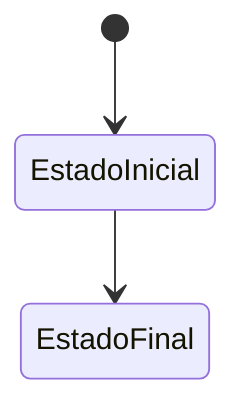
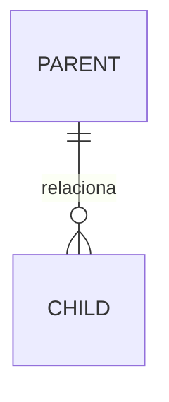

# Modelo de ficha de tabela

Copiar esta estrutura para toda tabela nova. Remover instruções e preencher todos
os campos; usar `Não aplicável` em vez de omitir silenciosamente.

---

## `schema.table_name`

### Identificação

| Campo | Valor |
|---|---|
| Domínio | `identity`, `tenancy`, `content`, `communication` ou `audit` |
| Módulo proprietário | Nome oficial do módulo que pode escrever diretamente |
| Finalidade | Frase única e inequívoca |
| Escopo | Global ou tenant |
| Sensibilidade | Pública, interna, pessoal ou sensível |
| Retenção | Regra de preservação/exclusão |
| Migração de origem | Identificador da migração |

### Semântica e ciclo de vida

Explicar o que uma linha representa, quando nasce, quem pode alterá-la e como
termina seu ciclo de vida.

Remover o diagrama apenas se a tabela não possuir ciclo de vida.

### Colunas

| Coluna | Tipo | Nulo | Default | Sensibilidade | Descrição |
|---|---|---:|---|---|---|
| `id` | `uuid` | Não | `uuidv7()` | Interna | Identificador técnico imutável |

### Chaves e constraints

| Nome | Tipo | Definição | Regra protegida |
|---|---|---|---|
| `pk_table_name` | PK | `(id)` | Identidade da linha |

### Relacionamentos

| Origem | Destino | Cardinalidade | `ON DELETE` | Motivo |
|---|---|---|---|---|

### Índices

| Nome | Colunas/expressão | Condição | Consulta sustentada |
|---|---|---|---|

### RLS e autorização

- política de leitura;
- política de inserção;
- política de atualização;
- política de exclusão;
- bypass técnico autorizado;
- comportamento sem contexto de tenant.

### Auditoria

| Evento | Momento | Metadados seguros |
|---|---|---|

### Invariantes

- listar regras que devem permanecer verdadeiras;
- indicar se banco, aplicação ou ambos garantem cada regra.

### Consultas principais

- listar casos de acesso esperados;
- referenciar índices correspondentes;
- registrar ordenação e paginação.

### Exemplos

Usar dados fictícios sem informações pessoais reais.

### Observações operacionais

- volume esperado;
- crescimento;
- riscos de lock;
- manutenção especial;
- dependência de job ou object storage.
