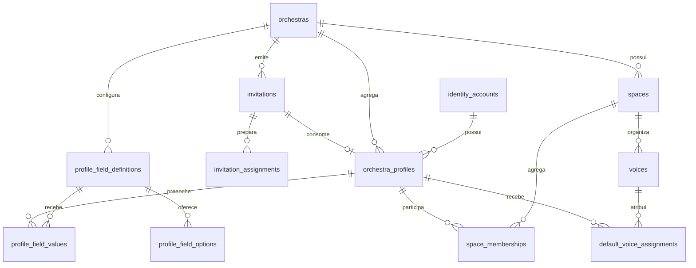
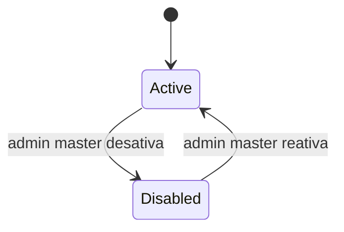
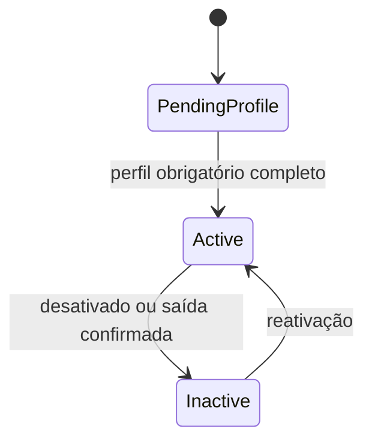
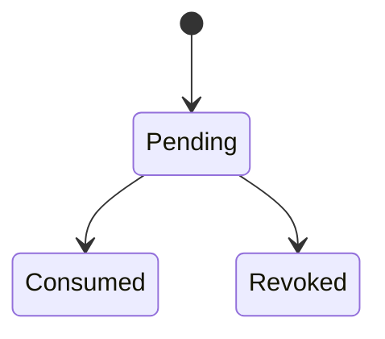
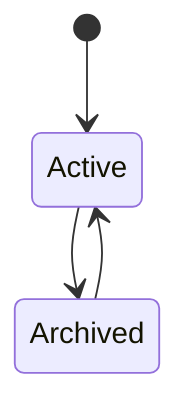

# Dicionário — domínio `tenancy`

Status: Proposto para P2

Última revisão: 2026-07-09

Este documento modela orquestras, perfis por orquestra, convites, campos de
perfil, espaços, naipes, vozes, lideranças e formação padrão.

O domínio `tenancy` referencia `identity.accounts`, mas `identity` não conhece
orquestras. Conteúdo, comunicação e auditoria referenciam perfis e espaços deste
domínio.

Migração conceitual de origem: `0003_tenancy`.

## Visão geral

## Regras globais do domínio

- Toda tabela de `tenancy`, exceto a própria raiz `orchestras`, possui
  `orchestra_id`.
- Perfis são isolados por orquestra; dados de uma orquestra não são copiados para
  outra automaticamente.
- Uma conta pode ter no máximo um perfil por orquestra.
- Nome visível normalizado é único dentro da orquestra.
- Toda orquestra ativa precisa manter pelo menos um maestro/admin ativo.
- Admin master cria/desativa orquestras e altera pesos administrativos; ele não é
  perfil normal de tenant por causa desse cargo.
- Sala global é criada automaticamente, não pode ser excluída e inclui todos os
  perfis ativos implicitamente.
- Liderança é contextual ao espaço do tipo `section`.
- Responsabilidade de sala temporária não concede poder fora da sala.
- Alterar voz padrão afeta somente obras futuras.
- Fotos, símbolos e imagens de sala usam chaves opacas de armazenamento neste
  domínio até a Onda 4 fechar o desenho físico de arquivos. O binário nunca fica
  em coluna do PostgreSQL.

## RLS padrão do domínio

Tabelas tenant-scoped usam:

- leitura permitida quando `app.orchestra_id = orchestra_id` e o perfil do ator
  está ativo no tenant, salvo regra mais restritiva;
- escrita apenas pelo módulo proprietário e pelos casos de uso autorizados;
- ausência de contexto de tenant falha fechada;
- admin master acessa por fluxo técnico auditado, não por política comum de
  negócio.

---

## `tenancy.orchestras`

### Identificação

| Campo | Valor |
|---|---|
| Domínio | `tenancy` |
| Módulo proprietário | Orquestras e membros |
| Finalidade | Representar um tenant independente do Concentus |
| Escopo | Global com raiz de tenant |
| Sensibilidade | Interna |
| Retenção | Desativação preserva dados para reativação |
| Migração de origem | `0003_tenancy` |

### Semântica e ciclo de vida

Uma linha representa uma orquestra isolada. A existência de uma orquestra não é
visível para usuários de outras orquestras.

### Colunas

| Coluna | Tipo | Nulo | Default | Sensibilidade | Descrição |
|---|---|---:|---|---|---|
| `id` | `uuid` | Não | `uuidv7()` | Interna | Identificador técnico do tenant |
| `name` | `text` | Não | — | Interna | Nome exibido da orquestra |
| `slug` | `text` | Não | — | Pública | Segmento de URL contextual |
| `slug_normalized` | `text` | Não | — | Interna | Slug normalizado para unicidade |
| `status` | `text` | Não | `active` | Interna | `active` ou `disabled` |
| `timezone` | `text` | Não | — | Interna | Fuso IANA, como `America/Sao_Paulo` |
| `symbol_storage_key` | `text` | Sim | — | Interna | Chave opaca de símbolo/imagem institucional, até Onda 4 |
| `disabled_at` | `timestamptz` | Sim | — | Interna | Momento de desativação |
| `created_at` | `timestamptz` | Não | `now()` | Interna | Criação |
| `updated_at` | `timestamptz` | Não | `now()` | Interna | Última alteração |

### Chaves e constraints

| Nome | Tipo | Definição | Regra protegida |
|---|---|---|---|
| `pk_orchestras` | PK | `(id)` | Identidade do tenant |
| `uq_orchestras_slug_normalized` | UNIQUE | `(slug_normalized)` | URL contextual única |
| `ck_orchestras_status` | CHECK | status em lista fechada | Ciclo de vida conhecido |
| `ck_orchestras_disabled_at` | CHECK | `disabled_at IS NULL OR status = 'disabled'` | Estado coerente |

### Índices

| Nome | Colunas/expressão | Condição | Consulta sustentada |
|---|---|---|---|
| `idx_orchestras_status` | `status` | — | Painel do admin master |

### RLS e autorização

- Leitura comum: apenas tenant ativo do contexto.
- Criação/desativação/reativação: admin master.
- Maestro/admin pode editar nome, símbolo e slug da própria orquestra, salvo
  regras futuras de redirecionamento de slug.

### Auditoria

| Evento | Momento | Metadados seguros |
|---|---|---|
| `orchestra.created` | criação pelo master | `orchestra_id`, slug |
| `orchestra.updated` | alteração de nome/slug/fuso | campos alterados |
| `orchestra.disabled` | desativação | motivo |
| `orchestra.reactivated` | reativação | motivo |

### Invariantes

- Orquestra desativada bloqueia acesso dos membros sem apagar dados.
- Tenant não altera identidade visual principal do Concentus.

---

## `tenancy.orchestra_profiles`

### Identificação

| Campo | Valor |
|---|---|
| Domínio | `tenancy` |
| Módulo proprietário | Orquestras e membros |
| Finalidade | Representar a pessoa dentro de uma orquestra específica |
| Escopo | Tenant |
| Sensibilidade | Pessoal |
| Retenção | Desativação preserva autoria e histórico |
| Migração de origem | `0003_tenancy` |

### Semântica e ciclo de vida

Uma linha é o perfil da conta global dentro de uma orquestra. Liderança,
responsabilidade de sala, vozes e permissões contextuais ficam em outras tabelas.

### Colunas

| Coluna | Tipo | Nulo | Default | Sensibilidade | Descrição |
|---|---|---:|---|---|---|
| `id` | `uuid` | Não | `uuidv7()` | Interna | Identificador do perfil no tenant |
| `orchestra_id` | `uuid` | Não | — | Interna | Tenant proprietário |
| `account_id` | `uuid` | Não | — | Interna | Conta global vinculada |
| `display_name` | `text` | Não | — | Pessoal | Nome visível no tenant |
| `display_name_normalized` | `text` | Não | — | Interna | Nome normalizado para unicidade |
| `status` | `text` | Não | `pending_profile` | Interna | `pending_profile`, `active` ou `inactive` |
| `orchestra_role` | `text` | Não | `member` | Interna | `member` ou `maestro_admin` |
| `authority_weight` | `integer` | Sim | — | Interna | Peso administrativo de maestro/admin |
| `biography` | `text` | Sim | — | Pessoal | Descrição opcional |
| `photo_storage_key` | `text` | Sim | — | Pessoal | Foto de perfil como chave opaca até Onda 4 |
| `profile_completed_at` | `timestamptz` | Sim | — | Interna | Conclusão dos campos obrigatórios |
| `deactivated_at` | `timestamptz` | Sim | — | Interna | Desativação ou saída confirmada |
| `created_at` | `timestamptz` | Não | `now()` | Interna | Criação |
| `updated_at` | `timestamptz` | Não | `now()` | Interna | Última alteração |

### Chaves e constraints

| Nome | Tipo | Definição | Regra protegida |
|---|---|---|---|
| `pk_orchestra_profiles` | PK | `(id)` | Identidade do perfil |
| `uq_orchestra_profiles_orchestra_id_id` | UNIQUE | `(orchestra_id, id)` | FK composta tenant-scoped |
| `uq_orchestra_profiles_account` | UNIQUE | `(orchestra_id, account_id)` | Uma conta por orquestra |
| `uq_orchestra_profiles_display_name` | UNIQUE | `(orchestra_id, display_name_normalized)` | Nome visível único |
| `fk_orchestra_profiles_orchestra` | FK | `orchestra_id -> tenancy.orchestras.id ON DELETE RESTRICT` | Perfil pertence ao tenant |
| `fk_orchestra_profiles_account` | FK | `account_id -> identity.accounts.id ON DELETE RESTRICT` | Perfil pertence à conta |
| `ck_orchestra_profiles_status` | CHECK | status em lista fechada | Ciclo de vida conhecido |
| `ck_orchestra_profiles_role` | CHECK | papel em lista fechada | Papel operacional conhecido |
| `ck_orchestra_profiles_admin_weight` | CHECK | peso presente somente para maestro/admin | Hierarquia coerente |

### Índices

| Nome | Colunas/expressão | Condição | Consulta sustentada |
|---|---|---|---|
| `idx_orchestra_profiles_orchestra_status` | `orchestra_id, status` | — | Listagem de membros |
| `idx_orchestra_profiles_admins_active` | `orchestra_id, authority_weight` | `status = 'active' AND orchestra_role = 'maestro_admin'` | Validar admins ativos |

### RLS e autorização

- Perfil ativo lê perfis ativos do mesmo tenant, respeitando privacidade de campos.
- E-mail vem de `identity.accounts` e só aparece para maestro/admin.
- O próprio perfil edita campos pessoais permitidos.
- Maestro/admin corrige nome, remove foto inadequada e desativa/reativa membros.
- Alterar `authority_weight` é exclusivo do admin master.

### Auditoria

| Evento | Momento | Metadados seguros |
|---|---|---|
| `profile.created` | convite aceito/criação | `profile_id`, `orchestra_id` |
| `profile.activated` | perfil completo | `profile_id` |
| `profile.updated` | alteração administrativa | campos alterados |
| `profile.role.changed` | promoção/rebaixamento | papel/peso anterior e novo |
| `profile.deactivated` | saída/desativação | motivo |
| `profile.reactivated` | reativação | motivo |

### Invariantes

- Último maestro/admin ativo não pode ser desativado, rebaixado ou sair.
- Essa regra exige transação com bloqueio adequado ou trigger futura; não cabe em
  `CHECK` simples.

---

## `tenancy.invitations`

### Identificação

| Campo | Valor |
|---|---|
| Domínio | `tenancy` |
| Módulo proprietário | Orquestras e membros |
| Finalidade | Controlar entrada por convite de uso único |
| Escopo | Tenant |
| Sensibilidade | Pessoal/sensível |
| Retenção | Convites consumidos/revogados preservam trilha administrativa |
| Migração de origem | `0003_tenancy` |

### Semântica e ciclo de vida

Convite não expira por decisão de produto, mas é uso único, revogável e vinculado
ao e-mail convidado. O token bruto nunca é armazenado.

### Colunas

| Coluna | Tipo | Nulo | Default | Sensibilidade | Descrição |
|---|---|---:|---|---|---|
| `id` | `uuid` | Não | `uuidv7()` | Interna | Identificador |
| `orchestra_id` | `uuid` | Não | — | Interna | Tenant emissor |
| `invited_email` | `text` | Não | — | Pessoal | E-mail convidado |
| `invited_email_normalized` | `text` | Não | — | Pessoal | E-mail normalizado para conferência |
| `suggested_display_name` | `text` | Sim | — | Pessoal | Nome sugerido pelo maestro/admin |
| `token_hash` | `text` | Não | — | Sensível | Hash/HMAC do token de convite |
| `status` | `text` | Não | `pending` | Interna | `pending`, `consumed` ou `revoked` |
| `created_by_profile_id` | `uuid` | Não | — | Interna | Perfil que criou o convite |
| `consumed_by_profile_id` | `uuid` | Sim | — | Interna | Perfil criado/ativado pelo convite |
| `consumed_at` | `timestamptz` | Sim | — | Interna | Consumo |
| `revoked_at` | `timestamptz` | Sim | — | Interna | Revogação |
| `created_at` | `timestamptz` | Não | `now()` | Interna | Criação |

### Chaves e constraints

| Nome | Tipo | Definição | Regra protegida |
|---|---|---|---|
| `pk_invitations` | PK | `(id)` | Identidade do convite |
| `uq_invitations_orchestra_id_id` | UNIQUE | `(orchestra_id, id)` | FK composta |
| `uq_invitations_token_hash` | UNIQUE | `(token_hash)` | Token único |
| `fk_invitations_orchestra` | FK | `orchestra_id -> tenancy.orchestras.id ON DELETE RESTRICT` | Convite pertence ao tenant |
| `fk_invitations_created_by` | FK | `(orchestra_id, created_by_profile_id) -> tenancy.orchestra_profiles(orchestra_id, id) ON DELETE RESTRICT` | Autor pertence ao tenant |
| `fk_invitations_consumed_by` | FK | `(orchestra_id, consumed_by_profile_id) -> tenancy.orchestra_profiles(orchestra_id, id) ON DELETE RESTRICT` | Perfil consumido pertence ao tenant |
| `ck_invitations_status` | CHECK | status em lista fechada | Ciclo de vida conhecido |
| `ck_invitations_finished_once` | CHECK | consumo e revogação não coexistem | Estado terminal único |

### Índices

| Nome | Colunas/expressão | Condição | Consulta sustentada |
|---|---|---|---|
| `idx_invitations_orchestra_pending_email` | `orchestra_id, invited_email_normalized` | `status = 'pending'` | Gerenciar convites pendentes |

### RLS e autorização

- Maestro/admin lê e gerencia convites da própria orquestra.
- Usuário convidado consome convite por token e e-mail correspondente.
- Respostas públicas não revelam se outro e-mail possui conta.

### Auditoria

| Evento | Momento | Metadados seguros |
|---|---|---|
| `invitation.created` | criação | e-mail mascarado, autor |
| `invitation.resent` | reenvio | e-mail mascarado |
| `invitation.revoked` | revogação | motivo |
| `invitation.consumed` | aceite | `profile_id` |

---

## `tenancy.invitation_assignments`

### Identificação

| Campo | Valor |
|---|---|
| Domínio | `tenancy` |
| Módulo proprietário | Orquestras e membros |
| Finalidade | Guardar atribuições administrativas que serão aplicadas ao aceitar convite |
| Escopo | Tenant |
| Sensibilidade | Interna |
| Retenção | Preservar com o convite para auditoria |
| Migração de origem | `0003_tenancy` |

### Semântica

Cada linha representa uma atribuição preparada pelo maestro/admin, como papel de
orquestra, participação em espaço, liderança/responsabilidade ou voz padrão.

Permissões de bibliotecas e recursos serão fechadas na Onda 3 para não criar
referência prematura a conteúdo.

### Colunas

| Coluna | Tipo | Nulo | Default | Sensibilidade | Descrição |
|---|---|---:|---|---|---|
| `id` | `uuid` | Não | `uuidv7()` | Interna | Identificador |
| `orchestra_id` | `uuid` | Não | — | Interna | Tenant |
| `invitation_id` | `uuid` | Não | — | Interna | Convite relacionado |
| `assignment_kind` | `text` | Não | — | Interna | `orchestra_role`, `space_membership` ou `default_voice` |
| `orchestra_role` | `text` | Sim | — | Interna | Papel a aplicar, quando `orchestra_role` |
| `authority_weight` | `integer` | Sim | — | Interna | Peso administrativo inicial, quando aplicável |
| `space_id` | `uuid` | Sim | — | Interna | Espaço relacionado |
| `space_role` | `text` | Sim | — | Interna | `member`, `leader` ou `responsible` |
| `voice_id` | `uuid` | Sim | — | Interna | Voz padrão relacionada |
| `created_at` | `timestamptz` | Não | `now()` | Interna | Criação |

### Chaves e constraints

| Nome | Tipo | Definição | Regra protegida |
|---|---|---|---|
| `pk_invitation_assignments` | PK | `(id)` | Identidade |
| `fk_invitation_assignments_invitation` | FK | `(orchestra_id, invitation_id) -> tenancy.invitations(orchestra_id, id) ON DELETE CASCADE` | Atribuição inseparável do convite |
| `fk_invitation_assignments_space` | FK | `(orchestra_id, space_id) -> tenancy.spaces(orchestra_id, id) ON DELETE RESTRICT` | Espaço do mesmo tenant |
| `fk_invitation_assignments_voice` | FK | `(orchestra_id, voice_id) -> tenancy.voices(orchestra_id, id) ON DELETE RESTRICT` | Voz do mesmo tenant |
| `ck_invitation_assignments_kind` | CHECK | kind em lista fechada | Tipos conhecidos |
| `ck_invitation_assignments_shape` | CHECK | colunas coerentes por kind | Evitar linha ambígua |

### Auditoria

| Evento | Momento | Metadados seguros |
|---|---|---|
| `invitation_assignment.created` | criação/edição do convite | tipo e alvo |
| `invitation_assignment.applied` | consumo do convite | `profile_id`, tipo e alvo |

---

## `tenancy.profile_field_definitions`

### Identificação

| Campo | Valor |
|---|---|
| Domínio | `tenancy` |
| Módulo proprietário | Orquestras e membros |
| Finalidade | Definir campos de perfil configuráveis por orquestra |
| Escopo | Tenant |
| Sensibilidade | Interna |
| Retenção | Definições inativas preservam valores históricos |
| Migração de origem | `0003_tenancy` |

### Semântica

Campos padrão opcionais, como telefone e nascimento, podem ser criados como
definições de sistema por orquestra. Maestro/admin pode alterar obrigatoriedade e
visibilidade padrão conforme regras.

### Colunas

| Coluna | Tipo | Nulo | Default | Sensibilidade | Descrição |
|---|---|---:|---|---|---|
| `id` | `uuid` | Não | `uuidv7()` | Interna | Identificador |
| `orchestra_id` | `uuid` | Não | — | Interna | Tenant |
| `field_key` | `text` | Não | — | Interna | Chave única no tenant |
| `system_key` | `text` | Sim | — | Interna | Chave de campo padrão, como `phone` ou `birth_date` |
| `label` | `text` | Não | — | Interna | Rótulo exibido |
| `description` | `text` | Sim | — | Interna | Ajuda para preenchimento |
| `field_type` | `text` | Não | — | Interna | `text`, `date`, `number`, `url`, `phone` ou `option` |
| `is_required` | `boolean` | Não | `false` | Interna | Bloqueia conclusão de perfil quando ausente |
| `default_visibility` | `text` | Não | `everyone` | Interna | `everyone`, `admins_only` ou `private` |
| `sort_order` | `integer` | Não | `0` | Interna | Ordem de exibição |
| `status` | `text` | Não | `active` | Interna | `active` ou `inactive` |
| `created_at` | `timestamptz` | Não | `now()` | Interna | Criação |
| `updated_at` | `timestamptz` | Não | `now()` | Interna | Última alteração |

### Chaves e constraints

| Nome | Tipo | Definição | Regra protegida |
|---|---|---|---|
| `pk_profile_field_definitions` | PK | `(id)` | Identidade |
| `uq_profile_field_definitions_orchestra_id_id` | UNIQUE | `(orchestra_id, id)` | FK composta |
| `uq_profile_field_definitions_key` | UNIQUE | `(orchestra_id, field_key)` | Campo único no tenant |
| `uq_profile_field_definitions_system_key` | UNIQUE parcial | `(orchestra_id, system_key) WHERE system_key IS NOT NULL` | Um campo padrão de cada tipo por tenant |
| `fk_profile_field_definitions_orchestra` | FK | `orchestra_id -> tenancy.orchestras.id ON DELETE RESTRICT` | Definição pertence ao tenant |
| `ck_profile_field_definitions_type` | CHECK | tipo em lista fechada | Tipos conhecidos |
| `ck_profile_field_definitions_visibility` | CHECK | visibilidade em lista fechada | Privacidade conhecida |
| `ck_profile_field_definitions_status` | CHECK | status em lista fechada | Ciclo de vida conhecido |

### RLS e autorização

- Maestro/admin cria, ordena, ativa/inativa e altera obrigatoriedade.
- Membro lê definições ativas necessárias para preencher o próprio perfil.
- Definição obrigatória nova gera pendência no próximo acesso.

---

## `tenancy.profile_field_options`

### Identificação

| Campo | Valor |
|---|---|
| Domínio | `tenancy` |
| Módulo proprietário | Orquestras e membros |
| Finalidade | Representar opções válidas de campos personalizados do tipo `option` |
| Escopo | Tenant |
| Sensibilidade | Interna |
| Retenção | Opções inativas preservam valores históricos |
| Migração de origem | `0003_tenancy` |

### Colunas

| Coluna | Tipo | Nulo | Default | Sensibilidade | Descrição |
|---|---|---:|---|---|---|
| `id` | `uuid` | Não | `uuidv7()` | Interna | Identificador |
| `orchestra_id` | `uuid` | Não | — | Interna | Tenant |
| `field_definition_id` | `uuid` | Não | — | Interna | Campo proprietário |
| `option_key` | `text` | Não | — | Interna | Chave estável da opção |
| `label` | `text` | Não | — | Interna | Rótulo exibido |
| `sort_order` | `integer` | Não | `0` | Interna | Ordem |
| `status` | `text` | Não | `active` | Interna | `active` ou `inactive` |
| `created_at` | `timestamptz` | Não | `now()` | Interna | Criação |

### Chaves e constraints

| Nome | Tipo | Definição | Regra protegida |
|---|---|---|---|
| `pk_profile_field_options` | PK | `(id)` | Identidade |
| `uq_profile_field_options_orchestra_id_id` | UNIQUE | `(orchestra_id, id)` | FK composta |
| `uq_profile_field_options_key` | UNIQUE | `(orchestra_id, field_definition_id, option_key)` | Opção única por campo |
| `fk_profile_field_options_definition` | FK | `(orchestra_id, field_definition_id) -> tenancy.profile_field_definitions(orchestra_id, id) ON DELETE RESTRICT` | Opção pertence ao campo |
| `ck_profile_field_options_status` | CHECK | status em lista fechada | Ciclo de vida conhecido |

---

## `tenancy.profile_field_values`

### Identificação

| Campo | Valor |
|---|---|
| Domínio | `tenancy` |
| Módulo proprietário | Orquestras e membros |
| Finalidade | Armazenar valores preenchidos em campos de perfil |
| Escopo | Tenant |
| Sensibilidade | Pessoal |
| Retenção | Preservar com o perfil para histórico, respeitando exclusão global futura |
| Migração de origem | `0003_tenancy` |

### Semântica

Valores usam colunas tipadas em vez de `jsonb`. A aplicação garante que a coluna
preenchida corresponda ao `field_type` da definição.

### Colunas

| Coluna | Tipo | Nulo | Default | Sensibilidade | Descrição |
|---|---|---:|---|---|---|
| `id` | `uuid` | Não | `uuidv7()` | Interna | Identificador |
| `orchestra_id` | `uuid` | Não | — | Interna | Tenant |
| `profile_id` | `uuid` | Não | — | Interna | Perfil proprietário |
| `field_definition_id` | `uuid` | Não | — | Interna | Campo preenchido |
| `field_option_id` | `uuid` | Sim | — | Pessoal | Opção escolhida, quando campo `option` |
| `value_text` | `text` | Sim | — | Pessoal | Valor textual/URL/telefone normalizado |
| `value_number` | `numeric` | Sim | — | Pessoal | Valor numérico |
| `value_date` | `date` | Sim | — | Pessoal | Valor de data civil |
| `visibility` | `text` | Não | — | Pessoal | `everyone`, `admins_only` ou `private` |
| `created_at` | `timestamptz` | Não | `now()` | Interna | Criação |
| `updated_at` | `timestamptz` | Não | `now()` | Interna | Última alteração |

### Chaves e constraints

| Nome | Tipo | Definição | Regra protegida |
|---|---|---|---|
| `pk_profile_field_values` | PK | `(id)` | Identidade |
| `uq_profile_field_values_profile_field` | UNIQUE | `(orchestra_id, profile_id, field_definition_id)` | Um valor por perfil/campo |
| `fk_profile_field_values_profile` | FK | `(orchestra_id, profile_id) -> tenancy.orchestra_profiles(orchestra_id, id) ON DELETE RESTRICT` | Valor pertence ao perfil |
| `fk_profile_field_values_definition` | FK | `(orchestra_id, field_definition_id) -> tenancy.profile_field_definitions(orchestra_id, id) ON DELETE RESTRICT` | Valor pertence ao campo |
| `fk_profile_field_values_option` | FK | `(orchestra_id, field_option_id) -> tenancy.profile_field_options(orchestra_id, id) ON DELETE RESTRICT` | Opção pertence ao tenant |
| `ck_profile_field_values_visibility` | CHECK | visibilidade em lista fechada | Privacidade conhecida |
| `ck_profile_field_values_one_value` | CHECK | no máximo uma família de valor preenchida | Evitar ambiguidade |

### RLS e autorização

- Dono edita valores próprios.
- Maestro/admin lê campos permitidos a administradores.
- Membros veem somente campos com visibilidade `everyone`.
- Campo `private` aparece apenas ao dono e a fluxos técnicos autorizados.

### Invariantes

- Campo obrigatório ativo precisa ter valor antes de concluir ou continuar perfil.
- A validação de tipo contra `field_type` exige aplicação ou trigger futura.

---

## `tenancy.spaces`

### Identificação

| Campo | Valor |
|---|---|
| Domínio | `tenancy` |
| Módulo proprietário | Orquestras e membros |
| Finalidade | Representar sala global, naipe ou sala temporária |
| Escopo | Tenant |
| Sensibilidade | Interna |
| Retenção | Arquivamento preserva histórico |
| Migração de origem | `0003_tenancy` |

### Semântica e ciclo de vida

`space_type = 'global'` é obrigatório por orquestra e não recebe memberships
explícitas; todos os perfis ativos pertencem implicitamente a ele.

### Colunas

| Coluna | Tipo | Nulo | Default | Sensibilidade | Descrição |
|---|---|---:|---|---|---|
| `id` | `uuid` | Não | `uuidv7()` | Interna | Identificador |
| `orchestra_id` | `uuid` | Não | — | Interna | Tenant |
| `space_type` | `text` | Não | — | Interna | `global`, `section` ou `temporary` |
| `name` | `text` | Não | — | Interna | Nome exibido |
| `name_normalized` | `text` | Não | — | Interna | Nome normalizado |
| `status` | `text` | Não | `active` | Interna | `active` ou `archived` |
| `image_storage_key` | `text` | Sim | — | Interna | Imagem/capa como chave opaca até Onda 4 |
| `starts_at` | `timestamptz` | Sim | — | Interna | Início de sala temporária, se aplicável |
| `ends_at` | `timestamptz` | Sim | — | Interna | Fim de sala temporária, se aplicável |
| `sort_order` | `integer` | Não | `0` | Interna | Ordem administrativa |
| `created_at` | `timestamptz` | Não | `now()` | Interna | Criação |
| `updated_at` | `timestamptz` | Não | `now()` | Interna | Última alteração |

### Chaves e constraints

| Nome | Tipo | Definição | Regra protegida |
|---|---|---|---|
| `pk_spaces` | PK | `(id)` | Identidade |
| `uq_spaces_orchestra_id_id` | UNIQUE | `(orchestra_id, id)` | FK composta |
| `uq_spaces_name` | UNIQUE | `(orchestra_id, name_normalized)` | Nome único no tenant |
| `uq_spaces_one_global` | UNIQUE parcial | `(orchestra_id) WHERE space_type = 'global'` | Uma sala global por orquestra |
| `fk_spaces_orchestra` | FK | `orchestra_id -> tenancy.orchestras.id ON DELETE RESTRICT` | Espaço pertence ao tenant |
| `ck_spaces_type` | CHECK | tipo em lista fechada | Tipos conhecidos |
| `ck_spaces_status` | CHECK | status em lista fechada | Ciclo de vida conhecido |
| `ck_spaces_temporary_dates` | CHECK | datas coerentes para temporário | Evitar sala temporária inválida |
| `ck_spaces_global_active` | CHECK | global não pode ser arquivado | Sala global permanece obrigatória |

### RLS e autorização

- Membros veem espaços dos quais participam; global é visível para todos ativos.
- Maestro/admin gerencia espaços.
- Responsável gerencia apenas sala temporária em que possui papel contextual.

### Auditoria

| Evento | Momento | Metadados seguros |
|---|---|---|
| `space.created` | criação | tipo, nome |
| `space.updated` | alteração | campos alterados |
| `space.archived` | arquivamento | motivo |

---

## `tenancy.space_memberships`

### Identificação

| Campo | Valor |
|---|---|
| Domínio | `tenancy` |
| Módulo proprietário | Orquestras e membros |
| Finalidade | Relacionar perfil a naipe ou sala temporária com papel contextual |
| Escopo | Tenant |
| Sensibilidade | Interna |
| Retenção | Encerramento preserva histórico |
| Migração de origem | `0003_tenancy` |

### Semântica

Não há linha para sala global. Perfis ativos pertencem à sala global
implicitamente.

### Colunas

| Coluna | Tipo | Nulo | Default | Sensibilidade | Descrição |
|---|---|---:|---|---|---|
| `id` | `uuid` | Não | `uuidv7()` | Interna | Identificador |
| `orchestra_id` | `uuid` | Não | — | Interna | Tenant |
| `space_id` | `uuid` | Não | — | Interna | Espaço |
| `profile_id` | `uuid` | Não | — | Interna | Perfil participante |
| `space_role` | `text` | Não | `member` | Interna | `member`, `leader` ou `responsible` |
| `status` | `text` | Não | `active` | Interna | `active` ou `inactive` |
| `starts_at` | `timestamptz` | Sim | — | Interna | Início efetivo |
| `ended_at` | `timestamptz` | Sim | — | Interna | Encerramento |
| `created_at` | `timestamptz` | Não | `now()` | Interna | Criação |

### Chaves e constraints

| Nome | Tipo | Definição | Regra protegida |
|---|---|---|---|
| `pk_space_memberships` | PK | `(id)` | Identidade |
| `uq_space_memberships_orchestra_id_id` | UNIQUE | `(orchestra_id, id)` | FK composta |
| `uq_space_memberships_active` | UNIQUE parcial | `(orchestra_id, space_id, profile_id) WHERE status = 'active'` | Evita duplicidade ativa |
| `fk_space_memberships_space` | FK | `(orchestra_id, space_id) -> tenancy.spaces(orchestra_id, id) ON DELETE RESTRICT` | Espaço do tenant |
| `fk_space_memberships_profile` | FK | `(orchestra_id, profile_id) -> tenancy.orchestra_profiles(orchestra_id, id) ON DELETE RESTRICT` | Perfil do tenant |
| `ck_space_memberships_role` | CHECK | papel em lista fechada | Papéis contextuais conhecidos |
| `ck_space_memberships_status` | CHECK | status em lista fechada | Ciclo de vida conhecido |

### RLS e autorização

- Membro vê suas associações e espaços visíveis.
- Maestro/admin gerencia associações.
- Responsável de sala temporária gerencia membros da própria sala, conforme
  capacidade.
- Líder é contextual ao espaço `section`.

### Invariantes

- Sala global não pode ser arquivada nem excluída.
- Papel `leader` só faz sentido para `space_type = 'section'`.
- Papel `responsible` só faz sentido para `space_type = 'temporary'`.
- `space_memberships` não deve possuir linha para a sala global, pois ela é
  implícita para todo perfil ativo.
- Essas regras exigem aplicação ou trigger porque dependem de outra tabela.

---

## `tenancy.voices`

### Identificação

| Campo | Valor |
|---|---|
| Domínio | `tenancy` |
| Módulo proprietário | Orquestras e membros |
| Finalidade | Representar vozes ordenadas dentro de um naipe |
| Escopo | Tenant |
| Sensibilidade | Interna |
| Retenção | Arquivamento preserva obras antigas |
| Migração de origem | `0003_tenancy` |

### Colunas

| Coluna | Tipo | Nulo | Default | Sensibilidade | Descrição |
|---|---|---:|---|---|---|
| `id` | `uuid` | Não | `uuidv7()` | Interna | Identificador |
| `orchestra_id` | `uuid` | Não | — | Interna | Tenant |
| `section_space_id` | `uuid` | Não | — | Interna | Espaço do tipo naipe |
| `name` | `text` | Não | — | Interna | Nome, como `1ª voz` |
| `name_normalized` | `text` | Não | — | Interna | Nome normalizado |
| `sort_order` | `integer` | Não | `0` | Interna | Ordem dentro do naipe |
| `status` | `text` | Não | `active` | Interna | `active` ou `archived` |
| `created_at` | `timestamptz` | Não | `now()` | Interna | Criação |
| `updated_at` | `timestamptz` | Não | `now()` | Interna | Última alteração |

### Chaves e constraints

| Nome | Tipo | Definição | Regra protegida |
|---|---|---|---|
| `pk_voices` | PK | `(id)` | Identidade |
| `uq_voices_orchestra_id_id` | UNIQUE | `(orchestra_id, id)` | FK composta |
| `uq_voices_section_name` | UNIQUE | `(orchestra_id, section_space_id, name_normalized)` | Nome único no naipe |
| `fk_voices_section_space` | FK | `(orchestra_id, section_space_id) -> tenancy.spaces(orchestra_id, id) ON DELETE RESTRICT` | Voz pertence ao naipe |
| `ck_voices_status` | CHECK | status em lista fechada | Ciclo de vida conhecido |

### RLS e autorização

- Maestro/admin gerencia vozes.
- Líder com capacidade contextual pode criar/ordenar vozes no próprio naipe, se
  autorizado.
- Membros veem vozes do próprio naipe.

### Invariantes

- `section_space_id` deve apontar para `space_type = 'section'`; aplicação ou
  trigger futura garante.
- Criar voz nova afeta somente obras futuras.

---

## `tenancy.default_voice_assignments`

### Identificação

| Campo | Valor |
|---|---|
| Domínio | `tenancy` |
| Módulo proprietário | Orquestras e membros |
| Finalidade | Guardar vozes padrão usadas ao criar obras futuras |
| Escopo | Tenant |
| Sensibilidade | Interna |
| Retenção | Histórico encerrado preserva rastreabilidade |
| Migração de origem | `0003_tenancy` |

### Semântica

Um músico pode ter mais de uma voz padrão no mesmo naipe. Alterações valem para
obras futuras; obras existentes preservam sua fotografia.

### Colunas

| Coluna | Tipo | Nulo | Default | Sensibilidade | Descrição |
|---|---|---:|---|---|---|
| `id` | `uuid` | Não | `uuidv7()` | Interna | Identificador |
| `orchestra_id` | `uuid` | Não | — | Interna | Tenant |
| `profile_id` | `uuid` | Não | — | Interna | Perfil do músico |
| `voice_id` | `uuid` | Não | — | Interna | Voz padrão |
| `status` | `text` | Não | `active` | Interna | `active` ou `inactive` |
| `assigned_by_profile_id` | `uuid` | Sim | — | Interna | Perfil que atribuiu, quando aplicável |
| `ended_at` | `timestamptz` | Sim | — | Interna | Encerramento |
| `created_at` | `timestamptz` | Não | `now()` | Interna | Criação |

### Chaves e constraints

| Nome | Tipo | Definição | Regra protegida |
|---|---|---|---|
| `pk_default_voice_assignments` | PK | `(id)` | Identidade |
| `uq_default_voice_assignments_active` | UNIQUE parcial | `(orchestra_id, profile_id, voice_id) WHERE status = 'active'` | Evita duplicidade ativa |
| `fk_default_voice_assignments_profile` | FK | `(orchestra_id, profile_id) -> tenancy.orchestra_profiles(orchestra_id, id) ON DELETE RESTRICT` | Perfil do tenant |
| `fk_default_voice_assignments_voice` | FK | `(orchestra_id, voice_id) -> tenancy.voices(orchestra_id, id) ON DELETE RESTRICT` | Voz do tenant |
| `fk_default_voice_assignments_assigned_by` | FK | `(orchestra_id, assigned_by_profile_id) -> tenancy.orchestra_profiles(orchestra_id, id) ON DELETE RESTRICT` | Autor da atribuição |
| `ck_default_voice_assignments_status` | CHECK | status em lista fechada | Ciclo de vida conhecido |

### RLS e autorização

- Maestro/admin gerencia qualquer voz padrão.
- Líder contextual gerencia vozes padrão no próprio naipe, se autorizado.
- Membro vê suas próprias vozes padrão.

### Invariantes

- Perfil precisa participar do naipe da voz para receber atribuição padrão; regra
  depende de `space_memberships` e exige aplicação ou trigger futura.
- Alteração não modifica obras antigas.

## Consultas principais do domínio

- resolver tenant por `slug_normalized`;
- listar orquestras de uma conta no seletor;
- carregar perfil ativo de uma conta no tenant;
- listar membros ativos com naipes, lideranças e vozes;
- validar último maestro/admin ativo;
- consumir convite de uso único por token e e-mail;
- listar campos obrigatórios pendentes no próximo acesso;
- montar formação padrão para nova obra;
- resolver responsáveis de sala temporária.

## Seeds do domínio

Ao criar uma orquestra, o caso de uso deve criar na mesma transação ou em fluxo
atômico equivalente:

1. `tenancy.orchestras`;
2. sala global em `tenancy.spaces`;
3. convite do primeiro maestro/admin;
4. definições padrão de perfil, como telefone e nascimento, se adotadas na V1;
5. modelos e prioridades iniciais serão criados pelo domínio `communication`.

Produção não deve semear uma orquestra específica como regra da plataforma.

## Pendências técnicas do domínio

1. decidir política de redirecionamento ao trocar `slug`;
2. fechar slots e limites de imagens institucionais antes de usar
   `symbol_storage_key`/`image_storage_key` em produção;
3. decidir se regras que dependem de outra tabela serão apenas aplicação + teste
   ou também triggers/constraints deferrable;
4. calibrar paginação e índices de listagem de membros com volume real;
5. fechar integração física de fotos e imagens com a Onda 4 de arquivos.
