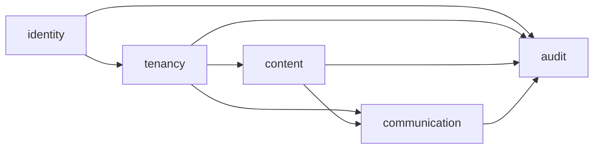
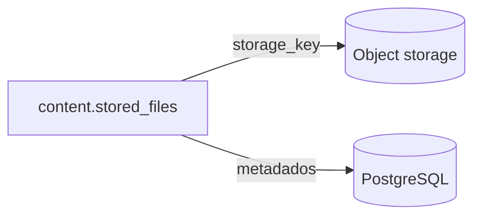

# Modelo lógico do banco

## 1. Estado

Este documento define fronteiras e inventário inicial. Colunas e constraints serão
consolidadas domínio por domínio no dicionário antes de virarem migração.

## 2. Schemas e dependências

Dependências inversas devem ser evitadas. `identity` não conhece conceitos de
orquestra; `tenancy` pode referenciar contas; conteúdo e comunicação referenciam
perfis da orquestra.

## 3. Inventário inicial

O inventário é provisório até a ficha de cada domínio ser aprovada.

### `identity`

- `accounts`;
- `account_credentials`;
- `email_verification_tokens`;
- `password_reset_tokens`;
- `sessions`;
- `mfa_methods`;
- `mfa_recovery_codes`.

### `tenancy`

- `orchestras`;
- `orchestra_profiles`;
- `invitations`;
- `invitation_assignments`;
- `profile_field_definitions`;
- `profile_field_values`;
- `spaces`;
- `space_memberships`;
- `voices`;
- `default_voice_assignments`.

### `content`

- `resource_nodes`;
- `libraries`;
- `folders`;
- `works`;
- `distribution_slots`;
- `work_voice_assignments`;
- `materials`;
- `stored_files`;
- `access_grants`;
- `change_requests`;
- `publication_batches`;
- `publication_items`.

### `communication`

- `priority_levels`;
- `notification_templates`;
- `announcements`;
- `announcement_targets`;
- `comments`;
- `reactions`;
- `polls`;
- `poll_options`;
- `poll_votes`;
- `acknowledgements`;
- `notifications`.

### `audit`

- `orchestra_audit_events`;
- `platform_audit_events`;
- `impersonation_sessions`.

## 4. Separação entre binário e metadado

PostgreSQL guarda identidade, nome original, MIME, tamanho, hash, estado e chave
opaca. O binário nunca é armazenado em `bytea` na V1.

## 5. Próxima modelagem

O primeiro domínio será `identity`, seguido de `tenancy`. Isso evita modelar
conteúdo antes de sabermos exatamente como conta, perfil, organização, convite e
sessão se relacionam.

