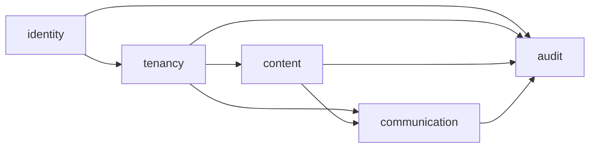
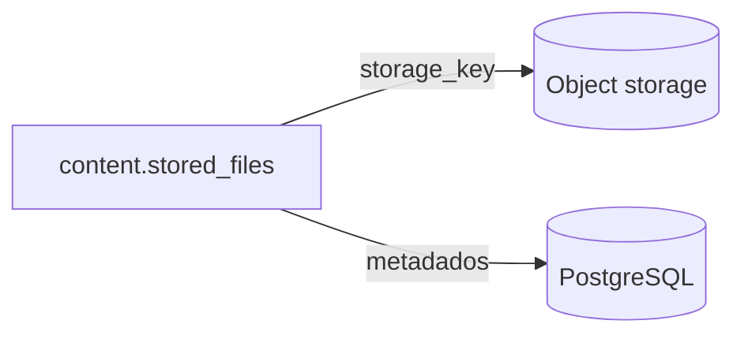
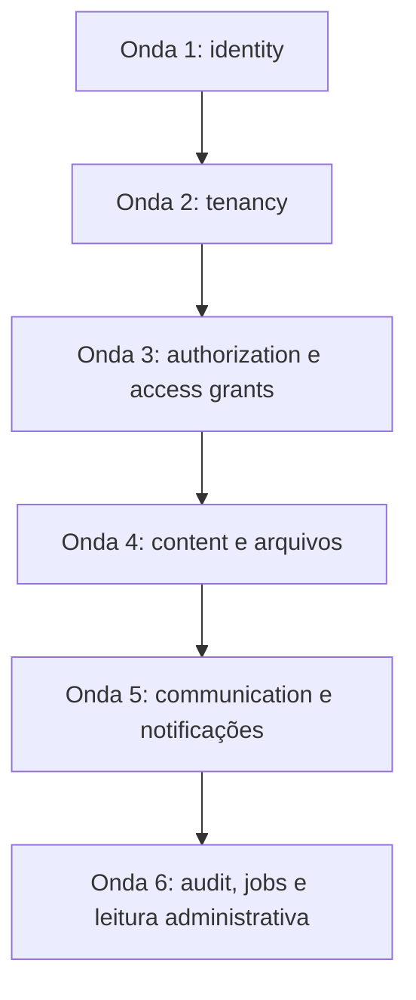

# Modelo lógico do banco

## 1. Estado

Status: Em modelagem P2

Este documento define fronteiras, inventário e ordem de consolidação do modelo
lógico. Colunas e constraints são consolidadas domínio por domínio no dicionário
antes de virarem migração.

O modelo lógico nasce da matriz aceita de
[capacidades, permissões e casos de uso](../../product/capabilities-permissions-and-use-cases.md).
Nenhuma tabela deve existir apenas porque “parece útil”; ela precisa sustentar uma
regra, consulta, auditoria, segurança ou operação documentada.

## 2. Schemas e dependências

Dependências inversas devem ser evitadas. `identity` não conhece conceitos de
orquestra; `tenancy` pode referenciar contas; conteúdo e comunicação referenciam
perfis da orquestra.

## 3. Inventário inicial

O inventário é provisório até a ficha de cada domínio ser aprovada.

### `identity`

- `accounts`;
- `account_credentials`;
- `email_verification_tokens`;
- `password_reset_tokens`;
- `auth_challenges`;
- `sessions`;
- `mfa_methods`;
- `mfa_recovery_codes`.

### `tenancy`

- `orchestras`;
- `orchestra_profiles`;
- `invitations`;
- `invitation_assignments`;
- `profile_field_definitions`;
- `profile_field_options`;
- `profile_field_values`;
- `spaces`;
- `space_memberships`;
- `voices`;
- `default_voice_assignments`.

### `content`

- `resource_nodes`;
- `libraries`;
- `folders`;
- `works`;
- `distribution_slots`;
- `work_voice_assignments`;
- `materials`;
- `stored_files`;
- `upload_batches`;
- `upload_batch_items`;
- `access_grants`;
- `access_blocks`;
- `change_requests`;
- `publication_batches`;
- `publication_items`;
- `download_access_logs`.

### `communication`

- `priority_levels`;
- `notification_templates`;
- `notification_template_variables`;
- `announcements`;
- `announcement_targets`;
- `announcement_collaborators`;
- `announcement_attachments`;
- `comments`;
- `comment_revisions`;
- `reactions`;
- `polls`;
- `poll_options`;
- `poll_votes`;
- `acknowledgements`;
- `notifications`;
- `notification_items`.

### `audit`

- `orchestra_audit_events`;
- `platform_audit_events`;
- `impersonation_sessions`.

## 4. Separação entre binário e metadado

PostgreSQL guarda identidade, nome original, MIME, tamanho, hash, estado e chave
opaca. O binário nunca é armazenado em `bytea` na V1.

## 5. Ondas de modelagem

A modelagem será feita em ondas. Cada onda atualiza:

1. este inventário;
2. ficha do dicionário;
3. constraints principais;
4. RLS aplicável;
5. seeds mínimos;
6. implicações para migração inicial.

### Onda 1 — `identity`

Objetivo: fechar conta global, credenciais, tokens, sessões, MFA e desafios
pré-MFA/reauthentication.

Critério de pronto:

- conta não depende de tenant;
- e-mail normalizado é único;
- senha, token, CSRF e códigos MFA nunca são armazenados em texto puro;
- sessão completa não nasce antes de MFA obrigatório;
- troca de senha/e-mail revoga sessões conforme regra;
- admin master pode ser semeado sem hardcoded secreto em migração.

### Onda 2 — `tenancy`

Objetivo: fechar orquestras, perfis, convites, espaços, naipes, vozes,
lideranças, campos personalizados e formação padrão.

Critério de pronto:

- um perfil por conta/orquestra;
- nome visível único por orquestra;
- convite de uso único vinculado a e-mail;
- sala global obrigatória;
- último maestro/admin ativo protegido;
- liderança e responsabilidade são contextuais.

### Onda 3 — autorização e concessões

Objetivo: representar papéis, pesos, capacidades, bloqueios explícitos e escopos
de recurso sem espalhar regra em JSON opaco.

Esta onda não cria um schema físico `authorization`. O módulo de Autorização é
transversal, mas suas tabelas iniciais ficam em `content` porque miram recursos
de conteúdo (`resource_nodes`, `access_grants`, `access_blocks` e
`change_requests`). Essa decisão evita dependência circular e mantém as escritas
sob ownership claro.

Critério de pronto:

- regra de peso administrativo consultável;
- concessões herdáveis e diretas distinguíveis;
- bloqueio explícito do maestro representável;
- editor comum não ganha `MANAGE_ACCESS`;
- solicitações de alteração/exclusão possuem destino e aprovador.

### Onda 4 — conteúdo e arquivos

Objetivo: fechar bibliotecas, pastas, obras, plano de distribuição, materiais,
stored files, upload, publicação, lotes e download.

Critério de pronto:

- número de obra único por biblioteca;
- rascunho, publicado, retirado e excluído possuem estados claros;
- plano de distribuição guarda fotografia da formação;
- arquivo físico é metadado no banco e binário no object storage;
- upload em lote possui itens rastreáveis e sugestões revisáveis;
- publicação em lote é idempotente por lote/item;
- logs técnicos de download são temporários e restritos.

### Onda 5 — comunicação e notificações

Objetivo: fechar comunicados, públicos, interações, ciência, enquetes, reações,
anexos e notificações persistentes.

Critério de pronto:

- visibilidade e notificação são separadas;
- anonimato de comentário não vaza em API de negócio;
- ciência acompanha público efetivo atual;
- notificações são idempotentes;
- templates usam variáveis por allowlist, sem expressão arbitrária;
- anexos usam `content.stored_files` e seguem upload seguro;
- expiração bloqueia acesso do músico inclusive por link direto.

### Onda 6 — auditoria, jobs e leitura administrativa

Objetivo: fechar eventos append-only, impersonação, jobs transacionais,
dead-letter/retries e consultas cruzadas somente leitura.

Critério de pronto:

- auditoria operacional não revela log privado de impersonação;
- job criado na mesma transação da ação principal;
- retry não duplica notificação, e-mail ou exclusão;
- camada de leitura não executa mutações;
- tabelas de auditoria não sofrem cascade destrutivo.
