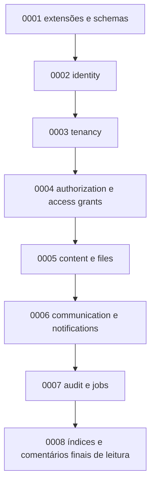

# Migrações e seeds

Status: Proposto para P2

Última revisão: 2026-07-09

Este documento define como o schema físico do PostgreSQL será criado e evoluído.
Ele complementa [Convenções](conventions.md), [Modelo lógico](logical-model.md) e
[Dicionário de dados](dictionary/README.md).

## 1. Princípios

1. Migração é código de infraestrutura, não anotação.
2. Migração compartilhada não é reescrita para esconder mudança.
3. Toda tabela nasce com constraints, comentários e RLS aplicável.
4. Seed não contém segredo real.
5. Seed cria ambiente útil, mas não substitui teste.
6. Rollback destrutivo não é presumido seguro.
7. Toda mudança de banco precisa ser rastreável à regra de produto, ADR ou
   decisão operacional.

## 2. Tipos de script

| Tipo | Finalidade | Ambiente |
|---|---|---|
| Migração estrutural | Criar/alterar schemas, tabelas, constraints, índices e comentários | Todos |
| Seed base | Dados mínimos estruturais sem segredo | Desenvolvimento, teste e bootstrap controlado |
| Seed demo | Dados fictícios para navegação e showcase | Desenvolvimento local |
| Seed teste | Dados pequenos e determinísticos para testes automatizados | Testes |
| Script operacional | Correção ou manutenção pontual aprovada | Conforme incidente/necessidade |

## 3. Ordem inicial prevista

A numeração exata será definida quando o repositório de código existir. A ordem
conceitual acima orienta dependências e revisão.

Na etapa `0004`, “authorization e access grants” não significa criar um schema
físico `authorization`. As tabelas iniciais ficam em `content` porque protegem
recursos de conteúdo, enquanto a escrita e a regra pertencem ao módulo de
Autorização.

Na etapa `0005`, o binário de arquivos não entra no PostgreSQL. A migração cria
metadados, estados, vínculos e logs técnicos temporários; o object storage é
provisionamento operacional separado.

Na etapa `0006`, comunicados e notificações separam visibilidade atual de
notificação histórica. Anexos referenciam `content.stored_files`; templates usam
variáveis por allowlist estruturada; notificações são idempotentes por
destinatário e evento.

## 4. Conteúdo obrigatório de uma migração que cria tabela

Toda migração que cria tabela deve incluir:

- `CREATE TABLE`;
- chave primária;
- FKs com `ON DELETE` explícito;
- `CHECK` para estados fechados;
- `UNIQUE` no escopo correto;
- índices necessários para constraints e consultas iniciais;
- `ALTER TABLE ... ENABLE ROW LEVEL SECURITY`, quando aplicável;
- políticas RLS ou justificativa de ausência;
- `COMMENT ON TABLE`;
- `COMMENT ON COLUMN` para colunas de negócio, sensibilidade, unidade ou estado.

## 5. RLS e contexto

Tabelas globais de `identity` não recebem `orchestra_id` e não usam política de
tenant. Ainda assim, acesso a elas é mediado pela aplicação e por funções
controladas quando necessário.

Tabelas tenant-scoped:

- possuem `orchestra_id NOT NULL`;
- usam FK composta quando referenciam outro dado tenant-scoped;
- têm RLS habilitado;
- falham fechadas quando `app.orchestra_id` não está definido;
- possuem testes de isolamento.

## 6. Dados iniciais

### Seed base

Pode criar:

- níveis padrão de prioridade por orquestra recém-criada;
- modelos iniciais de notificação;
- sala global automática durante fluxo de criação de orquestra;
- registros técnicos de configuração sem segredo.

Não pode criar:

- senha real;
- token de convite, reset ou sessão em texto puro;
- e-mail real de pessoa;
- arquivo real privado;
- dado de orquestra específica como se fosse regra de plataforma.

### Admin master

O admin master inicial não deve nascer de senha hardcoded em migração.

Estratégias aceitáveis:

1. comando operacional de bootstrap com e-mail informado por variável segura;
2. convite técnico de uso único emitido em ambiente controlado;
3. seed local fictício apenas para desenvolvimento.

Produção deve registrar o bootstrap em auditoria técnica.

## 7. Idempotência e ambientes

Migrações estruturais são aplicadas uma vez e registradas em tabela própria do
runner escolhido. Seeds podem ser idempotentes quando fizer sentido, usando chaves
naturais claras ou marcadores de versão.

Ambientes:

| Ambiente | Migrações | Seeds |
|---|---|---|
| Desenvolvimento local | Todas | base + demo opcional |
| Testes automatizados | Todas em banco descartável | teste determinístico |
| Homologação | Todas | base controlada |
| Produção | Todas aprovadas | bootstrap mínimo e explícito |

## 8. Alterações destrutivas

Mudança destrutiva inclui:

- remover tabela ou coluna;
- alterar tipo com perda de informação;
- reduzir limite de campo;
- apagar dados;
- mudar semântica de status;
- remover índice usado por consulta crítica.

Regra:

1. criar nova estrutura;
2. migrar dados com script auditável;
3. executar dupla escrita/leitura compatível quando necessário;
4. validar;
5. remover estrutura antiga em release posterior;
6. documentar no changelog.

## 9. Testes mínimos de migração

Antes de considerar o banco pronto para código:

1. aplicar migrações em banco vazio;
2. aplicar seeds de teste;
3. validar constraints principais;
4. validar RLS por tenant;
5. validar que tokens/segredos não aparecem em texto puro;
6. validar rollback lógico de scripts operacionais, quando aplicável;
7. gerar tipos Kysely contra o banco migrado;
8. conferir dicionário e `COMMENT ON`.

## 10. Relação com o dicionário

Uma tabela só está completa quando sua ficha no dicionário documenta:

- finalidade;
- ciclo de vida;
- colunas;
- constraints;
- RLS;
- auditoria;
- índices;
- consultas principais;
- retenção;
- migração de origem.

Se migração, dicionário e `COMMENT ON` divergirem, a divergência é bug de
documentação ou migração e precisa ser corrigida antes de seguir.
