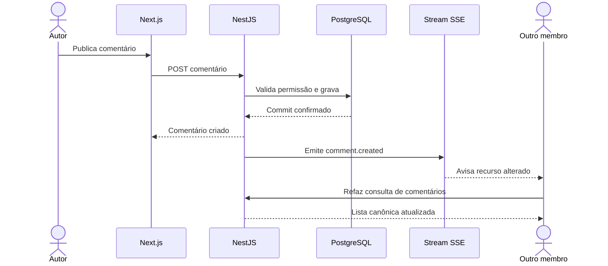

# ADR-0009 — Dados frontend, tempo real e estado de uploads

- Estado: Aceito
- Data: 2026-07-02

## Contexto

O frontend precisa combinar renderização inicial eficiente, operações
administrativas interativas, comentários atualizados quase instantaneamente e
uploads em lote que sobrevivam à navegação interna. A V1 não inclui chat,
presença ou edição colaborativa, portanto uma conexão bidirecional permanente
seria complexidade desnecessária.

## Decisão

### Acesso a dados

- NestJS é a única API de negócio e a única aplicação que acessa o banco;
- Next.js consome a API por rotas de mesma origem em `/api/v1`;
- OpenAPI gera o cliente TypeScript compartilhado;
- Server Components são o padrão para leitura e composição inicial;
- Client Components ficam nas bordas realmente interativas;
- TanStack Query gerencia estado remoto interativo, cache e invalidação;
- estado de filtro, busca, ordenação e paginação administrativa fica na URL;
- estado transitório ou sensível nunca é colocado na URL;
- Redux não será introduzido na V1 sem um caso de uso concreto.

### Atualizações quase instantâneas

- a V1 utiliza Server-Sent Events (SSE) para eventos do servidor ao navegador;
- gravações continuam usando HTTP comum (`POST`, `PATCH` e `DELETE`);
- após confirmar a gravação, a API emite um evento pequeno de invalidação;
- o cliente invalida a consulta afetada e busca o estado canônico novamente;
- cada janela mantém um stream autenticado para a orquestra ativa;
- ao trocar de orquestra, o stream anterior é encerrado;
- a conexão utiliza cookie de sessão e rota contextual, sem token secreto na URL;
- notificações persistentes ficam no banco; SSE é aceleração de interface, não
  mecanismo de durabilidade;
- reconexão provoca sincronização de notificações e consultas relevantes;
- WebSockets ficam reservados para funcionalidades futuras bidirecionais, como
  chat, presença e indicador de digitação.

Eventos iniciais incluem notificações, comentários, reações, enquetes e mudanças
de publicação ou acesso. O payload identifica evento e recurso, mas não carrega
conteúdo sensível completo.

### Upload em lote

- um gerenciador de uploads vive no shell autenticado da orquestra;
- navegar entre páginas do Concentus mantém fila, progresso e painel global;
- cada arquivo possui estado independente: fila, enviando, processando, concluído
  ou falha;
- falhar um arquivo não desfaz os demais;
- recarregar ou fechar a aba interrompe bytes ainda não enviados na V1;
- processamento já entregue ao servidor continua mesmo sem a aba aberta;
- ao tentar sair com transferências ativas, a interface apresenta aviso;
- a API preserva os registros concluídos e permite tentar novamente os falhos;
- na V1, uma transferência interrompida recomeça do início, sem repetir arquivos
  já concluídos.

## Fluxo de comentários

## Consequências positivas

- comentários e notificações parecem imediatos sem antecipar a arquitetura do
  chat;
- a perda de um evento SSE não perde dados, pois o banco continua autoritativo;
- filtros administrativos aceitam recarregar, voltar e compartilhar a visão;
- maestro acompanha vários arquivos enquanto continua usando a plataforma;
- o cliente gerado reduz divergência entre contrato e frontend.

## Custos e cuidados

- proxies precisam permitir streaming e desabilitar buffering na rota SSE;
- a interface precisa reconciliar resposta da escrita e evento posterior sem
  duplicar itens;
- reconexões e expiração de sessão devem ser testadas;
- uploads ativos ainda dependem da aba na V1;
- parâmetros de URL precisam de validação e valores padrão estáveis.

## Alternativas rejeitadas

- WebSockets na V1: maior custo operacional sem necessidade bidirecional atual;
- polling contínuo: mais requisições e maior atraso;
- Next.js acessando PostgreSQL: duplicaria fronteiras e regras de autorização;
- estado remoto global em Redux: sobreposição com a biblioteca de consultas;
- filtros somente em memória: perderiam estado ao atualizar ou compartilhar URL.
