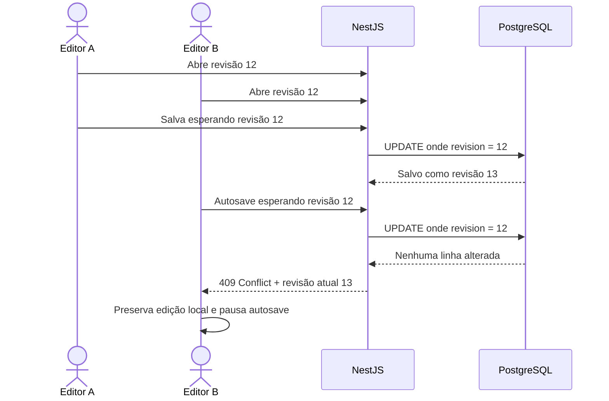

# ADR-0010 — Rascunhos, compartilhamento e edição concorrente

- Estado: Aceito
- Data: 2026-07-03

## Contexto

Obras, comunicados e lotes podem permanecer incompletos por bastante tempo e
recebem autosave. O autor pode querer trabalhar sozinho ou convidar outras
pessoas. Como usuários autorizados também podem editar o mesmo recurso, duas
sessões não podem sobrescrever silenciosamente o trabalho uma da outra.

## Decisão

### Visibilidade

- um novo rascunho é privado para o autor por padrão;
- a existência e o conteúdo não são expostos aos demais editores apenas porque
  eles possuem acesso à biblioteca, sala ou recurso pai;
- o autor pode conceder visualização ou edição a pessoas autorizadas;
- depois da concessão, aplicam-se hierarquia, pesos e limites normais do recurso;
- compartilhar o rascunho não equivale a publicá-lo aos destinatários finais;
- suporte técnico excepcional continua sujeito às regras de impersonação e
  auditoria.

### Concorrência

- cada rascunho possui número de revisão monotônico;
- toda escrita informa a revisão que o editor carregou;
- a API atualiza somente se a revisão esperada ainda for a atual;
- sucesso incrementa a revisão e devolve o novo valor;
- divergência retorna conflito, sem gravar por cima da versão mais recente;
- a interface preserva as alterações locais, pausa o autosave e oferece comparar,
  copiar o conteúdo local ou recarregar a versão atual;
- a V1 não faz mesclagem automática nem edição colaborativa caractere a caractere;
- sobrescrever depois de um conflito exige decisão explícita, nova autorização e
  nova escrita baseada na revisão atual.

### Retenção

- rascunhos de negócio não expiram automaticamente na V1;
- uploads incompletos e arquivos órfãos não são rascunhos de negócio;
- a orquestra configura o prazo de limpeza desses arquivos técnicos;
- a antecedência do aviso também é configurável pelo maestro/admin;
- antes da exclusão, proprietários recebem notificação persistente com data e
  ação disponível;
- se o proprietário estiver inativo, a pendência é encaminhada aos
  maestros/admins da orquestra;
- exclusão e eventual cancelamento ficam registrados no histórico técnico.

## Concorrência otimista

## Consequências positivas

- o autor controla quem participa antes da publicação;
- nenhuma colisão apaga trabalho silenciosamente;
- o mecanismo funciona em uma ou várias instâncias da API;
- autosave e edição manual obedecem ao mesmo contrato;
- conteúdo de negócio não desaparece por uma política automática de limpeza.

## Custos e cuidados

- tabelas editáveis precisam armazenar e documentar a revisão;
- todos os comandos de alteração precisam enviar a revisão esperada;
- a experiência de conflito precisa ser projetada e testada no Storybook;
- a política configurável de limpeza precisa de limites operacionais seguros;
- notificações de limpeza devem ser idempotentes para evitar duplicação.

## Alternativas rejeitadas

- liberar todo rascunho a qualquer editor do recurso pai: retiraria o controle do
  autor;
- último salvamento vence: poderia apagar trabalho sem aviso;
- bloqueio exclusivo durante toda a edição: ficaria vulnerável a abas abandonadas;
- mesclagem automática na V1: custo alto para formulários estruturados e anexos;
- expiração automática de todo rascunho: poderia excluir trabalho legítimo.
