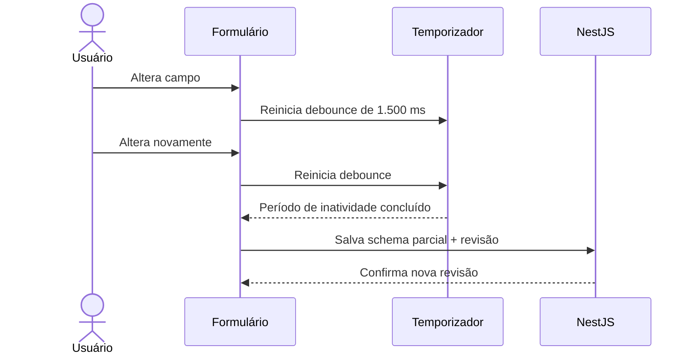

# ADR-0011 — Validação compartilhada e temporização do autosave

- Estado: Aceito
- Data: 2026-07-03

## Contexto

Next.js e NestJS precisam interpretar os mesmos payloads sem duplicar formatos,
campos obrigatórios e limites básicos. Os formulários longos também precisam
salvar com frequência suficiente para proteger o trabalho, mas não podem enviar
uma requisição a cada tecla.

## Decisão

### Schemas e formulários

- Zod 4 define os schemas de transporte compartilhados;
- schemas ficam em `packages/contracts`, organizados por domínio e operação;
- tipos TypeScript são inferidos dos schemas, não repetidos manualmente;
- React Hook Form controla estado, campos e erros dos formulários no Next.js;
- NestJS valida todo input não confiável com um pipe baseado em Zod;
- validação no navegador melhora a experiência, mas nunca substitui a validação
  da API;
- regras dependentes de banco, autorização, hierarquia ou estado atual pertencem
  aos casos de uso do NestJS, não aos schemas compartilhados;
- schemas de transporte devem ser representáveis em JSON Schema/OpenAPI;
- OpenAPI incorpora os schemas e continua gerando o cliente TypeScript da API;
- parâmetros simples de rota podem continuar usando pipes explícitos do NestJS.

Um schema parcial aceita rascunhos incompletos. Publicar utiliza o schema completo
e executa também todas as regras de negócio no servidor.

### Autosave

- alterações aguardam `1.500 ms` de inatividade antes do autosave;
- nova alteração reinicia essa espera;
- trocar de etapa força imediatamente o salvamento pendente;
- publicar ou concluir também força o salvamento e aguarda sua confirmação;
- apenas uma gravação de autosave por rascunho fica em trânsito por vez;
- mudanças ocorridas durante uma gravação formam o próximo salvamento;
- falha não apaga o estado local e aciona nova tentativa controlada;
- conflitos de revisão seguem o ADR-0010 e não são repetidos automaticamente.

### Momento de exibição dos erros

- enquanto um campo ainda não foi visitado, a interface não antecipa erros;
- ao sair do campo, ele é validado e sua mensagem pode ser exibida;
- depois que um campo apresentou erro, novas alterações podem revalidá-lo para
  remover a mensagem assim que a correção for válida;
- avançar de etapa valida os campos relevantes daquela etapa;
- publicar ou concluir valida o formulário completo;
- erros devolvidos pela API são associados aos campos quando possível;
- erros gerais aparecem em resumo acessível e levam o foco ao ponto apropriado;
- a API sempre executa novamente validação estrutural, autorização e regras de
  negócio, mesmo que o navegador considere o formulário válido.

## Fluxo do autosave

## Consequências positivas

- formato e validação estrutural possuem uma fonte de verdade;
- frontend e backend recebem os mesmos nomes, tipos e limites;
- OpenAPI e cliente gerado permanecem alinhados ao contrato;
- autosave reduz risco de perda sem sobrecarregar a API a cada tecla;
- rascunho incompleto e conteúdo publicável têm exigências distintas e claras.

## Custos e cuidados

- schemas compartilhados não podem importar React, NestJS, banco ou serviços;
- tipos que não possuem representação OpenAPI direta exigem formato de transporte
  explícito;
- regras de domínio continuam precisando de testes próprios no backend;
- o pipeline deve falhar se contrato OpenAPI ou cliente gerado estiverem
  desatualizados;
- mensagens precisam ser compreensíveis, acessíveis e independentes apenas de
  cor para comunicar o problema.

## Alternativas rejeitadas

- class-validator no backend e Zod no frontend: duplicaria regras estruturais;
- validar somente no navegador: não estabelece fronteira de segurança;
- validar somente no servidor: pioraria a experiência de formulários longos;
- salvar a cada tecla: aumentaria tráfego, colisões e gravações sem benefício;
- autosave apenas ao sair da página: deixaria uma janela grande de perda.
