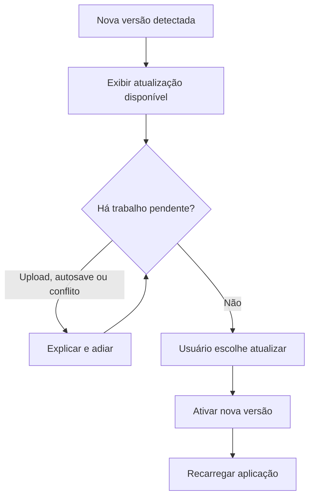

# ADR-0012 — Cache, instalação e atualizações da PWA

- Estado: Aceito
- Data: 2026-07-03

## Contexto

O Concentus será uma PWA, mas acesso offline a partituras não faz parte da V1.
Arquivos e respostas da API contêm dados privados por tenant. A aplicação também
precisa receber novas versões sem interromper upload, autosave ou edição local.

## Decisão

### Cache e arquivos privados

- o service worker armazena somente o shell e os arquivos estáticos versionados
  da aplicação;
- respostas autenticadas da API, PDFs, imagens, áudios e URLs assinadas não são
  persistidos para uso offline pela PWA;
- conteúdo privado utiliza cabeçalhos de cache compatíveis com essa política;
- sem conexão, a V1 exibe uma página informativa e não simula dados desatualizados;
- sincronização offline, fila de mutações e biblioteca offline ficam para uma
  versão posterior.

Download explícito é uma ação diferente de cache offline. Quando o autor ou
gestor autorizado permitir, o usuário pode baixar uma cópia pelo navegador. O
arquivo passa ao armazenamento controlado pelo dispositivo, fora da gestão do
Concentus, e não pode ser revogado remotamente.

- cada biblioteca define o padrão de download para seus materiais;
- cada material pode `herdar`, `permitir` ou `bloquear` explicitamente;
- autor, maestro/admin ou pessoa com `Gerenciar acesso` pode mudar essa política
  dentro de sua autoridade;
- permissão simples de edição não inclui alterar download;
- a V1 não apresenta ao maestro relatório de quem baixou;
- emissão de credencial e tentativa de download geram somente log técnico de
  segurança, com acesso restrito e retenção padrão de 90 dias;
- somente o admin master pode alterar globalmente esse prazo.

Ocultar o botão de download reduz a distribuição casual, mas não constitui DRM:
qualquer conteúdo visualizado já foi transmitido ao dispositivo e pode ser
capturado por meios externos.

### Instalação

- a instalação nunca é obrigatória para utilizar a plataforma;
- a aplicação respeita a experiência nativa de cada navegador;
- uma sugestão própria pode aparecer discretamente após uso recorrente e somente
  quando o dispositivo for elegível;
- a sugestão é dispensável e não reaparece de forma insistente;
- limitações de instalação, especialmente no iOS, são explicadas sem bloquear o
  acesso pela web.

### Atualização da aplicação

- uma nova versão pronta exibe `Atualização disponível`;
- a aplicação nunca recarrega automaticamente uma sessão em uso;
- atualização não pode interromper upload, salvamento pendente, alterações locais
  ou resolução de conflito;
- em estado seguro, o usuário pode aplicar a atualização e recarregar;
- com trabalho pendente, a interface explica o bloqueio e permite atualizar
  depois;
- assets antigos são descartados com segurança após ativação da nova versão;
- API e frontend mantêm compatibilidade durante a janela necessária à atualização
  de abas ainda abertas.

## Fluxo de atualização

## Consequências positivas

- conteúdo privado não vira cache offline invisível;
- download autorizado continua disponível como ação consciente;
- instalação permanece opcional e não atrapalha o primeiro acesso;
- novas versões não destroem trabalho em andamento;
- a política da V1 deixa espaço para offline seguro no futuro.

## Custos e cuidados

- service worker e cabeçalhos de cache precisam de testes automatizados;
- navegador e sistema controlam o destino e a retenção de downloads;
- alterações no prazo do log técnico são auditadas e não restauram eventos já
  descartados;
- backend precisa tolerar temporariamente clientes da versão anterior;
- estados que bloqueiam atualização devem existir numa coordenação central;
- acesso offline futuro exigirá criptografia, revogação e sincronização próprias.

## Alternativas rejeitadas

- cachear respostas privadas para melhorar velocidade: risco de exposição e
  comportamento offline não projetado;
- tratar download como cache da PWA: retiraria o controle explícito do usuário;
- solicitar instalação no primeiro acesso: interromperia login e convite;
- recarregar automaticamente ao publicar versão: poderia perder trabalho;
- manter indefinidamente qualquer versão antiga: aumentaria risco e complexidade.
