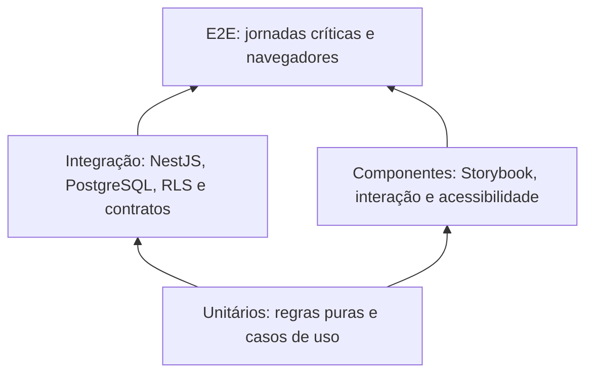

# ADR-0014 — Estratégia de testes e gates de qualidade

- Estado: Aceito
- Data: 2026-07-03

## Contexto

O monorepo reúne Next.js, NestJS, contratos Zod, PostgreSQL com RLS definida e um
catálogo Storybook. Uma coleção de ferramentas sem divisão de responsabilidades
criaria testes lentos, duplicados ou incapazes de detectar erros reais do banco e
da autorização multi-tenant.

## Decisão

### Ferramentas

- Vitest é o runner de testes unitários e de integração do monorepo;
- NestJS usa Vitest com compilação compatível com decorators e metadata;
- Storybook com addon Vitest testa componentes, interações e acessibilidade;
- Playwright testa jornadas completas no navegador;
- verificações automatizadas de acessibilidade usam axe nas stories e fluxos
  representativos, sem substituir avaliação manual;
- contratos OpenAPI e cliente gerado possuem verificação própria contra drift.

### Banco de integração

- testes de persistência usam PostgreSQL real, descartável e da major suportada;
- Testcontainers for Node.js é o provisionador padrão;
- `TEST_DATABASE_URL` permite usar PostgreSQL externo preparado para testes;
- uma URL externa exige ambiente de teste explícito e verificações que impeçam
  apontar para produção ou banco não descartável;
- SQLite e bancos em memória não substituem integração PostgreSQL;
- migrações são aplicadas desde uma base vazia;
- testes exercitam constraints, índices relevantes, transações, isolamento de
  tenant e RLS com papéis reais;
- dados de teste são determinísticos e isolados entre suítes ou workers;
- mocks de repositório são permitidos em testes unitários, não como prova da
  integração com banco.

### Cobertura

- linhas, funções e statements: mínimo global de 80%;
- branches: mínimo global de 75%;
- módulos críticos de segurança: mínimo de 90% de branches;
- autenticação, tenant context/RLS, autorização, convites, impersonação e download
  são inicialmente classificados como críticos;
- o piso funciona como ratchet: pode aumentar, mas não diminuir sem nova decisão
  arquitetural justificada;
- código gerado, declarações de tipo e migrações declarativas podem ser excluídos
  da métrica, mas continuam cobertos por geração, compilação e testes de integração;
- atingir o percentual não substitui os cenários explícitos de segurança.

### Pipeline por evento

Em cada pull request:

1. formatação/lint;
2. verificação TypeScript;
3. contratos e artefatos gerados atualizados;
4. testes unitários;
5. testes de componentes e acessibilidade;
6. testes de integração com PostgreSQL;
7. E2E crítico em Chromium.

O conjunto E2E crítico inicial cobre:

- login, convite e recuperação de senha;
- isolamento entre orquestras;
- publicação de material e acesso posterior do músico;
- limites de atuação entre líder e maestro/admin;
- comunicado, comentário e confirmação de ciência.

Cada jornada inclui o caminho principal e ao menos a negação de segurança que
representa seu maior risco. Demais combinações permanecem preferencialmente nos
testes unitários e de integração, evitando transformar o E2E em uma suíte
combinatória lenta.

Na branch principal e em releases, acrescentar:

- E2E em Chromium, Firefox e WebKit;
- projetos desktop e mobile representativos;
- build de produção;
- verificações de migração e instalação limpa;
- revisão manual definida para os fluxos de release.

## Pirâmide do projeto

Não se exige que todo comportamento passe por todas as camadas. Cada risco deve
ser coberto na camada mais baixa capaz de prová-lo com confiança.

## Consequências positivas

- um único runner cobre a maior parte do TypeScript;
- falhas específicas de PostgreSQL e RLS aparecem antes da produção;
- componentes do showcase também são artefatos testáveis;
- PRs recebem retorno rápido, enquanto a matriz cara fica na branch principal;
- jornadas críticas possuem prova no navegador real automatizado.

## Custos e cuidados

- integração exige runtime compatível com Testcontainers ou PostgreSQL de teste
  fornecido explicitamente;
- matriz completa consome mais tempo e armazenamento de artefatos;
- testes E2E precisam de dados e relógio controláveis;
- Playwright WebKit não substitui integralmente Safari/iOS em dispositivo real;
- testes instáveis devem ser corrigidos, não mascarados por repetição indefinida;
- paralelismo e particionamento ainda precisam de política detalhada.

## Alternativas rejeitadas

- Jest no backend e Vitest no frontend: dois runners sem necessidade atual;
- SQLite para integração: esconderia diferenças de SQL, tipos, transações e RLS;
- somente E2E: execução lenta e diagnóstico difícil;
- somente unitários: não provaria integração, contratos ou autorização no banco;
- matriz completa em toda alteração: custo alto para o primeiro ciclo de feedback;
- tratar WebKit automatizado como Safari real: equivalência incompleta.
