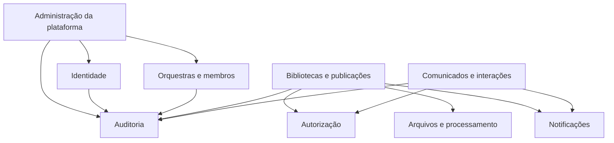

# ADR-0015 — Backend modular, propriedade de dados e efeitos assíncronos

- Estado: Aceito
- Data: 2026-07-03

## Contexto

O NestJS será um monólito modular. Sem fronteiras explícitas, módulos podem virar
apenas diretórios enquanto qualquer serviço consulta e altera qualquer tabela.
Também é necessário separar o que precisa ser atomicamente confirmado daquilo que
pode ocorrer depois, como notificação, e-mail e processamento de arquivo.

## Decisão

### Módulos iniciais

1. Identidade e autenticação;
2. Orquestras e membros;
3. Autorização;
4. Bibliotecas e publicações;
5. Arquivos e processamento;
6. Comunicados e interações;
7. Notificações;
8. Auditoria;
9. Administração da plataforma.

### Propriedade e dependências

- toda tabela possui exatamente um módulo proprietário;
- schemas PostgreSQL agrupam domínios amplos e não substituem a propriedade por
  módulo;
- somente o proprietário executa escritas diretas em suas tabelas;
- outro módulo utiliza a API pública de aplicação, uma porta definida ou um evento;
- módulos não importam controllers, repositories internos ou implementações
  privadas de outro módulo;
- consultas cruzadas são permitidas numa camada de leitura própria, sem autoridade
  para alterar dados;
- uma consulta cruzada continua aplicando tenant, RLS e projeção segura;
- módulo de orquestração, como Administração da plataforma, pode não possuir toda
  tabela que coordena;
- dependências circulares são defeitos arquiteturais e não são resolvidas com
  `forwardRef()` por conveniência.

### Transação e assincronismo

- a transação pertence ao caso de uso que representa a operação principal;
- estado principal, invariantes e auditoria crítica são confirmados atomicamente;
- notificação, e-mail, miniatura, análise e limpeza são efeitos posteriores;
- efeitos assíncronos só começam depois do commit;
- jobs carregam explicitamente `orchestra_id`, ator, correlação e versão do evento;
- consumidores são idempotentes e toleram entrega repetida;
- falha de efeito posterior não desfaz uma operação principal já confirmada;
- a interface recebe estado claro como `processando` quando o efeito ainda não
  terminou.

## Mapa inicial

As setas representam uso de contrato público, não acesso irrestrito à
implementação nem escrita direta na tabela do destino.

## Consequências positivas

- localização de regra e tabela fica previsível;
- extração futura de módulo permanece possível sem começar com microserviços;
- consultas administrativas continuam eficientes no mesmo PostgreSQL;
- falha de e-mail ou miniatura não prende a transação principal;
- auditoria crítica não fica sujeita a uma fila posterior incerta.

## Custos e cuidados

- APIs internas e ownership precisam ser revisados no código e no dicionário;
- alguns casos de uso exigirão coordenação explícita entre módulos;
- consultas cruzadas precisam impedir que conveniência vire escrita cruzada;
- entrega confiável de efeitos após commit ainda exige escolher mecanismo de
  outbox e processamento;
- módulos muito pequenos ou genéricos devem ser evitados.

## Alternativas rejeitadas

- repositories globais compartilhados: eliminariam ownership e encapsulamento;
- microserviços desde a V1: custo operacional desproporcional;
- proibir todo join entre módulos: sacrificaria consultas sem ganho no monólito;
- executar e-mail e miniatura dentro da transação: aumentaria lock e fragilidade;
- publicar efeitos antes do commit: poderia notificar uma operação revertida;
- auditoria crítica somente assíncrona: abriria janela de perda da trilha.
