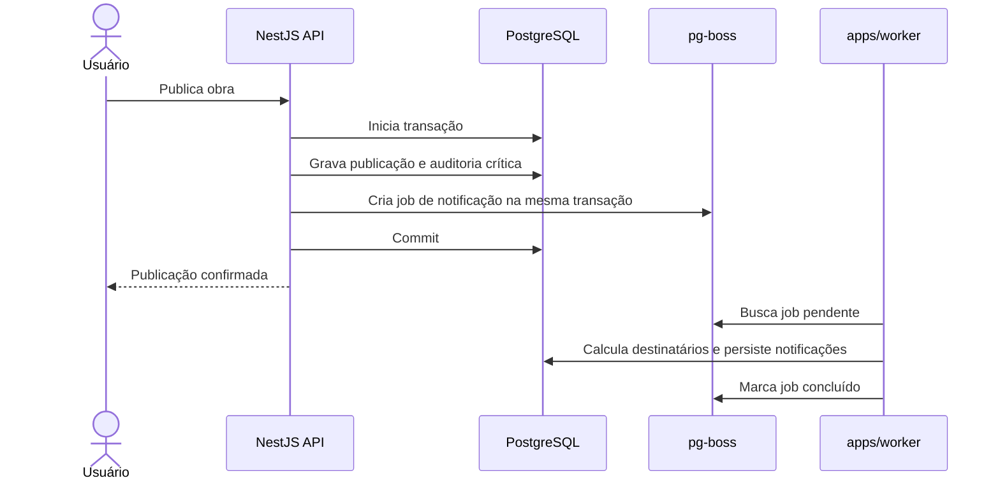

# ADR-0016 — Jobs assíncronos com pg-boss sobre PostgreSQL

- Estado: Aceito
- Data: 2026-07-08

## Contexto

O Concentus precisa executar efeitos posteriores ao commit: notificações,
e-mails, miniaturas, processamento de arquivos, limpezas, expirações e rotinas
agendadas. Esses efeitos não devem alongar a requisição do usuário, mas também
não podem ser “melhores esforços” que somem se o processo cair logo após salvar a
operação principal.

A V1 começa com escala pequena e infraestrutura enxuta. Adicionar Redis apenas
para filas aumentaria operação, backup, monitoramento e superfície de falha.

## Decisão

- a V1 usará `pg-boss` como fila de jobs;
- a fila fica no próprio PostgreSQL da aplicação;
- Redis/BullMQ não entram na infraestrutura obrigatória da V1;
- jobs são criados dentro da mesma transação da operação principal sempre que
  forem consequência direta dela;
- o commit torna visível tanto o estado principal quanto o job pendente;
- se a transação falhar, nem estado principal nem job são gravados;
- workers rodam em processo separado em `apps/worker`;
- no início, API e worker podem ficar no mesmo servidor, mas são processos
  independentes;
- workers podem ser escalados separadamente quando carga, agenda ou processamento
  exigirem;
- jobs carregam explicitamente `orchestra_id`, ator, correlação e payload mínimo;
- jobs não carregam segredo, arquivo bruto, token longo ou dado pessoal
  desnecessário;
- todo consumidor precisa ser idempotente;
- retries, backoff, dead letter e agendamento são configurados por tipo de job;
- falhas de job ficam observáveis e acionáveis, sem apagar a operação principal.

## Embasamento

- `pg-boss` declara suporte a PostgreSQL, criação de jobs dentro de transações
  existentes e adaptador para Kysely.
- `pg-boss` usa `SKIP LOCKED`, recurso do PostgreSQL voltado a reduzir contenção
  em cenários de fila.
- A documentação do PostgreSQL descreve `SKIP LOCKED` como útil para tabelas em
  formato de fila, embora inadequado para leituras gerais.
- BullMQ é maduro e poderoso, mas exige Redis/compatível como infraestrutura
  adicional.
- BullMQ recomenda jobs idempotentes para que retry não altere incorretamente o
  estado final; essa regra também será adotada no Concentus.

Referências:

- [pg-boss](https://github.com/timgit/pg-boss)
- [PostgreSQL `SKIP LOCKED`](https://www.postgresql.org/docs/current/sql-select.html)
- [BullMQ queues](https://docs.bullmq.io/guide/queues)
- [BullMQ idempotent jobs](https://docs.bullmq.io/patterns/idempotent-jobs)

## Fluxo transacional

## Regras por tipo de efeito

| Efeito | Confirmação e execução | Observação |
|---|---|---|
| Auditoria crítica | Mesma transação | Não depende da fila |
| Notificação interna | Job nasce na mesma transação e executa após commit | Deduplica destinatários |
| E-mail de convite/recuperação | Job nasce na mesma transação e executa após commit | Nunca guarda senha ou token longo no payload |
| Miniatura/preview | Job após upload recebido | Estado do arquivo fica `processando` |
| Limpeza de órfãos | Job agendado | Deve respeitar aviso prévio configurado |
| Expiração de comunicado | Job agendado ou varredura | Estado final confirmado no banco |

## Segurança

- worker não recebe permissão administrativa ampla por padrão;
- cada handler valida tenant, estado atual e autorização operacional aplicável;
- payload é considerado entrada não confiável, mesmo vindo do banco;
- jobs usam identificadores técnicos e buscam estado atual no banco;
- dead letter não pode expor segredo em painel, log ou erro;
- dashboards de fila, se adotados, ficam restritos ao admin master/técnico;
- job repetido não pode duplicar notificação, e-mail ou exclusão;
- toda ação relevante do worker registra auditoria ou log técnico apropriado.

## Consequências positivas

- menos infraestrutura obrigatória na V1;
- job e operação principal compartilham a mesma atomicidade de commit;
- backup e restauração do PostgreSQL preservam também a fila pendente;
- workers já nascem separados do runtime web;
- a plataforma continua apta a trocar para Redis/BullMQ no futuro, se a escala
  justificar.

## Custos e cuidados

- PostgreSQL passa a concentrar também carga de fila;
- filas muito volumosas exigirão índices, retenção e VACUUM bem observados;
- jobs longos devem buscar dados e liberar conexões rapidamente;
- processamento pesado de arquivo pode exigir throttling por tipo de job;
- pg-boss precisa ser incluído em backup, migração, monitoramento e alertas;
- a decisão reduz infraestrutura agora, mas não elimina disciplina de fila.

## Alternativas rejeitadas

- BullMQ/Redis na V1: tecnologia excelente, mas adiciona infraestrutura antes da
  necessidade real;
- fila em memória: perde jobs em reinício e não atende confiabilidade;
- executar efeitos dentro da requisição: aumenta latência e fragilidade;
- publicar evento fora da transação: cria risco de estado confirmado sem efeito
  pendente, ou efeito pendente sem estado confirmado;
- criar microserviço de jobs na V1: distribui prematuramente a arquitetura.
