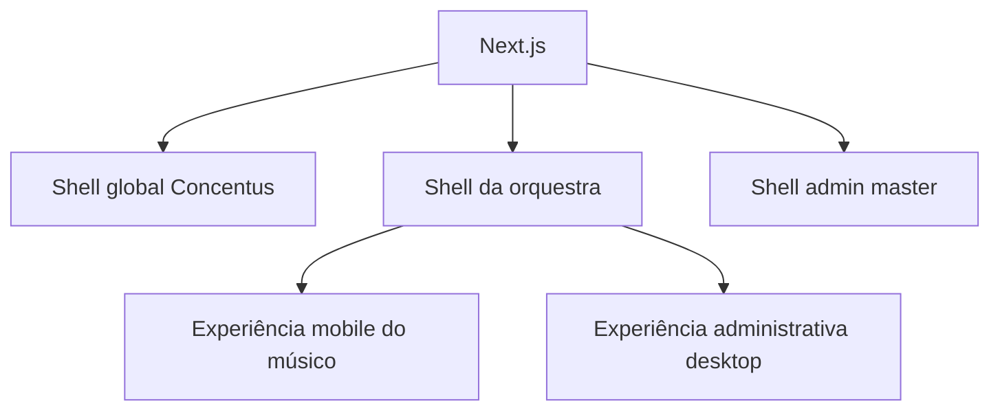

# Arquitetura frontend

## 1. Estado

| Área | Estado |
|---|---|
| Next.js App Router e React | Aceito no ADR-0005 |
| PWA responsiva | Aceito |
| Identidade visual única | Aceito no ADR-0007 |
| Modos claro e escuro | Aceito no ADR-0008 |
| Storybook/showcase | Aceito no ADR-0008 |
| Rotas por slug | Aceito no ADR-0008 |
| Tailwind e shadcn/ui | Aceito no ADR-0008 |
| Estratégia de dados/estado | Aceito no ADR-0009 |
| SSE e atualizações quase instantâneas | Aceito no ADR-0009 |
| Gerenciador global de uploads | Aceito no ADR-0009 |
| Formulários e validação | Definido no ADR-0011 |
| PWA, cache e atualizações | Definido no ADR-0012 |
| Acessibilidade e navegadores | Definido no ADR-0013 |
| Testes frontend | Definido no ADR-0014 |

## 2. Aplicações e pacotes

```text
apps/
├── web/                 Next.js e PWA
└── showcase/            Storybook

packages/
├── ui/                  Componentes próprios
├── design-tokens/       Identidade clara/escura
├── api-client/          Cliente gerado/tipado
├── contracts/           Schemas Zod e tipos de transporte
└── config/              ESLint, TypeScript e ferramentas
```

## 3. Princípios

1. mesma identidade em todos os tenants;
2. contexto de orquestra sem white-label;
3. mobile-first para consumo e desktop-first para operações em lote;
4. autorização nunca depende da interface;
5. componentes básicos não contêm regra de negócio;
6. estados de loading, vazio, erro e sucesso são projetados explicitamente;
7. acessibilidade e contraste valem nos modos claro e escuro;
8. mídia de tenant ocupa somente slots controlados.

## 4. Shells



- shell global: login, recuperação e seletor de orquestra;
- shell tenant: contexto da orquestra e funcionalidades de membros;
- shell master: administração técnica da plataforma;
- mobile e desktop compartilham componentes e casos de uso, alterando composição.

## 5. Documentos

- [Rotas e resolução de tenant](routing-and-tenant-resolution.md)
- [Design system e showcase](design-system-and-showcase.md)
- [Dados, estado, tempo real e uploads](data-state-and-realtime.md)
- [Formulários e rascunhos](forms-and-drafts.md)
- [PWA, cache e atualizações](pwa-cache-and-updates.md)
- [Acessibilidade e suporte a navegadores](accessibility-and-browser-support.md)

Testes integrados ao restante da aplicação estão em
[Estratégia de testes](../testing-strategy.md).
