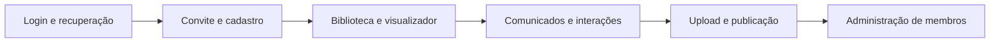

# Acessibilidade e suporte a navegadores

Este documento detalha a política viva definida no
[ADR-0013](../decisions/0013-accessibility-and-browser-support.md).

## 1. Meta

O Concentus tem como requisito WCAG 2.2 nível AA. Isso é uma meta de engenharia e
produto; não é uma alegação pública automática de conformidade.

## 2. Requisitos por componente

Todo componente interativo precisa documentar:

- nome, função, valor e estado expostos à tecnologia assistiva;
- ordem de foco e operação completa por teclado;
- foco visível nos temas claro e escuro;
- estados normal, hover, focus, disabled, loading, erro e sucesso;
- mensagem de erro associada ao campo correspondente;
- alvo de toque adequado e ausência de gesto obrigatório complexo;
- comportamento com zoom e texto ampliado;
- comportamento com `prefers-reduced-motion`;
- alternativa a informação apresentada apenas visualmente.

## 3. Fluxos manuais obrigatórios

Cada fluxo crítico é verificado com teclado. Uma amostra representativa também é
testada com leitor de tela em desktop e iOS, além de zoom e orientação mobile.

## 4. Conteúdo enviado

- controles do visualizador, título e ações precisam ser acessíveis;
- imagens institucionais exigem texto alternativo ou marcação decorativa;
- metadados textuais ajudam a identificar materiais;
- a plataforma não afirma que o interior de todo PDF, Word ou imagem enviada é
  acessível;
- orientações e validações adicionais para autores podem evoluir depois da V1.

## 5. Matriz de navegadores

| Ambiente | Janela suportada |
|---|---|
| Chrome desktop/Android | Major atual e anterior |
| Edge desktop | Major atual e anterior |
| Firefox desktop | Major atual e anterior |
| Safari macOS | Major atual e anterior |
| Safari iOS | Major atual e anterior |

A matriz é revisada a cada release. Firefox Android e navegadores fora da tabela
recebem melhor esforço, sem garantia formal na V1.

## 6. Experiência incompatível

- testar capacidades essenciais antes de bloquear;
- evitar uma lista rígida baseada apenas em `user-agent`;
- explicar qual recurso está ausente;
- oferecer atualização do navegador ou acesso por alternativa suportada;
- preservar login e conteúdo básico sempre que isso for seguro e funcional.

## 7. Critérios de aceite

1. todos os controles essenciais funcionam por teclado;
2. foco não fica oculto por cabeçalho, modal ou painel fixo;
3. temas claro e escuro atendem aos contrastes exigidos;
4. erro de formulário é anunciado e associado ao campo;
5. interface permanece utilizável com zoom e texto ampliado;
6. movimento não essencial é reduzido quando solicitado pelo sistema;
7. os fluxos críticos passam na matriz suportada;
8. ferramenta automática sem violações não dispensa revisão manual.
