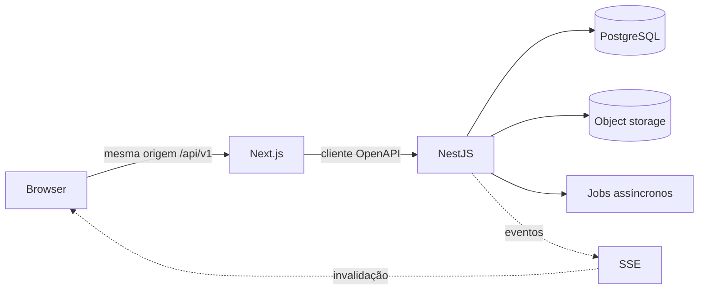
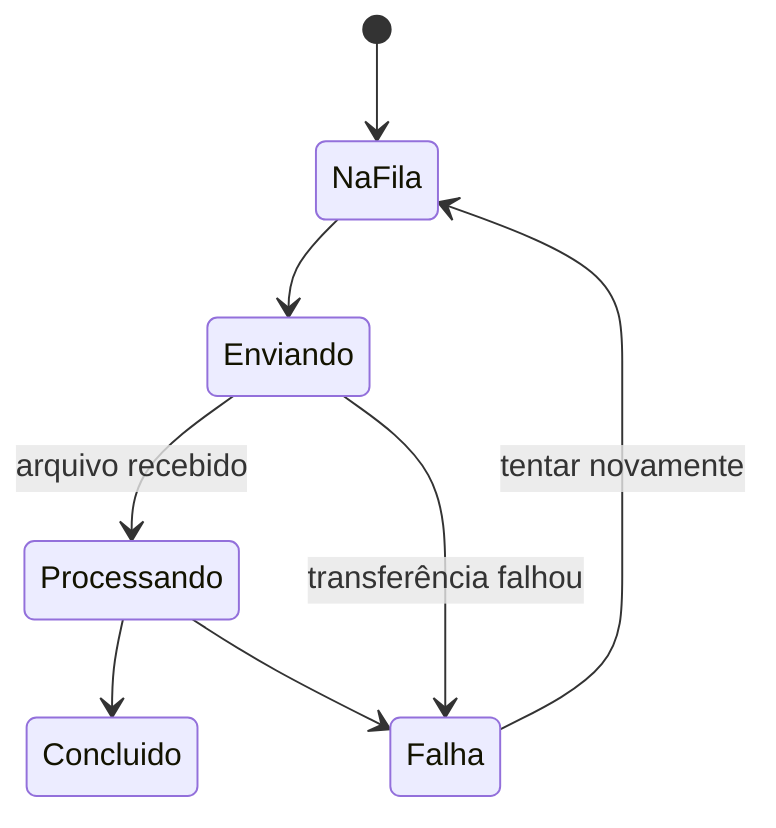

# Dados, estado, tempo real e uploads

Este documento detalha a implementação viva da decisão registrada no
[ADR-0009](../decisions/0009-frontend-data-realtime-and-upload-state.md).

## 1. Fronteiras de dados



- componentes de servidor carregam a visão inicial quando isso reduz trabalho no
  navegador;
- componentes de cliente usam TanStack Query para listas e mutações interativas;
- o cliente TypeScript é gerado do contrato OpenAPI, não escrito manualmente;
- nenhuma camada do Next.js consulta tabelas diretamente;
- respostas de autorização sempre vêm da API, independentemente do que a tela
  esconde ou mostra.

## 2. Tipos de estado

| Estado | Local correto | Exemplos |
|---|---|---|
| Estado remoto canônico | API + TanStack Query | comentários, comunicados, materiais |
| Navegação reproduzível | URL | busca, filtros, ordem, página |
| Preferência persistente | conta ou armazenamento local, conforme regra | tema |
| Interface efêmera | componente/contexto próximo | modal aberto, aba selecionada |
| Transferência ativa | gerenciador no shell | fila e progresso de upload |

A URL não recebe senha, token, motivo confidencial, conteúdo de formulário ainda
não enviado nem qualquer dado que não possa aparecer em histórico e logs.

## 3. SSE

O stream é unidirecional: servidor para navegador. Isso atende comentários porque
a criação, edição e exclusão continuam sendo requisições HTTP normais.

```text
POST comentário -> commit -> resposta ao autor -> evento SSE -> refetch dos demais
```

### Contrato mínimo de evento

```json
{
  "id": "evento_01...",
  "type": "comment.created",
  "resourceType": "announcement",
  "resourceId": "comunicado_01...",
  "occurredAt": "2026-07-02T18:30:00Z"
}
```

Regras:

- eventos não substituem a resposta canônica da API;
- um evento repetido não pode duplicar dados na tela;
- a API só emite após a transação ser confirmada;
- reconexão ou retorno da aba dispara reconciliação das consultas relevantes;
- o stream nunca revela recurso ao qual a sessão não tem acesso;
- heartbeat, timeout e limites serão definidos na configuração operacional.

## 4. Comportamento de comentários

- na tela do comunicado, criação, edição e exclusão aparecem automaticamente;
- reação e resultado de enquete também são reconciliados por evento;
- fora da tela, o evento atualiza os indicadores aplicáveis, sem abrir conteúdo ou
  deslocar a navegação do usuário;
- atualizações otimistas só são usadas quando houver rollback claro em caso de
  erro;
- a lista obtida da API decide ordem, moderação e anonimato finais.

## 5. Gerenciador global de uploads



O painel global mostra nome de exibição, obra, progresso, estado e ação possível.
O estado no shell sobrevive a navegações internas. Ao fechar ou recarregar:

- arquivos ainda em transferência são interrompidos;
- arquivos totalmente recebidos continuam o processamento no servidor;
- itens concluídos permanecem registrados na obra;
- ao retornar, a tela consulta a API e reconstrói estados persistidos;
- retomada do mesmo byte não é promessa da V1.
- ao tentar novamente uma transferência interrompida, o arquivo recomeça do
  início; os arquivos já concluídos permanecem intactos.

## 6. Critérios de aceite

1. dois membros na mesma tela veem um novo comentário sem atualizar a página;
2. reconectar após perda de rede resulta na lista canônica correta;
3. trocar de tenant não entrega eventos do tenant anterior;
4. editar filtro administrativo altera a URL e atualizar preserva a visão;
5. navegar durante um lote não interrompe uploads;
6. fechar a aba com transferência ativa apresenta aviso;
7. processamento iniciado no servidor continua após fechar a aba;
8. uma falha individual mantém os demais arquivos e permite nova tentativa.
9. reiniciar um arquivo interrompido não reenvia os arquivos já concluídos.
