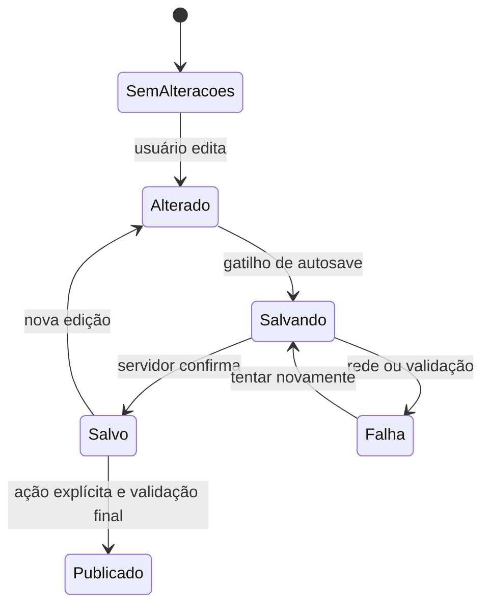
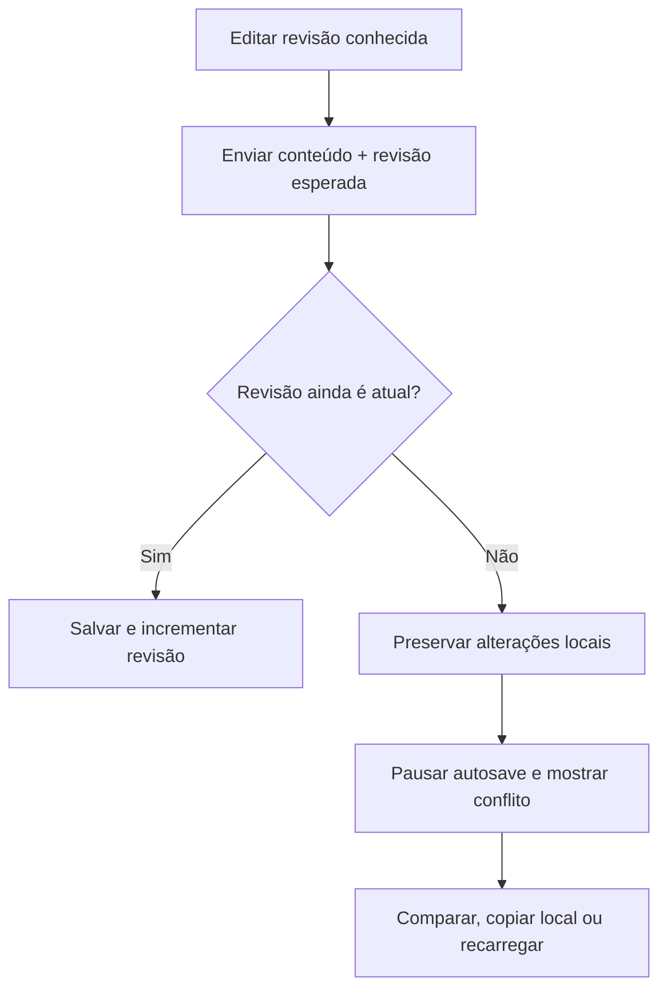

# Formulários e rascunhos

## 1. Estado da decisão

| Área | Estado |
|---|---|
| Autosave de formulários longos | Definido |
| Salvamento explícito de formulários simples | Definido |
| Biblioteca e contrato de validação | Definido no ADR-0011 |
| Compartilhamento de rascunho | Definido no ADR-0010 |
| Tratamento de edição concorrente | Definido no ADR-0010 |
| Retenção de rascunhos | Definido no ADR-0010 |
| Intervalos e gatilhos técnicos do autosave | Definido no ADR-0011 |
| Momento de exibição dos erros | Definido no ADR-0011 |

## 2. Princípio

Autosave protege trabalho longo; não substitui publicação. Salvar um rascunho
nunca torna o conteúdo visível aos destinatários e nunca dispara notificações de
publicação.

## 3. Formulários com autosave na V1

- criação e edição de obra;
- criação e edição de comunicado;
- preparação e configuração de upload em lote.

O rascunho pertence à orquestra e ao recurso correspondente, é recuperável após
reabrir a plataforma e informa claramente o estado `Salvando`, `Salvo` ou
`Falha ao salvar`.

## 4. Privacidade e compartilhamento

O rascunho começa privado para o autor. Ter permissão no recurso pai não revela
automaticamente sua existência ou conteúdo. O autor pode compartilhar:

- somente visualização;
- edição;
- com pessoas específicas que possam atuar naquele contexto.

Após o compartilhamento, hierarquia, pesos administrativos e limites de
autoridade continuam valendo. Compartilhar não publica para músicos.

## 5. Formulários com salvamento explícito

- perfil do usuário;
- configurações simples;
- ações curtas em modais;
- alterações administrativas pontuais.

Esses formulários usam botão `Salvar` e avisam antes de descartar mudanças não
salvas.

## 6. Fluxo conceitual

O gatilho padrão ocorre após `1.500 ms` sem novas alterações. Trocar de etapa,
publicar ou concluir força imediatamente qualquer salvamento pendente. Publicação
aguarda a confirmação do autosave antes de continuar.

## 7. Concorrência otimista

Cada leitura recebe uma revisão. Autosave e salvamento explícito enviam essa
revisão de volta. Se outra pessoa tiver salvado antes, a API responde com conflito
e não altera o banco.

Não haverá mesclagem automática na V1. A interface nunca deve resolver o conflito
apagando silenciosamente uma das versões.

## 8. Retenção

- rascunhos de negócio não expiram automaticamente na V1;
- uploads incompletos e arquivos órfãos seguem política técnica configurável;
- maestro/admin define o prazo e a antecedência do aviso;
- o proprietário recebe notificação persistente com a data prevista de exclusão;
- se estiver inativo, maestros/admins recebem a pendência;
- a limpeza definitiva mantém log técnico mínimo.

## 9. Regras invariantes

1. publicação exige ação explícita e autorização atual;
2. autosave não envia notificação aos destinatários;
3. erro de autosave permanece visível até resolver ou descartar;
4. sair da tela não deve sugerir que mudanças ainda não confirmadas foram salvas;
5. validação parcial pode aceitar rascunho incompleto;
6. validação de publicação exige todos os campos e vínculos obrigatórios;
7. anexos e arquivos seguem seus próprios estados de upload e processamento;
8. rascunho privado só se torna colaborativo por compartilhamento explícito;
9. conflito nunca sobrescreve silenciosamente a revisão atual.

## 10. Experiência de validação

- não mostrar erro enquanto a pessoa visita um campo pela primeira vez;
- validar ao sair do campo;
- após um erro visível, revalidar durante a correção para removê-lo rapidamente;
- validar a etapa ao avançar e o formulário completo ao publicar;
- mapear erros da API para campos e apresentar falhas gerais em resumo acessível;
- nunca depender apenas de cor para indicar um problema.

## 11. Decisões ainda necessárias

- limites mínimo e máximo para a política de limpeza de arquivos técnicos.

## 12. Contrato de validação

- Zod 4 é a fonte dos schemas de transporte em `packages/contracts`;
- React Hook Form gerencia formulários no navegador;
- um pipe Zod valida os mesmos schemas na entrada do NestJS;
- rascunhos usam schemas parciais; publicação usa schemas completos;
- autorização, unicidade e demais regras dependentes do banco continuam no
  backend;
- OpenAPI e o cliente gerado derivam desse contrato e são verificados no pipeline.
