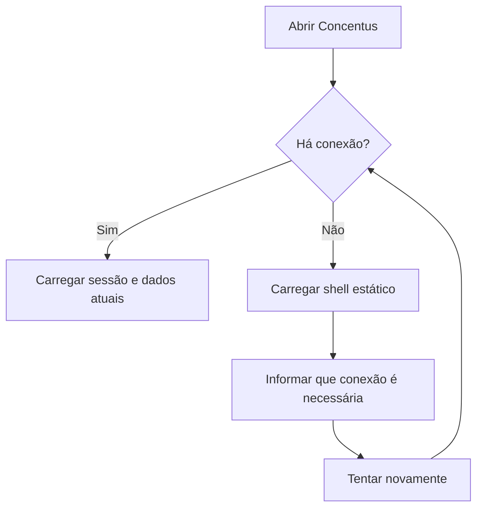

# PWA, cache e atualizações

Este documento detalha a política viva definida no
[ADR-0012](../decisions/0012-pwa-cache-installation-and-updates.md).

## 1. Matriz de armazenamento

| Conteúdo | Cache da PWA | Download explícito | Offline pela aplicação na V1 |
|---|---:|---:|---:|
| HTML base e assets versionados | Sim | Não se aplica | Sim |
| Respostas autenticadas da API | Não | Não | Não |
| PDF, imagem ou áudio privado | Não | Se autorizado | Não |
| Word, planilha ou outro anexo | Não | Se autorizado | Não |
| Rascunho no servidor | Não como cache | Não | Não |
| Alteração local ainda não salva | Memória da aba | Não | Não garantido |

Um arquivo baixado pode ser aberto offline pelo sistema operacional, mas não
aparece como item offline gerenciado pelo Concentus.

## 2. Permissão de download

- biblioteca define `permitir` ou `bloquear` como padrão;
- material define `herdar`, `permitir` ou `bloquear`;
- autor, maestro/admin ou pessoa com `Gerenciar acesso` pode alterar a política
  dentro de sua autoridade;
- editor comum não altera download apenas por possuir `Editar`;
- a API verifica acesso ao material e permissão de download em toda solicitação;
- o navegador recebe acesso temporário, nunca uma URL pública permanente;
- depois do download, remoção de acesso não apaga a cópia local;
- sem download, visualização interna continua possível quando autorizada;
- essa restrição não promete impedir captura, impressão virtual ou ferramentas do
  próprio navegador.

A interface administrativa pode mostrar a origem da decisão, por exemplo
`Permitido — herdado da biblioteca`, evitando configurações invisíveis.

Não existe relatório administrativo de downloads na V1. A plataforma registra
somente eventos técnicos temporários para investigar abuso, falha ou incidente de
segurança; esse log não compõe o histórico de atividade do músico. A retenção
padrão é de 90 dias e somente o admin master pode alterá-la globalmente.

## 3. Estado sem conexão

A tela offline não mostra listas privadas antigas nem permite criar mutações que
pareçam salvas.

## 4. Instalação

A sugestão de instalação é discreta, dispensável e posterior ao primeiro uso. A
decisão exata de frequência pertence à UX, mas deve respeitar a recusa registrada
no dispositivo e a capacidade real do navegador.

## 5. Atualizações

Estados que impedem recarga:

- arquivo em transferência;
- autosave em andamento ou falho;
- alteração local ainda não confirmada;
- conflito de revisão aberto;
- publicação ou outra mutação crítica em andamento.

Quando todos terminarem, a interface habilita `Atualizar agora`. Fechar a aba
continua seguindo os avisos de trabalho pendente já definidos.

## 6. Critérios de aceite

1. abrir offline não revela resposta autenticada visitada anteriormente;
2. PDF visualizado não surge na biblioteca offline da PWA;
3. PDF baixado aparece no destino escolhido pelo navegador/dispositivo;
4. material com download desabilitado não oferece a ação nem gera credencial de
   download pela API;
5. material sem exceção acompanha imediatamente o padrão da biblioteca;
6. editor sem `Gerenciar acesso` não muda a política de download;
7. maestro não encontra relatório de downloads dos músicos;
8. dispensar a instalação impede insistência recorrente;
9. nova versão não recarrega a aba sozinha;
10. upload ou formulário pendente bloqueia atualização imediata com explicação;
11. em estado seguro, atualizar ativa a nova versão e recarrega.
