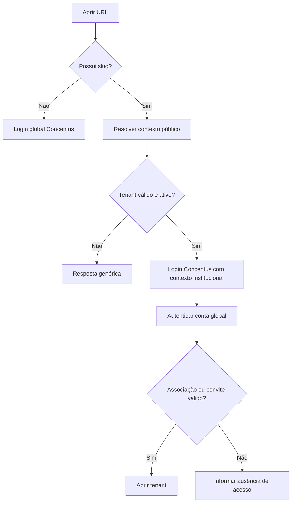

# Rotas e resolução de tenant

## 1. Estrutura aceita

```text
/                              login global Concentus
/{orchestra_slug}              login contextual ou início da orquestra
/{orchestra_slug}/convites/... aceite de convite contextual
/admin-master                  painel técnico reservado
```

O slug permite resolver o tenant antes da autenticação.

Essa decisão está registrada no
[ADR-0008](../decisions/0008-frontend-foundation-routing-and-themes.md).

## 2. Dados públicos do resolver

O endpoint público de contexto pode retornar apenas:

- nome público da orquestra;
- símbolo institucional;
- mídia aprovada para slot de login, quando existir;
- estado genérico de disponibilidade.

Não retorna membros, configuração interna, permissões ou conteúdo.

## 3. Fluxo



## 4. Slugs reservados

A lista inicial incluirá rotas técnicas como `api`, `admin-master`, `login`,
`logout`, `convites`, `status`, `_next` e nomes futuros protegidos. A validação
ocorre na aplicação e por constraint/dado de referência apropriado.

## 5. Login global

Após autenticação sem slug:

- uma associação ativa: redirecionar para seu tenant;
- várias associações: abrir seletor;
- nenhuma associação: mostrar estado sem orquestra e convites pendentes aplicáveis.
