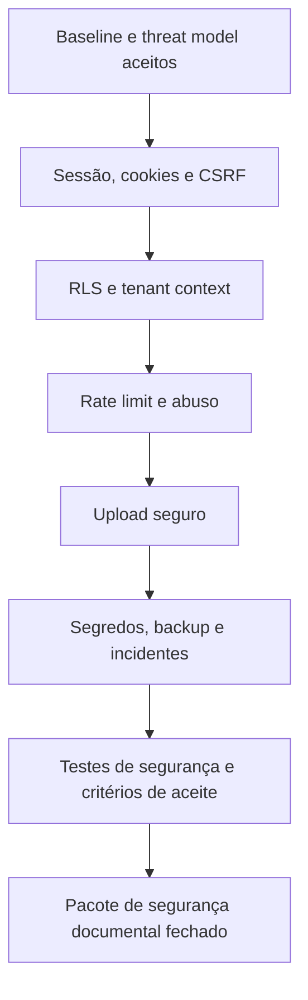

# Arquitetura de segurança

Status: Fechado em nível arquitetural para V1  
Última revisão: 2026-07-09

Esta área contém as decisões vivas de segurança do Concentus. Ela complementa os
requisitos não funcionais e transforma riscos em controles verificáveis.

## 1. Baseline aceito

O [ADR-0017](../decisions/0017-security-baseline-and-threat-model.md) define:

- OWASP ASVS 5.0.0 como catálogo de referência, sem certificação formal na V1;
- threat model vivo com DFD e STRIDE;
- sessão opaca server-side em cookie seguro;
- proteção CSRF explícita para requisições mutáveis autenticadas por cookie;
- Argon2id, política moderna de senha e MFA obrigatório para admin master;
- RLS como segunda barreira de isolamento multi-tenant;
- contexto de tenant transacional no PostgreSQL;
- rate limit e controle de abuso em camadas;
- upload seguro, quarentena e antimalware como superfície crítica;
- segredos fora do código, backup testado e resposta a incidentes;
- testes de segurança e gates de aceite antes de produção;
- workers e jobs obrigados a carregar e validar contexto de tenant.

## 2. Documentos

| Documento | Estado | Finalidade |
|---|---|---|
| [Threat model](threat-model.md) | Inicial | Ativos, fronteiras, ameaças P0 e controles |
| [Sessão, cookies e CSRF](session-cookies-and-csrf.md) | Aceito | Contrato detalhado de sessão e mutações |
| [RLS e tenant context](rls-and-tenant-context.md) | Aceito | Propagação segura de tenant no PostgreSQL |
| [Rate limit e abuso](rate-limit-and-abuse.md) | Aceito | Login, convites, recuperação, downloads, uploads, SSE e interações |
| [Upload seguro](secure-uploads-and-antimalware.md) | Aceito | Tipos, limites, quarentena, varredura e entrega |
| [Segredos, backup e incidentes](secrets-backup-and-incident-response.md) | Aceito | Operação, rotação, restauração e resposta |
| [Testes de segurança e aceite](security-tests-and-acceptance.md) | Aceito | Fechamento do pacote de segurança |

## 3. Ordem de trabalho

## 4. Regras de documentação

- decisão de segurança estrutural gera ADR;
- ameaça P0 precisa ter mitigação, teste e observabilidade;
- controle sem teste documentado não é considerado fechado;
- pendência de segurança não deve ser escondida dentro de implementação;
- exceção antes da produção exige risco aceito explicitamente.

## 5. Critério para sair do bloco

Só avançamos para implementação de negócio quando houver documentação suficiente
para responder:

1. como a sessão nasce, gira, expira e é revogada;
2. como CSRF, CORS e headers protegem mutações;
3. como o tenant chega com segurança ao PostgreSQL e ao worker;
4. como uploads são aceitos, processados, servidos e removidos;
5. como abuso é limitado sem bloquear uso legítimo;
6. como segredos, backups e incidentes são operados;
7. quais testes provam isolamento e autorização.

Essas respostas estão documentadas nos artefatos acima. O pacote de segurança da
documentação V1 está fechado em nível arquitetural; pendências restantes dependem
de infraestrutura ou implementação.

## 6. Referências

- https://owasp.org/www-project-application-security-verification-standard/
- https://csrc.nist.gov/pubs/sp/800/218/final
- https://cheatsheetseries.owasp.org/cheatsheets/Threat_Modeling_Cheat_Sheet.html
- https://cheatsheetseries.owasp.org/cheatsheets/Multi_Tenant_Security_Cheat_Sheet.html
- https://cheatsheetseries.owasp.org/cheatsheets/Authentication_Cheat_Sheet.html
- https://cheatsheetseries.owasp.org/cheatsheets/Password_Storage_Cheat_Sheet.html
- https://cheatsheetseries.owasp.org/cheatsheets/Session_Management_Cheat_Sheet.html
- https://cheatsheetseries.owasp.org/cheatsheets/Cross-Site_Request_Forgery_Prevention_Cheat_Sheet.html
- https://cheatsheetseries.owasp.org/cheatsheets/HTTP_Headers_Cheat_Sheet.html
- https://pages.nist.gov/800-63-4/sp800-63b.html
- https://www.postgresql.org/docs/current/ddl-rowsecurity.html
- https://owasp.org/API-Security/editions/2023/en/0xa4-unrestricted-resource-consumption/
- https://cheatsheetseries.owasp.org/cheatsheets/Credential_Stuffing_Prevention_Cheat_Sheet.html
- https://cheatsheetseries.owasp.org/cheatsheets/Forgot_Password_Cheat_Sheet.html
- https://cheatsheetseries.owasp.org/cheatsheets/Denial_of_Service_Cheat_Sheet.html
- https://www.rfc-editor.org/rfc/rfc6585.html#section-4
- https://www.rfc-editor.org/rfc/rfc9110.html#name-retry-after
- https://cheatsheetseries.owasp.org/cheatsheets/File_Upload_Cheat_Sheet.html
- https://owasp.org/www-community/vulnerabilities/Unrestricted_File_Upload
- https://docs.clamav.net/manual/Usage/Scanning.html
- https://www.rfc-editor.org/rfc/rfc6266
- https://cheatsheetseries.owasp.org/cheatsheets/Secrets_Management_Cheat_Sheet.html
- https://cheatsheetseries.owasp.org/cheatsheets/Logging_Cheat_Sheet.html
- https://csrc.nist.gov/pubs/sp/800/61/r2/final
- https://csrc.nist.gov/pubs/sp/800/92/final
- https://www.postgresql.org/docs/current/backup.html
- https://www.postgresql.org/docs/current/continuous-archiving.html
- https://owasp.org/www-project-web-security-testing-guide/
- https://cheatsheetseries.owasp.org/cheatsheets/Authorization_Testing_Automation_Cheat_Sheet.html
- https://cheatsheetseries.owasp.org/cheatsheets/Authorization_Regression_Testing_Cheat_Sheet.html
- https://www.zaproxy.org/docs/docker/baseline-scan/
- https://www.zaproxy.org/docs/docker/api-scan/
