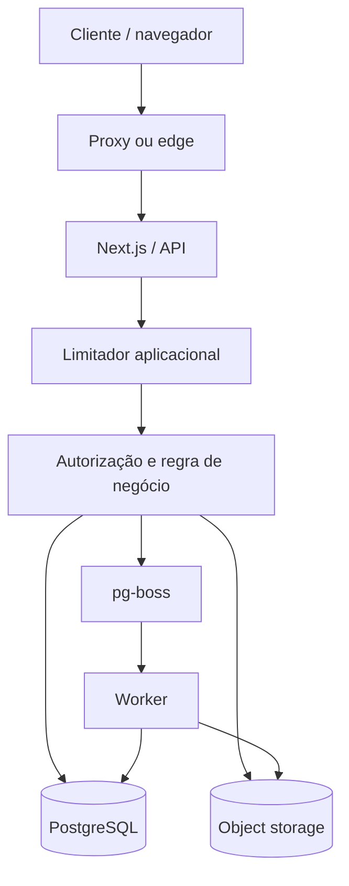
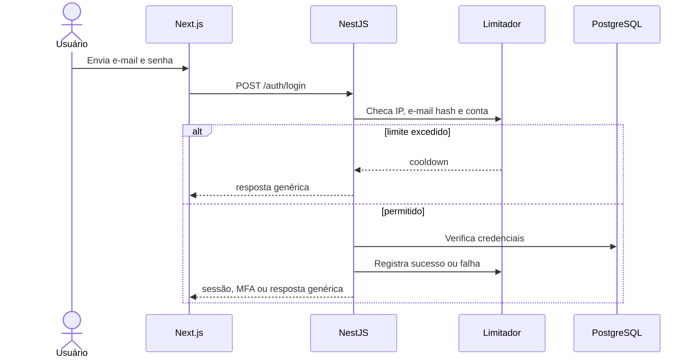

# Rate limit e controle de abuso

Status: Aceito  
Última revisão: 2026-07-09

Este documento operacionaliza o
[ADR-0020](../decisions/0020-rate-limit-and-abuse-controls.md).

## 1. Objetivo

Rate limit no Concentus não é só “quantas requisições por minuto”. É proteção
contra:

- brute force, password spraying e credential stuffing;
- enumeração de contas, convites e recursos;
- flooding de e-mail de recuperação/convite;
- scraping de PDFs e áudios;
- upload excessivo ou processamento caro;
- spam em comunicados e comentários;
- excesso de conexões SSE;
- fan-out de notificações e jobs que derruba worker ou banco.

## 2. Princípios

1. Limitar por ação, não apenas por IP.
2. Preferir atraso progressivo a bloqueio permanente.
3. Fazer validações baratas antes de operações caras.
4. Responder de forma genérica onde houver risco de enumeração.
5. Manter contadores e logs sem tokens, senhas ou conteúdo sensível.
6. Proteger custo operacional, não só CPU.
7. Ajustar limites por observação real, sem hardcode espalhado.

## 3. Arquitetura em camadas

| Camada | Protege | Exemplo |
|---|---|---|
| Proxy/edge | Ataque grosseiro e conexão | tamanho máximo, timeout, limite por IP |
| API | Ação de negócio | login, busca, comentário, download |
| Banco | Contadores e isolamento | limite por conta, tenant e recurso |
| Worker | Processamento caro | thumbnails, notificações, limpeza |
| Storage/e-mail | Custo externo | quotas e alertas |

## 4. Chaves de limite

| Chave | Uso | Cuidado |
|---|---|---|
| IP ou prefixo | ataque grosseiro, origem anônima | nunca usar como única defesa |
| e-mail normalizado em hash | login e recuperação | não armazenar e-mail cru no contador |
| conta global | usuário autenticado | respeitar conta multi-orquestra |
| sessão | abas, PWA e SSE | não confundir com identidade permanente |
| orquestra | quota de tenant | evitar um tenant afetar outro |
| recurso | material, comunicado, convite | detectar scraping ou spam localizado |
| ação | login, upload, download, comentar | limites diferentes por custo/risco |

## 5. Algoritmos

| Tipo | Onde usar | Motivo |
|---|---|---|
| Token bucket/GCRA | API comum, comentários, buscas | permite rajada curta sem abuso contínuo |
| Janela deslizante | falhas de login, MFA, reset | melhor para abuso acumulado |
| Cooldown progressivo | autenticação e reset | reduz força bruta sem lockout permanente |
| Semáforo de concorrência | upload, SSE, processamento | limita custo simultâneo |
| Quota por período | e-mail, storage, downloads | protege custo e vazamento em massa |

## 6. Defaults iniciais da V1

Estes valores são ponto de partida. Eles devem ser configuráveis por ambiente e
revistos antes de produção real.

### Autenticação

| Ação | Limite inicial | Resposta |
|---|---|---|
| Login falho por e-mail hash + IP/prefixo | 5 em 15 min | atraso progressivo |
| Login falho por e-mail/conta | 10 em 30 min | cooldown até 30 min |
| Login falho por IP/prefixo | 50 em 15 min | mitigação temporária |
| Falhas consecutivas por autenticador | teto duro de 100 | recuperação/revalidação segura |
| Sucesso de login | zera falhas aplicáveis | cria sessão normal |

Mensagens de login não diferenciam e-mail inexistente, senha errada, conta
desativada ou limite atingido.

### MFA

| Ação | Limite inicial | Resposta |
|---|---|---|
| Tentativas por desafio MFA | 5 | invalida desafio |
| Desafios MFA por conta | 10 em 30 min | exige novo login/cooldown |
| Código de recuperação inválido | 5 em 30 min | cooldown e auditoria |

Senha correta seguida de falha MFA é evento de risco maior do que senha errada.

### Recuperação de senha

| Ação | Limite inicial | Resposta |
|---|---|---|
| Solicitação por e-mail hash | 3 por hora, 10 por dia | resposta uniforme |
| Solicitação por IP/prefixo | 20 por hora | resposta uniforme/cooldown |
| Consumo de token inválido | 10 por hora por IP/prefixo | cooldown |

O sistema não informa se o e-mail existe.

### Convites

| Ação | Limite inicial | Resposta |
|---|---|---|
| Criar convites por maestro/admin | 100 por hora | `429` ou fila |
| Reenviar convite por e-mail | 3 por hora | cooldown |
| Consumo inválido de convite | 10 por hora por IP/prefixo | cooldown |
| Consumo de token já usado | sempre negado | resposta genérica |

Convites continuam sem expiração por decisão de produto, mas são de uso único e
revogáveis.

### API autenticada

| Ação | Limite inicial | Resposta |
|---|---|---|
| Leitura comum por conta | 600 em 5 min | `429` com `Retry-After` |
| Mutação comum por conta | 120 em 5 min | `429` com `Retry-After` |
| Busca/listagem pesada | 60 por minuto | `429` e reduzir página |
| Página máxima | 100 registros | erro de validação |
| Operações em lote | limite por endpoint | validação antes de executar |

Limites de página e filtros são tão importantes quanto limite de requisição.

### Downloads

| Ação | Limite inicial | Resposta |
|---|---|---|
| Gerar URL assinada por conta | 60 por minuto | `429` |
| Gerar URL assinada por material | 30 por minuto por conta | `429` |
| Downloads por conta | alerta técnico acima de 1.000 por dia | investigar |
| Downloads por orquestra | alerta técnico acima de 20.000 por dia | investigar |

Esses eventos não viram relatório comportamental para maestro na V1.

### Uploads

| Ação | Limite inicial | Resposta |
|---|---|---|
| Lotes ativos por conta | 2 | aguardar/fila |
| Lotes ativos por orquestra | 4 | aguardar/fila |
| Arquivos por lote | 250 | validação antes de upload |
| Processamentos simultâneos por tenant | 4 | fila no worker |

Tamanho de arquivo, formatos finais e antimalware foram definidos no ADR-0021.
CDR permanece como evolução possível se documentos editáveis ganharem uso frequente.

### Comunicados e interações

| Ação | Limite inicial | Resposta |
|---|---|---|
| Comentários por conta | 10 por minuto, 60 por hora | `429` |
| Comentários no mesmo comunicado | 5 por minuto por conta | `429` |
| Votos/alterações de voto | 30 por minuto | `429` |
| Curtidas/descurtidas | 60 por minuto | `429` |
| Comunicados criados por líder | 20 por hora | `429` |
| Comunicados criados por maestro/admin | 100 por hora | `429` |

Esses limites bloqueiam automação grosseira, não substituem moderação.

### SSE e notificações

| Ação | Limite inicial | Resposta |
|---|---|---|
| Conexões SSE por conta | 6 | recusar nova conexão |
| Conexões SSE por conta + tenant | 3 | recusar nova conexão |
| Reconexão após queda | backoff obrigatório | fechar conexão se insistir |
| Notificações iguais | deduplicar por janela curta | agrupar |
| Fan-out grande | worker obrigatório | nunca loop síncrono |

## 7. Fluxo de login com throttling

O limite é checado antes de operação cara de senha sempre que possível, mas sem
criar enumeração. Quando o e-mail não existe, o fluxo ainda deve simular caminho
seguro suficiente para manter tempo e resposta uniformes.

## 8. Respostas e headers

| Cenário | Resposta |
|---|---|
| API autenticada comum limitada | `429 Too Many Requests` + `Retry-After` |
| Download limitado | `429` + mensagem simples |
| Upload/lote excedido | `429` ou erro de validação antes de enviar |
| Login/reset limitado | resposta genérica, sem revelar causa |
| Ataque volumétrico | proxy pode encerrar conexão sem `429` |

Na V1, não expor headers detalhados de limite restante em rotas sensíveis. Eles
podem ajudar atacante a calibrar automação.

## 9. Observabilidade

Eventos mínimos:

- login throttled;
- MFA throttled;
- recuperação de senha throttled;
- convite throttled;
- download throttled;
- upload/lote recusado por limite;
- SSE recusado por excesso;
- comentário/interação throttled;
- fan-out ou job recusado por quota;
- proxy/edge bloqueando origem.

Cada evento deve registrar:

- `request_id`;
- ação;
- tenant, quando houver;
- conta, quando autenticada;
- chave de limite em formato seguro;
- política acionada;
- janela/cooldown;
- resultado.

Não registrar senha, token, código MFA, URL assinada, arquivo, conteúdo integral
de comentário ou e-mail cru em contador de abuso.

## 10. Retenção

| Dado | Retenção inicial |
|---|---|
| Contadores de janela curta | expiram automaticamente após a janela |
| Eventos técnicos de abuso | 90 dias |
| IP cru em logs técnicos | até 90 dias, quando necessário |
| Métricas agregadas | podem permanecer sem dado pessoal |
| Bloqueios temporários | expiram automaticamente |

Retenções maiores exigem justificativa operacional e decisão do admin master.

## 11. Falhas do limitador

Se o armazenamento de contadores falhar:

- autenticação, MFA, reset, convite, upload e download entram em modo seguro:
  limitar de forma conservadora ou retornar indisponibilidade temporária;
- leituras autenticadas simples podem degradar com limite local temporário;
- eventos de falha do limitador são críticos para operação;
- não ignorar silenciosamente o limitador em rotas sensíveis.

## 12. Testes mínimos

| Teste | Esperado |
|---|---|
| várias senhas erradas no mesmo e-mail | cooldown sem enumeração |
| ataque distribuído em e-mails diferentes pelo mesmo IP | mitigação temporária |
| senha correta após falhas moderadas | fluxo legítimo ainda possível |
| mais de 5 códigos MFA errados | desafio inválido |
| reset para e-mail inexistente | mesma resposta de e-mail existente |
| reset em excesso | não envia e-mail novo |
| upload acima da concorrência | bloqueia/fila antes de consumir processamento |
| busca com página enorme | validação recusa |
| download em massa | limita e registra evento técnico |
| SSE em muitas abas | recusa conexões extras |
| spam de comentários | `429` sem criar comentário |
| falha no armazenamento do limitador | rota sensível não passa livremente |

## 13. Pendências

- definir formato físico das tabelas de contadores de abuso;
- decidir quais limites serão variáveis de ambiente e quais ficarão em tabela
  operacional;
- escolher o ponto exato do proxy/edge quando a infraestrutura for definida;
- calibrar limites após ensaio com usuários reais;
- decidir se haverá desafio adaptativo no futuro;
- detalhar limites finais de arquivo no bloco de upload seguro.

## 14. Referências

- https://owasp.org/API-Security/editions/2023/en/0xa4-unrestricted-resource-consumption/
- https://cheatsheetseries.owasp.org/cheatsheets/Abuse_Case_Cheat_Sheet.html
- https://cheatsheetseries.owasp.org/cheatsheets/Credential_Stuffing_Prevention_Cheat_Sheet.html
- https://cheatsheetseries.owasp.org/cheatsheets/Forgot_Password_Cheat_Sheet.html
- https://cheatsheetseries.owasp.org/cheatsheets/Denial_of_Service_Cheat_Sheet.html
- https://pages.nist.gov/800-63-4/sp800-63b.html
- https://www.rfc-editor.org/rfc/rfc6585.html#section-4
- https://www.rfc-editor.org/rfc/rfc9110.html#name-retry-after
