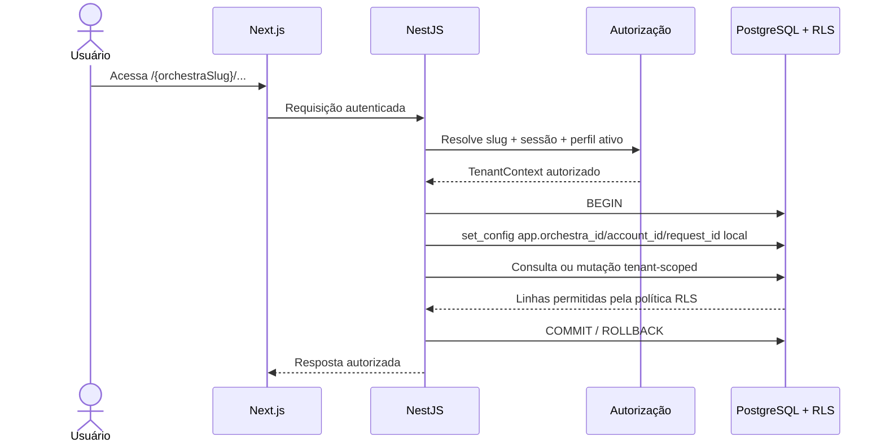
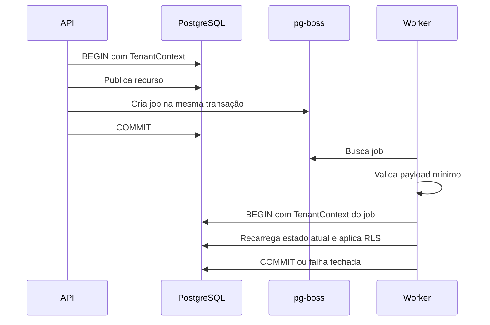

# RLS e contexto seguro de tenant

Status: Aceito  
Última revisão: 2026-07-09

Este documento operacionaliza o
[ADR-0019](../decisions/0019-rls-and-secure-tenant-context.md).

## 1. Objetivo

O objetivo é garantir que uma falha de filtro na aplicação não permita leitura ou
alteração de dados de outra orquestra.

RLS é defesa em profundidade:

- a API continua responsável por autorização de produto;
- o banco garante isolamento básico de tenant;
- workers usam o mesmo contexto seguro da API;
- testes provam as duas camadas.

## 2. Fluxo de requisição tenant-scoped



Nenhuma consulta tenant-scoped deve acontecer antes do contexto ser definido na
transação.

## 3. Tipos de dados

| Tipo | Exemplo | Regra |
|---|---|---|
| Global | conta, credencial, sessão | Não possui `orchestra_id` obrigatório; acesso por regra própria |
| Tenant-scoped | biblioteca, obra, material, comunicado | Possui `orchestra_id` e RLS obrigatório |
| Vínculo conta/tenant | membro, perfil de orquestra, papel contextual | Possui `orchestra_id` quando representa participação em uma orquestra |
| Técnico global | log restrito do master, configuração da plataforma | Acesso fora do fluxo normal, com auditoria técnica |
| Público mínimo | slug ativo, tela de login contextual quando existir | Só expõe dados institucionais não sensíveis |

## 4. Contrato de contexto

| Chave PostgreSQL | Obrigatória | Origem | Finalidade |
|---|---:|---|---|
| `app.orchestra_id` | Sim para tenant | Orquestra resolvida no servidor | Isolamento RLS |
| `app.account_id` | Sim para usuário | Sessão autenticada | Auditoria e regras auxiliares |
| `app.membership_id` | Quando houver | Perfil ativo na orquestra | Permissões contextuais |
| `app.request_id` | Sim | Middleware da API/worker | Correlação e logs |
| `app.actor_kind` | Sim | API/worker | Diferenciar usuário, worker, impersonação e plataforma |
| `app.impersonated_by_account_id` | Só em impersonação | Sessão técnica do master | Auditoria restrita |

O cliente não envia essas chaves como autoridade. Ele pode enviar IDs de recurso,
mas a API resolve e valida tudo contra sessão, slug, perfil e permissões.

## 5. Wrapper obrigatório

Todo módulo que acessa dados tenant-scoped deve receber um banco já
contextualizado.

```ts
await withTenantContext(ctx, async (tenantDb) => {
  return tenantDb
    .selectFrom('content.libraries')
    .selectAll()
    .execute()
})
```

O wrapper conceitual faz:

```ts
await db.transaction().execute(async (trx) => {
  await setTenantContext(trx, ctx)
  return callback(new TenantDb(trx, ctx))
})
```

`TenantDb` é uma fronteira de arquitetura: ele representa que a transação possui
`app.orchestra_id` e demais chaves obrigatórias. Código de negócio tenant-scoped
não deve receber o `db` global.

## 6. Definição transacional

O contexto será definido com `set_config(..., true)` ou `SET LOCAL`.

Exemplo conceitual:

```sql
select set_config('app.orchestra_id', :orchestra_id, true);
select set_config('app.account_id', :account_id, true);
select set_config('app.membership_id', :membership_id, true);
select set_config('app.request_id', :request_id, true);
select set_config('app.actor_kind', :actor_kind, true);
```

O terceiro argumento `true` limita o valor à transação atual. Isso é obrigatório
porque conexões serão reutilizadas pelo pool.

## 7. Funções auxiliares

As políticas devem usar funções pequenas e estáveis.

```sql
create schema if not exists app;

create function app.current_orchestra_id()
returns uuid
language sql
stable
as $$
  select nullif(current_setting('app.orchestra_id', true), '')::uuid
$$;

create function app.current_account_id()
returns uuid
language sql
stable
as $$
  select nullif(current_setting('app.account_id', true), '')::uuid
$$;
```

Se o contexto estiver ausente, a função retorna `null`; políticas que comparam
`orchestra_id = app.current_orchestra_id()` falham fechadas.

## 8. Padrão de política

Exemplo conceitual para tabela tenant-scoped:

```sql
alter table content.libraries enable row level security;
alter table content.libraries force row level security;

create policy libraries_tenant_select
on content.libraries
for select
using (orchestra_id = app.current_orchestra_id());

create policy libraries_tenant_insert
on content.libraries
for insert
with check (orchestra_id = app.current_orchestra_id());

create policy libraries_tenant_update
on content.libraries
for update
using (orchestra_id = app.current_orchestra_id())
with check (orchestra_id = app.current_orchestra_id());

create policy libraries_tenant_delete
on content.libraries
for delete
using (orchestra_id = app.current_orchestra_id());
```

Esse padrão isola o tenant, mas não decide sozinho se o usuário pode editar uma
biblioteca específica. Essa permissão continua na camada de autorização da API.

## 9. Regras para migrations

Toda tabela tenant-scoped nova deve sair da migration com:

1. `orchestra_id uuid not null`;
2. FK para a orquestra;
3. FKs compostas quando apontar para outro recurso tenant-scoped;
4. índice compatível com as consultas principais envolvendo `orchestra_id`;
5. RLS habilitado;
6. política `USING` e `WITH CHECK` aplicável;
7. `COMMENT ON TABLE` e `COMMENT ON COLUMN`;
8. ficha no dicionário de dados;
9. teste de isolamento cruzado.

Tabela sem tenant precisa justificar explicitamente por que é global.

## 10. Workers e jobs



Payload tenant-scoped mínimo:

- `orchestra_id`;
- ID do recurso-alvo;
- tipo do job;
- versão do payload;
- `request_id` ou `correlation_id`;
- ator responsável quando aplicável.

Payload não deve carregar segredo, arquivo bruto, URL assinada ou dado pessoal
desnecessário.

## 11. Admin master e plataforma

Impersonação usa contexto de tenant como qualquer usuário representado. O admin
master não ganha bypass silencioso de RLS durante impersonação.

Operações globais de plataforma seguem outro caminho:

- painel técnico separado;
- reautenticação/MFA conforme ADR-0018;
- contexto `platform`;
- autorização explícita;
- log técnico restrito;
- menor conjunto possível de grants/funções.

## 12. Comportamento de erro

Para o usuário final, acesso cruzado não deve revelar se o recurso existe em outra
orquestra.

Regra de resposta:

- leitura de recurso inacessível: resposta genérica, normalmente `404` ou
  `403` conforme contrato do endpoint;
- mutação sem permissão: `403`;
- mutação que viola RLS ou `WITH CHECK`: erro tratado e logado sem expor IDs de
  outro tenant;
- tentativa suspeita repetida: evento de segurança para rate limit/abuso.

## 13. Observabilidade

Eventos mínimos:

- tentativa de acesso cruzado detectada pela API;
- violação RLS tratada;
- job sem tenant;
- job com recurso divergente do tenant;
- consulta administrativa executada em contexto `platform`;
- rota tenant-scoped chamada sem `TenantContext`.

Logs não devem incluir token de sessão, CSRF, senha, URL assinada ou conteúdo
integral de arquivo/comunicado.

## 14. Testes mínimos

| Teste | Esperado |
|---|---|
| `select` sem `app.orchestra_id` em tabela tenant-scoped | zero linhas |
| `insert` sem contexto | falha |
| contexto A consulta UUID da orquestra B | sem vazamento |
| contexto A tenta atualizar linha da B | zero linhas ou falha segura |
| tentativa de trocar `orchestra_id` | falha |
| duas transações na mesma conexão simulada | contexto não vaza |
| worker recebe job sem tenant | falha fechada |
| worker recebe tenant A para recurso B | falha fechada |
| papel da aplicação possui `BYPASSRLS` | gate falha |
| tabela tenant-scoped sem RLS | gate falha |

## 15. Pendências

- listar exatamente todas as tabelas tenant-scoped no modelo lógico;
- definir grants finais por schema quando as migrations existirem;
- decidir se haverá funções `security definer` para casos específicos;
- desenhar a camada de leitura administrativa cruzada;
- definir mensagens finais `403`/`404` por tipo de endpoint.

## 16. Referências

- https://cheatsheetseries.owasp.org/cheatsheets/Authorization_Cheat_Sheet.html
- https://cheatsheetseries.owasp.org/cheatsheets/Multi_Tenant_Security_Cheat_Sheet.html
- https://owasp.org/API-Security/editions/2023/en/0xa1-broken-object-level-authorization/
- https://www.postgresql.org/docs/current/ddl-rowsecurity.html
- https://www.postgresql.org/docs/current/sql-createpolicy.html
- https://www.postgresql.org/docs/current/functions-admin.html
- https://www.postgresql.org/docs/current/sql-set.html
- https://kysely.dev/docs/examples/transactions/simple-transaction
