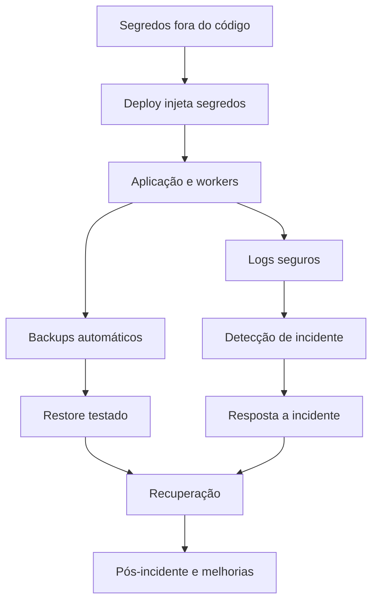
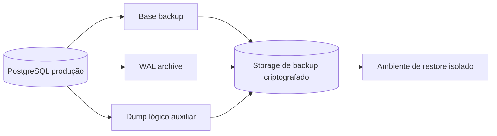
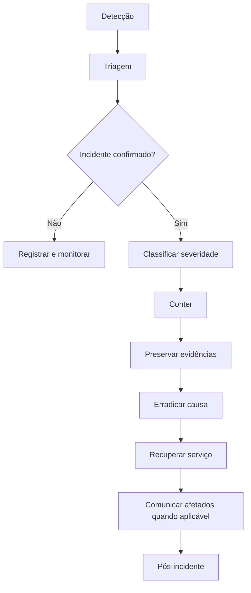

# Segredos, backup, restore e resposta a incidentes

Status: Aceito  
Última revisão: 2026-07-09

Este documento operacionaliza o
[ADR-0022](../decisions/0022-secrets-backup-restore-and-incident-response.md).

## 1. Objetivo

Garantir que o Concentus consiga:

- manter segredos fora do código e dos logs;
- rotacionar credenciais críticas;
- restaurar PostgreSQL e arquivos;
- preservar evidências;
- responder a incidentes sem improviso;
- declarar RPO/RTO realistas antes da produção.

## 2. Mapa operacional

## 3. Ambientes

| Ambiente | Dados reais | Segredos | Observação |
|---|---|---|---|
| Local | Não | `.env.local` ignorado pelo Git | apenas desenvolvimento |
| Teste/CI | Não | segredos efêmeros ou de baixo privilégio | sem dados reais |
| Homologação | preferencialmente não | próprios | pode usar dados anonimizados |
| Produção | Sim | fonte operacional controlada | acesso restrito e auditado |

Produção nunca reutiliza banco, storage, SMTP ou chaves de desenvolvimento.

## 4. Inventário de segredos

Cada segredo deve ter uma ficha operacional.

| Campo | Obrigatório |
|---|---|
| Nome lógico | Sim |
| Ambiente | Sim |
| Dono | Sim |
| Finalidade | Sim |
| Sistema consumidor | Sim |
| Local de armazenamento | Sim |
| Escopo/privilégio | Sim |
| Rotação | Sim |
| Última rotação | Sim |
| Impacto de vazamento | Sim |
| Procedimento de revogação | Sim |

Exemplos de segredos:

- `DATABASE_URL_API`;
- `DATABASE_URL_WORKER`;
- `SESSION_TOKEN_HMAC_SECRET`;
- `CSRF_SECRET`, se houver;
- `OBJECT_STORAGE_ACCESS_KEY`;
- `SMTP_API_KEY`;
- `BACKUP_ENCRYPTION_KEY`;
- `ANTIMALWARE_SERVICE_TOKEN`;
- `CI_DEPLOY_TOKEN`;
- `MONITORING_WRITE_TOKEN`.

## 5. Regras de armazenamento

- Segredo real não entra no repositório.
- Segredo real não entra em Markdown.
- Segredo real não entra em ticket, print, log ou mensagem de erro.
- `.env.example` contém apenas chaves e comentários.
- Arquivo local com segredo fica fora do Git.
- Produção usa secret manager, cofre operacional ou mecanismo equivalente
  documentado.
- Acesso humano a segredos de produção é exceção, não rotina.

## 6. Rotação

| Tipo | Rotação planejada | Rotação emergencial |
|---|---:|---|
| Credencial PostgreSQL | semestral ou quando houver equipe maior | imediata se vazada |
| Storage | semestral | imediata se vazada |
| SMTP/e-mail | anual | imediata se vazada ou abuso |
| Sessão/HMAC | anual com plano de invalidação | imediata com logout forçado |
| Backup encryption key | anual ou por política operacional | imediata se vazada |
| Token CI/deploy | trimestral | imediata se vazado |

Rotação deve ter runbook. Se a rotação derruba sessões ou invalida URLs, isso
precisa estar descrito antes de executar.

## 7. Logs seguros

Eventos de segurança devem conter:

- `request_id`;
- data/hora em UTC;
- ambiente;
- serviço;
- tenant, quando aplicável;
- conta, quando autenticada;
- ação;
- resultado;
- motivo técnico seguro;
- IP/prefixo ou hash quando necessário;
- User-Agent resumido quando útil.

Não registrar:

- senha;
- token de sessão;
- token CSRF;
- código MFA;
- segredo de storage;
- URL assinada;
- payload bruto de arquivo;
- conteúdo integral de comunicado/comentário;
- resposta completa de provedor externo com segredo.

## 8. Retenção de logs

| Tipo | Retenção inicial |
|---|---:|
| Logs operacionais comuns | 30 dias |
| Eventos técnicos de segurança | 180 dias |
| Logs técnicos de download | 90 dias |
| Auditoria de negócio | enquanto necessário para histórico da orquestra |
| Incidentes SEV-1/SEV-2 | 1 ano ou conforme necessidade operacional |

Retenção maior precisa justificar custo, privacidade e finalidade.

## 9. Backup PostgreSQL

Estratégia da V1:

- base backup físico periódico;
- WAL archiving contínuo para point-in-time recovery;
- dump lógico periódico como camada auxiliar de portabilidade;
- monitoramento de atraso/falha de archiving;
- criptografia dos artefatos de backup;
- restauração testada em ambiente isolado.

`pg_dump` é útil para inspeção e portabilidade, mas não substitui PITR.

## 10. Backup de object storage

Arquivos privados exigem proteção própria.

Regras:

- storage de produção não é bucket público;
- versionamento ou cópia incremental deve existir antes de produção;
- objetos limpos, derivados e manifests são cobertos;
- quarentena e malware rejeitado seguem retenção própria do ADR-0021;
- manifest relaciona `file_id`, hash, tamanho, estado e storage key;
- restauração deve validar hash do objeto contra metadado do banco.

## 11. RPO/RTO

| Escopo | RPO | RTO | Como provar |
|---|---:|---:|---|
| PostgreSQL | 15 min | 4 h | restore PITR testado |
| Object storage | 24 h | 8 h | restore de amostra + hash |
| Configuração/segredos | 24 h | 4 h | recuperação controlada |
| Plataforma completa | 24 h | 8 h | ensaio integrado |

RPO é quanto dado podemos perder. RTO é quanto tempo aceitamos ficar em recuperação.
Se a infraestrutura real não sustentar esses números, eles devem ser alterados por
decisão explícita antes da produção.

## 12. Retenção de backups

| Artefato | Retenção inicial |
|---|---:|
| PITR PostgreSQL | 14 dias |
| Backups PostgreSQL criptografados | 30 dias rolling |
| Versões/cópias de object storage | 30 dias rolling |
| Dumps lógicos auxiliares | 30 dias rolling |
| Manifests de backup | 30 dias ou enquanto necessários ao restore |
| Backups mensais longos | não habilitados por padrão na V1 |

Exclusão definitiva remove o dado do ambiente ativo. O dado pode permanecer em
backup criptografado até a expiração da janela de retenção. Na V1, a janela padrão
máxima para esse resíduo técnico é 30 dias.

Backups não devem ser alterados manualmente para remover um item isolado, exceto
por procedimento documentado em caso legal, incidente ou exigência operacional
específica.

## 13. Restore testado

Teste de restore mínimo:

1. subir ambiente isolado;
2. restaurar PostgreSQL até ponto definido;
3. restaurar objetos de amostra;
4. iniciar API/worker sem enviar e-mail real;
5. autenticar usuário de teste;
6. confirmar isolamento entre duas orquestras;
7. abrir biblioteca e material;
8. gerar download autorizado;
9. validar que download negado continua negado;
10. registrar duração, backup usado e falhas.

Restore de produção real exige runbook separado e confirmação explícita.

## 14. Alertas mínimos

Alertar:

- backup não executado;
- WAL archiving atrasado ou falhando;
- restore mensal não realizado;
- storage de backup perto do limite;
- segredo obrigatório ausente;
- secret scanning detectou segredo;
- aumento de `5xx`;
- falha repetida de login/MFA;
- tentativa de acesso cross-tenant;
- scanner antimalware desatualizado;
- fila pg-boss acumulando;
- dead letter acima do normal.

## 15. Resposta a incidentes

## 16. Severidades

| Severidade | Exemplos | Ação |
|---|---|---|
| SEV-1 | vazamento entre tenants, perda de dados, segredo prod vazado | resposta imediata |
| SEV-2 | admin comprometido, malware publicado, backup indisponível | resposta urgente |
| SEV-3 | abuso localizado, falha parcial de worker, alerta de quota | triagem planejada |
| SEV-4 | suspeita sem impacto confirmado | monitorar |

## 17. Papéis durante incidente

Mesmo que uma pessoa acumule funções no começo, os papéis precisam existir.

| Papel | Responsabilidade |
|---|---|
| Incident lead | coordena decisões e prioridade |
| Técnico responsável | investiga, contém e recupera |
| Scribe | registra linha do tempo e evidências |
| Comunicação | prepara mensagem interna/externa |
| Dono do negócio | decide impacto aceitável quando houver tradeoff |

Admin master pode ser incident lead na V1, mas ações técnicas críticas continuam
auditadas.

## 18. Primeira hora de incidente

Checklist:

1. abrir registro do incidente;
2. classificar severidade inicial;
3. preservar logs relevantes;
4. impedir rotação/limpeza automática que destrua evidência;
5. conter sem destruir prova;
6. revogar segredo/sessão quando necessário;
7. avaliar impacto por tenant;
8. decidir se comunicação imediata é necessária;
9. registrar tudo com horário;
10. definir próximo checkpoint.

## 19. Incidentes pré-mapeados

| Cenário | Primeira contenção |
|---|---|
| Segredo de produção vazado | revogar/rotacionar, invalidar sessões se aplicável |
| Conta admin comprometida | revogar sessões, exigir reset/MFA, auditar ações |
| Vazamento cross-tenant | bloquear rota, preservar logs, avaliar escopo por tenant |
| Malware publicado | remover acesso, revogar URLs, identificar downloads técnicos |
| Backup falhou | congelar risco, corrigir archiving, executar backup manual controlado |
| Storage corrompido | bloquear exclusões, restaurar amostra, validar hashes |
| Abuso/DoS | ativar limites mais restritos, preservar eventos, revisar origem |

## 20. Pós-incidente

Todo SEV-1 e SEV-2 exige revisão com:

- linha do tempo;
- causa raiz provável;
- impacto confirmado e descartado;
- controles que funcionaram;
- controles que falharam;
- ações preventivas;
- testes novos;
- documentação atualizada;
- decisão sobre comunicação adicional.

Sem postmortem, o incidente fica aberto.

## 21. Pendências

- escolher ferramenta concreta de secret management/deploy;
- escolher ferramenta concreta de backup PostgreSQL;
- escolher estratégia final de backup/versionamento do object storage;
- definir onde os logs centralizados ficarão;
- criar templates de runbook quando a infraestrutura for escolhida;
- calibrar RPO/RTO após teste real em servidor/provedor escolhido.

## 22. Referências

- https://cheatsheetseries.owasp.org/cheatsheets/Secrets_Management_Cheat_Sheet.html
- https://cheatsheetseries.owasp.org/cheatsheets/Logging_Cheat_Sheet.html
- https://csrc.nist.gov/pubs/sp/800/61/r2/final
- https://csrc.nist.gov/pubs/sp/800/92/final
- https://www.postgresql.org/docs/current/backup.html
- https://www.postgresql.org/docs/current/continuous-archiving.html
- https://www.postgresql.org/docs/current/app-pgdump.html
