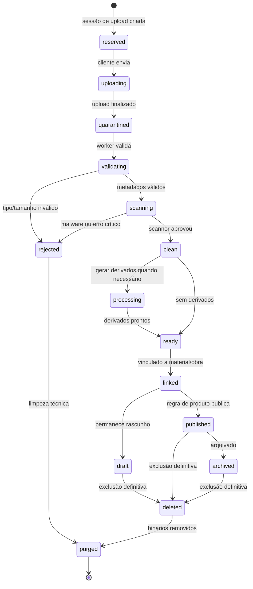
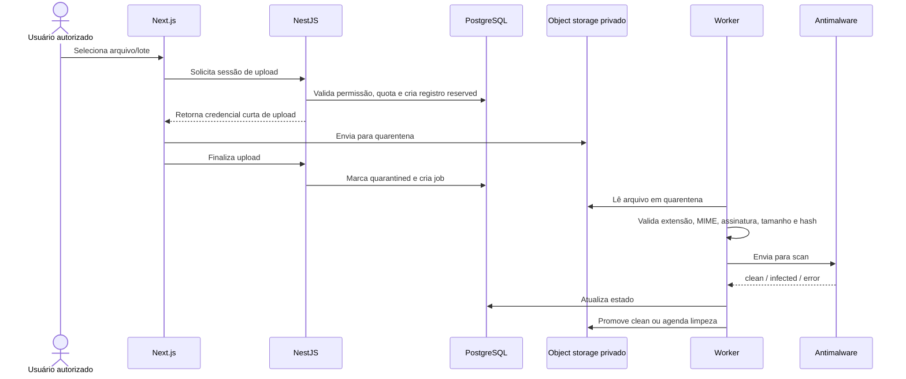
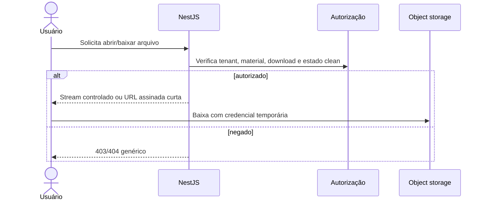

# Upload seguro e antimalware

Status: Aceito  
Última revisão: 2026-07-09

Este documento operacionaliza o
[ADR-0021](../decisions/0021-secure-upload-antimalware-and-file-serving.md).

## 1. Objetivo

Proteger o Concentus contra arquivos maliciosos, vazamento de materiais privados,
abuso de storage, exploração de parsers e entrega insegura de conteúdo.

Upload seguro cobre:

- autorização para enviar;
- validação de tipo e tamanho;
- quarentena;
- antimalware;
- processamento em worker;
- publicação segura;
- download/visualização com autorização;
- limpeza e retenção.

## 2. Ciclo de vida do arquivo



Estados de arquivo não substituem estados de material. Um arquivo pode estar
`ready`, mas o material continuar em rascunho.

## 3. Fluxo de upload



Credenciais de upload são curtas, escopadas para um objeto esperado e não concedem
leitura do storage.

## 4. Allowlist da V1

| Família | Extensões | MIME esperado | Assinatura mínima | Tratamento |
|---|---|---|---|---|
| PDF | `.pdf` | `application/pdf` | `%PDF-` | preview interno e download opcional |
| JPEG | `.jpg`, `.jpeg` | `image/jpeg` | SOI JPEG | preview interno |
| PNG | `.png` | `image/png` | assinatura PNG | preview interno |
| WebP | `.webp` | `image/webp` | RIFF/WEBP | preview interno |
| MP3 | `.mp3` | `audio/mpeg` | ID3 ou frame MPEG | download; player futuro |
| WAV | `.wav` | `audio/wav` | RIFF/WAVE | download; player futuro |
| M4A | `.m4a` | `audio/mp4` | contêiner MP4 | download; player futuro |
| OGG | `.ogg` | `audio/ogg` | OggS | download; player futuro |
| Word | `.docx` | OOXML Word | ZIP OOXML validado | download apenas |
| Excel | `.xlsx` | OOXML Excel | ZIP OOXML validado | download apenas |
| PowerPoint | `.pptx` | OOXML PowerPoint | ZIP OOXML validado | download apenas |

ZIP genérico não é aceito, mesmo que OOXML internamente use ZIP. OOXML precisa ser
validado como pacote Office esperado, sem aceitar qualquer arquivo compactado.

## 5. Bloqueios explícitos da V1

Rejeitar:

- `.exe`, `.dll`, `.bat`, `.cmd`, `.ps1`, `.sh`, `.js`, `.jar`, `.msi`;
- `.html`, `.htm`, `.svg`, `.xml` enviado como conteúdo de usuário;
- `.zip`, `.rar`, `.7z`, `.tar`, `.gz` como upload genérico;
- `.doc`, `.xls`, `.ppt` legados;
- arquivos com macro, como `.docm`, `.xlsm`, `.pptm`;
- arquivos sem extensão;
- extensão dupla suspeita, como `partitura.pdf.exe`;
- nome com byte nulo, separador de diretório, controle invisível ou normalização
  ambígua.

## 6. Limites iniciais

| Categoria | Limite |
|---|---:|
| PDF | 50 MB |
| Imagem | 15 MB |
| Áudio | 250 MB |
| Documento editável | 50 MB |
| Arquivos por lote | 250 |
| Total por lote | 2 GB |
| Quota inicial recomendada por orquestra | 100 GB |
| Alerta de quota | 80% |
| Bloqueio de novos uploads | 100% |

Esses limites são configuração operacional. O admin master pode ajustar por
ambiente ou por orquestra, com log técnico.

## 7. Validações obrigatórias

Validar em camadas:

1. usuário autenticado e autorizado;
2. biblioteca/obra/comunicado/perfil de destino;
3. quota da orquestra;
4. limite por arquivo e lote;
5. extensão normalizada;
6. MIME informado, apenas como sinal fraco;
7. assinatura/magic bytes;
8. estrutura interna quando aplicável, como OOXML;
9. hash criptográfico do conteúdo;
10. antimalware;
11. permissão de publicação ou rascunho.

Nenhuma camada isolada aprova o arquivo sozinha.

## 8. Nomes e metadados

- Nome físico é gerado pela aplicação.
- Nome original é metadado, não caminho.
- Título exibido na plataforma é separado do nome original.
- Nome sugerido para download é gerado pelo sistema a partir do título seguro,
  número da obra, naipe/voz e extensão aprovada.
- Nome original perigoso é preservado no máximo como metadado restrito para
  suporte, nunca refletido sem sanitização.
- Limite inicial do nome original: 180 caracteres após normalização.

Exemplo:

```text
original: ../../scan<script>.pdf
storage: tenants/{orchestra_id}/clean/{file_id}.pdf
download: 055-o-gato-branco-trompete-1.pdf
```

## 9. Antimalware

### Contrato

Todo scanner deve retornar:

- `clean`;
- `infected`;
- `error`;
- `timeout`;
- identificador da engine;
- versão/assinatura quando disponível;
- data da varredura.

### Política

| Resultado | Ação |
|---|---|
| `clean` | pode promover para `clean`/`ready` |
| `infected` | rejeitar, bloquear download e registrar evento técnico |
| `error` | falhar fechado em produção |
| `timeout` | repetir com limite; depois falhar fechado |

O usuário recebe mensagem genérica: arquivo rejeitado por segurança ou falha de
processamento. Detalhes de assinatura ficam em log técnico restrito.

### ClamAV na V1

Para ambiente próprio, ClamAV/clamd é a opção inicial recomendada. O worker deve
preferir daemon (`clamd`) por desempenho. `clamscan` pode ser usado localmente ou
em fallback controlado, mas não deve virar gargalo em produção.

Assinaturas desatualizadas geram alerta operacional. Scanner indisponível bloqueia
promoção de novos arquivos em produção.

## 10. Processamento seguro

| Tipo | Processamento V1 |
|---|---|
| PDF | metadados, páginas/thumbnail se necessário, sem executar scripts |
| Imagem | reprocessar avatar/imagem institucional para remover metadados |
| Áudio | metadados básicos; sem transcodificação obrigatória |
| OOXML | validar estrutura; sem renderizar preview |

Processadores rodam no worker com:

- timeout;
- limite de memória;
- limite de tamanho de saída;
- diretório temporário isolado;
- limpeza garantida;
- sem acesso a segredos desnecessários;
- logs sem conteúdo sensível.

## 11. Entrega de arquivos

Arquivos nunca são servidos diretamente de um bucket público.

Fluxo de download:



Headers mínimos:

| Header | Regra |
|---|---|
| `Content-Type` | definido pela aplicação, não pelo upload original |
| `Content-Disposition` | `inline` para preview seguro; `attachment` para download/documentos |
| `X-Content-Type-Options` | `nosniff` |
| `Cache-Control` | privado/curto para URLs assinadas; sem cache para respostas sensíveis |

## 12. Retenção e limpeza

| Caso | Binário | Metadado |
|---|---|---|
| Upload reservado sem envio | remover após 24 h | reter evento técnico |
| Upload incompleto visível ao usuário | notificar e remover após 7 dias | reter histórico mínimo |
| Quarentena com falha técnica | remover após 7 dias | reter erro técnico |
| Malware detectado | remover após até 7 dias, salvo investigação | reter log seguro |
| Rascunho de negócio limpo | não expira automaticamente | permanece |
| Exclusão definitiva | remover original e derivados | reter log mínimo |

Quando houver aviso ao usuário, o padrão inicial é notificar 48 horas antes da
limpeza de upload incompleto associado a um rascunho visível.

## 13. Observabilidade

Eventos mínimos:

- upload session created;
- upload completed;
- validation failed;
- scan clean;
- scan infected;
- scan error/timeout;
- processing failed;
- file promoted;
- file linked;
- download denied;
- signed URL issued;
- file purged.

Não registrar:

- URL assinada;
- conteúdo do arquivo;
- token de upload;
- segredo de storage;
- assinatura de malware exposta ao usuário comum;
- path físico completo quando não necessário.

## 14. Testes mínimos

| Teste | Esperado |
|---|---|
| `.exe` renomeado para `.pdf` | rejeitado por assinatura |
| PDF válido acima de 50 MB | rejeitado antes do scan caro |
| `Content-Type: application/pdf` com imagem | não aprova sozinho |
| arquivo limpo em quarentena | não gera URL pública |
| EICAR ou malware de teste | rejeitado pelo scanner |
| scanner fora em produção | arquivo não promove |
| nome com traversal | storage key segura e header sanitizado |
| usuário de outro tenant conhece ID | não obtém URL |
| download desabilitado no material | URL não emitida |
| OOXML com macro | rejeitado |
| lote com 249 válidos e 1 inválido | válidos seguem; inválido rejeitado |
| exclusão definitiva | remove original e derivados |

## 15. Pendências

- escolher provedor final de object storage;
- definir infraestrutura final do scanner em produção;
- decidir se imagens institucionais terão reprocessamento obrigatório já na V1;
- calibrar quota por orquestra após estimativa real de storage;
- decidir se CDR será adotado antes de documentos Office virarem uso frequente;
- manter o dicionário de arquivos sincronizado com
  [content.md](../database/dictionary/content.md) quando a implementação física
  começar.

## 16. Referências

- https://cheatsheetseries.owasp.org/cheatsheets/File_Upload_Cheat_Sheet.html
- https://owasp.org/www-community/vulnerabilities/Unrestricted_File_Upload
- https://owasp.org/API-Security/editions/2023/en/0xa4-unrestricted-resource-consumption/
- https://docs.clamav.net/manual/Usage/Scanning.html
- https://www.eicar.org/download-anti-malware-testfile/
- https://www.rfc-editor.org/rfc/rfc6266
- https://cheatsheetseries.owasp.org/cheatsheets/HTTP_Headers_Cheat_Sheet.html
