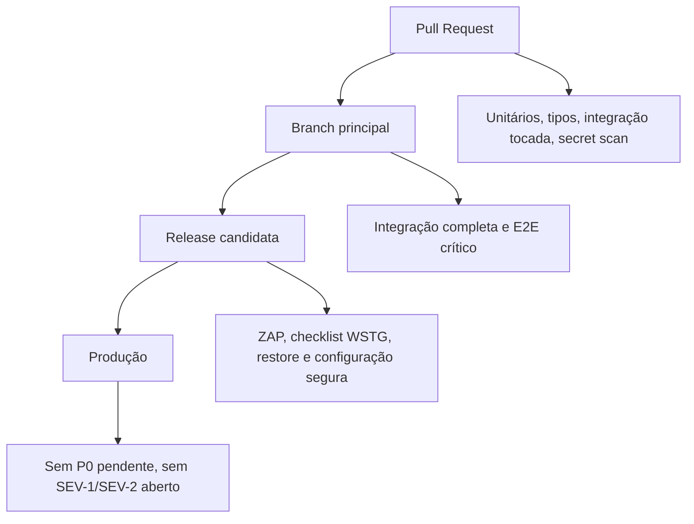

# Testes de segurança e critérios de aceite

Status: Aceito  
Última revisão: 2026-07-09

Este documento operacionaliza o
[ADR-0023](../decisions/0023-security-tests-and-acceptance-gates.md).

## 1. Objetivo

Fechar o pacote de segurança da V1 em termos verificáveis.

Este documento responde:

- quais testes provam os controles;
- quais gates bloqueiam merge, release e produção;
- qual evidência precisa existir;
- quando uma exceção pode ser aceita;
- quando podemos dizer que o bloco de segurança está documentalmente fechado.

## 2. Modelo de gates

## 3. Critérios por gate

| Gate | Bloqueia se |
|---|---|
| PR | teste crítico falha, cobertura cai, segredo aparece, autorização tocada sem teste |
| Branch principal | suíte completa de segurança falha |
| Release candidata | ZAP/checklist/restore/configuração segura falha sem exceção aprovada |
| Produção | P0 sem teste, SEV-1/SEV-2 aberto, backup não restaurado ou segredo exposto |

## 4. Matriz P0

| Ameaça | Teste mínimo |
|---|---|
| TM-01 cross-tenant | API e DB negam UUID de outro tenant |
| TM-02 elevação de líder | líder não altera bloqueio do maestro |
| TM-03 sessão roubada/fixada | login gira sessão; revogada não acessa |
| TM-04 CSRF | mutação sem token/origem válida falha |
| TM-05 upload malicioso | extensão falsa, malware e excesso de tamanho são rejeitados |
| TM-06 impersonação | ação não culpa usuário representado no histórico operacional |
| TM-07 worker sem tenant | job falha fechado |
| TM-08 token vazado | convite/reset reutilizado ou fora de escopo falha |
| TM-09 relatório sem tenant | consulta administrativa exige contexto/camada própria |
| TM-10 auditoria perdida | ação crítica e auditoria persistem na mesma transação |
| TM-11 brute force | falhas entram em cooldown sem enumeração |
| TM-12 abuso de recurso | quota/limite retorna `429`, fila ou recusa segura |
| TM-13 segredo vazado | secret scan falha e logs mascaram segredo |
| TM-14 restore impossível | restore isolado prova RPO/RTO ou registra exceção |
| TM-15 incidente sem evidência | simulado SEV-1 gera linha do tempo e postmortem |

## 5. Catálogo mínimo por área

### Autenticação e sessão

- senha correta cria sessão somente após MFA exigido;
- senha errada não revela se e-mail existe;
- sessão usa cookie `HttpOnly`, `Secure`, `SameSite=Lax`, `Path=/` e sem `Domain`;
- logout revoga sessão no servidor;
- troca de senha revoga outras sessões;
- ação sensível exige reautenticação recente;
- admin master sem MFA não acessa painel técnico.

### CSRF, CORS e headers

- `POST`, `PUT`, `PATCH` e `DELETE` sem CSRF falham;
- `GET`, `HEAD` e `OPTIONS` não alteram estado;
- origem inválida falha;
- rota autenticada não permite CORS curinga com credenciais;
- headers mínimos aparecem no build de produção;
- resposta autenticada sensível usa `Cache-Control: no-store`.

### Tenant, RLS e autorização

- sem `app.orchestra_id`, tabela tenant-scoped não retorna dados;
- contexto A não lê recurso B;
- insert/update com `orchestra_id` divergente falha;
- conexão reutilizada não herda tenant anterior;
- papel da aplicação não possui `BYPASSRLS`;
- matriz de papéis cobre maestro/admin, líder, músico, responsável de sala e
  concessões individuais;
- peso administrativo maior administra menor; mesmo peso coadministra; menor
  solicita.

### Convites, reset e MFA

- convite é uso único;
- convite de e-mail diferente falha;
- reset responde uniformemente para conta existente e inexistente;
- token de reset reutilizado falha;
- MFA invalida desafio após excesso de tentativas;
- códigos de recuperação são uso único.

### Impersonação e auditoria

- impersonação exige MFA/reautenticação recente e motivo;
- ação via impersonação exige segunda confirmação quando mutável;
- histórico da orquestra mostra ação técnica da plataforma;
- log técnico restrito preserva master, representado e motivo;
- tentativa negada sensível gera auditoria segura.

### Rate limit e abuso

- login falho aplica cooldown;
- recuperação em excesso não envia novo e-mail;
- download em massa é limitado;
- SSE recusa conexões excessivas;
- spam de comentários retorna `429`;
- falha no limitador não libera rota sensível.

### Upload e arquivos

- arquivo com extensão proibida falha;
- extensão permitida com assinatura errada falha;
- malware de teste é rejeitado;
- scanner indisponível em produção bloqueia promoção;
- arquivo em quarentena não gera URL;
- usuário sem acesso não obtém URL assinada;
- material com download desabilitado não emite URL;
- exclusão definitiva remove original e derivados.

### Jobs e workers

- job criado na mesma transação da operação principal;
- rollback remove job e estado;
- job sem tenant falha fechado;
- job com recurso de outro tenant falha fechado;
- retry não duplica notificação;
- dead letter registra correlação sem segredo.

### Segredos, logs, backup e incidentes

- secret scan bloqueia segredo de teste;
- aplicação não inicia em produção sem segredo obrigatório;
- logs mascaram tokens, URLs assinadas e senhas;
- backup automatizado existe;
- WAL archiving monitorado;
- restore isolado prova login, tenant e arquivo;
- simulado SEV-1 gera registro, linha do tempo e pós-incidente.

## 6. DAST e checks automatizados

| Check | Momento |
|---|---|
| ZAP baseline | release candidata |
| ZAP API scan | release candidata quando houver OpenAPI |
| Verificação de headers | branch principal e release |
| Verificação de cookies | branch principal e release |
| Secret scanning | toda PR |
| Dependency audit | toda PR, quando houver dependências |
| OpenAPI lint/security review | quando contrato existir |

ZAP é complementar. Alerta de scanner precisa triagem; falso positivo vira exceção
com prazo ou ajuste de configuração, nunca silêncio invisível.

## 7. Checklist manual reduzido WSTG

Antes de release candidata:

1. tentar acessar recurso de outro tenant alterando ID/URL;
2. tentar repetir token de convite/reset;
3. tentar mutação sem CSRF via cliente HTTP;
4. verificar cookies e headers no navegador;
5. testar upload com arquivo renomeado;
6. confirmar que erro não expõe stack trace ou segredo;
7. confirmar que usuário sem permissão não vê ação escondida nem consegue chamá-la
   por API;
8. revisar logs de uma jornada crítica e confirmar ausência de tokens/segredos;
9. confirmar que links assinados expiram;
10. confirmar que restore recente existe ou exceção foi aprovada.

## 8. Evidência de release

Cada release candidata deve registrar:

- versão/commit;
- data;
- ambiente;
- responsável;
- resultado dos gates;
- cobertura;
- resultado dos E2E críticos;
- resultado de integração PostgreSQL/RLS;
- resultado de ZAP;
- data do último restore válido;
- exceções abertas e prazo;
- decisão final: aprovado, aprovado com risco aceito ou bloqueado.

## 9. Política de exceção

Exceção precisa ser curta e explícita.

| Campo | Obrigatório |
|---|---|
| Controle afetado | Sim |
| Risco | Sim |
| Ambiente | Sim |
| Motivo | Sim |
| Mitigação temporária | Sim |
| Dono | Sim |
| Prazo | Sim |
| Teste a criar/reativar | Sim |

Não aceitar exceção silenciosa para:

- vazamento cross-tenant;
- bypass administrativo;
- segredo de produção exposto;
- backup sem restore;
- malware publicado;
- sessão/cookie inseguro em produção.

## 10. Critério de fechamento do pacote de segurança

O pacote de segurança da documentação fica fechado quando:

1. ADRs 0017 a 0023 estão aceitos;
2. threat model possui P0 com mitigação, teste e observabilidade;
3. cada documento operacional aponta seus testes mínimos;
4. os gates de PR, release e produção estão definidos;
5. pendências restantes dependem de escolha de infraestrutura ou implementação,
   não de regra de segurança desconhecida.

## 11. Pendências

- escolher ferramenta concreta de secret scanning;
- escolher ferramenta de dependency audit conforme package manager final;
- definir provedor de CI e retenção de artefatos;
- decidir quando pedir revisão/pentest externo antes de abertura pública ampla;
- criar templates de relatório de release e exceção quando houver repositório de
  código.

## 12. Referências

- https://owasp.org/www-project-application-security-verification-standard/
- https://csrc.nist.gov/pubs/sp/800/218/final
- https://owasp.org/www-project-web-security-testing-guide/
- https://cheatsheetseries.owasp.org/cheatsheets/Authorization_Testing_Automation_Cheat_Sheet.html
- https://cheatsheetseries.owasp.org/cheatsheets/Authorization_Regression_Testing_Cheat_Sheet.html
- https://www.zaproxy.org/docs/docker/baseline-scan/
- https://www.zaproxy.org/docs/docker/api-scan/
- https://playwright.dev/docs/test-assertions
- https://vitest.dev/guide/coverage
