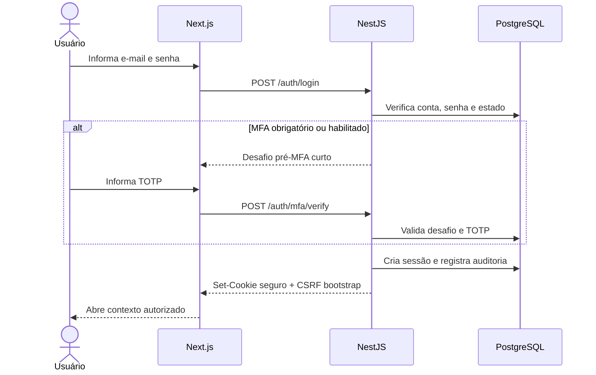
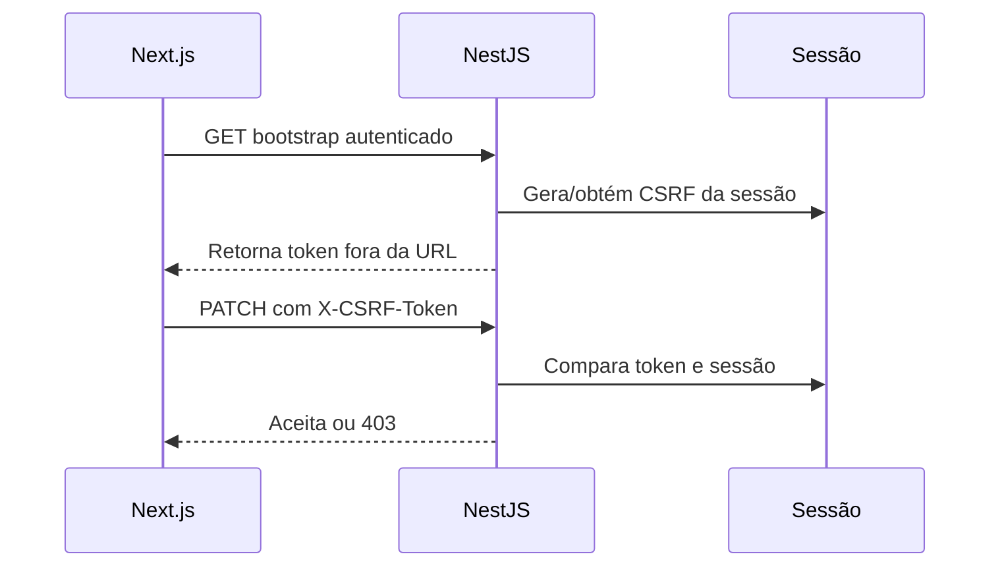

# Autenticação, sessões, cookies e CSRF

Status: Aceito  
Última revisão: 2026-07-09

Este documento operacionaliza o
[ADR-0018](../decisions/0018-authentication-sessions-cookies-and-csrf.md).

## 1. Fluxo de autenticação



Nenhuma sessão completa é criada antes de concluir MFA exigido. O desafio pré-MFA
é curto, server-side e sem acesso a dados de negócio.

## 2. Senhas

| Regra | Decisão |
|---|---|
| Mínimo | 15 caracteres |
| Máximo | pelo menos 128 caracteres |
| Composição obrigatória | Não usar |
| Espaços e frases | Permitidos |
| Troca periódica | Não exigir sem motivo |
| Bloqueio de senha fraca | Lista local ou serviço documentado com privacidade |
| Armazenamento | Argon2id com salt e parâmetros revisáveis |

Mensagens de erro não revelam se e-mail existe, se senha errou ou se a conta está
ativa. O usuário recebe uma resposta genérica e segura.

## 3. MFA

| Tema | Regra |
|---|---|
| Admin master | MFA obrigatório antes de acessar painel técnico |
| Maestro/admin | Opcional e recomendado |
| Método inicial | TOTP |
| Recuperação | Códigos de recuperação de uso único, armazenados como hash |
| Perda de MFA do master | Procedimento técnico documentado e auditado |

A tela deve incentivar salvar códigos de recuperação. O sistema não deve exibir
novamente o segredo TOTP ou os códigos depois da conclusão.

## 4. Cookie de sessão

Cookie inicial:

```text
Set-Cookie: __Host-concentus_session=<token>; Path=/; HttpOnly; Secure; SameSite=Lax
```

Regras:

- sem atributo `Domain`;
- valor é aleatório forte e opaco;
- banco armazena somente hash/HMAC do token;
- token não contém dados do usuário;
- token não aparece em URL, localStorage, logs ou payload de job;
- rotação ocorre após login, MFA, elevação e eventos sensíveis.

## 5. Classes de sessão

| Contexto | Ociosidade | Absoluta | Observação |
|---|---:|---:|---|
| Uso comum | 14 dias | 30 dias | músico não deve logar a cada ensaio |
| Ação sensível | 15 minutos | — | exige senha/MFA recente |
| Admin master | 2 horas | 12 horas | reduz risco da conta técnica |
| Impersonação | 30 minutos | 30 minutos | sessão curta, visível e auditada |
| Desafio pré-MFA/reset | 10 minutos | 10 minutos | não concede acesso completo |

Ações sensíveis incluem:

- alterar e-mail, senha ou MFA;
- promover, rebaixar ou alterar peso administrativo;
- iniciar impersonação;
- excluir definitivamente arquivo, comunicado ou orquestra;
- revogar sessão de outro dispositivo;
- alterar política global de segurança;
- acessar log técnico restrito.

## 6. Revogação

Uma sessão é revogada quando:

- usuário sai manualmente;
- usuário revoga o dispositivo na lista de sessões;
- senha é alterada;
- conta global é bloqueada;
- perfil da orquestra é desativado e a sessão tenta atuar naquele tenant;
- admin master encerra sessão técnica;
- timeout é atingido;
- risco operacional exige revogação forçada.

O usuário poderá ver sessões com dados seguros: dispositivo aproximado, navegador,
IP aproximado ou região quando disponível, data de criação, último uso e tenant
mais recente. Não mostrar dados excessivamente precisos sem necessidade.

## 7. CSRF

Toda mutação autenticada por cookie exige token CSRF.



Regras:

- token vinculado à sessão;
- enviado em header `X-CSRF-Token`;
- nunca enviado em query string;
- obrigatório para `POST`, `PUT`, `PATCH` e `DELETE`;
- endpoint mutável sem token retorna `403`;
- falhas relevantes são logadas como evento de segurança;
- `Origin` deve bater com a origem esperada;
- `Referer` é fallback limitado;
- Fetch Metadata rejeita mutações cross-site quando disponível.

## 8. CORS

A API de negócio é same-origin. Na V1, a regra é:

- não liberar credenciais para origem curinga;
- não usar `Access-Control-Allow-Origin: *` em rota autenticada;
- permitir origens extras apenas por allowlist de ambiente;
- separar claramente configuração local, homologação e produção;
- registrar qualquer origem de produção como decisão operacional.

## 9. Headers mínimos

| Header | Valor inicial |
|---|---|
| `Strict-Transport-Security` | iniciar após HTTPS estável; preparar `max-age=63072000; includeSubDomains; preload` |
| `Content-Security-Policy` | `default-src 'self'`; scripts com nonce/hash; `object-src 'none'`; `frame-ancestors 'none'` |
| `X-Frame-Options` | `DENY` |
| `X-Content-Type-Options` | `nosniff` |
| `Referrer-Policy` | `strict-origin-when-cross-origin` |
| `Permissions-Policy` | negar recursos não usados |
| `Cache-Control` | `no-store` para HTML/API autenticados sensíveis |

A CSP final será refinada junto do frontend real, mas não deve depender de
`unsafe-inline` em produção sem justificativa registrada.

## 10. Testes mínimos

1. cookie possui `HttpOnly`, `Secure`, `SameSite=Lax`, `Path=/` e sem `Domain`;
2. sessão não nasce antes de MFA obrigatório;
3. login gira token de sessão;
4. logout revoga a sessão no servidor;
5. sessão revogada não acessa API;
6. troca de senha revoga outras sessões;
7. mutação sem CSRF falha com `403`;
8. mutação com `Origin` inválido falha;
9. `GET` não altera estado;
10. admin master sem MFA não acessa painel técnico;
11. ação sensível exige reautenticação recente;
12. CORS não permite credenciais de origem não autorizada;
13. resposta autenticada sensível usa `Cache-Control: no-store`;
14. headers mínimos aparecem nas rotas aplicáveis.

## 11. Pendências

- escolher biblioteca concreta de Argon2id no Node.js;
- definir lista ou serviço para senha comprometida;
- desenhar procedimento de recuperação de MFA do admin master;
- fechar CSP final quando o frontend existir;
- definir política visual da tela de sessões ativas;
- calibrar os limites do ADR-0020 após testes reais de uso.

## 12. Referências

- https://owasp.org/www-project-application-security-verification-standard/
- https://cheatsheetseries.owasp.org/cheatsheets/Authentication_Cheat_Sheet.html
- https://cheatsheetseries.owasp.org/cheatsheets/Password_Storage_Cheat_Sheet.html
- https://cheatsheetseries.owasp.org/cheatsheets/Session_Management_Cheat_Sheet.html
- https://cheatsheetseries.owasp.org/cheatsheets/Cross-Site_Request_Forgery_Prevention_Cheat_Sheet.html
- https://cheatsheetseries.owasp.org/cheatsheets/HTTP_Headers_Cheat_Sheet.html
- https://pages.nist.gov/800-63-4/sp800-63b.html
- https://developer.mozilla.org/en-US/docs/Web/HTTP/Reference/Headers/Set-Cookie
