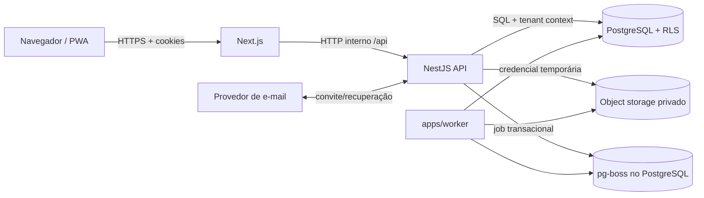

# Threat model inicial

Status: Inicial  
Última revisão: 2026-07-09

Este documento registra o modelo inicial de ameaças do Concentus. Ele será
revisado sempre que uma nova superfície relevante for adicionada.

## 1. Escopo

Incluído:

- login, sessão, recuperação de senha e MFA;
- convites de uso único;
- rate limit e controle de abuso;
- resolução de tenant por slug;
- autorização por papel, peso, contexto e concessões;
- bibliotecas, obras, materiais e downloads;
- comunicados, comentários, votos e notificações;
- impersonação pelo admin master;
- uploads, antimalware e processamento de arquivos;
- jobs pg-boss e worker;
- PostgreSQL com tenant explícito e RLS obrigatória;
- object storage privado;
- segredos, backup, restore e resposta a incidentes.

Fora deste documento inicial:

- chat em tempo real futuro;
- blogs e descoberta entre orquestras;
- app móvel nativo;
- integrações externas avançadas.

## 2. Ativos protegidos

| Ativo | Sensibilidade | Risco principal |
|---|---|---|
| Conta global | Alta | tomada de conta e acesso a múltiplas orquestras |
| Perfil por orquestra | Pessoal | exposição indevida de dados e papel contextual |
| Conteúdo de biblioteca | Interna/privada | vazamento de materiais e repertório |
| Arquivos físicos | Interna/privada | URL vazada, download indevido, malware ou parser exploit |
| Comunicados e interações | Interna/pessoal | exposição, falsificação ou moderação incorreta |
| Auditoria | Alta | perda de responsabilização |
| Sessão e tokens | Crítica | sequestro ou replay |
| Contexto de tenant | Crítica | vazamento entre orquestras |
| Jobs e payloads | Interna/crítica | ação assíncrona no tenant errado |
| Segredos operacionais | Crítica | comprometimento amplo da plataforma |
| Limites e quotas | Alta | abuso, DoS, custo excessivo e falso positivo operacional |
| Backups e logs | Crítica | perda de dados, restore impossível ou evidência insuficiente |

## 3. Atores

| Ator | Descrição |
|---|---|
| Músico autenticado | Acessa materiais e comunicados próprios |
| Líder | Atua em contexto limitado de naipe ou sala |
| Maestro/admin | Administra uma orquestra |
| Admin master | Opera a plataforma e pode impersonar tecnicamente |
| Usuário convidado | Possui link de convite ainda não consumido |
| Visitante anônimo | Acessa login global ou contextual |
| Atacante externo | Não possui conta válida |
| Atacante autenticado | Possui conta comum e tenta ampliar acesso |
| Worker | Processo interno que executa efeitos assíncronos |

## 4. Fronteiras de confiança

Fronteiras críticas:

1. navegador para aplicação;
2. login anônimo para sessão autenticada;
3. conta global para perfil de uma orquestra;
4. aplicação para PostgreSQL;
5. aplicação para object storage;
6. API para worker;
7. admin master para impersonação;
8. e-mail externo para convite/recuperação.

## 5. Ameaças P0

| ID | STRIDE | Ameaça | Mitigação inicial | Teste mínimo | Observabilidade |
|---|---|---|---|---|---|
| TM-01 | Information Disclosure | Usuário da orquestra A lê recurso da B por ID conhecido | autorização server-side, `orchestra_id`, FK composta e RLS | API e DB negam acesso cruzado com UUID válido de outro tenant | evento de negação cruzada com tenant e correlação |
| TM-02 | Elevation of Privilege | Líder amplia público ou altera decisão bloqueada pelo maestro | matriz de autorização, bloqueio `maestro_locked`, testes combinatórios | líder tenta alterar parte bloqueada e recebe negação | auditoria de tentativa negada sensível |
| TM-03 | Spoofing | Sessão roubada ou fixada assume conta legítima | sessão opaca, cookie `HttpOnly/Secure/SameSite`, rotação e revogação | login gira sessão; sessão revogada não acessa API | login, rotação, revogação e uso anômalo |
| TM-04 | Tampering | CSRF executa ação administrativa com cookie válido | token CSRF, validação de origem e Fetch Metadata | POST sem token/origem válida falha | log de possível CSRF sem dados sensíveis |
| TM-05 | Tampering / DoS | Upload malicioso explora parser, consome storage ou entrega malware | allowlist, MIME real, assinatura, limites, quarentena, processamento isolado e antimalware | arquivo disfarçado/maior que limite ou malware de teste é rejeitado | eventos de rejeição, scan e fila de processamento |
| TM-06 | Repudiation | Ação via impersonação parece ter sido feita pela conta representada | log técnico restrito com admin master + representado; histórico da orquestra usa ação técnica | ação impersonada não culpa o usuário na auditoria operacional | início, ação crítica e fim da sessão técnica |
| TM-07 | Elevation / Disclosure | Worker processa job sem tenant ou com tenant errado | payload mínimo com `orchestra_id`, validação do estado atual e falha fechada | job sem tenant ou com recurso cruzado vai para erro seguro | dead letter com correlação e sem segredo |
| TM-08 | Information Disclosure | URL assinada ou token de convite/recuperação vaza | tokens curtos, hash em banco, uso único, escopo e expiração quando aplicável | token reutilizado ou de e-mail diferente falha | consumo, rejeição e revogação auditados |
| TM-09 | Tampering | Query administrativa ignora filtro de tenant | camada de leitura com contexto obrigatório e RLS | relatório com IDs mistos não retorna dados cruzados | alerta para execução sem tenant context |
| TM-10 | Repudiation / Tampering | Auditoria crítica é perdida ou alterada | auditoria crítica na mesma transação e append-only para aplicação comum | rollback remove estado e auditoria; commit grava ambos | trilha pesquisável por correlação |
| TM-11 | DoS / Spoofing | Credential stuffing, password spraying ou brute force contra login/MFA | MFA para master, senhas fortes, resposta genérica, cooldown progressivo e limite por conta/e-mail/IP | falhas sucessivas entram em cooldown sem revelar existência da conta | evento de autenticação throttled sem senha/token |
| TM-12 | DoS | Abuso de e-mail, upload, download, SSE, busca ou jobs esgota recursos/custos | rate limit por ação, quotas, concorrência, validação barata e fan-out assíncrono | exceder quota retorna `429`, fila ou recusa segura | evento de abuso com política acionada e correlação |
| TM-13 | Information Disclosure / Elevation | Segredo de produção vaza em código, log ou deploy | secret scanning, inventário, menor privilégio, rotação e logs mascarados | segredo de teste no commit falha pipeline; logs mascaram tokens | evento de secret scanning e rotação auditada |
| TM-14 | DoS / Tampering | Backup não restaura ou restore perde dados além do aceitável | backup automatizado, WAL archiving, object backup, restore mensal e RPO/RTO | restore isolado prova login, tenant e arquivo autorizado | alerta de backup/WAL/restore e relatório de ensaio |
| TM-15 | Repudiation | Incidente crítico não preserva evidência nem linha do tempo | playbook, severidade, scribe, logs protegidos e postmortem | simulado SEV-1 gera registro completo | registro de incidente e ações pós-incidente |

## 6. Decisões aceitas neste threat model

- segurança usa ASVS 5.0.0 como referência;
- threat model usa DFD + STRIDE;
- sessão da V1 é opaca e server-side;
- JWT em `localStorage` não será usado para sessão web principal;
- CSRF é obrigatório para mutações autenticadas por cookie;
- RLS é defesa em profundidade e não substitui autorização da API;
- admin master possui MFA obrigatório;
- rate limit e controle de abuso são obrigatórios para autenticação, e-mail,
  arquivos, SSE, interações e jobs;
- uploads são tratados como entrada hostil até validação, scan e processamento;
- nenhum arquivo enviado por usuário é publicado antes de passar por quarentena e
  antimalware;
- segredos reais não entram no repositório, logs ou documentação;
- backup só é considerado fechado após restore testado;
- incidentes SEV-1 e SEV-2 exigem linha do tempo e pós-incidente;
- cada ameaça P0 precisa de teste ou evidência conforme ADR-0023;
- worker não confia cegamente no payload do job.

## 7. Pendências que seguem abertas

- política de lembrar dispositivo para MFA;
- ferramenta final de antimalware em produção e provedor de object storage;
- decisão futura sobre CDR se documentos editáveis ganharem uso frequente;
- ferramenta final de secret management, backup e logs centralizados;
- templates finais de evidência quando houver CI/release real.

## 8. Critério de revisão

Este documento deve ser revisado quando:

- novo módulo ou superfície externa for criado;
- uma ameaça P0 não tiver teste automatizado;
- um incidente ou bug de autorização ocorrer;
- uma decisão de sessão, RLS, rate limit, upload, antimalware, segredos, backup,
  incidente, auditoria ou gate de segurança mudar;
- antes de qualquer release candidata.

## 9. Referências

- https://owasp.org/www-project-application-security-verification-standard/
- https://cheatsheetseries.owasp.org/cheatsheets/Threat_Modeling_Cheat_Sheet.html
- https://cheatsheetseries.owasp.org/cheatsheets/Multi_Tenant_Security_Cheat_Sheet.html
- https://cheatsheetseries.owasp.org/cheatsheets/Session_Management_Cheat_Sheet.html
- https://cheatsheetseries.owasp.org/cheatsheets/Cross-Site_Request_Forgery_Prevention_Cheat_Sheet.html
- https://cheatsheetseries.owasp.org/cheatsheets/File_Upload_Cheat_Sheet.html
- https://www.postgresql.org/docs/current/ddl-rowsecurity.html
- https://owasp.org/API-Security/editions/2023/en/0xa4-unrestricted-resource-consumption/
- https://cheatsheetseries.owasp.org/cheatsheets/Credential_Stuffing_Prevention_Cheat_Sheet.html
- https://cheatsheetseries.owasp.org/cheatsheets/Forgot_Password_Cheat_Sheet.html
- https://cheatsheetseries.owasp.org/cheatsheets/Denial_of_Service_Cheat_Sheet.html
- https://owasp.org/www-community/vulnerabilities/Unrestricted_File_Upload
- https://docs.clamav.net/manual/Usage/Scanning.html
- https://cheatsheetseries.owasp.org/cheatsheets/Secrets_Management_Cheat_Sheet.html
- https://cheatsheetseries.owasp.org/cheatsheets/Logging_Cheat_Sheet.html
- https://csrc.nist.gov/pubs/sp/800/61/r2/final
- https://www.postgresql.org/docs/current/continuous-archiving.html
- https://owasp.org/www-project-web-security-testing-guide/
- https://cheatsheetseries.owasp.org/cheatsheets/Authorization_Testing_Automation_Cheat_Sheet.html
- https://cheatsheetseries.owasp.org/cheatsheets/Authorization_Regression_Testing_Cheat_Sheet.html
