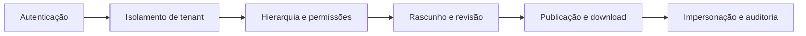
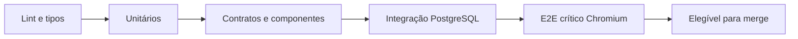

# Estratégia de testes

Este documento operacionaliza o [ADR-0014](decisions/0014-testing-strategy-and-quality-gates.md).
Os gates específicos de segurança foram fechados no
[ADR-0023](decisions/0023-security-tests-and-acceptance-gates.md) e em
[Testes de segurança e critérios de aceite](security/security-tests-and-acceptance.md).

## 1. Camadas

| Camada | Ferramenta principal | Prova esperada |
|---|---|---|
| Unitária | Vitest | Regra pura, precedência e transformação |
| Contrato | Vitest + geração OpenAPI | Schema e cliente sem divergência |
| Integração API | Vitest + Nest testing | Endpoint, autenticação e caso de uso |
| Integração DB | Vitest + PostgreSQL real | SQL, constraint, transação, migração e RLS |
| Componente | Storybook + addon Vitest | Estado visual, interação e acessibilidade |
| E2E | Playwright | Jornada completa no navegador |
| Manual | Checklist de release | Teclado, leitor de tela e dispositivos reais |

## 2. O que não deve ser simulado

Testes que afirmam provar persistência ou isolamento precisam utilizar:

- PostgreSQL da major suportada;
- esquema criado por migrações reais;
- constraints e índices reais;
- papéis e contexto de tenant equivalentes aos da produção;
- mais de uma conexão nos cenários de concorrência;
- armazenamento de objetos compatível quando o fluxo depender dele.

Um repositório falso pode acelerar teste unitário de caso de uso, mas não autoriza
afirmar que SQL, RLS ou transação funcionam.

### Provisionamento

O caminho padrão usa Testcontainers para iniciar PostgreSQL da major suportada,
aplicar todas as migrações e descartá-lo ao final. Ambientes controlados podem
fornecer `TEST_DATABASE_URL`, desde que:

- a aplicação esteja inequivocamente em modo de teste;
- host, banco e credencial não coincidam com produção;
- o banco possua marcação explícita de que é descartável;
- a suíte falhe antes de qualquer limpeza se uma verificação não passar;
- migrações e reset sejam executados apenas no escopo autorizado.

## 3. Cobertura

| Escopo | Linhas | Funções | Statements | Branches |
|---|---:|---:|---:|---:|
| Global | 80% | 80% | 80% | 75% |
| Segurança crítica | — | — | — | 90% |

O piso não pode diminuir. Melhorias podem elevar os thresholds por ratchet. Uma
redução exige ADR, motivo concreto e plano de recuperação — não apenas fazer o CI
voltar a ficar verde.

Escopo crítico inicial:

- autenticação e sessões;
- CSRF, CORS e headers;
- resolução e isolamento de tenant/RLS;
- hierarquia e autorização;
- convites de uso único;
- impersonação e auditoria;
- autorização e política de download;
- rate limit e abuso;
- upload, antimalware e serving de arquivos;
- workers e jobs com tenant;
- segredos, logs seguros, backup e restore.

Código gerado, tipos sem runtime e migrações declarativas não distorcem a métrica.
Migrações continuam obrigatoriamente testadas contra PostgreSQL real. Cobertura é
um indicador; a matriz de casos positivos, negativos e de fronteira continua
obrigatória.

## 4. Matriz de riscos obrigatória

Cada área crítica precisa de casos positivos, negativos e de fronteira. Conhecer
um UUID de outro tenant nunca deve transformar um teste negado em leitura válida.

## 5. Pull request

Falha em qualquer gate bloqueia merge. Exceção exige justificativa registrada e
prazo de correção; teste simplesmente desativado não conta como aprovado.

### Jornadas E2E críticas iniciais

| Jornada | Prova principal |
|---|---|
| Login, convite e recuperação | Identidade entra e recupera acesso com segurança |
| Isolamento entre orquestras | Identificador conhecido de outro tenant continua negado |
| Publicação de material | Maestro publica e músico autorizado encontra o material |
| Líder versus maestro | Líder atua no permitido e não ultrapassa bloqueio superior |
| Comunicado e ciência | Membro comenta e confirma; autor consulta o estado correto |
| Upload seguro | Arquivo válido passa; arquivo hostil não publica |
| Sessão e CSRF | Mutação sem token falha; sessão revogada não acessa |

O catálogo cresce quando um defeito relevante escapar ou uma nova jornada crítica
entrar no produto. Variações combinatórias de permissão devem ficar nas camadas
mais rápidas sempre que possível.

## 6. Branch principal e release

- repetir todos os gates da PR;
- executar Chromium, Firefox e WebKit;
- incluir viewport desktop, Chrome Android e Safari iOS representativos;
- gerar build de produção e iniciar com configuração equivalente à implantação;
- testar migração desde banco vazio;
- guardar relatório, trace e screenshot apenas em falhas ou conforme retenção de
  CI;
- executar checklist manual em Safari/iOS e nos fluxos críticos de acessibilidade;
- executar gates de segurança definidos no ADR-0023;
- executar ZAP baseline e ZAP API scan quando houver OpenAPI disponível;
- validar restore recente ou exceção formal antes de release candidata.

## 7. Organização

- testes unitários próximos ao código com sufixo `.spec.ts` ou `.test.ts`;
- E2E em área própria, organizado por jornada e papel;
- factories criam dados válidos por padrão e exigem override explícito para casos
  inválidos;
- IDs, datas e relógio são controláveis;
- nenhuma suíte depende da ordem de execução;
- snapshots não substituem assertions de regra de negócio.

## 8. Critérios iniciais de aceite

1. banco novo aceita todas as migrações em ordem;
2. banco integrado nunca é SQLite;
3. tentativa cruzada entre tenants é negada na API e no PostgreSQL;
4. stories interativas falham no CI por violações automatizáveis definidas;
5. jornada crítica funciona em Chromium em toda PR;
6. matriz completa funciona antes de release;
7. Safari/iOS real permanece no checklist manual.
8. cobertura abaixo do piso ou do ratchet bloqueia merge.
9. `TEST_DATABASE_URL` insegura falha antes de executar limpeza ou migração.
10. gate de segurança P0 pendente bloqueia release candidata.
11. segredo detectado no repositório bloqueia PR.
12. restore não testado bloqueia produção real.

## 9. Decisões pendentes

- paralelismo e particionamento da suíte;
- provedor de CI e retenção de artefatos;
