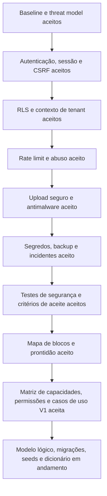

# Foco atual e próximos passos

Status: Vivo  
Última revisão: 2026-07-09

Este documento existe para impedir perda de ritmo. Ele resume onde paramos, o que
já foi decidido e qual é o próximo bloco de decisão. Não substitui ADRs nem
documentos de domínio.

## 1. Onde estamos

A fase atual ainda é arquitetura e segurança antes da implementação.

Já foram consolidados:

- produto multi-orquestra Concentus;
- papéis, hierarquia, convites, perfis, salas, naipes e vozes;
- bibliotecas, obras, materiais, publicação e download;
- comunicados, comentários, enquetes e notificações;
- stack TypeScript com Next.js, NestJS, PostgreSQL e Kysely;
- frontend, PWA, Storybook, temas e estratégia de dados;
- backend modular NestJS;
- pg-boss para jobs assíncronos no PostgreSQL;
- estratégia de testes com PostgreSQL real;
- acessibilidade WCAG 2.2 AA e matriz de navegadores;
- baseline de segurança e threat model inicial com ASVS 5.0.0, DFD e STRIDE;
- autenticação, sessão server-side, cookies seguros e CSRF;
- RLS e contexto seguro de tenant no PostgreSQL;
- rate limit e controle de abuso em camadas;
- upload seguro, quarentena, antimalware e entrega privada de arquivos;
- segredos fora do código, backup/restore testado e resposta a incidentes;
- testes de segurança e critérios de aceite;
- mapa de blocos e prontidão aprovado como espinha dorsal do planejamento;
- matriz detalhada de capacidades, permissões e casos de uso da V1 aceita.

## 2. Próximo foco

Foco atual: **P2 — modelo lógico relacional, migrações, seeds e dicionário de dados**.

Onda atual: **comunicação e notificações**, cobrindo comunicados, públicos,
prioridades, anexos, ciência, comentários, anonimato, reações, enquetes,
templates e notificações internas idempotentes.

Motivo: as ações da V1 já foram traduzidas em capacidades verificáveis. Agora o
banco precisa representar tenants, usuários, escopos, permissões, conteúdo,
comunicação, arquivos, jobs e auditoria de forma clara, rastreável e segura.

O mapa completo dos blocos está em
[Blocos de projeção e prontidão](governance/project-blocks-and-readiness.md).
A matriz P1 aceita está em
[Capacidades, permissões e casos de uso](product/capabilities-permissions-and-use-cases.md).

Ordem recomendada:

## 3. Não abrir ainda

Para manter foco, adiar por enquanto:

- layout visual final de telas;
- implementação do monorepo;
- escolha final de provedor de e-mail e storage;
- modelos avançados de chat/blog;
- otimização de infraestrutura;
- ajustes finos de performance, particionamento e custos antes de existir volume
  real.

## 4. Pendências que continuam importantes

| Tema | Momento de fechar |
|---|---|
| Provedor de e-mail | Antes da fundação operacional |
| Object storage | Antes de uploads reais |
| Limites e cotas de arquivos | Definido no ADR-0021; calibrar com infraestrutura |
| Política antimalware | Definido no ADR-0021 |
| RLS e tenant context | Definido no ADR-0019 |
| Sessão/cookies/CSRF | Definido no ADR-0018 |
| Rate limit e abuso | Definido no ADR-0020 |
| Upload seguro | Definido no ADR-0021 |
| Backup, restore e retenção | Definido no ADR-0022; calibrar com infraestrutura |
| Segredos e incidentes | Definido no ADR-0022 |
| Testes de segurança e aceite | Definido no ADR-0023 |

## 5. Critério para avançar

O bloco de segurança foi fechado em documentação arquitetural. Para seguir com
implementação futura, ainda será preciso transformar as regras em testes reais e
gates no CI.

Critério usado para sair do bloco de segurança:

1. modelo de ameaças inicial;
2. sessão e autenticação;
3. isolamento multi-tenant na aplicação e no banco;
4. upload seguro;
5. segredos e configuração;
6. logs de segurança e resposta a incidente;
7. testes mínimos que provam essas regras.
