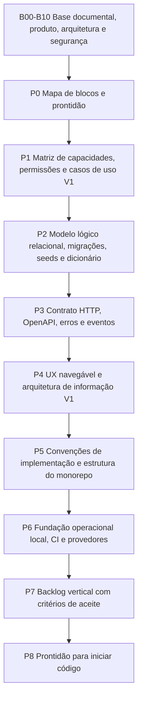

# Blocos de projeção e prontidão para implementação

Status: Aceito

Última revisão: 2026-07-09

Este documento amarra os blocos de decisão do Concentus até o início do código.
Ele existe para evitar duas falhas comuns:

1. decisões boas, mas espalhadas demais para guiar a implementação;
2. início prematuro do código antes de fechar os riscos estruturais mínimos.

O objetivo não é criar uma fase pesada de documentação infinita. O objetivo é
ter uma espinha dorsal clara: o que já está fechado, o que ainda falta, quando
uma decisão precisa de ADR, e qual é o critério objetivo para começar a codar.

## 1. Como pensar os blocos

Um bloco não é uma etapa rígida de waterfall. É um conjunto de decisões sobre uma
preocupação arquitetural ou de produto.

Cada bloco deve responder:

- qual problema ele resolve;
- quais documentos ou ADRs sustentam a decisão;
- quais decisões ainda estão pendentes;
- quais artefatos precisam existir antes do próximo bloco;
- qual critério permite considerar o bloco pronto por enquanto.

Blocos podem ser revisitados. A regra é: revisitar de forma rastreável, sem
apagar a história da decisão.

## 2. Este modelo é reconhecido?

Sim. A amarração por blocos segue práticas reconhecidas de engenharia de
software, adaptadas ao tamanho atual do Concentus.

Não existe um único formato universal, mas existe consenso em separar:

- requisitos e regras de negócio;
- decisões arquiteturais e seus motivos;
- visões da arquitetura;
- qualidade, segurança e operação;
- contratos técnicos;
- prontidão para implementação.

Referências usadas como base:

| Referência | Como influencia o Concentus |
|---|---|
| ISO/IEC/IEEE 42010 | Reforça a ideia de descrever arquitetura por estruturas, conceitos, pontos de vista e modelos, sem prender o projeto a uma ferramenta específica. |
| ISO/IEC/IEEE 29148 | Reforça que requisitos precisam produzir informações rastreáveis, com conteúdo suficiente para orientar sistemas e software ao longo do ciclo de vida. |
| arc42 | Inspira a documentação arquitetural pragmática, flexível e iterativa. |
| C4 Model | Inspira a separação futura entre contexto, containers, componentes e, se necessário, código. |
| ADRs | Sustentam o registro das decisões estruturais, com contexto, trade-offs e consequências. |
| Azure/AWS Well-Architected | Inspiram revisão por pilares: segurança, confiabilidade, operação, performance e custos. |
| Twelve-Factor App | Inspira práticas operacionais para aplicação web/SaaS, especialmente configuração, portabilidade e paridade entre ambientes. |
| Evolutionary Database Design | Inspira banco versionado por migrações e evolução incremental junto com a aplicação. |

## 3. O que já criamos

As decisões não foram realmente soltas. Elas seguiram preocupações naturais do
produto, mas a amarração estava implícita demais. Este mapa torna essa estrutura
explícita.

| Bloco | Estado | Fontes principais | Observação |
|---|---|---|---|
| B00 Governança documental | Definido | `README.md`, `docs/README.md`, `reference/versioning.md`, ADR-0004, `governance/decision-process.md` | Define documentação viva, changelog, ADRs e processo de decisão embasada. |
| B01 Produto e escopo da V1 | Definido conceitualmente | `product/vision-and-scope.md`, `product/roadmap-and-open-decisions.md` | Define Concentus como plataforma multi-orquestra, com V1 focada em identidade, bibliotecas, materiais e comunicação. |
| B02 Papéis, hierarquia e permissões conceituais | Em validação operacional | `product/roles-and-permissions.md`, `product/capabilities-permissions-and-use-cases.md`, ADR-0003 | Regras gerais existem; a matriz detalhada de ações foi criada para validação. |
| B03 Usuários, convites e perfis | Definido conceitualmente | `product/users-invitations-and-profiles.md`, ADR-0002 | Conta global e perfis por orquestra estão definidos. |
| B04 Orquestras, espaços, naipes e vozes | Definido conceitualmente | `product/orchestras-spaces-sections-and-voices.md` | Faltam detalhes de schema lógico e constraints. |
| B05 Bibliotecas, obras e materiais | Definido conceitualmente | `product/libraries-works-and-materials.md` | Regras de publicação, rascunho, download e compartilhamento existem; falta matriz por ação e banco lógico. |
| B06 Comunicados, interações e notificações | Definido conceitualmente | `product/announcements-and-notifications.md` | V1 inclui comunicação interativa; falta contrato de eventos/API. |
| B07 Identidade visual, frontend e PWA | Definido arquiteturalmente | `architecture/frontend/README.md`, ADR-0007 a ADR-0013 | Stack visual, rotas, temas, Storybook, PWA e formulários estão decididos. |
| B08 Stack, backend modular e jobs | Definido arquiteturalmente | ADR-0005, ADR-0015, ADR-0016, `architecture/backend/README.md` | Next.js, NestJS, PostgreSQL, Kysely, pg-boss e worker separado estão definidos. |
| B09 Testes, acessibilidade e navegadores | Definido arquiteturalmente | `architecture/testing-strategy.md`, ADR-0013, ADR-0014 | Estratégia de testes e compatibilidade estão definidas. |
| B10 Segurança | Definido arquiteturalmente | `architecture/security/README.md`, ADR-0017 a ADR-0023 | Threat model inicial, sessão, CSRF, RLS, upload seguro, rate limit, segredos, backup e gates estão definidos. |
| B11 Banco de dados | Estrutura criada; conteúdo pendente | `architecture/database/README.md`, ADR-0006 | Convenções existem; modelo lógico, migrações, seeds e dicionário ainda precisam ser produzidos. |

## 4. O que ainda falta antes de codar

Nem tudo abaixo precisa estar perfeito para sempre antes do primeiro commit. Mas
precisa estar bom o suficiente para o código nascer alinhado.

### P0 — Mapa de blocos e prontidão

Estado: aceito.

Resultado esperado:

- este documento aprovado;
- foco atual atualizado;
- ordem restante explícita.

Critério de pronto:

- conseguimos responder “onde estamos?” e “qual é o próximo bloco?” sem depender
  de memória da conversa.

### P1 — Matriz de capacidades, permissões e casos de uso V1

Estado: criado para validação.

Este é o bloco recomendado antes do banco.

Resultado esperado:

- lista de capacidades por módulo;
- ação, ator, recurso, escopo, pré-condições, exceções, efeitos colaterais,
  auditoria e notificações;
- regras de hierarquia traduzidas em ações verificáveis;
- casos de uso essenciais da V1 numerados.

Exemplo de pergunta que este bloco responde:

> Um líder pode publicar uma parte de obra em biblioteca criada pelo maestro,
> compartilhada com ele apenas como editor?

Sem essa matriz, o banco corre o risco de nascer bonito, mas incapaz de expressar
corretamente autorização, auditoria e notificações.

Critério de pronto:

- cada ação crítica da V1 possui regra de permissão, log, efeito assíncrono e
  cenário de aceite correspondente.

### P2 — Modelo lógico relacional, migrações, seeds e dicionário

Resultado esperado:

- schemas, tabelas, colunas, tipos e constraints;
- chaves primárias, estrangeiras, unicidade e índices;
- estratégia de RLS por tabela;
- estratégia de exclusão, arquivamento e retenção;
- migração inicial;
- seeds mínimos para desenvolvimento;
- dicionário de dados por tabela.

Critério de pronto:

- alguém novo consegue localizar onde cada dado mora e qual módulo é dono de
  cada escrita.

### P3 — Contrato HTTP, OpenAPI, erros e eventos

Resultado esperado:

- endpoints da V1;
- DTOs e schemas Zod compartilháveis;
- padrão de erro;
- paginação, filtros e ordenação;
- eventos SSE;
- contratos de jobs assíncronos visíveis à aplicação.

Critério de pronto:

- frontend e backend podem ser implementados em paralelo sem inventar contrato no
  meio do código.

### P4 — UX navegável e arquitetura de informação V1

Resultado esperado:

- fluxos mobile principais;
- fluxos administrativos desktop;
- navegação de materiais, comunicados, convites, perfil e administração;
- wireframes ou protótipo navegável suficiente;
- estados vazios, erro, carregamento e permissão negada.

Critério de pronto:

- sabemos por onde o usuário passa para executar cada caso de uso crítico.

### P5 — Convenções de implementação e estrutura do monorepo

Resultado esperado:

- estrutura de `apps` e `packages`;
- fronteiras entre Next.js, NestJS, worker e bibliotecas compartilhadas;
- padrão de módulos NestJS;
- padrão de transação, repositórios SQL/Kysely e jobs;
- padrão de validação, erros, logs e testes;
- regra de dependências entre pacotes.

Critério de pronto:

- o primeiro commit de código não precisa inventar arquitetura local.

### P6 — Fundação operacional local, CI e provedores

Resultado esperado:

- ambiente local com PostgreSQL descartável;
- `TEST_DATABASE_URL` e estratégia de Testcontainers;
- serviço local de e-mail para desenvolvimento;
- decisão inicial de object storage ou emulador;
- CI com lint, tipos e testes;
- política inicial de secrets;
- scripts de backup/restore planejados.

Critério de pronto:

- qualquer ambiente novo sobe de forma repetível e testável.

### P7 — Backlog vertical com critérios de aceite

Resultado esperado:

- épicos e histórias por fatias verticais;
- critérios de aceite rastreáveis às regras;
- primeira fatia vertical escolhida;
- ordem de implementação definida.

Critério de pronto:

- sabemos qual funcionalidade será implementada primeiro e quais testes provam
  que ela funciona.

### P8 — Prontidão para iniciar código

Resultado esperado:

- checklist final aprovado;
- pendências classificadas como bloqueantes ou adiadas;
- primeiro slice técnico/produto escolhido.

Critério de pronto:

- iniciar código reduz risco, em vez de criar dívida estrutural invisível.

## 5. Checklist mínimo para começar a codar

O Concentus pode começar a implementação quando todos os itens abaixo estiverem
verdadeiros ou explicitamente adiados com justificativa:

- escopo da V1 claro;
- matriz de capacidades/permissões da V1 aprovada;
- modelo lógico inicial do PostgreSQL aprovado;
- dicionário inicial de dados criado;
- contrato API inicial da primeira fatia vertical definido;
- regras de sessão, CSRF, RLS e upload traduzidas em testes planejados;
- ambiente local definido;
- CI mínimo definido;
- primeira fatia vertical escolhida;
- pendências restantes registradas com momento limite.

## 6. Próximo bloco recomendado

A recomendação é não ir direto para o banco ainda.

O próximo bloco deve ser:

> **P1 — Matriz de capacidades, permissões e casos de uso V1.**

Motivo: o modelo lógico do banco depende diretamente das ações que o sistema
precisa autorizar, auditar, notificar e bloquear. Se modelarmos tabelas antes de
fechar ações, podemos criar uma estrutura aparentemente correta, mas frágil para
permissões reais.

Depois de P1, o caminho natural é:

1. modelo lógico relacional;
2. dicionário de dados;
3. contrato OpenAPI;
4. protótipo navegável;
5. estrutura de código.

## 7. Regra de manutenção

Este documento deve ser atualizado quando:

- um bloco novo for criado;
- um bloco mudar de status;
- uma decisão estrutural alterar a ordem dos próximos passos;
- uma pendência deixar de ser bloqueante;
- o projeto estiver pronto para iniciar implementação.

Mudanças profundas nesta espinha dorsal devem gerar ADR, pois afetam processo,
arquitetura e execução.

## 8. Referências

- ISO/IEC/IEEE 42010:2022 — Architecture description: https://www.iso.org/standard/74393.html
- ISO/IEC/IEEE 29148:2018 — Requirements engineering: https://www.iso.org/standard/72089.html
- arc42 — Software architecture documentation: https://arc42.org/
- C4 Model — Visualising software architecture: https://c4model.com/
- Architectural Decision Records: https://adr.github.io/
- Azure Well-Architected Framework: https://learn.microsoft.com/en-us/azure/well-architected/
- AWS Well-Architected Framework: https://docs.aws.amazon.com/wellarchitected/latest/framework/welcome.html
- The Twelve-Factor App: https://12factor.net/
- Evolutionary Database Design: https://martinfowler.com/articles/evodb.html
