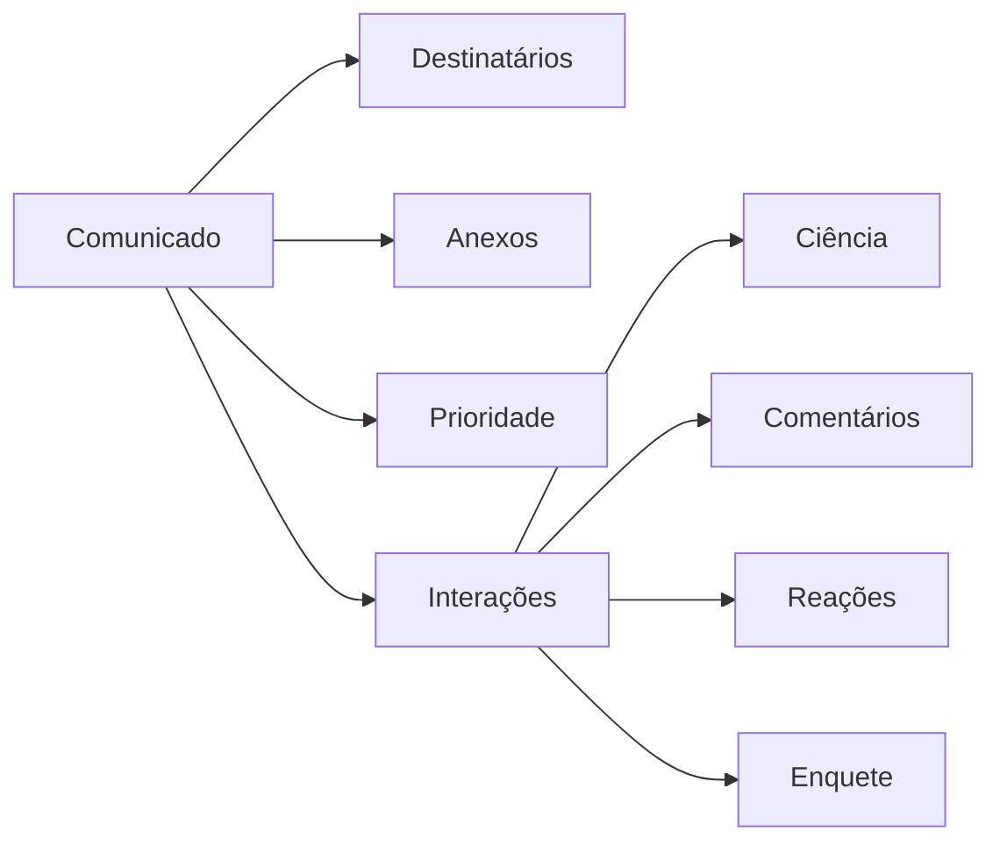
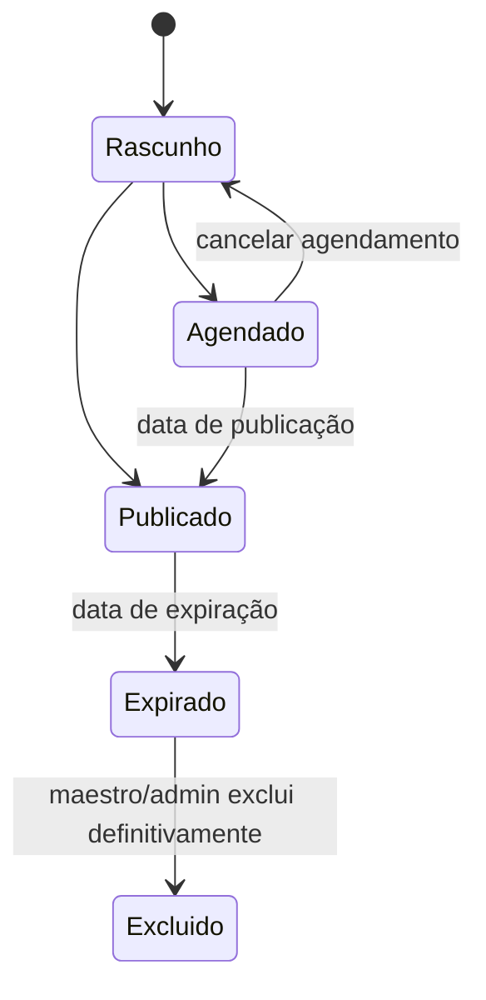
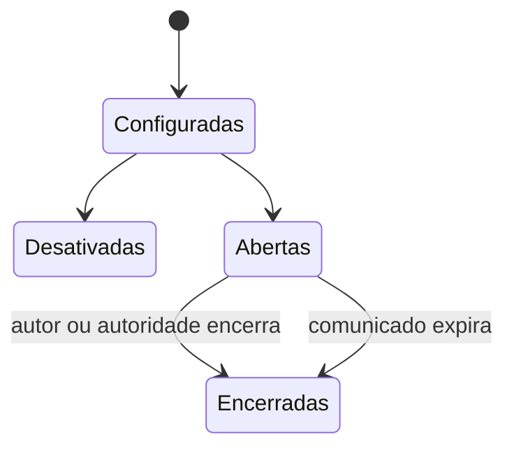

# Comunicados e notificações

## 1. Comunicado configurável

Um comunicado não depende de tipos rígidos “estático” ou “dinâmico”. Seu autor
ativa os recursos necessários:

- anexos;
- prioridade;
- fixação até uma data;
- publicação imediata ou agendada;
- expiração;
- confirmação de ciência;
- comentários;
- comentários anônimos;
- reações;
- enquete.

O rascunho do comunicado começa privado. O autor pode compartilhar visualização
ou edição sem publicá-lo ao público final. Autosave, compartilhamento de rascunho
e anexos em rascunho nunca disparam notificações aos destinatários finais.

Invariantes deste domínio:

- comunicado publicado nunca atravessa o limite da orquestra;
- destinatário precisa ter associação ativa no tenant no momento do acesso;
- expiração remove o comunicado da visão dos músicos, inclusive por link direto;
- abrir notificação não equivale a confirmar ciência;
- anonimato de comentário vale para todas as interfaces de negócio;
- moderação não apaga o fato histórico de que um comentário existiu;
- anexos seguem o mesmo pipeline seguro de arquivos da plataforma.



## 2. Destinatários e autoria

- maestro/admin publica globalmente ou para públicos específicos;
- líder publica no próprio naipe;
- responsável de sala temporária publica somente na própria sala;
- públicos possíveis são global, espaços/naipes, vozes e pessoas específicas;
- uma pessoa alcançada por vários públicos recebe apenas uma cópia;
- regra de hierarquia e propriedade também se aplica a comunicados;
- edição posterior pode ser silenciosa ou gerar nova notificação;
- encerramento antecipado de interações gera notificação ao público afetado.

O público do comunicado é armazenado como regra de destino, não como texto livre.
Exemplos: `global`, `naipe:trompetes`, `voz:trompete-1`, `perfil:carol` ou
`sala:concerto-natal`.

Visibilidade e notificação são conceitos diferentes:

- visibilidade de comunicado ativo é calculada pelas regras de destino e pela
  associação atual do usuário;
- notificações são snapshots do evento publicado, editado ou encerrado;
- se alguém entrar em um naipe depois da publicação, poderá ver comunicados ainda
  ativos daquele naipe, mas não recebe automaticamente notificações antigas na V1;
- alterar público depois da publicação é mudança material: novos alcançados
  recebem notificação, removidos perdem acesso imediatamente, e a auditoria registra
  quem alterou.

## 3. Prioridades

Cada orquestra configura níveis com:

- nome;
- cor;
- peso de ordenação;
- exigência ou não de confirmação de ciência.

Valores iniciais sugeridos: `Normal`, `Importante` e `Urgente`. Os nomes não são
fixos.

Ordenação padrão na página inicial:

1. comunicados fixados ainda válidos;
2. maior peso de prioridade;
3. data de publicação mais recente.

Comunicado agendado não aparece antes da publicação. Comunicado expirado não
aparece para músicos, mesmo que tenha sido urgente ou fixado.

## 4. Leitura e ciência

Abrir uma notificação não prova leitura. Para comunicados que exigem confirmação,
o usuário executa explicitamente `Confirmo que estou ciente`.

O sistema registra:

- usuário;
- comunicado;
- data e hora;
- estado atual da confirmação.

Maestro/admin pode consultar confirmados e pendentes. Não haverá ação de “marcar
tudo como lido”; itens são tratados individualmente.

Autor com autoridade contextual pode consultar ciência somente nos comunicados
que publicou dentro do próprio escopo. Exemplo: líder vê pendências do comunicado
do seu naipe, mas não de comunicados globais nem de outros naipes.

Para comunicados ativos com ciência obrigatória, a lista de pendentes acompanha o
público efetivo atual. Se alguém entrar no naipe depois da publicação, passa a
aparecer como pendente enquanto o comunicado estiver ativo. Se alguém perder
acesso, deixa a lista operacional de pendentes, mas confirmações históricas já
registradas permanecem no histórico administrativo.

## 5. Comentários

- lista simples na V1, sem respostas encadeadas;
- músico pode editar ou excluir o próprio comentário enquanto os comentários do
  comunicado estiverem abertos;
- depois do encerramento, o músico não altera mais seu comentário;
- autor pode moderar comentários dentro do próprio comunicado;
- maestro/admin pode moderar comentário que extrapole as regras;
- encerramento bloqueia novos comentários, preservando os existentes;
- comentários podem ser identificados ou anônimos.

Cada novo comentário gera notificação persistente somente para o autor do
comunicado. Comentários próximos ainda não lidos são agrupados por comunicado,
evitando uma notificação por participante ou por mensagem. Os demais membros
veem a atualização em tempo real quando estiverem na tela, mas não recebem uma
notificação persistente por comentário.

### Anonimato

Quando comentários anônimos estiverem habilitados, o usuário escolhe no momento
do envio se aquele comentário será identificado ou anônimo. Essa escolha fica
presa ao comentário; editar o texto não altera o modo de identidade.

No modo anônimo, ninguém na interface — nem maestro, nem autor do comunicado,
nem moderador da orquestra — vê a identidade. APIs de negócio também não retornam
o autor. O banco mantém o identificador técnico do autor, acessível somente em
intervenção técnica autorizada da plataforma. Portanto, o termo correto é
**anônimo na interface e tecnicamente rastreável**, não anonimato absoluto.

Moderação de comentário anônimo acontece pelo identificador do comentário, nunca
pelo autor. O histórico operacional registra a moderação sem revelar a identidade
do comentarista.

Edição ou exclusão moderadora:

- preserva versão ou metadado suficiente em histórico técnico/auditoria;
- informa na interface que houve moderação quando isso for relevante;
- deve preferir ocultar/remover quando editar o texto puder mudar o sentido do
  comentário original.

## 6. Reações

Comunicados podem aceitar reação positiva ou negativa. Quando configuradas como
anônimas, a identidade fica visível somente para maestro/moderadores; os demais
veem apenas totais. Quando identificadas, os nomes aparecem em tooltip no desktop
ou popover no celular. Essa regra é diferente da dos comentários anônimos.

Cada usuário possui no máximo uma reação ativa por comunicado. Enquanto reações
estiverem abertas, ele pode alterar ou remover a própria reação. Ao encerrar
interações ou expirar o comunicado, novas reações e alterações são bloqueadas.
Se o usuário perder acesso ao comunicado, não consegue mais alterar a reação já
registrada; o registro histórico permanece.

## 7. Enquetes

- uma resposta ativa por usuário;
- voto pode ser alterado enquanto a enquete estiver aberta;
- resultado aparece imediatamente;
- autor pode encerrar antes da data prevista;
- encerramento antecipado gera notificação;
- opções e prazo pertencem ao comunicado.

A V1 trabalha com uma enquete de opções fechadas por comunicado. Participantes
veem resultado agregado. A identidade do voto é dado administrativo restrito,
visível somente para maestro/admin e autor com autoridade contextual quando
necessário para gestão. Enquete plenamente anônima para administração fica fora
da V1 e exigirá decisão própria. Se o usuário perder acesso ao comunicado, não
consegue mais alterar o voto já registrado; o registro histórico permanece.

## 8. Agendamento, expiração e exclusão

O estado principal do comunicado e o estado das interações são separados. Fechar
comentários ou enquete não transforma o comunicado em expirado.

Estado principal:



Estado das interações:



Comunicado expirado desaparece para músicos, mas permanece no histórico
administrativo. Maestro/admin pode excluí-lo permanentemente. Anexos físicos são
removidos; o log mantém apenas identificador, autor, responsável, data e motivo.

Se um comunicado agendado for editado antes da publicação, a versão publicada é
a versão vigente no momento do job. Cancelar o agendamento antes da publicação
volta o comunicado para rascunho e não gera notificação para o público final.

Anexos:

- seguem upload seguro, quarentena, allowlist de formatos e antimalware;
- herdam a visibilidade do comunicado;
- não recebem URL pública ou permanente;
- deixam de aparecer para músicos quando o comunicado expira;
- são removidos fisicamente na exclusão definitiva, preservando log mínimo.

## 9. Notificações internas

A V1 possui somente notificações dentro da plataforma. E-mail é utilizado para
identidade, convite e recuperação de senha, não como canal de conteúdo.

Eventos mínimos:

- novo material ou lote publicado;
- material atualizado, retirado ou acesso removido;
- novo comunicado;
- novos comentários agrupados para o autor do comunicado;
- comunicado editado com opção de renotificar;
- enquete, comentários ou reações encerrados antecipadamente;
- solicitação de alteração ou exclusão;
- aprovação ou rejeição;
- mudança administrativa relevante.

Notificações calculam destinatários por todos os públicos e eliminam duplicatas.
Lotes de uma mesma obra geram uma notificação agregada, com lista individualizada.

Notificação persistente é idempotente: repetir um job não pode duplicar a mesma
notificação para o mesmo destinatário e evento. Abrir ou marcar uma notificação
como lida não executa ciência, voto, reação nem comentário.

Enquanto a plataforma estiver aberta, notificações e interações são atualizadas
quase instantaneamente por SSE. Comentários, reações e votos continuam sendo
gravados por requisições HTTP comuns; o evento apenas informa às outras telas que
o estado canônico deve ser consultado novamente. O stream nunca deve revelar
recurso que a sessão não possa consultar pela API. Chat futuro poderá adotar
WebSockets sem transformar SSE em protocolo de escrita.

## 10. Modelos

Maestro/admin cria modelos por evento, utilizando variáveis controladas, por
exemplo:

```text
Nova publicação: {{obra_numero}} — {{obra_titulo}}
Materiais: {{lista_materiais}}
{{nota_atualizacao}}
```

Ao enviar, o texto renderizado é salvo como fotografia. Alterar o modelo depois
não reescreve notificações antigas.

Ao criar uma orquestra, o sistema instala modelos iniciais editáveis para os
eventos obrigatórios. Maestro/admin pode substituí-los; o motor e a lista segura
de variáveis continuam estruturais.

Modelos não aceitam HTML, JavaScript ou expressão arbitrária. Variáveis são
escapadas e renderizadas por allowlist para evitar injeção de conteúdo ou
exposição de dados fora do evento.
