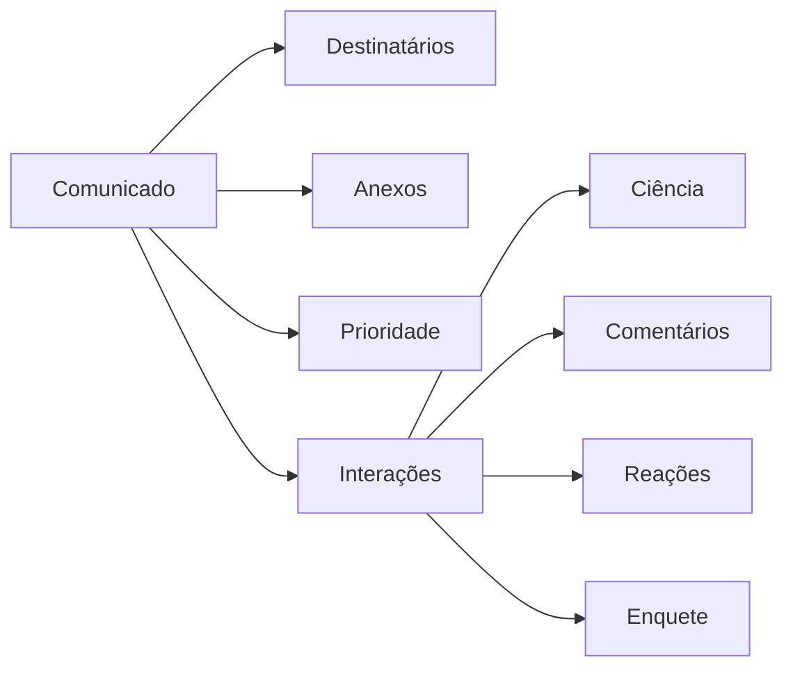
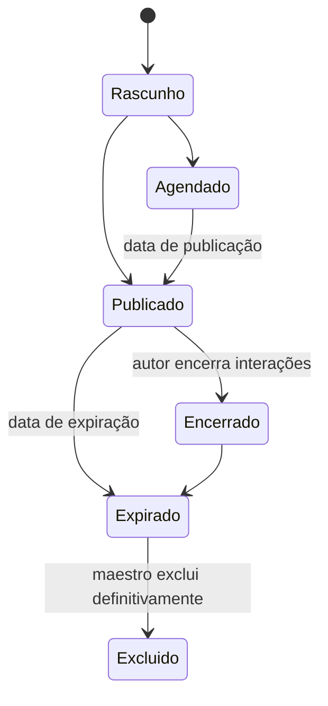

# Comunicados e notificações

## 1. Comunicado configurável

Um comunicado não depende de tipos rígidos “estático” ou “dinâmico”. Seu autor
ativa os recursos necessários:

- anexos;
- prioridade;
- fixação até uma data;
- publicação imediata ou agendada;
- expiração;
- confirmação de ciência;
- comentários;
- comentários anônimos;
- reações;
- enquete.

O rascunho do comunicado começa privado. O autor pode compartilhar visualização
ou edição sem publicá-lo ao público final.



## 2. Destinatários e autoria

- maestro/admin publica globalmente ou para públicos específicos;
- líder publica no próprio naipe;
- públicos possíveis são global, espaços/naipes, vozes e pessoas específicas;
- uma pessoa alcançada por vários públicos recebe apenas uma cópia;
- regra de hierarquia e propriedade também se aplica a comunicados;
- edição posterior pode ser silenciosa ou gerar nova notificação;
- encerramento antecipado de interações gera notificação ao público afetado.

## 3. Prioridades

Cada orquestra configura níveis com:

- nome;
- cor;
- peso de ordenação;
- exigência ou não de confirmação de ciência.

Valores iniciais sugeridos: `Normal`, `Importante` e `Urgente`. Os nomes não são
fixos. Comunicados urgentes ou fixados aparecem antes dos demais.

## 4. Leitura e ciência

Abrir uma notificação não prova leitura. Para comunicados que exigem confirmação,
o usuário executa explicitamente `Confirmo que estou ciente`.

O sistema registra:

- usuário;
- comunicado;
- data e hora;
- estado atual da confirmação.

Maestro/admin pode consultar confirmados e pendentes. Não haverá ação de “marcar
tudo como lido”; itens são tratados individualmente.

## 5. Comentários

- lista simples na V1, sem respostas encadeadas;
- músico pode editar ou excluir o próprio comentário enquanto os comentários do
  comunicado estiverem abertos;
- depois do encerramento, o músico não altera mais seu comentário;
- autor pode editar ou excluir comentários dentro do próprio comunicado;
- maestro/admin pode excluir comentário que extrapole as regras;
- encerramento bloqueia novos comentários, preservando os existentes;
- comentários podem ser identificados ou anônimos.

Cada novo comentário gera notificação persistente somente para o autor do
comunicado. Comentários próximos ainda não lidos são agrupados por comunicado,
evitando uma notificação por participante ou por mensagem. Os demais membros
veem a atualização em tempo real quando estiverem na tela, mas não recebem uma
notificação persistente por comentário.

### Anonimato

No modo anônimo, ninguém na interface — nem maestro — vê a identidade. O banco
mantém o identificador técnico do autor, acessível somente em intervenção técnica
do desenvolvedor. Portanto, o termo correto é **anônimo na interface e
tecnicamente rastreável**, não anonimato absoluto.

## 6. Reações

Comunicados podem aceitar reação positiva ou negativa. Quando configuradas como
anônimas, a identidade fica visível somente para maestro/moderadores; os demais
veem apenas totais. Quando identificadas, os nomes aparecem em tooltip no desktop
ou popover no celular. Essa regra é diferente da dos comentários anônimos.

## 7. Enquetes

- uma resposta ativa por usuário;
- voto pode ser alterado enquanto a enquete estiver aberta;
- resultado aparece imediatamente;
- autor pode encerrar antes da data prevista;
- encerramento antecipado gera notificação;
- opções e prazo pertencem ao comunicado.

## 8. Agendamento, expiração e exclusão



Comunicado expirado desaparece para músicos, mas permanece no histórico
administrativo. Maestro/admin pode excluí-lo permanentemente. Anexos físicos são
removidos; o log mantém apenas identificador, autor, responsável, data e motivo.

## 9. Notificações internas

A V1 possui somente notificações dentro da plataforma. E-mail é utilizado para
identidade, convite e recuperação de senha, não como canal de conteúdo.

Eventos mínimos:

- novo material ou lote publicado;
- material atualizado, retirado ou acesso removido;
- novo comunicado;
- novos comentários agrupados para o autor do comunicado;
- comunicado editado com opção de renotificar;
- enquete/comentários encerrados antecipadamente;
- solicitação de alteração ou exclusão;
- aprovação ou rejeição;
- mudança administrativa relevante.

Notificações calculam destinatários por todos os públicos e eliminam duplicatas.
Lotes de uma mesma obra geram uma notificação agregada, com lista individualizada.

Enquanto a plataforma estiver aberta, notificações e interações são atualizadas
quase instantaneamente por SSE. Comentários, reações e votos continuam sendo
gravados por requisições HTTP comuns; o evento apenas informa às outras telas que
o estado canônico deve ser consultado novamente. Chat futuro poderá adotar
WebSockets sem transformar SSE em protocolo de escrita.

## 10. Modelos

Maestro/admin cria modelos por evento, utilizando variáveis controladas, por
exemplo:

```text
Nova publicação: {{obra_numero}} — {{obra_titulo}}
Materiais: {{lista_materiais}}
{{nota_atualizacao}}
```

Ao enviar, o texto renderizado é salvo como fotografia. Alterar o modelo depois
não reescreve notificações antigas.

Ao criar uma orquestra, o sistema instala modelos iniciais editáveis para os
eventos obrigatórios. Maestro/admin pode substituí-los; o motor e a lista segura
de variáveis continuam estruturais.
