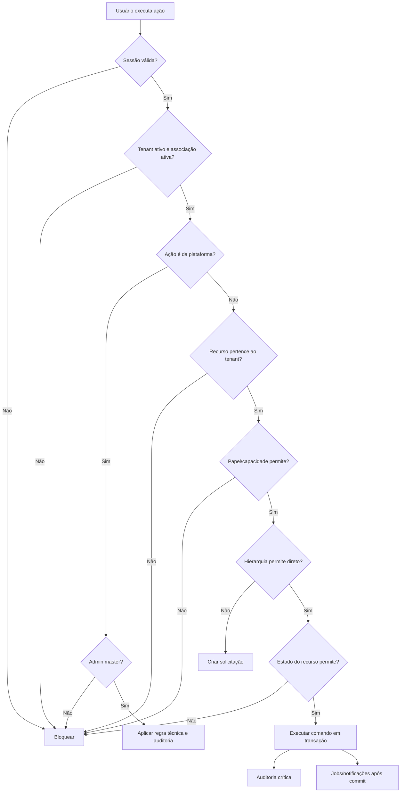

# Matriz de capacidades, permissões e casos de uso da V1

Status: Aceito

Última revisão: 2026-07-09

Este documento transforma as regras de produto do Concentus em ações verificáveis.
Ele é a ponte entre:

- regras de domínio;
- autorização;
- auditoria;
- notificações;
- modelo lógico do banco;
- contrato HTTP/OpenAPI;
- testes de aceite.

Ele não substitui [Papéis e permissões](roles-and-permissions.md). O documento
de papéis explica a hierarquia; esta matriz explica o que cada ação exige.

## 1. Princípios de interpretação

- Toda ação acontece dentro de um tenant, exceto ações exclusivas da plataforma.
- Nenhuma regra de interface substitui autorização no backend.
- RLS no PostgreSQL é segunda barreira, não a fonte principal da regra de
  negócio.
- O admin master não atua rotineiramente no conteúdo das orquestras; intervenção
  técnica é excepcional, auditada e, em ações reais por impersonação, exige
  confirmação reforçada.
- Maestro/admin é o administrador operacional da orquestra.
- Pesos administrativos resolvem conflitos entre maestros/admins:
  - peso maior administra conteúdo de peso menor;
  - peso igual coadministra;
  - peso menor solicita alteração em conteúdo de peso maior;
  - somente admin master altera pesos.
- Líder atua apenas no naipe onde é líder.
- Responsável de sala temporária atua apenas na sala onde foi designado.
- Editor comum não ganha automaticamente direito de compartilhar, publicar ou
  alterar política de download.
- Rascunho começa privado para o autor; outros só veem se houver compartilhamento
  explícito ou autoridade hierárquica suficiente.
- Ação que modifica estado relevante gera auditoria.
- Ação que muda acesso, publicação ou interação pode gerar notificação.

## 2. Legenda operacional

| Termo | Significado |
|---|---|
| `Direto` | Pode executar sem aprovação adicional, respeitando escopo e estado do recurso. |
| `Contextual` | Pode executar somente no naipe, sala, biblioteca ou recurso em que recebeu função/capacidade. |
| `Solicita` | Não altera diretamente; cria solicitação para aprovação de autoridade superior ou proprietário. |
| `Bloqueado` | Ação não permitida na V1. |
| `Sistema` | Executado automaticamente por regra do produto ou job assíncrono. |
| `Suporte técnico` | Ação excepcional do admin master, registrada como intervenção da plataforma. |

## 3. Capacidades canônicas de recurso

Estas capacidades podem ser concedidas diretamente, herdadas de um recurso pai ou
derivadas de papel contextual.

| Código | Capacidade | Permite | Não permite sozinha |
|---|---|---|---|
| `VIEW` | Visualizar | Ver metadados e conteúdo publicado autorizado | Baixar, editar, publicar ou repassar acesso |
| `ADD` | Adicionar | Criar pastas, obras, materiais, comunicados ou anexos dentro do escopo | Publicar ou ampliar público |
| `EDIT` | Editar | Alterar metadados, ordem, notas e conteúdo permitido | Excluir conteúdo superior, publicar ou gerenciar acesso |
| `PUBLISH` | Publicar | Tornar rascunho disponível ao público autorizado | Alterar público se não tiver `MANAGE_ACCESS` |
| `REQUEST_CHANGE` | Solicitar alteração | Propor mudança em conteúdo de hierarquia superior | Aplicar a mudança diretamente |
| `REQUEST_DELETE` | Solicitar exclusão | Pedir remoção de conteúdo de hierarquia superior | Apagar diretamente |
| `MANAGE_ACCESS` | Gerenciar acesso | Definir destinatários, compartilhamento e política de download | Ignorar bloqueio de autoridade superior |
| `ADMIN` | Administrar | Organizar estrutura e configurações locais do recurso | Atuar fora do escopo concedido |

Download não é uma capacidade isolada. Ele é o resultado de:

1. usuário ter `VIEW` efetivo;
2. material estar publicado;
3. política efetiva de download permitir;
4. usuário passar pelas regras de sessão, tenant e rate limit.

## 4. Algoritmo geral de autorização

## 5. Matriz por domínio

### 5.1 Plataforma e orquestras

| ID | Ação | Quem executa direto | Condições | Auditoria | Efeito assíncrono/notificação |
|---|---|---|---|---|---|
| CAP-PLT-01 | Criar orquestra | Admin master | Slug único; primeiro maestro/admin será convidado | Plataforma | Enviar convite inicial |
| CAP-PLT-02 | Desativar orquestra | Admin master | Preserva dados; bloqueia acesso dos membros | Plataforma | Notificar admins afetados, se configurado |
| CAP-PLT-03 | Reativar orquestra | Admin master | Orquestra preservada e elegível | Plataforma | Notificar admins |
| CAP-PLT-04 | Ver lista de orquestras | Admin master | Painel técnico da plataforma | Plataforma | — |
| CAP-PLT-05 | Alterar nome, símbolo e slug da orquestra | Maestro/admin | Dentro da própria orquestra; política de redirecionamento ainda pendente | Orquestra | Pode invalidar links antigos |
| CAP-PLT-06 | Alterar identidade visual principal | Bloqueado | Identidade visual é do Concentus | — | — |
| CAP-PLT-07 | Configurar slots institucionais permitidos | Maestro/admin | Somente quando o produto definir os slots | Orquestra | Processamento de imagem, se houver |
| CAP-PLT-08 | Configurar fuso horário da orquestra | Maestro/admin | Afeta agendamentos futuros e exibição de datas | Orquestra | Recalcular visões agendadas, se necessário |
| CAP-PLT-09 | Ver auditoria operacional da orquestra | Maestro/admin | Não inclui log privado de impersonação | Orquestra | — |
| CAP-PLT-10 | Ver auditoria técnica e impersonação | Admin master | Acesso restrito da plataforma | Plataforma restrita | — |
| CAP-PLT-11 | Impersonar usuário | Admin master | Motivo, nova autenticação, sessão curta e confirmação para ação real | Plataforma restrita | — |
| CAP-PLT-12 | Criar outro admin master | Bloqueado | Existe apenas um cargo master de desenvolvimento | — | — |

### 5.2 Identidade, conta e sessão

| ID | Ação | Quem executa direto | Condições | Auditoria | Efeito assíncrono/notificação |
|---|---|---|---|---|---|
| CAP-ID-01 | Criar conta global | Usuário convidado | Convite válido, e-mail conferido e senha criada | Segurança/identidade | E-mail de validação, se aplicável |
| CAP-ID-02 | Aceitar convite com conta existente | Usuário convidado | E-mail da conta deve corresponder ao convite | Orquestra | Ativar associação |
| CAP-ID-03 | Recuperar senha | Dono da conta | Fluxo exclusivamente por e-mail | Segurança | E-mail de recuperação |
| CAP-ID-04 | Alterar senha própria | Dono da conta | Reautenticação ou fluxo seguro definido | Segurança | Encerrar sessões, se exigido |
| CAP-ID-05 | Criar senha temporária para músico | Bloqueado | Substituído por recuperação via e-mail | — | — |
| CAP-ID-06 | Ver sessões abertas próprias | Dono da conta | Conta autenticada | Segurança | — |
| CAP-ID-07 | Encerrar sessão própria em outro dispositivo | Dono da conta | Sessão identificável | Segurança | Revogar sessão |
| CAP-ID-08 | Encerrar todas as sessões de uma conta por segurança | Admin master | Intervenção técnica justificada | Plataforma restrita | Notificar usuário, se apropriado |
| CAP-ID-09 | Bloquear conta global | Admin master | Banimento ou contenção de abuso | Plataforma restrita | Revogar sessões |
| CAP-ID-10 | Solicitar exclusão de conta global | Dono da conta | Somente se não participar mais de nenhuma orquestra | Plataforma | Fluxo de confirmação posterior |
| CAP-ID-11 | Configurar MFA do próprio usuário | Dono da conta | Obrigatório para master; opcional para maestro/admin | Segurança | Eventos de configuração |
| CAP-ID-12 | Desativar MFA obrigatório do master | Bloqueado | MFA do master é requisito de segurança | — | — |
| CAP-ID-13 | Alterar e-mail próprio | Dono da conta | Reautenticação recente, novo e-mail único e validação do novo endereço | Segurança/identidade | Avisar e-mail antigo e revogar outras sessões |

Maestro/admin não altera e-mail de outro usuário. Admin master também não usa
troca direta como rotina de suporte; em incidente, bloqueia conta, revoga sessões
ou orienta recuperação segura.

### 5.3 Convites, membros e perfis

| ID | Ação | Quem executa direto | Condições | Auditoria | Efeito assíncrono/notificação |
|---|---|---|---|---|---|
| CAP-MEM-01 | Criar convite | Maestro/admin | Define e-mail, naipes, salas, papel e permissões iniciais | Orquestra | Enviar e-mail e gerar link copiável |
| CAP-MEM-02 | Revogar convite não usado | Maestro/admin | Convite ainda não consumido | Orquestra | Invalidar link |
| CAP-MEM-03 | Reenviar convite | Maestro/admin | Convite ativo | Orquestra | Enviar e-mail |
| CAP-MEM-04 | Finalizar cadastro de perfil | Usuário convidado | Campos obrigatórios completos | Orquestra | Consumir convite |
| CAP-MEM-05 | Editar perfil próprio | Membro | Respeita obrigatoriedade e privacidade dos campos | Orquestra, se campo sensível | — |
| CAP-MEM-06 | Configurar privacidade de telefone/nascimento | Dono do perfil | Opções: todos, admins ou privado | Orquestra | — |
| CAP-MEM-07 | Corrigir nome visível | Maestro/admin | Nome deve permanecer único dentro da orquestra | Orquestra | Notificar membro, se necessário |
| CAP-MEM-08 | Remover foto inadequada | Maestro/admin | Ação moderadora | Orquestra | Notificar membro, se necessário |
| CAP-MEM-09 | Criar campo personalizado de perfil | Maestro/admin | Tipo e visibilidade válidos | Orquestra | — |
| CAP-MEM-10 | Tornar campo obrigatório | Maestro/admin | Perfis antigos completam no próximo acesso | Orquestra | Criar pendências de perfil |
| CAP-MEM-11 | Desativar membro | Maestro/admin | Preserva autoria e histórico | Orquestra | Revogar acesso e sessões do tenant |
| CAP-MEM-12 | Reativar membro | Maestro/admin | Associação preservada ou recriada | Orquestra | Notificar membro, se necessário |
| CAP-MEM-13 | Solicitar saída voluntária | Membro | Não pode ser último maestro/admin ativo | Orquestra | Notificar maestro/admin |
| CAP-MEM-14 | Confirmar saída voluntária | Maestro/admin | Responsabilidades transferidas | Orquestra | Revogar acessos do tenant |
| CAP-MEM-15 | Promover membro a maestro/admin | Maestro/admin ou admin master | Maestro/admin cria com o próprio peso; master define peso | Orquestra/plataforma | Notificar promovido |
| CAP-MEM-16 | Alterar peso administrativo | Admin master | Somente entre maestros/admins | Plataforma restrita | Notificar admins afetados |
| CAP-MEM-17 | Rebaixar maestro/admin | Admin master | Orquestra deve manter pelo menos um admin ativo | Plataforma restrita | Notificar afetado |
| CAP-MEM-18 | Redefinir senha de outro usuário | Bloqueado | Recuperação é por e-mail; admin não conhece senha | — | — |

### 5.4 Espaços, naipes e vozes

| ID | Ação | Quem executa direto | Condições | Auditoria | Efeito assíncrono/notificação |
|---|---|---|---|---|---|
| CAP-ESP-01 | Criar sala global | Sistema | Criada junto com a orquestra | Orquestra | — |
| CAP-ESP-02 | Excluir sala global | Bloqueado | Sala global é obrigatória | — | — |
| CAP-ESP-03 | Alterar nome/imagem da sala global | Maestro/admin | Mantém inclusão implícita de todos ativos | Orquestra | — |
| CAP-ESP-04 | Criar naipe | Maestro/admin | Nome único no tenant | Orquestra | — |
| CAP-ESP-05 | Arquivar/desativar naipe | Maestro/admin | Não apaga histórico | Orquestra | Notificar afetados, se houver |
| CAP-ESP-06 | Atribuir músico a naipe | Maestro/admin | Membro ativo | Orquestra | Atualizar acessos derivados |
| CAP-ESP-07 | Definir líder de naipe | Maestro/admin | Liderança contextual | Orquestra | Notificar líder |
| CAP-ESP-08 | Remover liderança | Maestro/admin | Acessos de liderança cessam imediatamente | Orquestra | Notificar afetado |
| CAP-ESP-09 | Criar/ordenar vozes do naipe | Maestro/admin; líder contextual com `ADMIN` | Escopo limitado ao naipe | Orquestra | Afeta obras futuras |
| CAP-ESP-10 | Alterar voz padrão de músico | Maestro/admin; líder contextual com `ADMIN` | Afeta somente obras futuras | Orquestra | — |
| CAP-ESP-11 | Criar sala temporária | Maestro/admin | Define membros, responsáveis e duração | Orquestra | Notificar convidados |
| CAP-ESP-12 | Administrar membros da sala temporária | Maestro/admin; responsável contextual | Responsável limitado à própria sala | Orquestra | Atualizar acessos derivados |
| CAP-ESP-13 | Atuar fora da sala temporária | Bloqueado para responsável | Responsabilidade não atravessa escopo | — | — |

### 5.5 Bibliotecas, obras, materiais e arquivos

| ID | Ação | Quem executa direto | Condições | Auditoria | Efeito assíncrono/notificação |
|---|---|---|---|---|---|
| CAP-MAT-01 | Criar biblioteca | Maestro/admin; líder/responsável com autorização | Escopo definido; pode começar oculta/rascunho | Orquestra | — |
| CAP-MAT-02 | Criar pasta | Quem possui `ADD` ou `ADMIN` na biblioteca | Respeita rascunho e escopo | Orquestra | — |
| CAP-MAT-03 | Criar obra | Quem possui `ADD` na biblioteca | Número único dentro da biblioteca | Orquestra | Criar fotografia da formação |
| CAP-MAT-04 | Alterar número/título/notas da obra | Autor, autoridade superior ou `EDIT` válido | Peso/hierarquia podem exigir solicitação | Orquestra | — |
| CAP-MAT-05 | Ordenar materiais dentro da obra | Maestro/admin; autor; quem possui `EDIT` | Respeita hierarquia | Orquestra | — |
| CAP-MAT-06 | Fazer upload simples | Quem possui `ADD` ou `EDIT` aplicável | Arquivo permitido; passa quarentena | Orquestra/segurança | Processamento/antimalware |
| CAP-MAT-07 | Fazer upload em lote | Maestro/admin; quem possui `ADD` aplicável | Associação automática é sugestão revisável | Orquestra/segurança | Processamento por arquivo |
| CAP-MAT-08 | Ver progresso de upload próprio | Uploader | Enquanto lote estiver ativo | Técnico | SSE/estado local |
| CAP-MAT-09 | Associar arquivo a naipe/voz | Maestro/admin; líder no próprio naipe se não houver bloqueio do maestro | Respeita plano da obra | Orquestra | — |
| CAP-MAT-10 | Alterar destinatário individual | Quem possui `MANAGE_ACCESS`; líder apenas no próprio naipe e sem bloqueio do maestro | Não amplia público acima do recurso pai | Orquestra | Notificar afetados |
| CAP-MAT-11 | Definir bloqueio explícito do maestro em parte/voz | Maestro/admin | Prevalece sobre líder | Orquestra | Notificar afetados, se publicado |
| CAP-MAT-12 | Compartilhar biblioteca própria | Autor com `MANAGE_ACCESS`; maestro/admin; líder se criou a biblioteca | Conteúdo futuro herda acesso | Orquestra | Notificar novos destinatários, se publicado |
| CAP-MAT-13 | Repassar biblioteca recebida | Maestro/admin conforme autoridade | Líder/editor recebido não pode repassar | Orquestra | Notificar novos destinatários |
| CAP-MAT-14 | Alterar política de download | Autor, maestro/admin ou quem possui `MANAGE_ACCESS` | `EDIT` sozinho não basta | Orquestra | — |
| CAP-MAT-15 | Visualizar material publicado | Destinatário efetivo com `VIEW` | Tenant, estado e política válidos | Leitura técnica, se necessário | — |
| CAP-MAT-16 | Baixar material | Destinatário com `VIEW` e download permitido | Log técnico temporário; sem relatório ao maestro | Técnico de segurança | — |
| CAP-MAT-17 | Publicar material individual | Quem possui `PUBLISH` e autoridade suficiente | Arquivo pronto e destinatários válidos | Orquestra | Notificar destinatários |
| CAP-MAT-18 | Publicar todos os prontos | Quem possui `PUBLISH` | Ignora faltantes/excluídos do plano | Orquestra | Notificação agrupada por obra/lote |
| CAP-MAT-19 | Voltar material publicado para rascunho | Autor, maestro/admin ou quem possui `PUBLISH` e autoridade | Retira acesso temporariamente | Orquestra | Notificar afetados |
| CAP-MAT-20 | Substituir arquivo próprio | Autor ou autoridade superior | Nota de atualização opcional | Orquestra/segurança | Processamento e notificação |
| CAP-MAT-21 | Substituir arquivo criado por maestro/admin superior | Usuário inferior solicita | Troca ocorre somente após aprovação | Solicitação | Notificar aprovador |
| CAP-MAT-22 | Excluir material próprio | Autor ou autoridade superior | Confirmação forte; se publicado, notifica afetados | Orquestra | Remover objeto físico |
| CAP-MAT-23 | Excluir material criado por autoridade superior | Usuário inferior solicita | Aprovação obrigatória | Solicitação | Notificar aprovador |
| CAP-MAT-24 | Aprovar/rejeitar solicitação de alteração/exclusão | Autor do recurso ou autoridade superior | Decisão registrada | Orquestra | Notificar solicitante |
| CAP-MAT-25 | Ampliar público de recurso criado dentro de biblioteca de terceiro | Bloqueado sem `MANAGE_ACCESS` no nível adequado | Filho não amplia pai | — | — |

### 5.6 Comunicados, comentários, enquetes e ciência

| ID | Ação | Quem executa direto | Condições | Auditoria | Efeito assíncrono/notificação |
|---|---|---|---|---|---|
| CAP-COM-01 | Criar rascunho de comunicado | Maestro/admin; líder no próprio naipe; responsável na própria sala | Rascunho privado por padrão | Orquestra | Autosave sem notificação |
| CAP-COM-02 | Compartilhar rascunho para edição | Autor ou autoridade superior | Compartilhamento explícito | Orquestra | — |
| CAP-COM-03 | Publicar comunicado global | Maestro/admin | Público global | Orquestra | Notificar destinatários |
| CAP-COM-04 | Publicar comunicado para públicos específicos | Maestro/admin | Espaços, naipes, vozes ou pessoas | Orquestra | Notificar destinatários deduplicados |
| CAP-COM-05 | Publicar comunicado no próprio naipe | Líder | Apenas naipe onde é líder | Orquestra | Notificar naipe |
| CAP-COM-06 | Publicar comunicado na própria sala temporária | Responsável contextual | Apenas sala onde é responsável | Orquestra | Notificar sala |
| CAP-COM-07 | Agendar publicação | Autor com permissão de publicar | Usa fuso horário da orquestra | Orquestra | Job de publicação |
| CAP-COM-08 | Fixar comunicado até data | Autor com permissão de publicar | Data futura válida | Orquestra | Job de desfixação, se necessário |
| CAP-COM-09 | Definir prioridade | Autor com permissão de publicar | Usa níveis configurados da orquestra | Orquestra | Pode exigir ciência |
| CAP-COM-10 | Editar comunicado publicado | Autor, autoridade superior ou mesmo peso | Escolhe notificar novamente ou correção silenciosa; mudança de público é material | Orquestra | Opcional para texto; novos destinatários são notificados quando público muda |
| CAP-COM-11 | Encerrar comentários, reações ou enquete antes do prazo | Autor ou autoridade superior | Interações abertas | Orquestra | Notificar público afetado |
| CAP-COM-12 | Expirar comunicado | Sistema | Data de expiração no fuso da orquestra | Orquestra | Remover da visão dos músicos |
| CAP-COM-13 | Excluir comunicado expirado permanentemente | Maestro/admin | Remove anexos físicos; preserva log mínimo | Orquestra | Remoção de arquivos |
| CAP-COM-14 | Confirmar ciência | Destinatário ativo atual | Comunicado exige ciência e não expirou | Orquestra | Atualizar pendências |
| CAP-COM-15 | Consultar confirmados e pendentes | Maestro/admin; autor do comunicado no próprio escopo | Somente comunicados sob sua autoridade | Orquestra | — |
| CAP-COM-16 | Comentar | Destinatário ativo | Comentários abertos e comunicado não expirado | Orquestra | Notificar autor, agrupado |
| CAP-COM-17 | Editar/excluir comentário próprio | Autor do comentário | Enquanto comentários estiverem abertos | Orquestra | Atualizar tela por SSE |
| CAP-COM-18 | Moderar comentário | Autor do comunicado; maestro/admin | Excluir, ocultar ou editar comentário inadequado, preservando histórico | Orquestra | Atualizar tela por SSE |
| CAP-COM-19 | Descobrir identidade de comentário anônimo pela interface | Bloqueado | Anônimo na interface para todos | — | — |
| CAP-COM-20 | Criar, alterar ou remover reação | Destinatário ativo | Reações habilitadas; uma reação ativa por comunicado | Orquestra | Atualizar tela por SSE |
| CAP-COM-21 | Votar em enquete | Destinatário ativo | Enquete aberta, comunicado não expirado e uma resposta ativa | Orquestra | Atualizar resultado por SSE |
| CAP-COM-22 | Alterar voto | Destinatário ativo | Enquanto enquete estiver aberta e comunicado não expirado | Orquestra | Atualizar resultado por SSE |
| CAP-COM-23 | Configurar prioridades | Maestro/admin | Níveis por orquestra | Orquestra | — |
| CAP-COM-24 | Configurar modelos de notificação | Maestro/admin | Variáveis seguras e estruturais | Orquestra | — |
| CAP-COM-25 | Cancelar publicação agendada | Autor ou autoridade superior | Antes da publicação; volta para rascunho | Orquestra | Sem notificação ao público final |

### 5.7 Notificações

| ID | Ação | Quem executa direto | Condições | Auditoria | Efeito assíncrono/notificação |
|---|---|---|---|---|---|
| CAP-NOT-01 | Criar notificação de negócio | Sistema | Evento confirmado após commit | Técnico/orquestra | Persistir na caixa interna |
| CAP-NOT-02 | Receber notificação interna | Destinatário | Usuário ativo e autorizado no tenant | — | SSE se online |
| CAP-NOT-03 | Abrir notificação | Destinatário | Notificação própria | Técnico leve | — |
| CAP-NOT-04 | Marcar notificação individual como lida | Destinatário | Notificação própria | Técnico leve | — |
| CAP-NOT-05 | Marcar todas de uma vez como lidas | Bloqueado na V1 | Leitura deve ser individual | — | — |
| CAP-NOT-06 | Deduplicar destinatários | Sistema | Mesmo usuário alcançado por múltiplos públicos | Técnico | — |
| CAP-NOT-07 | Agrupar lote de materiais | Sistema | Mesmo lote/obra/publicação | Técnico | Uma notificação com lista individualizada |
| CAP-NOT-08 | Notificar todos por novo comentário | Bloqueado | Apenas autor recebe persistente; demais veem tempo real se estiverem na tela | — | — |

### 5.8 Auditoria, solicitações e histórico

| ID | Ação | Quem executa direto | Condições | Auditoria | Efeito assíncrono/notificação |
|---|---|---|---|---|---|
| CAP-AUD-01 | Registrar ação mutável crítica | Sistema | Dentro da transação principal quando crítico | Orquestra/plataforma | — |
| CAP-AUD-02 | Criar solicitação de alteração | Usuário sem autoridade direta | Inclui justificativa e proposta | Orquestra | Notificar aprovador |
| CAP-AUD-03 | Criar solicitação de exclusão | Usuário sem autoridade direta | Inclui motivo | Orquestra | Notificar aprovador |
| CAP-AUD-04 | Aprovar/rejeitar solicitação | Autor, responsável ou autoridade superior | Decisão registrada | Orquestra | Notificar solicitante |
| CAP-AUD-05 | Ver histórico operacional da orquestra | Maestro/admin | Escopo da orquestra | Leitura | — |
| CAP-AUD-06 | Ver log privado de impersonação | Admin master | Escopo da plataforma | Plataforma restrita | — |
| CAP-AUD-07 | Atribuir ação feita por impersonação ao usuário representado | Bloqueado | Histórico operacional mostra `Ação técnica da plataforma` | — | — |
| CAP-AUD-08 | Relatório de quem baixou material | Bloqueado na V1 | Existe apenas log técnico temporário de segurança | — | — |

## 6. Efeitos colaterais obrigatórios

| Tipo de ação | Transação principal | Depois do commit |
|---|---|---|
| Publicar material | Estado publicado, destinatários, auditoria e job de notificação | Criar notificações agrupadas |
| Remover acesso | Nova regra de acesso e auditoria | Notificar afetados |
| Substituir arquivo | Novo arquivo lógico, estado e auditoria | Processar arquivo, remover anterior quando aplicável, notificar |
| Publicar comunicado | Estado publicado, público e auditoria | Criar notificações |
| Agendar comunicado | Estado agendado e job persistido na mesma transação | Publicar no horário |
| Encerrar interação | Estado encerrado e auditoria | Notificar afetados |
| Criar convite | Convite e auditoria | Enviar e-mail |
| Solicitar alteração/exclusão | Solicitação e auditoria | Notificar aprovador |
| Aprovar solicitação | Aplicar mudança e auditoria | Notificar solicitante e afetados |

## 7. Casos de uso essenciais da V1

| ID | Caso de uso | Atores principais | Capacidades envolvidas | Prova mínima |
|---|---|---|---|---|
| UC-001 | Admin master cria orquestra e convida primeiro maestro/admin | Admin master | CAP-PLT-01, CAP-MEM-01 | Orquestra ativa, sala global criada e convite enviado |
| UC-002 | Maestro cria convite para músico novo | Maestro/admin | CAP-MEM-01, CAP-ID-01, CAP-MEM-04 | Usuário cria conta, completa perfil e entra no tenant correto |
| UC-003 | Conta existente aceita convite de outra orquestra | Usuário convidado | CAP-ID-02 | Nova associação sem nova senha e sem vazamento entre tenants |
| UC-004 | Maestro promove membro a maestro/admin | Maestro/admin | CAP-MEM-15 | Promovido recebe mesmo peso; último admin continua garantido |
| UC-005 | Admin master altera peso ou rebaixa maestro/admin | Admin master | CAP-MEM-16, CAP-MEM-17 | Hierarquia muda sem quebrar regra de último admin |
| UC-006 | Maestro configura naipes, vozes, líderes e formação | Maestro/admin | CAP-ESP-04 a CAP-ESP-10 | Obras futuras usam nova formação; antigas não mudam |
| UC-007 | Maestro cria biblioteca oficial restrita | Maestro/admin | CAP-MAT-01, CAP-MAT-12, CAP-MAT-14 | Líder não edita ou compartilha sem capacidade |
| UC-008 | Líder cria biblioteca própria do naipe | Líder | CAP-MAT-01, CAP-MAT-12 | Biblioteca aparece aos destinatários permitidos sem ampliar conteúdo do maestro |
| UC-009 | Maestro faz upload em lote de obra | Maestro/admin | CAP-MAT-03, CAP-MAT-07, CAP-MAT-09 | Sistema sugere naipe/voz, salva rascunhos e mostra faltantes |
| UC-010 | Maestro publica todos os materiais prontos | Maestro/admin | CAP-MAT-18, CAP-NOT-07 | Cada músico recebe uma notificação agrupada apenas com seus materiais |
| UC-011 | Líder ajusta voz de obra no próprio naipe | Líder | CAP-MAT-09, CAP-MAT-10 | Permitido somente se maestro não bloqueou explicitamente |
| UC-012 | Editor solicita alteração em material do maestro | Editor/líder | CAP-MAT-21, CAP-AUD-02 | Pedido aguarda aprovação; arquivo original não muda antes disso |
| UC-013 | Maestro substitui material publicado | Maestro/admin | CAP-MAT-20 | Novo arquivo fica disponível; destinatários recebem atualização com nota opcional |
| UC-014 | Músico acessa e baixa PDF permitido | Membro | CAP-MAT-15, CAP-MAT-16 | Visualiza internamente; download só aparece se política permitir |
| UC-015 | Maestro publica comunicado urgente com ciência e enquete | Maestro/admin | CAP-COM-03, CAP-COM-09, CAP-COM-14, CAP-COM-21 | Pendentes/confirmados e votos aparecem corretamente |
| UC-016 | Líder publica comunicado no próprio naipe | Líder | CAP-COM-05 | Somente membros do naipe recebem |
| UC-017 | Comentário anônimo é moderado sem revelar identidade | Membro, autor, maestro/admin | CAP-COM-16, CAP-COM-18, CAP-COM-19 | Interface não mostra autor; log técnico preserva vínculo |
| UC-018 | Comunicado agendado expira | Autor, sistema | CAP-COM-07, CAP-COM-12 | Publica e expira no fuso da orquestra |
| UC-019 | Membro solicita saída da orquestra | Membro, maestro/admin | CAP-MEM-13, CAP-MEM-14 | Responsabilidades são transferidas antes da desativação |
| UC-020 | Campo obrigatório novo bloqueia próximo acesso | Maestro/admin, membro | CAP-MEM-10, CAP-MEM-04 | Usuário completa perfil antes de navegar |
| UC-021 | Admin master faz suporte por impersonação | Admin master | CAP-PLT-11, CAP-AUD-06, CAP-AUD-07 | Histórico da orquestra não culpa o usuário representado |
| UC-022 | Isolamento entre duas orquestras | Qualquer usuário | CAP-PLT-04, RLS e tenant context | Usuário não encontra nem acessa recurso de outro tenant mesmo com ID conhecido |

## 8. Critérios para considerar P1 pronto

Este bloco será considerado aceito quando:

1. as ações acima forem validadas como suficientes para a V1;
2. pendências novas estiverem registradas no roadmap;
3. cada ação crítica tiver dono de módulo no modelo lógico;
4. ações mutáveis indicarem auditoria e efeitos assíncronos;
5. casos de uso essenciais puderem virar testes de aceite;
6. o próximo bloco puder iniciar o desenho do banco sem inventar regra de
   autorização no caminho.

## 9. Impacto no próximo bloco

O modelo lógico relacional deve nascer a partir desta matriz.

Em especial, o banco precisará representar:

- tenants e associações ativas/inativas;
- papéis, pesos administrativos e escopos contextuais;
- capacidades concedidas, herdadas e bloqueadas;
- autoria e propriedade operacional;
- rascunhos privados e compartilhados;
- solicitações de alteração/exclusão;
- plano de distribuição por obra;
- destinatários efetivos por publicação;
- jobs assíncronos persistidos na transação;
- auditoria operacional e auditoria técnica restrita;
- logs técnicos temporários de download;
- estados de comunicação, interação, ciência e enquete.
