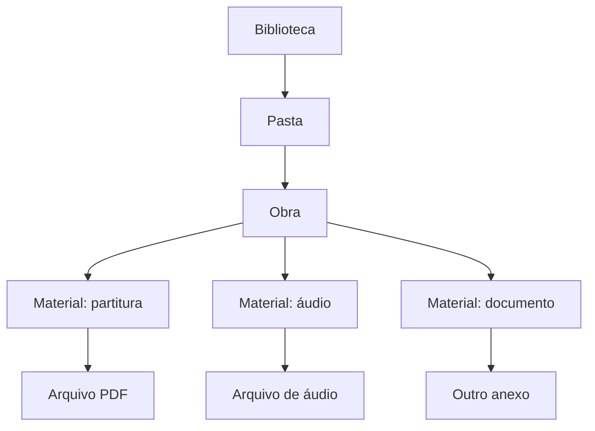
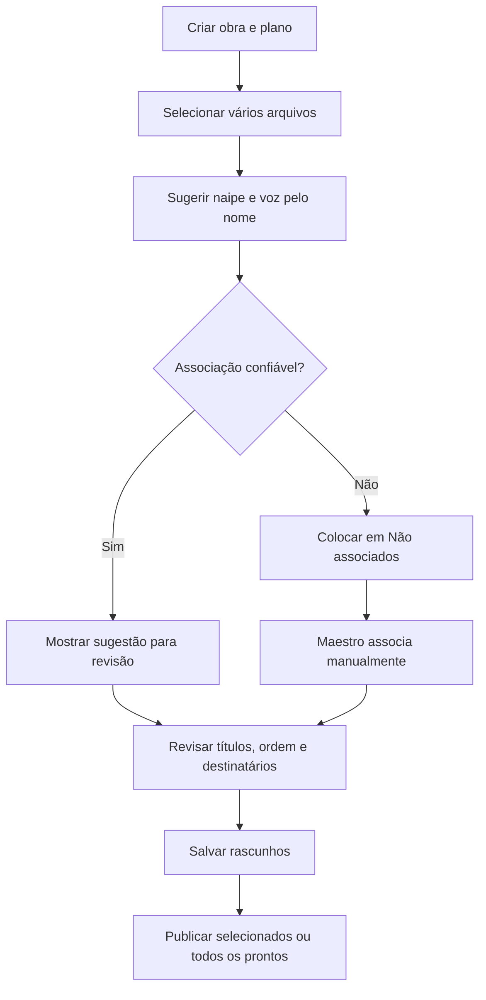

# Bibliotecas, obras e materiais

## 1. Estrutura



Bibliotecas e pastas são dinâmicas. Exemplos: Repertório oficial, Materiais de
estudo, Respiração e Embocadura.

## 2. Identificação da obra

Uma obra contém:

- identificador técnico interno, invisível;
- número de catálogo escolhido pelo maestro;
- título oficial;
- notas permanentes;
- posição ordenável;
- plano de distribuição;
- materiais e anexos.

- **MAT-01:** o número é único somente dentro da biblioteca.
- **MAT-02:** duas bibliotecas podem possuir a obra número 55.
- **MAT-03:** materiais têm título de exibição independente do nome original do
  arquivo.
- **MAT-04:** o nome original é mantido para auditoria técnica.

## 3. Exibição ao músico

O músico vê uma única obra e, dentro dela, somente as partes autorizadas:

```text
55 — O Gato Branco

Seus materiais
├── Trompete — 1ª voz
└── Trompete — 2ª voz
```

Downloads recebem nomes claros, por exemplo:

```text
55 - O Gato Branco - Trompete - 1ª voz.pdf
```

## 4. Estados

| Estado | Visibilidade | Significado |
|---|---|---|
| Enviando | Administrativa | Transferência em andamento |
| Upload concluído | Administrativa | Arquivo recebido, ainda não preparado |
| Faltando | Administrativa | Parte esperada sem arquivo |
| Rascunho | Administrativa | Configurado, mas não publicado |
| Publicado | Destinatários | Disponível e notificado |
| Falha | Administrativa | Upload ou processamento falhou |
| Aguardando aprovação | Administrativa | Substituição/alteração pendente |
| Retirado | Administrativa | Já foi publicado e voltou a ficar oculto |
| Excluído do plano | Administrativa | Parte não utilizada naquela obra |

Biblioteca, pasta, obra e material podem ser rascunho. O mecanismo é reutilizado
de forma consistente em toda a hierarquia.

Rascunhos começam privados para o autor. Ele pode conceder visualização ou edição
a pessoas específicas; possuir acesso ao recurso pai não revela automaticamente
o rascunho. Depois de compartilhado, aplicam-se as regras normais de hierarquia.
Rascunhos de negócio não expiram automaticamente na V1.

## 5. Plano de distribuição

Cada obra recebe uma fotografia editável da formação padrão:

| Parte esperada | Arquivo | Destinatários | Estado |
|---|---|---|---|
| Trompete — 1ª voz | `tpt1.pdf` | Voz padrão + exceções | Publicado |
| Trompete — 2ª voz | `tpt2.pdf` | Voz padrão + exceções | Rascunho |
| Clarinete — 1ª voz | — | Voz padrão | Faltando |
| Clarinete — 2ª voz | — | — | Excluído do plano |

- **MAT-05:** partes podem ser excluídas e reincluídas.
- **MAT-06:** nova parte adicionada a obra antiga começa como `Faltando`.
- **MAT-07:** maestro pode acrescentar, retirar ou trocar acessos individuais.
- **MAT-08:** atribuição explícita do maestro prevalece sobre líder e padrão.
- **MAT-09:** se não houver decisão do maestro, líder decide no próprio naipe.
- **MAT-10:** se ninguém decidir, valem as vozes copiadas na criação da obra.

## 6. Upload em lote



Naipes e vozes aceitam aliases configuráveis, como `trompete`, `trumpet`, `tpt`,
`1`, `1a` e `I`. A associação automática é sempre uma sugestão revisável.

Durante o lote, um painel global acompanha cada arquivo. Navegar dentro do
Concentus não interrompe transferências. Fechar ou recarregar a aba interrompe
arquivos ainda não enviados; arquivos já recebidos continuam o processamento no
servidor. Falhas são independentes e podem ser tentadas novamente. Na V1, o
arquivo interrompido recomeça do início; arquivos concluídos não são repetidos.

A configuração longa da obra e do lote é salva automaticamente como rascunho.
Autosave não publica materiais nem dispara notificações.

## 7. Publicação e lotes

- **MAT-11:** cada material pode ser publicado individualmente.
- **MAT-12:** “Publicar todos os prontos” publica apenas itens com arquivo e
  destinatários válidos.
- **MAT-13:** cada operação em lote recebe identificador, autor e data.
- **MAT-14:** a notificação é agrupada por obra e lote, mas lista ao músico apenas
  os materiais que ele recebeu.
- **MAT-15:** publicação mostra data original e última atualização.
- **MAT-16:** materiais não possuem agendamento na V1.
- **MAT-17:** maestro/admin pode ordenar manualmente materiais e vozes dentro da
  obra; essa ordem é a apresentada ao músico.

## 8. Públicos e compartilhamento

Um recurso pode ser destinado a:

- toda a orquestra;
- um ou vários espaços ou naipes;
- vozes específicas;
- pessoas específicas.

Compartilhar uma biblioteca concede acesso também ao conteúdo futuro. A
biblioteca aparece em `Compartilhados comigo`, preservando a origem e sem copiar
arquivos. A organização dessa seção é controlada pelo sistema na V1.

Remover acesso retira imediatamente o conteúdo da plataforma, mas não apaga uma
cópia que o usuário já tenha baixado.

## 9. Alterações posteriores

| Ação | Efeito | Notificação |
|---|---|---|
| Remover destinatário | Somente ele perde acesso | Somente afetados |
| Voltar a rascunho | Todos os destinatários perdem acesso temporário | Todos os afetados |
| Republicar | Acesso restaurado | Novos destinatários/afetados |
| Substituir arquivo | Nova versão publicada; binário anterior pode ser removido | Destinatários atuais |
| Excluir material | Remoção definitiva após confirmação/aprovação aplicável | Afetados |

Notas da obra são permanentes. Cada publicação ou atualização pode ter uma nota
própria, preservada no histórico e incluída na notificação.

## 10. Arquivos

- PDF, imagens e áudio: visualização/reprodução interna; download quando habilitado
  pelo autor ou gestor autorizado.
- Word, planilhas e outros formatos autorizados: download quando habilitado.
- arquivos físicos ficam em armazenamento de objetos, não no banco relacional;
- URLs de acesso não devem ser públicas ou permanentes;
- exclusão definitiva remove o objeto físico e mantém somente log mínimo.

Download cria uma cópia no armazenamento controlado pelo navegador ou sistema,
fora do cache da PWA. O Concentus não consegue revogá-la posteriormente. Desativar
download remove a ação explícita, mas não constitui proteção DRM contra captura de
um conteúdo que possa ser visualizado.

A biblioteca define o padrão de download. Cada material pode herdar esse padrão
ou substituí-lo por `permitir` ou `bloquear`. A alteração exige autoria,
maestro/admin ou capacidade `Gerenciar acesso`; `Editar` sozinho não basta. A V1
não mostra ao maestro quem baixou, mantendo apenas log técnico temporário e
restrito para segurança.
