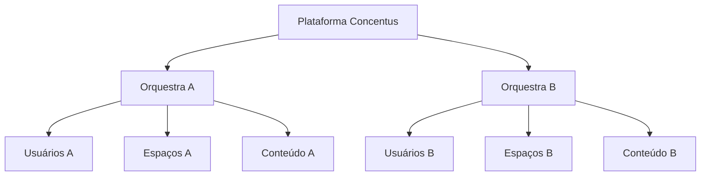
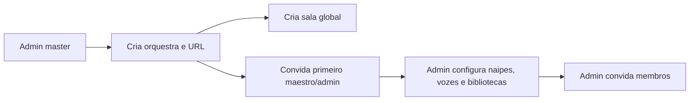
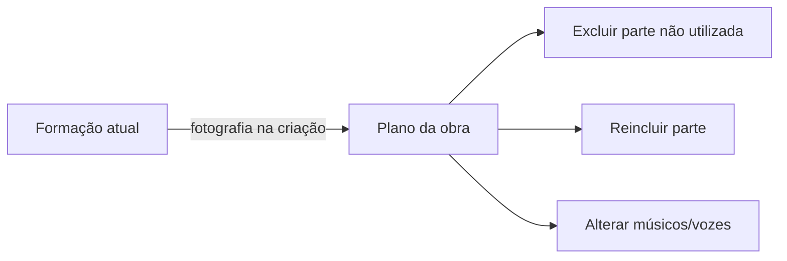

# Orquestras, espaços, naipes e vozes

## 1. Isolamento entre orquestras

Cada orquestra é um tenant independente. Membros, bibliotecas, números de obras,
campos de perfil, prioridades e modelos de comunicação não atravessam esse limite.

O nome da orquestra é dado de tenant. Nenhum nome específico faz parte da lógica,
do esquema ou da marca da plataforma.



- **ORG-01:** somente o admin master/dev cria ou desativa uma orquestra.
- **ORG-02:** a desativação bloqueia todos os membros, preserva os dados e permite
  reativação.
- **ORG-03:** nenhuma interface da orquestra revela que outras existem.
- **ORG-04:** a URL identifica o contexto, por exemplo
  `/orquestra-sinfonica`; trocar de orquestra troca a URL.
- **ORG-05:** cada orquestra define nome, símbolo e slug; não altera a identidade
  visual do Concentus.
- **ORG-06:** assistente inicial de configuração fica fora da V1.

## 2. Criação



A sala global é criada automaticamente, não pode ser excluída e inclui todos os
membros ativos. Nome e imagem podem ser personalizados.

## 3. Modelo de espaço

Um único conceito de espaço atende três finalidades:

| Tipo | Membros | Duração | Exemplo |
|---|---|---|---|
| Global | Todos os ativos, implicitamente | Permanente | Geral |
| Naipe | Membros atribuídos | Permanente | Trompetes |
| Temporário | Pessoas selecionadas | Definida administrativamente | Concerto de Natal |

Espaços possuem membros, responsáveis, bibliotecas e comunicados próprios.
Salas temporárias podem ter um ou mais responsáveis com capacidades semelhantes
às de líder, estritamente limitadas àquela sala.

## 4. Naipe e liderança

- **ESP-01:** músico pode participar de vários naipes.
- **ESP-02:** liderança pertence à associação `usuário + naipe`, não ao usuário
  globalmente.
- **ESP-03:** a mesma pessoa pode ser líder num naipe e membro em outro.
- **ESP-04:** líder publica comunicados e administra bibliotecas que concedam
  capacidades aos líderes daquele naipe.
- **ESP-05:** salas temporárias podem ter responsáveis escolhidos explicitamente.
- **ESP-06:** responsabilidade de sala temporária não concede autoridade fora
  dela.

## 5. Vozes

Cada naipe pode criar e ordenar vozes, por exemplo:

```text
Trompetes
├── 1ª voz
├── 2ª voz
└── 3ª voz
```

- **VOZ-01:** um músico pode ter mais de uma voz padrão no mesmo naipe.
- **VOZ-02:** vozes padrão são usadas para preparar obras futuras.
- **VOZ-03:** alterar a voz padrão não modifica obras já existentes.
- **VOZ-04:** criar um novo naipe ou voz afeta somente obras novas.
- **VOZ-05:** maestro pode substituir as atribuições numa obra específica.
- **VOZ-06:** se o maestro não decidir, o líder pode ajustar seu próprio naipe.
- **VOZ-07:** uma decisão explícita do maestro fica bloqueada para o líder.

## 6. Formação padrão e fotografia por obra

Na V1, a formação padrão é a orquestra completa. Ao criar uma obra, o sistema
copia a estrutura atual de naipes, vozes e atribuições padrão para um plano de
distribuição próprio.



O plano permanece editável. Remover por engano é reversível. Formações nomeadas,
como “Metais” e “Grupo de câmara”, ficam para versão posterior.

## 7. Contexto da orquestra e URL

A identidade visual pertence ao Concentus e permanece igual entre orquestras.
Alterar a URL exige cuidado com links existentes; a política de redirecionamento
do endereço antigo está registrada como pendência.

### Resolução de marca por contexto

| Contexto | Apresentação |
|---|---|
| Login e recuperação global | Identidade Concentus |
| Seletor de orquestras | Identidade Concentus e lista de tenants do usuário |
| Painel do admin master | Identidade Concentus |
| Área interna de uma orquestra | Identidade Concentus com nome/símbolo do tenant como contexto |
| Login contextual | Identidade Concentus, nome/símbolo e imagem permitida da orquestra |

Tenant não fornece paleta, tipografia, espaçamentos, sombras, ícones ou formato de
componentes. Imagens de fundo, capas ou outros elementos institucionais só podem
ser usados em slots definidos pelo produto, com fallback, recorte e contraste
controlados. O tenant ativo permanece inequívoco para quem participa de várias
orquestras.

## 8. Fuso horário

Na V1, cada orquestra possui um único fuso horário. Agendamentos, expirações,
fixações e datas administrativas usam esse fuso e o exibem claramente. Fuso
individual por usuário fica para evolução posterior.
