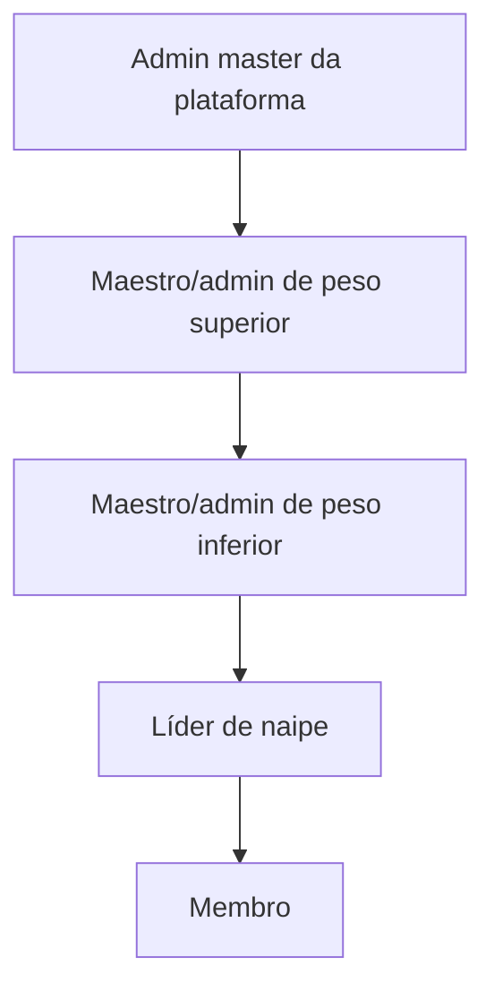
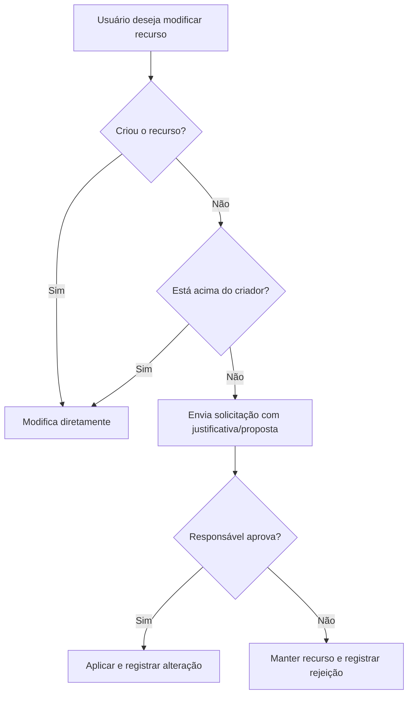

# Papéis, hierarquia e permissões

## 1. Hierarquia

Maestro e admin da orquestra são títulos diferentes no mesmo nível operacional.
Dentro desse nível operacional, o admin master pode atribuir pesos de autoridade
diferentes. Um usuário pode ser líder em um naipe e membro em outro.

### Regra dos pesos administrativos

O peso é ordinal, não uma coleção arbitrária de permissões:

- peso maior pode administrar conteúdo criado por peso menor;
- pesos iguais coadministram e podem alterar o conteúdo um do outro;
- peso menor não altera diretamente conteúdo criado por peso maior e envia uma
  solicitação;
- somente o admin master cria ou altera o peso de um maestro/admin;
- promoção realizada por um maestro/admin cria inicialmente um admin com o mesmo
  peso de quem promoveu;
- peso não muda senha, e-mail ou regras de conta de outro administrador;
- peso não permite rebaixar outro maestro/admin; isso continua exclusivo do
  master.

Essa regra mantém uma única comparação de autoridade e evita permissões especiais
difíceis de prever.

## 2. Regras por papel

| Papel | Escopo | Capacidades principais |
|---|---|---|
| Admin master | Plataforma | Criar/desativar orquestras, nomear primeiro admin, suporte técnico e impersonação |
| Maestro/admin | Uma orquestra | Administrar membros, espaços, bibliotecas, comunicados, configurações e auditoria operacional |
| Líder | Naipe específico | Administrar recursos liberados aos líderes e publicar comunicados no próprio naipe |
| Membro | Associações próprias | Consumir materiais, interagir com comunicados e editar o próprio perfil |

## 3. Regras formais

- **PER-01:** existe apenas um admin master; ele não pode criar outro master.
- **PER-02:** maestro/admin pode promover um membro a maestro/admin.
- **PER-03:** maestro/admin não pode rebaixar nem redefinir a senha de outro no
  mesmo nível; isso exige hierarquia superior.
- **PER-04:** toda orquestra deve manter pelo menos um maestro/admin ativo.
- **PER-05:** permissões de liderança são contextuais ao naipe.
- **PER-06:** ao perder a liderança, o usuário perde os acessos decorrentes dela,
  mas conserva concessões individuais.
- **PER-07:** decisões do maestro em uma obra prevalecem sobre decisões do líder.
- **PER-08:** se o maestro não decidir uma atribuição de voz na obra, o líder pode
  decidi-la dentro do próprio naipe.
- **PER-09:** maestros/admins de mesmo peso coadministram seus conteúdos.
- **PER-10:** maestro/admin de peso maior administra conteúdo criado por peso
  menor.
- **PER-11:** maestro/admin de peso menor solicita mudança em conteúdo criado por
  peso maior.
- **PER-12:** somente o admin master atribui ou altera pesos administrativos.

### Matriz resumida de autoridade

`Contextual` significa “somente nos naipes, espaços ou recursos em que a pessoa
possui a função/capacidade necessária”.

| Ação | Admin master | Maestro/admin | Líder | Membro |
|---|---:|---:|---:|---:|
| Criar/desativar orquestra | Sim | Não | Não | Não |
| Criar outro master | Não | Não | Não | Não |
| Promover membro a maestro/admin | Sim e define peso | Sim, no mesmo peso | Não | Não |
| Rebaixar maestro/admin | Sim | Não | Não | Não |
| Administrar naipes e vozes | Suporte | Sim | Contextual | Não |
| Definir líder | Suporte | Sim | Não | Não |
| Criar biblioteca | Suporte | Sim | Se autorizado | Não |
| Compartilhar biblioteca própria | Suporte | Sim | Sim | Não |
| Repassar biblioteca recebida | Suporte | Sim, conforme autoridade | Não | Não |
| Publicar comunicado global | Suporte | Sim | Não | Não |
| Publicar no próprio naipe | Suporte | Sim | Sim | Não |
| Moderar comentário | Suporte técnico | Sim | Se autor do comunicado | Edita/exclui o próprio enquanto aberto |
| Ver auditoria da orquestra | Suporte | Sim | Não | Não |
| Ver auditoria de impersonação | Sim | Não | Não | Não |

O admin master não atua rotineiramente no conteúdo. “Suporte” indica poder técnico
excepcional, sempre auditado.

## 4. Capacidades de recurso

Papéis e capacidades não são sinônimos. Uma biblioteca pode conceder diferentes
combinações:

A matriz operacional detalhada de ações, escopos, auditoria e efeitos está em
[Capacidades, permissões e casos de uso](capabilities-permissions-and-use-cases.md).

| Capacidade | Significado |
|---|---|
| Visualizar | Ver metadados e abrir materiais publicados; download depende da política efetiva |
| Adicionar | Criar pastas, obras ou materiais dentro do limite concedido |
| Editar | Alterar recursos permitidos sem ganhar direito de redistribuição |
| Publicar | Tornar um rascunho visível aos destinatários |
| Solicitar alteração | Propor mudança em conteúdo de hierarquia superior |
| Solicitar exclusão | Pedir remoção de conteúdo de hierarquia superior |
| Gerenciar acesso | Escolher destinatários e política de download; nunca é implícito em Editar |
| Administrar | Organizar estrutura e configurações locais permitidas |

## 5. Propriedade e delegação

- **PER-13:** o criador é o proprietário operacional inicial do recurso.
- **PER-14:** uma hierarquia superior pode administrar recursos criados abaixo.
- **PER-15:** o criador pode editar e excluir o próprio conteúdo.
- **PER-16:** para alterar, substituir ou excluir conteúdo criado acima, o usuário
  envia uma solicitação.
- **PER-17:** a solicitação de substituição pode incluir o novo arquivo e uma
  justificativa; a troca ocorre somente após aprovação.
- **PER-18:** líder que criou uma biblioteca pode compartilhá-la.
- **PER-19:** líder que apenas recebeu uma biblioteca, mesmo como editor, não pode
  repassá-la.
- **PER-20:** recurso criado dentro de uma biblioteca de terceiro não pode ampliar
  o público permitido pela biblioteca superior.
- **PER-21:** se o criador deixar a orquestra, seus recursos permanecem e passam
  à administração da orquestra.

Para maestros/admins, “acima”, “igual” e “abaixo” são determinados pelo peso
administrativo. Para líder e membro, valem os níveis contextuais já definidos.

## 6. Herança de acesso

Uma concessão feita à biblioteca alcança pastas, obras e materiais futuros. Um
filho pode restringir o público herdado, mas não ampliá-lo sem a capacidade de
gerenciar acesso no nível adequado.

Permissões efetivas resultam de:

1. papel do usuário na orquestra;
2. papel contextual no espaço;
3. capacidades herdadas do recurso pai;
4. concessões diretas;
5. bloqueios explícitos do maestro;
6. estado do recurso, como rascunho ou publicado.

## 7. Impersonação

- exclusiva do admin master;
- exige motivo, nova autenticação e confirmação adicional para ações reais;
- sessão curta com indicação visual permanente;
- nunca revela nem substitui a senha do usuário;
- ações reais registram, no histórico técnico restrito, o usuário representado e o admin master responsável;
- metadados da sessão ficam no histórico técnico da plataforma, invisível aos
  maestros/admins da orquestra;
- o histórico operacional da orquestra identifica o ator como `Ação técnica da
  plataforma`, sem atribuir falsamente a ação ao usuário representado;
- contas temporárias continuam disponíveis futuramente para testes genéricos.
