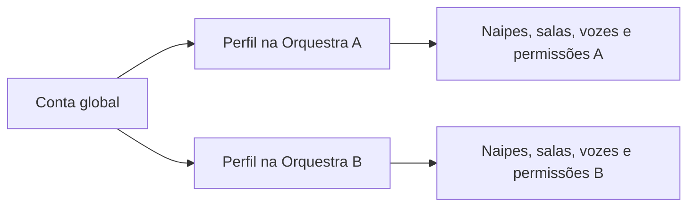
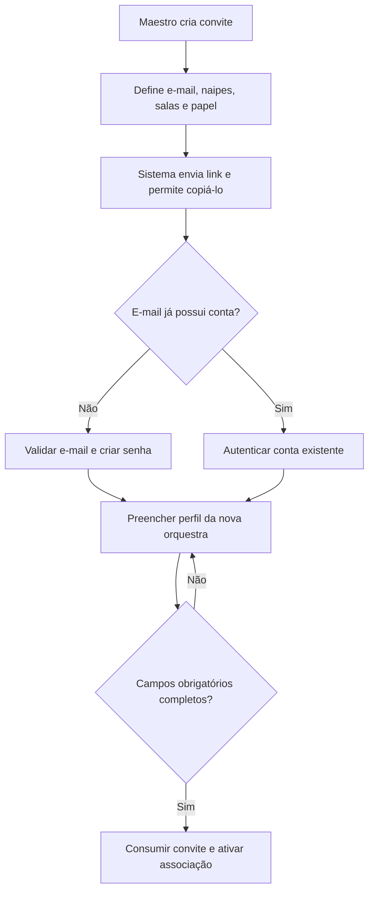

# Usuários, convites e perfis

## 1. Separação de identidade

### Conta global

- e-mail verificado;
- senha e dados de segurança;
- estado geral da conta.

### Perfil por orquestra

- nome visível;
- foto;
- descrição e campos opcionais;
- preferências de privacidade;
- associações administrativas próprias daquela orquestra.

Dados preenchidos numa orquestra não são copiados automaticamente para outra.

## 2. Convite

- **USR-01:** não existe cadastro livre; a entrada ocorre por convite.
- **USR-02:** o maestro informa o e-mail e pode sugerir o nome.
- **USR-03:** o convite contém naipes, salas, papel membro/líder e permissões
  preparadas pelo maestro.
- **USR-04:** o convite é vinculado ao e-mail, de uso único, sem expiração e
  revogável.
- **USR-05:** o sistema envia o convite por e-mail e oferece botão para copiar o
  link.
- **USR-06:** se a conta já existir, o usuário autentica e aceita apenas a nova
  associação; nenhuma nova senha é solicitada.
- **USR-07:** se a conta não existir, o usuário valida o e-mail e cria a senha.

## 3. Cadastro e recuperação

- **USR-08:** o próprio usuário confirma nome e preenche seus dados.
- **USR-09:** não é possível finalizar o cadastro sem os campos obrigatórios.
- **USR-10:** foto é recomendada, não obrigatória por padrão.
- **USR-11:** recuperação de senha ocorre exclusivamente por e-mail; maestro não
  cria nem conhece senhas temporárias.
- **USR-12:** um convite vazado não pode ser aceito por conta de e-mail diferente.
- **USR-13:** troca de e-mail global é feita somente pelo dono da conta, exige
  reautenticação recente, validação do novo endereço, aviso ao e-mail antigo e
  revogação das demais sessões.

## 4. Nome visível

O nome deve ser único dentro da orquestra, comparado sem diferenciar maiúsculas e
minúsculas. Havendo colisão, o usuário precisa incluir nome do meio, sobrenome ou
outra diferenciação. Maestro/admin pode corrigir o nome.

## 5. Perfil

### Sempre exibido

- nome;
- foto, quando cadastrada;
- naipe ou naipes;
- papel contextual, como líder de Trompetes.

### Padrões opcionais

- descrição;
- telefone;
- data de nascimento;
- links e redes sociais.

O e-mail é visível somente para maestro/admin. Telefone e nascimento permitem ao
usuário escolher: `todos`, `somente administradores` ou `privado`.

A idade é calculada em tempo real a partir da data de nascimento. A data exata
aparece em tooltip no desktop ou popover por toque no celular, respeitando a
preferência de privacidade.

## 6. Campos personalizados

Cada orquestra pode criar campos com:

- título e descrição;
- tipo, como texto, data, número, URL ou opção;
- ordem de exibição;
- obrigatoriedade;
- visibilidade padrão;
- estado ativo/inativo.

Os campos padrão são opcionais, mas maestro/admin pode alterar a obrigatoriedade.
Naipes, salas, vozes, liderança e permissões não são campos preenchidos pelo
músico: são associações administrativas apenas exibidas no perfil.

Se um campo se tornar obrigatório depois da ativação, perfis incompletos recebem
uma pendência. No próximo acesso, o usuário deve preencher os campos exigidos
antes de continuar navegando.

## 7. Moderação e ciclo de vida

- maestro/admin pode remover foto inadequada e corrigir nome;
- usuário desativado perde acesso, mas não é excluído fisicamente;
- autoria, comentários, votos e histórico permanecem referenciáveis;
- perfil desativado não aparece como membro ativo;
- reativação restaura a associação sem reescrever a autoria histórica;
- usuário solicita saída voluntária; maestro/admin confirma após verificar
  responsabilidades e transferência de recursos;
- o último maestro/admin ativo não pode solicitar nem concluir saída;
- importar dados de perfil de outra orquestra fica fora da V1.
