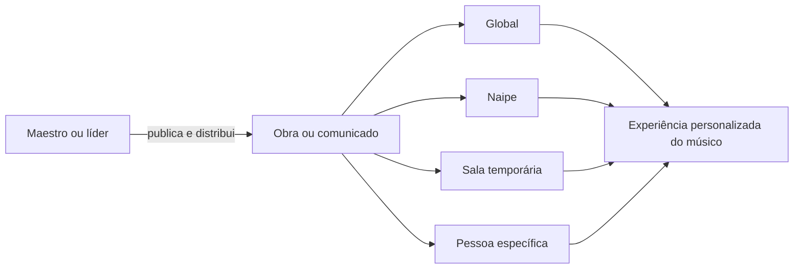

# Visão e escopo

## 1. Problema

Materiais de uma orquestra normalmente ficam espalhados entre mensagens,
pastas, conversas individuais e dispositivos pessoais. Isso dificulta saber:

- qual é a partitura correta e mais recente;
- quem recebeu cada parte ou voz;
- quais materiais ainda não foram publicados;
- onde estão orientações e áudios de estudo;
- quais comunicados exigem ciência ou resposta;
- quem pode alterar, compartilhar ou excluir determinado conteúdo.

## 2. Visão do produto

Concentus será uma plataforma multi-orquestra, mobile-first, para organizar pessoas,
espaços, repertórios, materiais de estudo e comunicação. Cada músico verá apenas
o que lhe foi destinado por orquestra, naipe, sala, voz ou concessão individual.

## 3. Princípio de configurabilidade

O produto terá quase nenhum conteúdo de negócio fixado na interface. Cada
orquestra poderá configurar nomes, naipes, vozes, bibliotecas, campos de perfil,
prioridades e modelos de notificação.

Isso **não** significa transformar tudo em dados genéricos. Capacidades de
segurança, estados essenciais e relacionamentos estruturais permanecem definidos
no domínio e no código.

## 4. Escopo consolidado da V1

### Plataforma e acesso

- múltiplas orquestras completamente isoladas;
- um único admin master da plataforma;
- pesos administrativos internos atribuídos exclusivamente pelo master;
- URL contextual por orquestra;
- autenticação por e-mail validado e senha;
- convites de uso único, sem expiração e revogáveis;
- recuperação de senha por e-mail;
- conta global com associações independentes por orquestra.
- MFA obrigatório para o master e opcional para maestros/admins.

### Organização

- sala global obrigatória;
- naipes e salas temporárias;
- músico em múltiplos naipes;
- líder em um naipe e membro comum em outro;
- vozes padrão múltiplas e substituições por obra;
- perfis e campos personalizados.

### Conteúdo

- bibliotecas, pastas, obras, materiais e anexos;
- PDFs, imagens e áudios visualizados internamente;
- outros formatos disponibilizados para download;
- upload em lote com sugestão de associação pelo nome do arquivo;
- rascunho, publicação individual ou em lote e retirada de publicação;
- público global, por espaço, naipe, voz ou pessoa;
- plano de distribuição e acompanhamento de partes faltantes;
- pedidos de alteração ou exclusão segundo a hierarquia.

### Comunicação

- comunicados globais ou segmentados;
- anexos, prioridade, fixação, agendamento e expiração;
- confirmação de ciência;
- comentários comuns ou anônimos;
- reações e enquete de resposta única;
- notificações internas configuráveis e agrupadas.

## 5. Fora da V1

- interação e descoberta entre orquestras;
- assistente de configuração inicial;
- acesso offline e sincronização local;
- favoritos de materiais;
- acompanhamento de material como “estudado”;
- respostas encadeadas em comentários;
- modelos salvos de formação como “Metais” ou “Grupo de câmara”;
- importação de perfil entre orquestras;
- agendamento de publicação de materiais;
- métricas avançadas;
- aplicação móvel nativa, salvo decisão técnica posterior.

## 6. Critérios de sucesso iniciais

1. Um músico encontra sua partitura atual em poucos toques.
2. Um maestro distribui várias partes sem configurar destinatário por destinatário.
3. O sistema informa claramente partes faltantes, em rascunho e publicadas.
4. Um líder administra somente o que sua posição e a autoria permitem.
5. Comunicados importantes possuem confirmação objetiva de ciência.
6. Nenhum dado de uma orquestra aparece em outra.

## 7. Invariantes do produto

Estas regras não dependem de personalização:

1. somente contas globais e dados técnicos da plataforma existem fora de uma
   orquestra;
2. todo recurso de negócio pertence exatamente a uma orquestra;
3. arquivos privados nunca possuem URL pública permanente;
4. conteúdo em rascunho não aparece ao público final;
5. uma decisão explícita do maestro numa obra prevalece sobre líder e padrão;
6. capacidade de editar não concede automaticamente capacidade de compartilhar;
7. convite é consumido no máximo uma vez;
8. uma orquestra ativa sempre possui pelo menos um maestro/admin ativo;
9. exclusão definitiva de binário não elimina a trilha administrativa mínima;
10. configuração dinâmica não pode contornar isolamento ou autorização.
