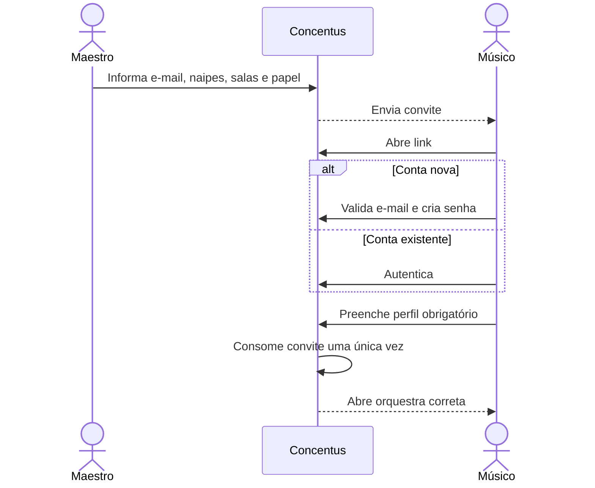
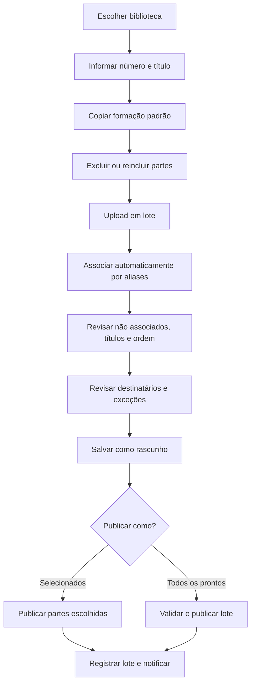
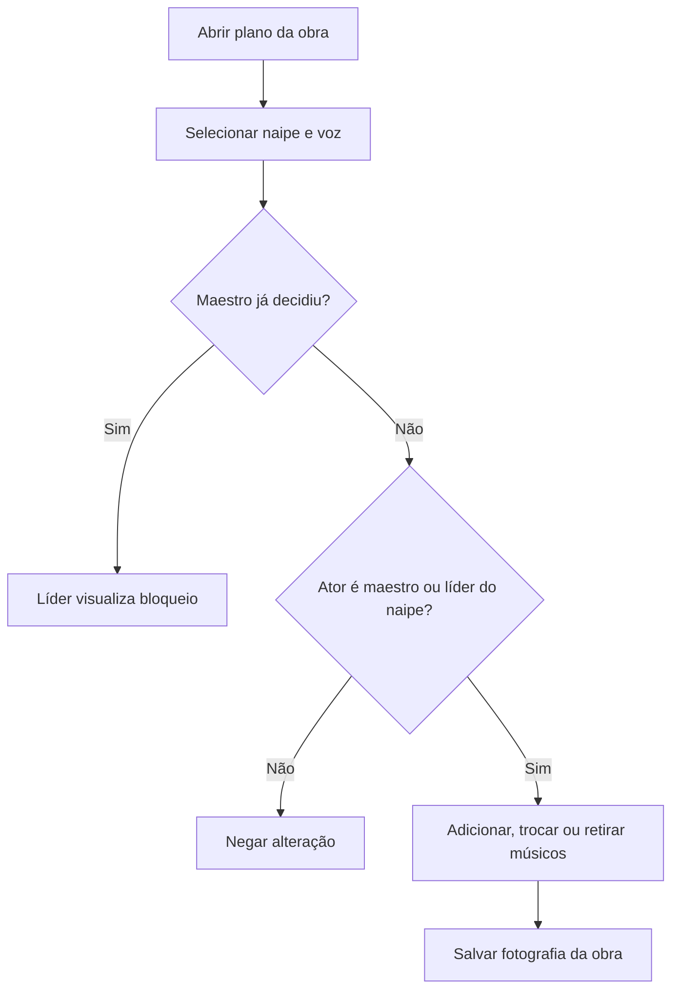
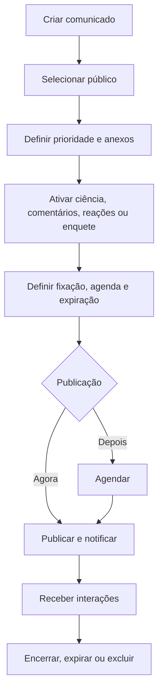
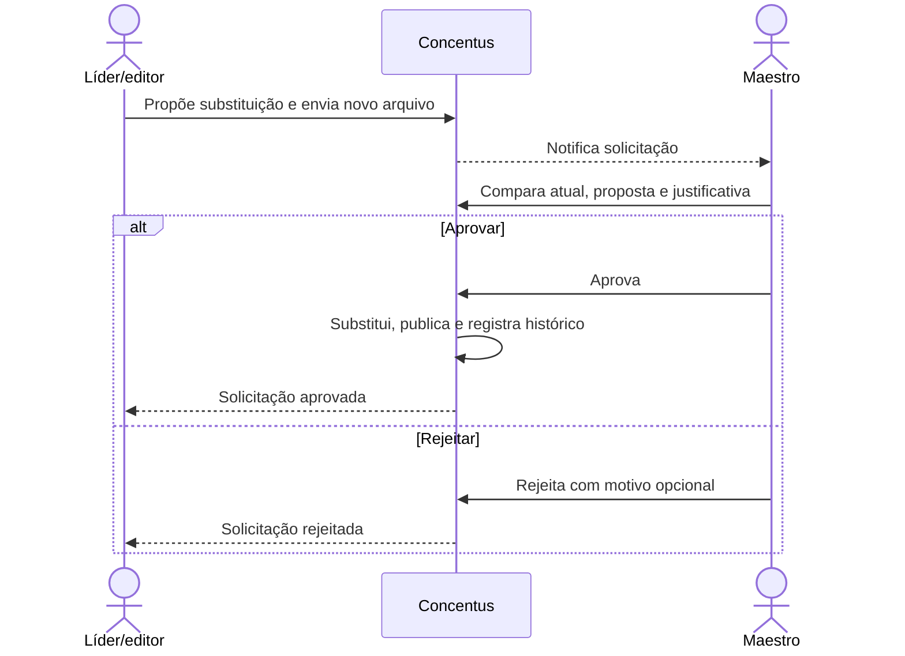
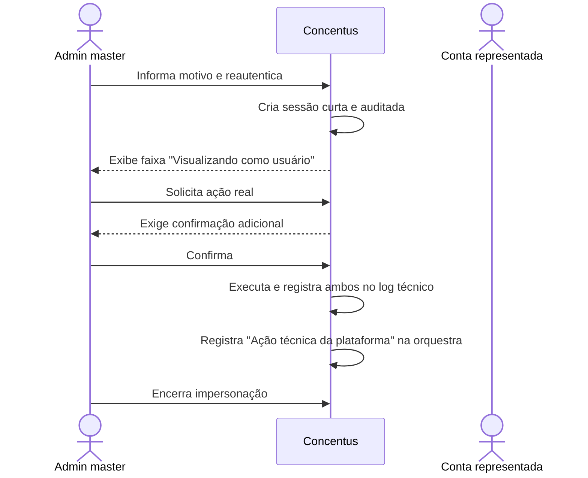

# Fluxos e experiência mobile

## 1. Navegação principal

```text
┌─────────────────────────────────┐
│ Início                          │
│                                 │
│ Urgentes e fixados              │
│ Comunicados globais             │
│ Meus naipes                     │
│ Salas temporárias               │
│                                 │
├──────┬──────────┬───────┬───────┤
│Início│Biblioteca│ Salas │Alertas│ Perfil
└──────┴──────────┴───────┴───────┘
```

A barra inferior prioriza o músico. A administração aparece por ações contextuais
e por uma área de gestão separada, não como mais um item permanente para todos.

## 2. Início sem enxurrada

```text
INÍCIO

[ Urgentes e fixados — máximo inicial visível ]

Comunicados globais
  3 mais recentes                     Ver todos

Meus naipes
  Trompetes               2 não lidos  >
  Clarinetes              1 não lido   >

Salas temporárias
  Concerto de Natal       3 novidades  >
```

- não existe feed único infinito na página inicial;
- global, naipes e salas temporárias aparecem separados;
- cada seção mostra resumo e leva ao histórico completo;
- materiais não aparecem na página inicial; ficam na Biblioteca;
- comunicados expirados somem para músicos.

## 3. Biblioteca do músico

```text
MINHA BIBLIOTECA

[ Buscar por número, título ou material ]

Materiais globais                         >
Trompete                                  >
Clarinete                                 >
Salas temporárias                         >
Compartilhados comigo                     >
```

Dentro do naipe:

```text
TROMPETE

Repertório oficial                        >
Materiais de estudo                       >
  Respiração                              >
  Embocadura                              >
```

Uma concessão individual aparece em `Compartilhados comigo`, com origem visível.
O mesmo objeto não é duplicado em resultados de busca.

## 4. Detalhe da obra

```text
55 — O Gato Branco
Repertório oficial • atualizado em 02/07/2026

Notas da obra
“Atenção à dinâmica no compasso 42.”

Seus materiais
┌─────────────────────────────────────┐
│ Trompete — 1ª voz              PDF │
│ [Abrir] [Baixar]                    │
└─────────────────────────────────────┘
┌─────────────────────────────────────┐
│ Trompete — 2ª voz              PDF │
│ [Abrir] [Baixar]                    │
└─────────────────────────────────────┘
┌─────────────────────────────────────┐
│ Áudio de referência            MP3 │
│ [▶ Reproduzir] [Baixar]             │
└─────────────────────────────────────┘

Última atualização
“PDF corrigido no compasso 42.”
```

PDF abre no visualizador interno e áudio toca na página. O botão de download
aparece somente quando o autor ou gestor autorizado o habilitou para o material.

## 5. Fluxo de convite



## 6. Criação e publicação de obra



### Mesa de distribuição administrativa

```text
OBRA 55 — O GATO BRANCO

Parte                 Arquivo       Destino       Estado
Trompete — 1ª voz     tpt1.pdf      4 músicos     Publicado
Trompete — 2ª voz     tpt2.pdf      3 músicos     Rascunho
Clarinete — 1ª voz    clar1.pdf     5 músicos     Pronto
Clarinete — 2ª voz    —             4 músicos     Faltando
Tuba                   —             —             Excluído

[ Upload em lote ]  [ Salvar ]  [ Publicar todos os prontos ]
```

## 7. Ajuste de voz por obra



## 8. Comunicado



## 9. Solicitação de mudança



## 10. Impersonação



## 11. Estados vazios e erros obrigatórios

Cada área deve explicar o próximo passo:

- biblioteca vazia: informar que nenhum material foi liberado;
- upload não associado: explicar como escolher naipe e voz;
- obra sem parte para o usuário: não exibir a obra na biblioteca pessoal;
- convite consumido/revogado: informar o estado sem revelar dados da conta;
- acesso removido: remover conteúdo e manter notificação explicativa;
- falha de upload: preservar demais arquivos e permitir tentar novamente;
- sessão em outra orquestra: manter URL e contexto visual inequívocos.
